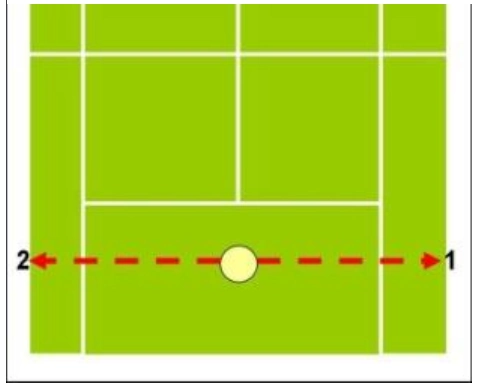
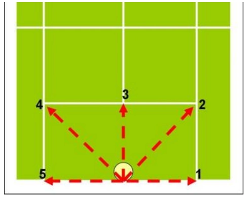
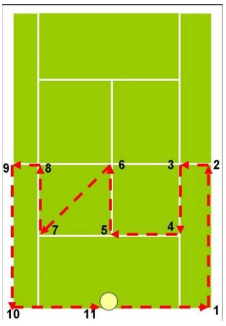

## 三、脚部的训练

现今的网球职业赛事不管在球速、步法移位、判断、节奏等各方面都比过去还要快， 而且是越来越快，全面性、全方位的打法是现今的趋势。为了负荷这种高强度的竞争，更需要合理与效率的步法。体能与脚步是相辅相成的，良好的步法能够节省体能，而充沛的体能、敏捷的身体素质又能帮助步法的发挥。针对脚步的训练应该是和体能训练专项结合。针对几种主要的脚步训练简述如后(江劲彦、江劲政、吴杏仁，2005; 林俊宏、洪彰岑，2005；连玉辉，2004)：

### 一、短距离冲刺

短距离冲刺的能力是网球脚步训练的基础。和田径训练不同，网球的冲刺训练必需结合比赛的情况。网球的冲刺训练约以 30公尺基准。由于一分的开始和结束持续的时间通常都比 30公尺冲刺的时间来的长。因此，为了结合网球的专项训练，当选手完成 30公尺冲刺后，应该以慢跑的方式回到起点，以维持一定的心跳率，并且必需在返回起点后，不休息继续下一次的冲刺，直到一回合的训练结束后，再休息进行下一回合的训练。

### 二、折返跑

网球竞赛包含了有氧与无氧的能量消耗，是由一连串快速动作组成的运动，随着对手所击出每个球不同的速度、旋转方式、旋转程度以及在场内落点的不同，选手必须做出快速的反应及移位(王苓华，2001)。

综观网球选手在竞赛中，下肢运动一连串冲刺、急停与改变方向的下肢动作模式与折返跑训练中，不同方向的冲刺快跑、急停、转向等内容性质极为相似(陈君豪、杨雅如、王瑞瑶，2005)。网球比赛的过程中经常需要变换方向，而且是完全相反的方向，最常见的就是击球和回位，而折返跑可以加强球员变换方向的能力。要能迅速的折返必需要全程保持平衡的重心，尤其在变换相反方向前有效率的应用冲刺的能量，避免成为变换方向的阻力。由此可知，折返跑能够加强网球选手移动的能力。

### 三、跳绳

跳绳运动常被使用在需要大量跑动和变换方向的运动，例如：网球、拳击、跆拳道、足球、篮球等。它能加强运动员随时保持移动的能力，也是一种很好的心肺运动，能增强运动员的耐力。

### 四、重量训练

一场耗时 4个多小时的网球比赛中要有 300至500次的冲刺，不仅要有很好的肌肉力量，还要有很好的肌肉耐力，以及有氧和无氧能力 (Roeter & Groppel, 2001; 2008)。34岁的美国名将阿格西(Andre Agassi)，也是网球史上少数能分别称霸四大公开赛的选手，坚持重量训练是造成他几年前成功复出的一项主要原因，并且持续借着重量训练保持着最佳的体能状态(Bruce, 2001)。

由于网球运动需要大量的跑动并且变换方向，为了强化选手的移动，必需具备强大的肌力。拥有强大的肌力不但能增加移动的速度，更能保护关节，降低受伤的风险。以网球的脚步移动来说，应该强化的是下肢及核心肌群。

### 五、耐力跑

耐力是网球运动员比赛和训练的基础，借由较长距离的跑步可以增进网球运动员的耐力。但毕竟专项体能的需求不同，网球选手的耐力跑不需要像长跑选手般跑到一万公尺，视选手的个别差异一星期施行 1到2次三千公尺的跑步即可。

### 六、专项移动训练

专项移动训练是运用网球场地的底线、发球线、边线和发球 T点作为标示，来训练网球运动员移动的方法。在作这种训练时必需和网球比赛一样，随时面向对手，因为在比赛时绝对没有任何一刻是背向对手的。以图1为例，选手训练时从起点出发，先用侧并步移动到右边双打线，接着回到起点后作一次分腿垫步后再往左边双打线移动，来回数次并渐渐加快速度。这和网球底线的基本步法非常类似。

**图1｜沿底线向左右两侧移动，回到起点后再做分腿垫步。**

图2所示的训练，是以底线的中点为起点向图中所示的 5个方向来移动。这种训练可以先依序完成或是依教练的指示随时移动到不同的目标。与图1的训练不同的是除了左右方向之外，还加入了前后及斜前后方向，不但增加了变化性，也能帮助选手应付对手不同球路的来球。

**图2｜从底线中点向五个方向移动。**

图3所示的训练法则是增加了各种方向的变化性。由图3中我们可以观察到这种训练的移动路径更长，要全程维持相同的高速度并且流畅的完成，对于选手的体能和敏捷性要求更高。

**图3｜增加方向变化、路径更长的专项移动练习。**
