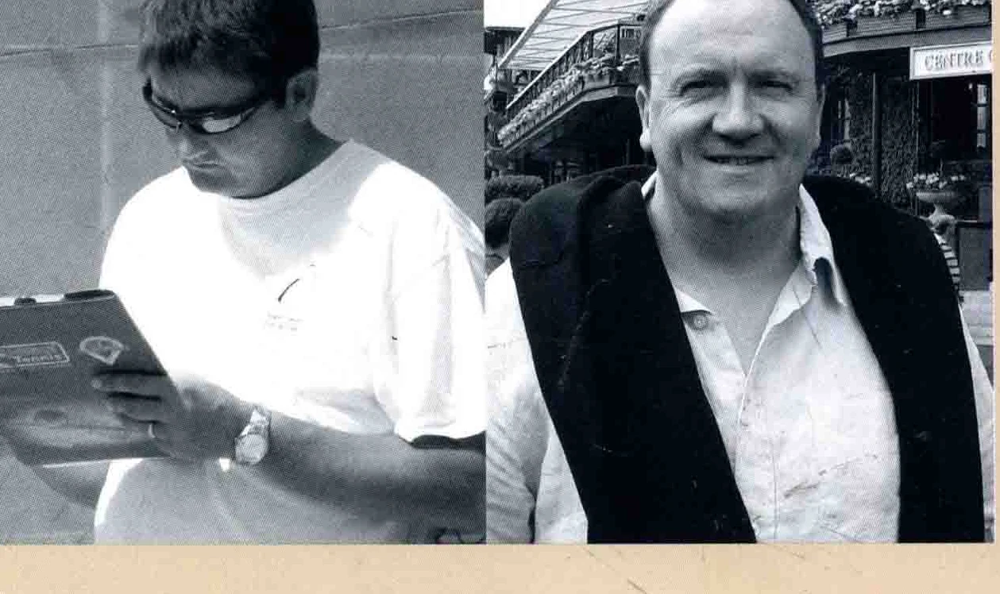

网球(Tennis ) 是一项令人心醉的运动，无论您有着怎样的文化背景，来自何方，它都能激发您的潜能。

孩提时代，父母第一次抛给我们一个网球，我们对网球的热忱就从此种下了。 幼年时电视上的温布尔顿网球赛事，又助燃了这份激情。我们曾目睹传奇般的麦肯罗(McEnroe ) 与博格(Borg ) 一时瑜亮，其后球坛上走来网球奇才鲍里斯，贝克尔(Boris Becker )，激励着许多网球少年像他一样，为了接住一个截击球而跑满全场，即使在硬地上也奋不顾身。

我们在网球上有着家学传承，因为我们的父母皆是教练。而能够执教于这项我们深爱的运动，看见人们学到种种网球技巧，而有了心满意足的笑容，也使我们倍感荣幸。因而我们十分乐意在本书中给出深入浅出的讲解。读透了这本书后，您就能立刻学会打网球，并且进入了网球的世界。

