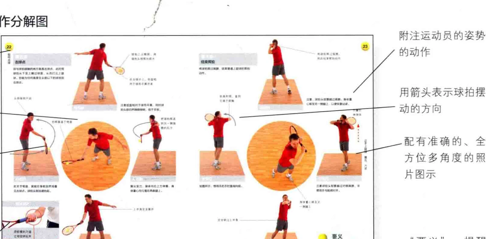
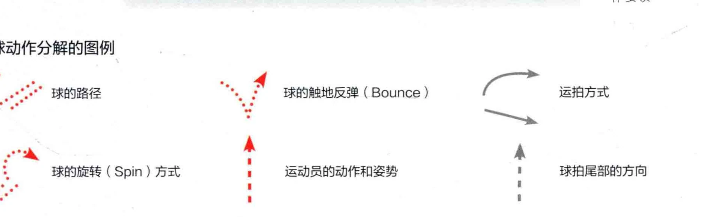
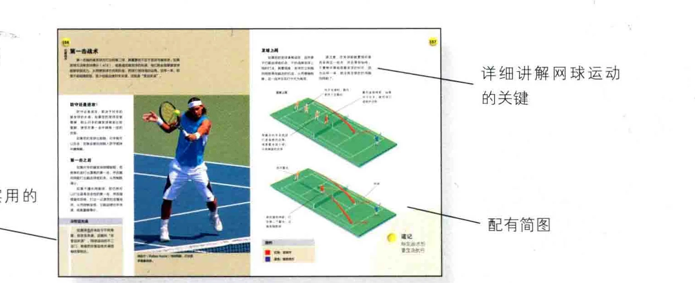

### 击球 ( Stroke ) 动作分解图

附注运动员的姿势每种击球方式都分的动作解成若干步骤一相当二未标汪攻用箭头表示球拍摆动员的站姿和握有拍姿势 |

标出球路，以帮助理解击球动作一 |

:| 一配有准确的、全方位多角度的照

片图示详细j 区有日 sx ms te 0 * 二您打球时记得动作要和领击球动作分解的图例 2 球的路径 ” 球的触地反弹 ( Bounce ) 4 运拍方式党一一、 和球的旋转 ( Spin ) 方式运动员的动作和姿势 E 球拍尾部的方向市和说习战术本书后半部分讲述网 1 球运动的其他要令 al 生辅以简短实用的说明一检配有简图

