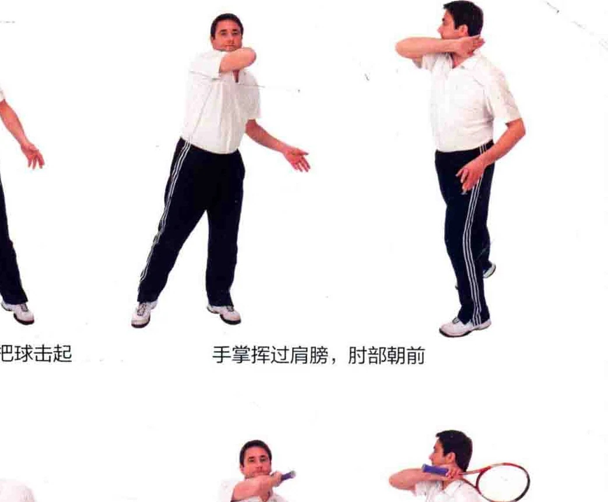
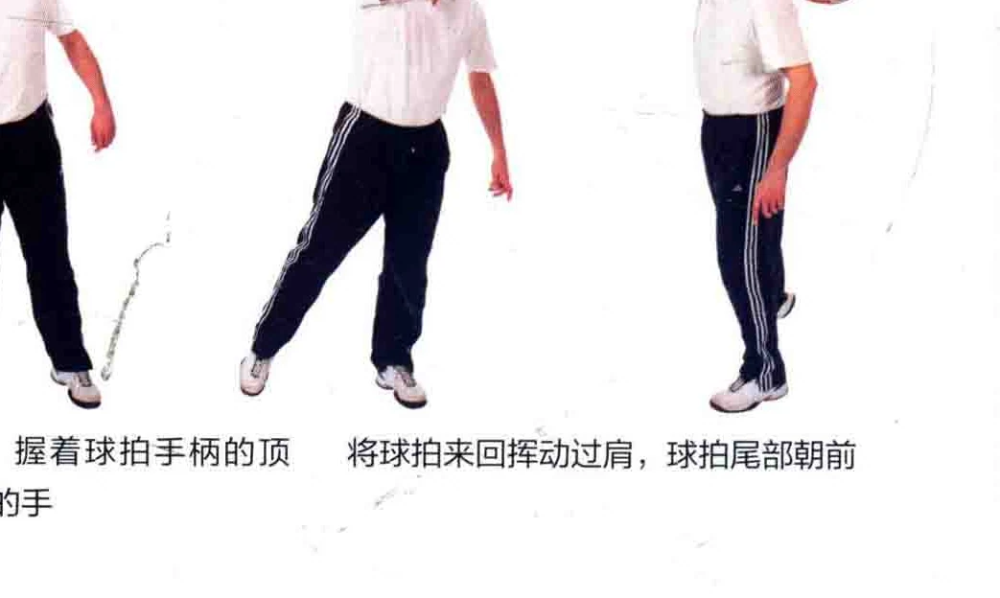
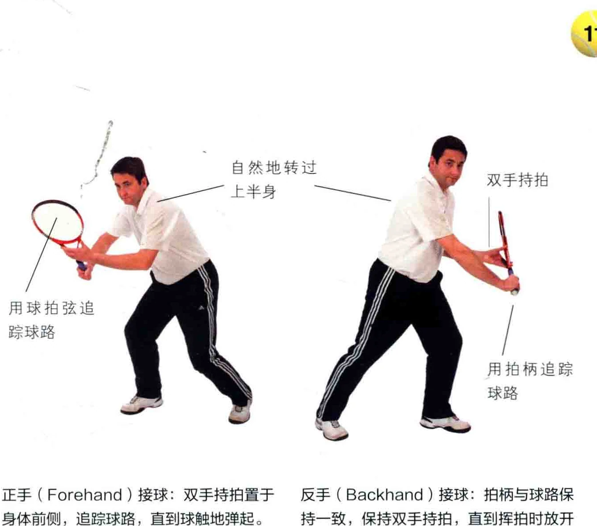
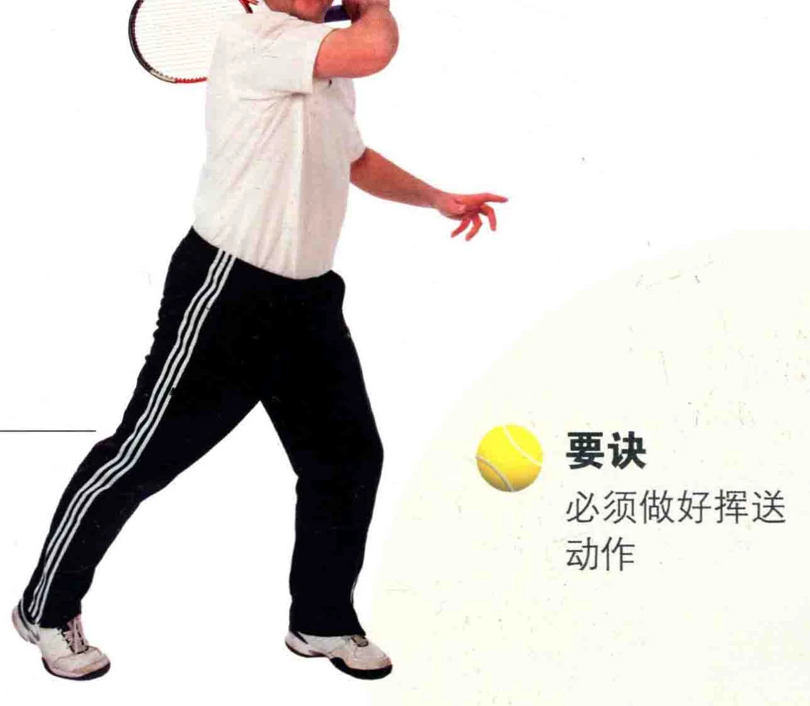

教导初学者时，许多教练一开始就鳌述那些他们掌握不了的技巧，这让许多初学者感到举步维艰，即使是握拍这样的基础动作，教练总是指望初学者能挥出完美一拍，同时又牢记与之相关的战术。这对学员而言既复杂又环手，更些训练是无法使人感受到网球运动的乐趣的。 该怎么办呢? 本书将在以下章节讲解技巧，引导初学者走上一条康庄大道。它能让您在拿起球拍之前，就能自如地击球，并自然而然地将击球法与网后: 球规则、比赛战术结合起来。

首先，徒手练习击球仿全 <国有个开始学习网球的好办法， 代就是徒手练习挥拍。先练习击球和接 AN : 球，这个练习能教您如何自然地随着有 AS 1 球而运动。徒手挥拍还能让您掌握接球的肢体协调性，等到您拿起球拍时，再来讲解动作要领，就能掌握网球运动的规律

徒手练习还包括如何不甩动手臂，而只用手来击球。您可以找个对手，只用手掌，隔着网互相击球。您

的球感将与日俱增，而更重要的是， ,本这挺有趣的。 多上学和局 )

遵循本书教导，进一步练习将包

括正手上旋球、反手球、发球等。先徒手练习，以增加您的球感。和球拍 ee 本 2

六本姜一挥拍和挥送: 用手掌把球击起手掌挥过肩膀，肘部朝前

一样，徒手也能打出旋转球，其区别

仅仅是球拍的力度更大。 找个对手一起徒手练习，能让您 | 学习网球制胜的基本战术。 心

拿着球拍反复练习: 握着球拍手柄的项将球拍来回挥动过肩，球拍尾部朝前端，把拍面想象成您的手

### 追踪球路

您需要关注的是从前方飞来的球，不要去注意您的背后。有具体做法是，把球拍持于身体前方，用它来追踪球路。

所谓追踪球路，就是把球拍放到球的前进路径上，当球触地弹起后向后拉拍，这一技巧对估算击球时机是至关重要的。 用球拍弦追

踪球路用拍柄追踪训名说记手人 ) 接球手持拍置于 “反手 ( khand ) 接球: 拍柄与球路保正 Forehand 求: 双手持 Backhan 过球: 与球路球担随着球路身体前侧，追踪球路，直到球触地弹起。 持一致，保持双手持拍，直到挥拍时放开而动非惯用手。

### 挥送

接下来您将学习结束挥拍，换言之，就是怎样收住挥拍动作，这个术语叫作“挥送”。以基础的正手上旋球为例，挥送动作结束于球拍过肩的一刻。

以下章节中，每一种击球方式都配有图示，用于说明球拍触球后的挥送动作是怎样结束的。同样地，您可以先徒手练习这些动作。

击球前后，始终注视着球的去向。

击球时，让身体重心在两腿上交替移动。

### 要诀必须做好挥送动作

