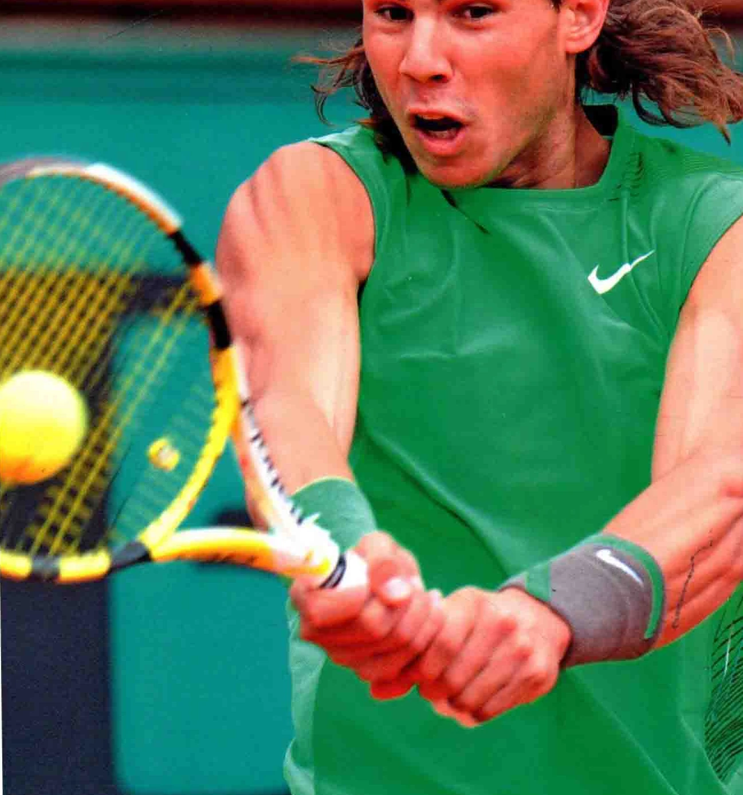
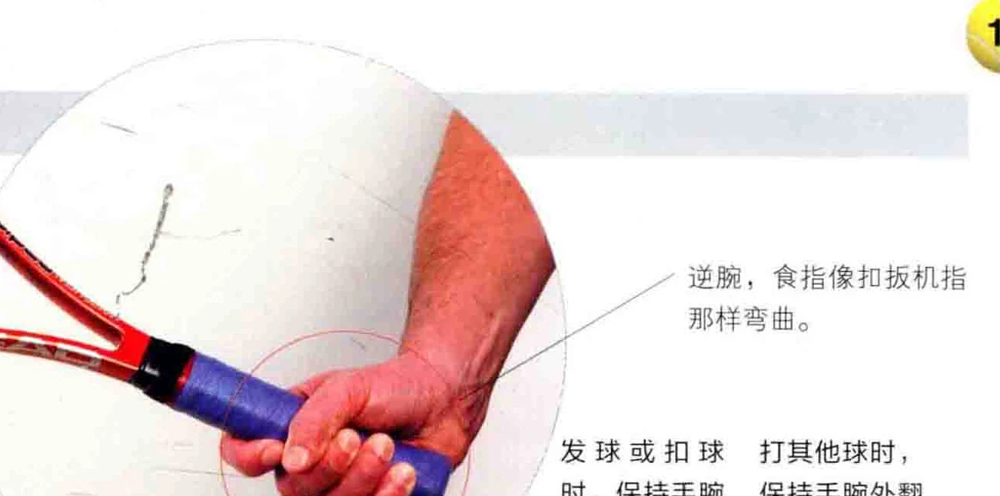
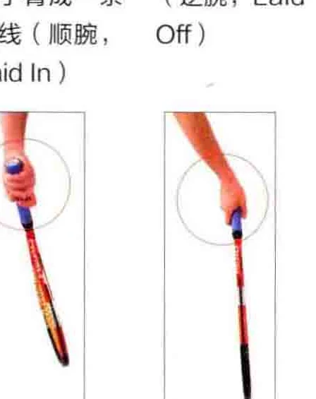
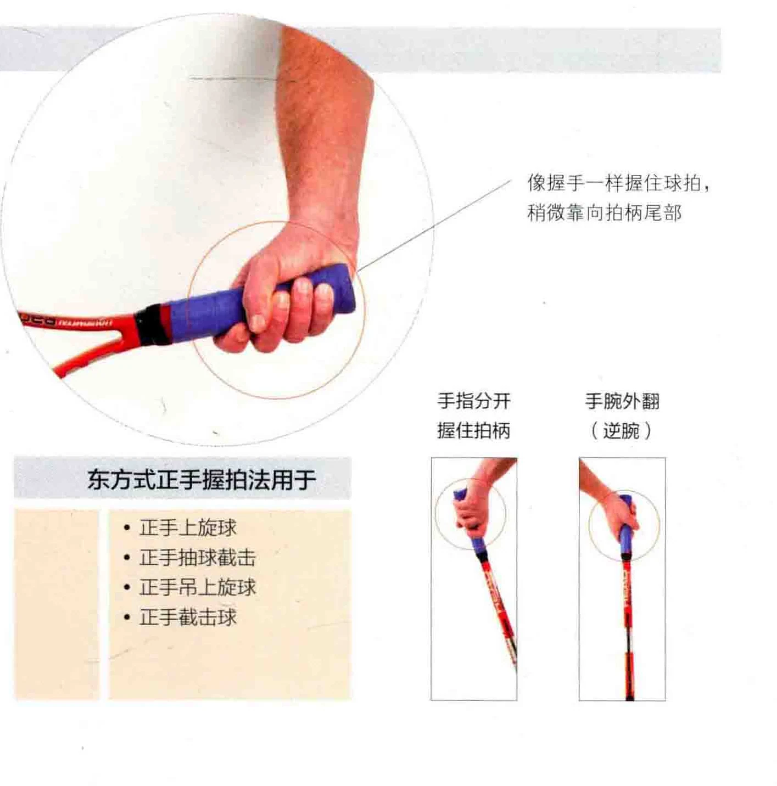
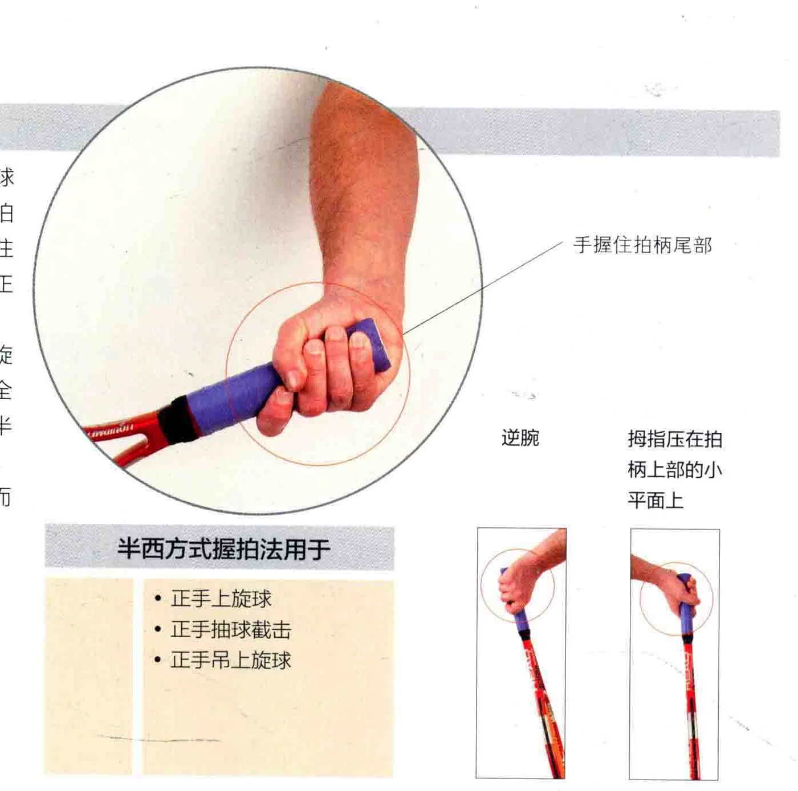
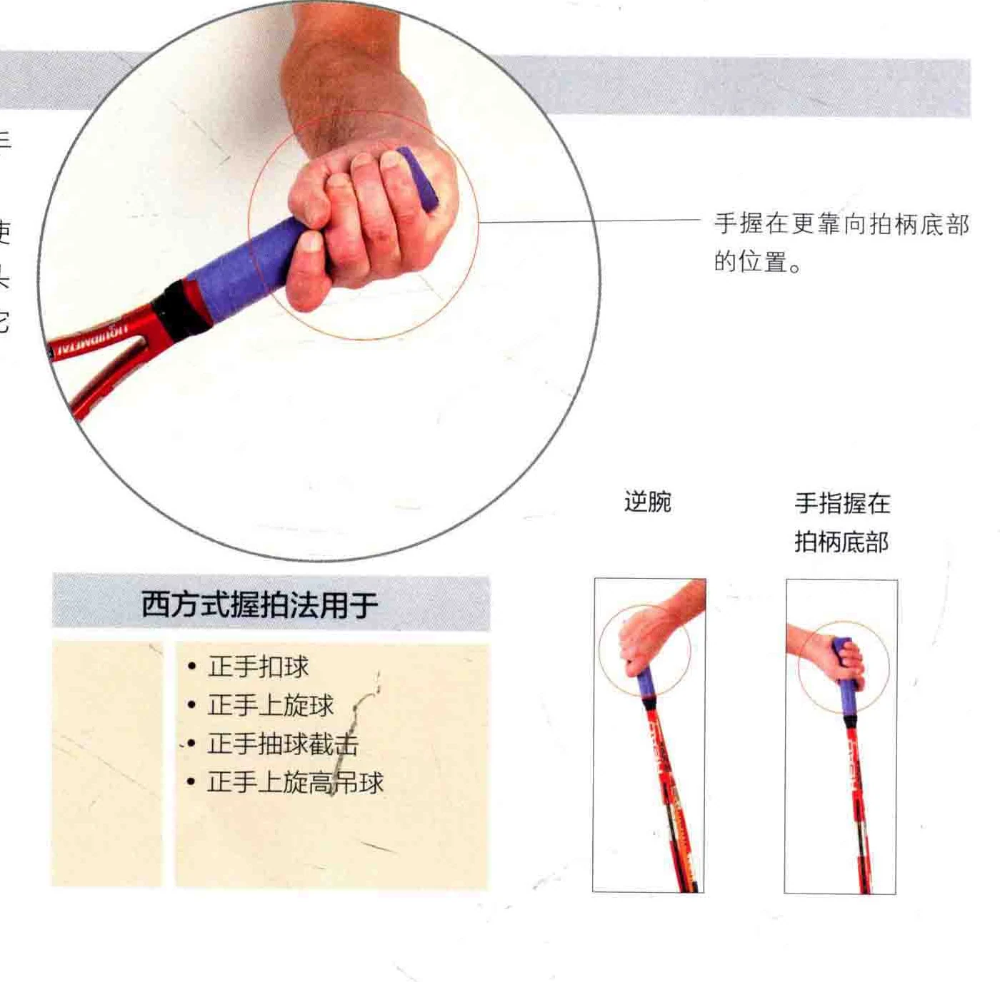
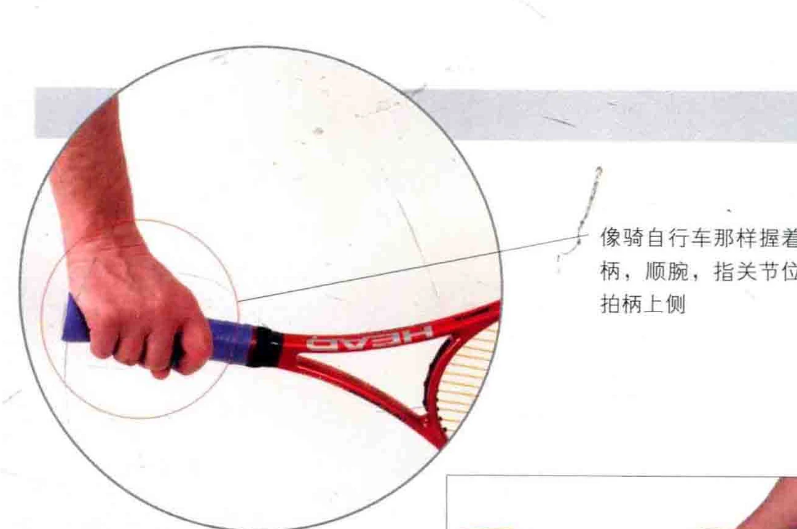
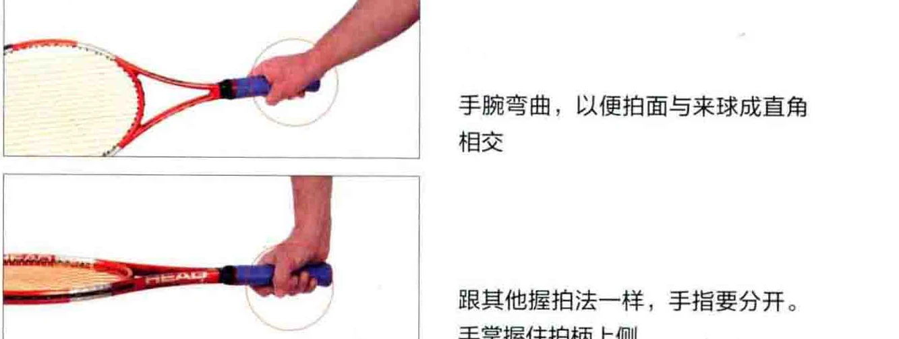
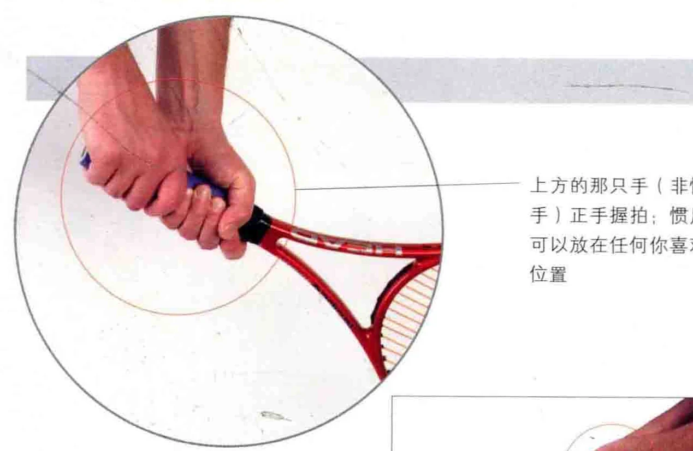
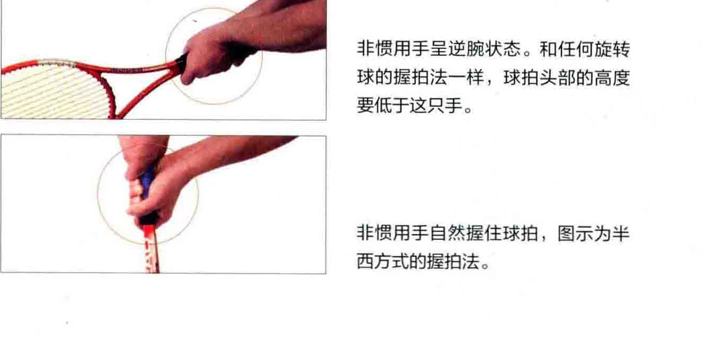

真正拿起球拍来练习时，您会发现顶尖的网球选手都是像本书示例那样， 握着拍柄的尾部的。 二您不必要求自己刚开始握拍就这样正手上旋球 (Forehand “0 的时候，不要握住拍柄底部，而是先握着拍柄的颈部打几球。随着练习时间的增加，您最终会将握拍位置下移，以便更轻松

自如地挥拍。这种握拍步骤可以贯彻在每一球的练习中。

### 要诀选一个合适自己的

对于许多击球方式而言，哪种一。您自己要用哪种也是个令人头痛的事。不过，您可以分析每种击球方同高度的球。举例而言，要打出正手 (Eastern Grip )，从而接住触地反弹后高度在肩膀以下的球。然而，要接住高度在肩膀以上的球，则需要加大挥拍范围，这就得采用半西方式 ( Semi-Western )，或西方式 (Full

拉菲尔* 纳达尔 ( Rafael Nadal ) 打出一记强劲的双手反手上旋球 ( Two- Handed Topspin Backhand )

### 大陆式 ( 即椰头式 ) 握拍法

这种握拍法广泛运用于多种击球方式。请注意拇指和食指是怎样握住球拍的。

发球时，大陆式握拍法能自然而灵活的击球，并且可以打出旋转球， 这一点对于其他握拍法而言可能不太方便。

这种握拍法通常用于截击球 ( Volley )，因为它能打出正手或反手截击球，却不必改变握拍方式。这对于迎击那些以50英里的时速朝您飞来的球是非常有利的。大陆式握拍法还能让您在截击时自然地打开拍面。

采用此种握拍法，能够打出正手或反手上旋球，不过上旋得非常有限，而且球飞出界 ( Out ) 的概率也较高。

### 东方式正手握拍法

这种握拍法就像握手，通常用于打正手上旋球。

相对于大陆式握拍法而言，东方式的握拍角度，能让拍面更向内，从而在从后方抽球时减少球飞出界的概率。

众所周知，顶尖选手也使用这种握拍法来打出正手截击球。

。 逆腕: 是指手腕朝着 “身体后方，又称手腕

外翻。 顺腕: 是指手腕伸直，与手臂成一条直线， 或稍微朝前。 = 1号

### 大陆式握拍法用于

。 发球 (Serve )。扣杀( Smash ) * 截击球

。削球 ( Slice )

。放小球 (Drop )。正手上旋球

### 东方式正手握拍法用于

*。正手上旋球。正手抽球截击。正手吊上旋球。正手截击球

_一逆腕，食指像扣扳机指那样弯曲。

发球或扣球打其他球时， 时，保持手腕保持手腕外翻 7 与手臂成一条 ( 逆腕，Laid 人直线 ( 顺腕， Off )

像握手一样握住球拍，

### 稍微靠向拍柄尾部手指分开手腕外翻

### 握住拍柄 (逆腕 )

### 旬”半西方式握拍法

这也许是最常用的正手上旋球的握拍法，其方法是用手握住球拍尾部，从而能够在任何场地上接住任意高度的球，继而打出有效的正手上旋球。

这种握拍法还能增加球的旋转，并在用拍面抽球时保证安全性。同时，对于年幼的人而言，半西方式握拍法也是个绝妙的起步， 因为它能接住高球，这对小孩子而

言是很有用的。。 半西方式握拍法用于

。正手上旋球。 正手抽球截击。 正手上旋高吊球

### - 手握住拍柄尾部

### 逆腕拇指压在拍柄上部的小平面上

西方式握拍法这是一种极端的正手握拍法，手要几乎握到拍柄底部。 辣西方式握拍法主要是红土选手使人用的。初级选手在持续地接高度在头 ” 部的球时，也会用到这种握拍法，它能打出旋转度很高的上旋球。 逆腕手指握在拍柄底部西方式握拍法用于 “”。正手扣球，。正手上旋球 .。正手抽球截。正手上旋高时球

### 单手反手上旋球握拍法

“ 单手反手上旋球。 单手反手上旋抽球截击 “。 反手上旋高叶球

。 双手反手上旋球。 双手反手抽球截击。反手上旋高吊球

### “地像骑自行车那样握着拍

柄，顺腕，指关节位于拍柄上侧

上方的那只手 ( 非惯用手 ) 正手握拍;惯用手可以放在任何你喜欢的位置

### 单手反手上旋球握拍法;

此处展示的是单手上旋球的握拍法，打出这种球，也可以采用反手东方式、反手半西方式的握拍法。

手大致握在拍柄顶部上，像骑自行车时握住车头那样。跟所有正手握拍法一样，此种握拍法在抽球时也会将拍面向内扣，以防止球飞出界。

手腕弯曲，以便拍面与来球成直角相交

跟其他握拍法一样，手指要分开。 手掌握住拍柄上侧

### 双手反手上旋球握拍法

打反手球时，这种握拍法更为舒适自如，力道也更大。

选择您喜欢的正手握拍法, 然后把非惯用手握在球拍颈部, 这只手才是击球时实际的发力手, 悍用手并不需要发力, 只要用任何你觉得舒服的姿势握住拍柄的底部就可以了。 注意， 两只手要并拢, 但不要妓在一起。

非惯用手呈逆腕状态。和任何旋转球的握拍法一样，球拍头部的高度要低于这只手。

非惯用手自然握住球拍，图示为半西方式的握拍法。

