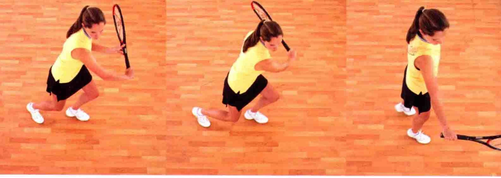

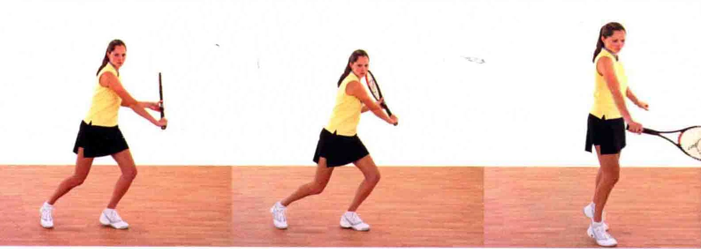

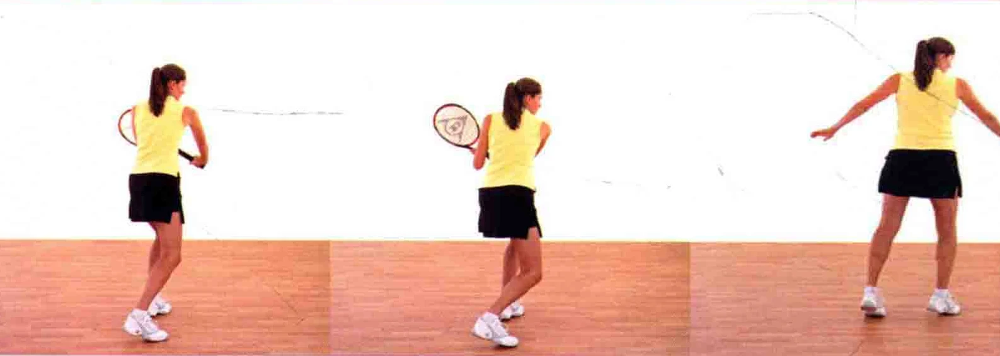

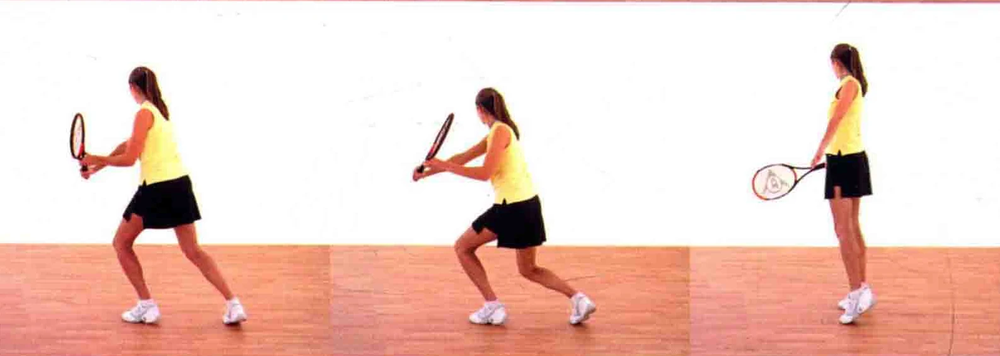

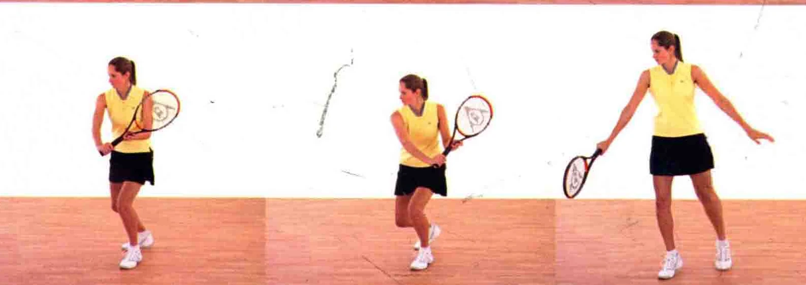

方式。采用单手反如接球能力。

### 把握时机

“5 ”的时候击球。 上旋

以预备姿势站立，球拍置于身体前方，非惯用手扶在拍柄的颈部上。膝盖稍微弯曲，以便于移动。

握拍法，能显著提升您的

所有成功的击球都是建立在正确把握时机的基础上的。“等待- 对手的球时，要快速地从1数到5。在球落地时开始数“1”，数到

上旋是球拍由下至上擦过球面形成的，它能让球快速地沿着运动轨道向前方旋转，从而使球急速下落，且不容易出界。

### 握拍法

可以选择东方式、半西方式或大陆式握拍法 ( 见本书13、14页 )。像骑自行车那样握住球拍，指关节位于拍柄项侧。

与上旋球的其他打法一样，用拍面擦过球的后人出，打出过网高度在4英尺 ( 1米 ) 的球。

肩头收紧，以便聚力一击

拍面由下至上探过球身，使球上旋

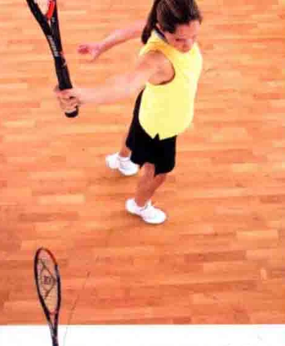

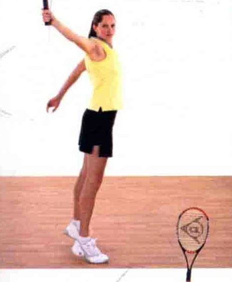

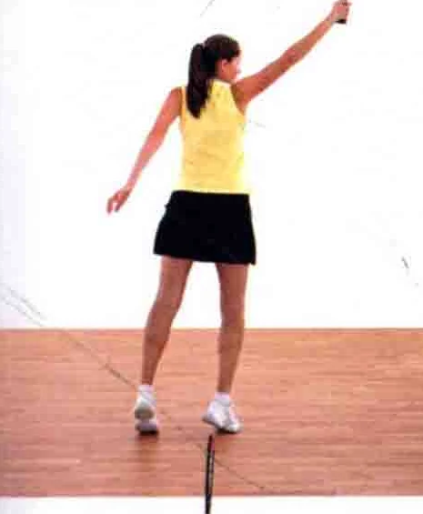

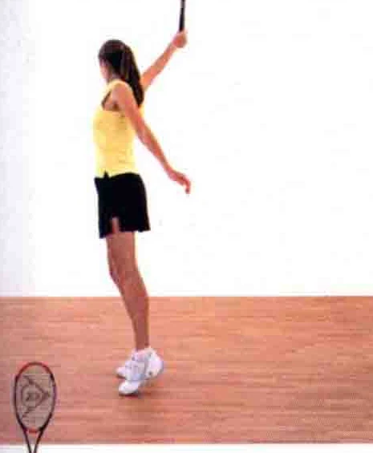

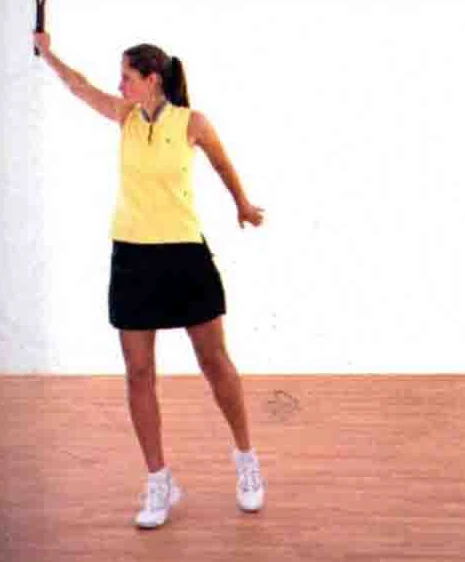

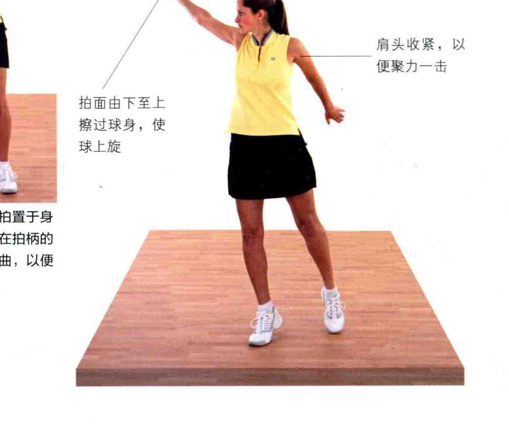

### 江上布守光

握好球拍，用拍柄尾部追踪球路。

友2 用拍柄尾端追踪来球 > 注意，仔细观察图中运动员反手持将球拍头部抬拍，用拍柄尾部朝着位于身体前方高至手腕以上的球的具体做法。 上半身开始转动 SR

从这个角度，您能看见身体重心开注意，非惯用手扶着拍柄颈部，手始移至反手侧。 腕弯起。

上目视着网球将身体重心下沉至脚部 SN 用拍柄尾端追踪球路要光用拍柄尾端追踪来球

追踪位于身体前方的球时，身体重心移至反手侧。

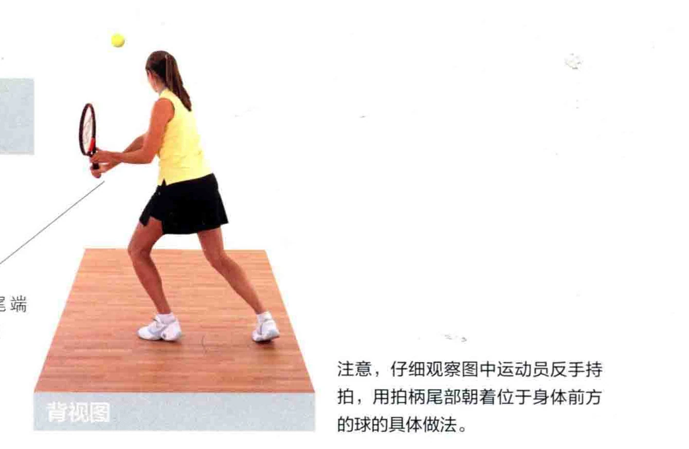

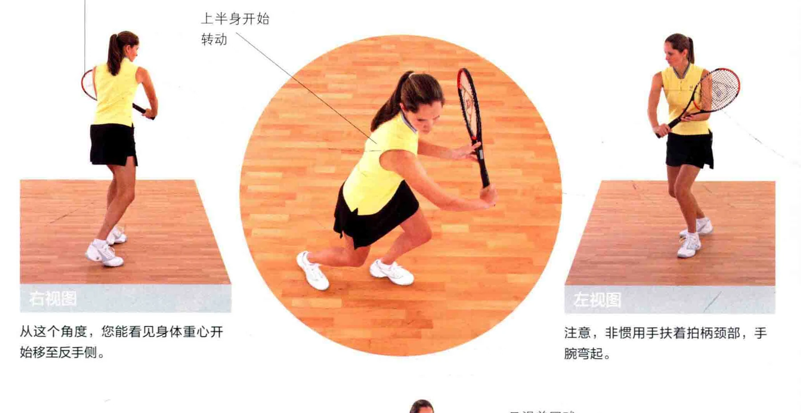

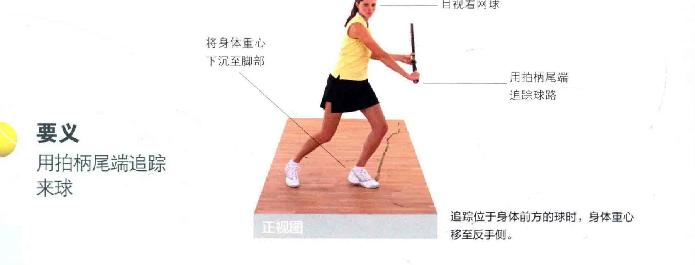

拉拍球触地反弹后，在一个合适的时机拉拍， 和所有的击球法一样，将身体重心下沉。

从这个角度能完追踪球路的同时，将身体重心下沉。

全看见背部注意，此时重心位于身体的反手侧。

在这个角度，您能看见上半身在拉拍时自然地转向、手腕外竹的具体身体重心放在外做法。

### 侧腿上

自如地采用开放式或闭合式站姿， 两种均可，这取决于球的位置。

### 一非惯用手仍然扶着

Ce 拍柄颈部位于身体前侧的肩本膀朝着球转去、 鲁双眼注视着球，寻找击球点，以及球区

拍擦球使之旋转的时机。 有

### 喇咱

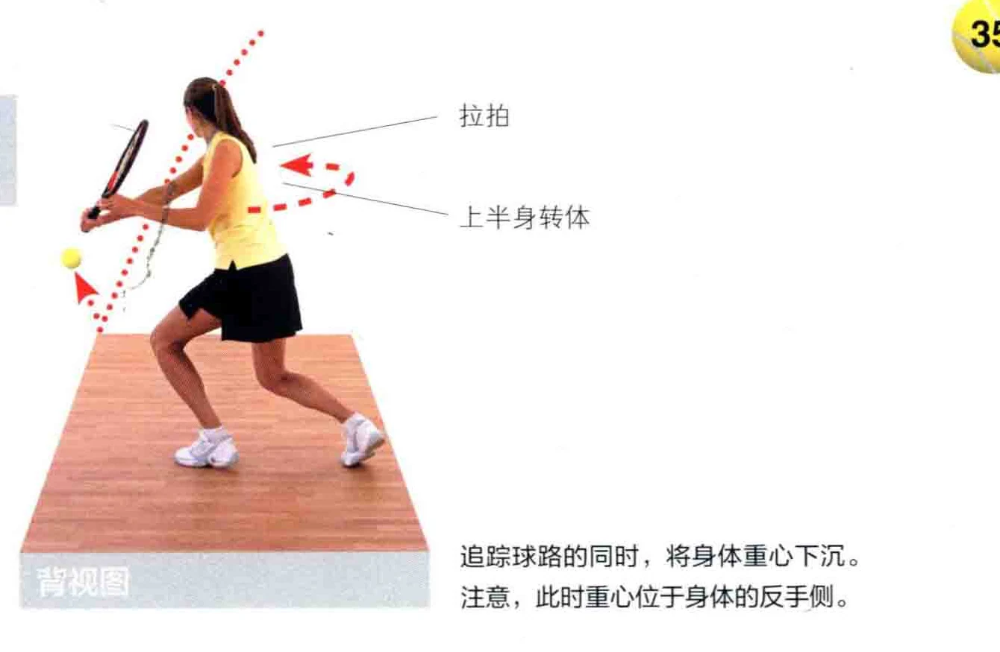

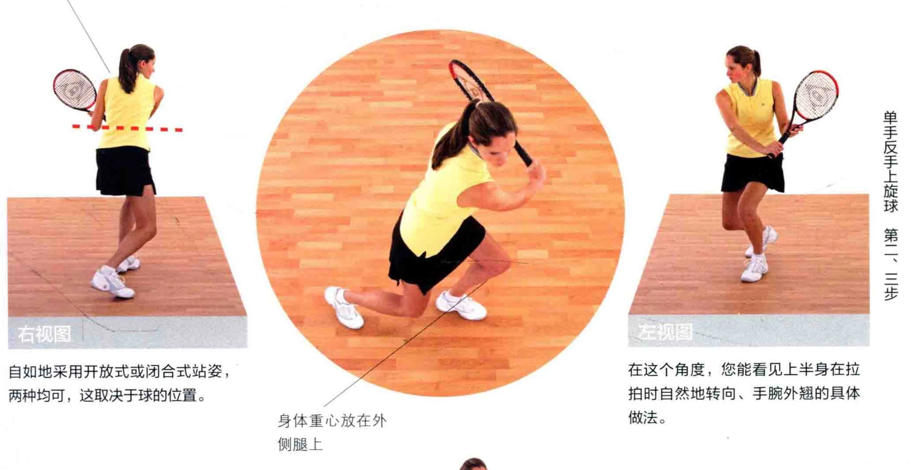

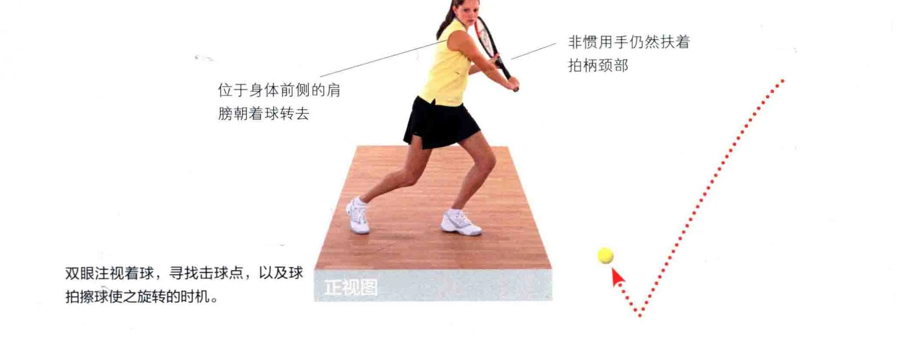

如本 2 呈 ee， 在击球点时，身球”击球点 ee 5 ! 体完全延展球触地反弹后，迅速地从1开始默念，念到5时，让拍面由下至上擦过球身。 Y

用拍面探过球的后侧，打出上旋球、

松开非惯用手，擦球时，球拍头部的高度仍然略低于手。

### 舒展上半身

### 头部保持不动

击球点位于身前，击球时身体向上伸。 由下至上挥拍，使拍面与球接触， 同时将球拍头部拉起。

双腿哮地， 使身体拾高将球拍头部拉高臂的力道

### 二前

。”击球时, 拍面朝着球而平展。

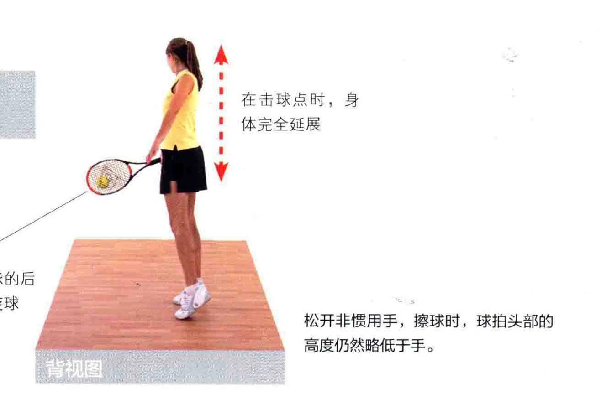

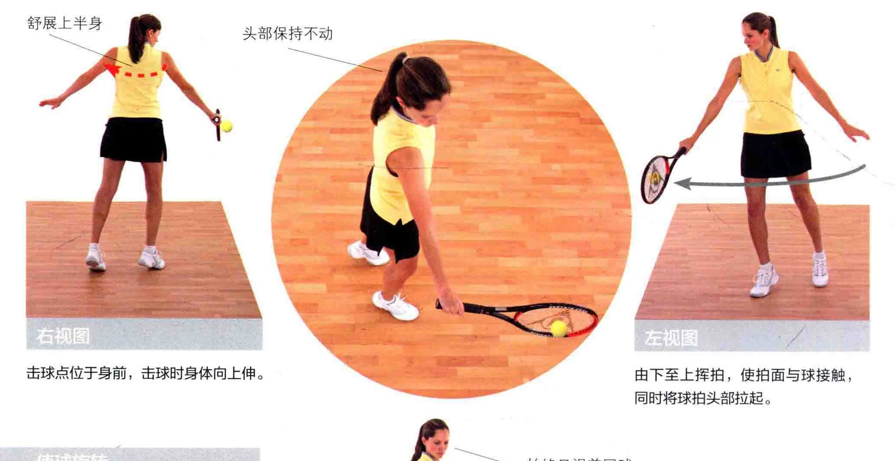

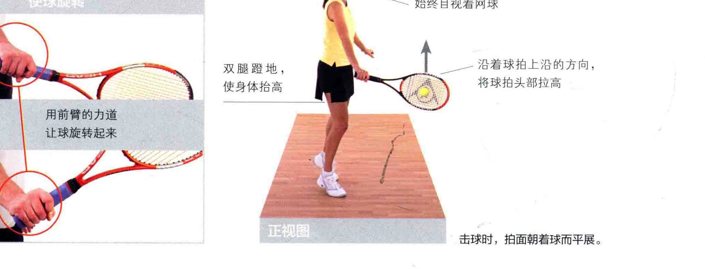

结束挥拍拍面擦过球身之后，球拍头部高举，收紧两侧肩胛骨，以加大击球力道。

非惯用手回拉至身后。

朝着球所在的方向踏上一步，用 “自由女神像”的站姿结束挥拍。

### 采用“自由女神像” 站姿结束挥拍

### 将大部分身体重心移至前脚

从这个角度，您能清晰地看到，结束挥拍时，身体重心移至前腿。

### 收紧两侧肩胛骨

结束挥拍时，仍然目视着球的去向， 准备下一击吕

### 以“自由女神像”的站姿结

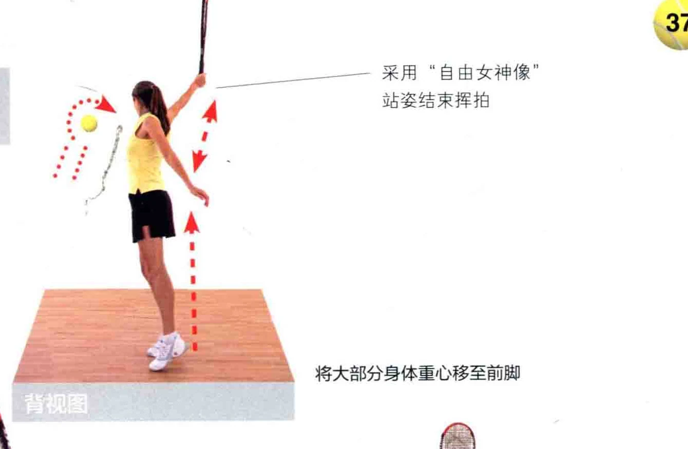

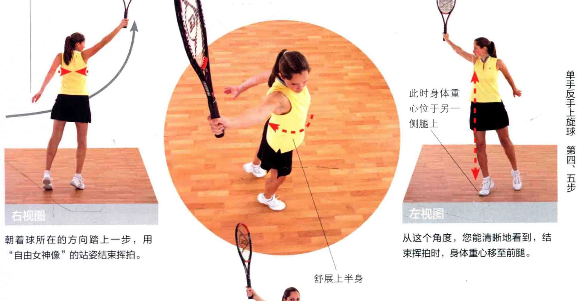

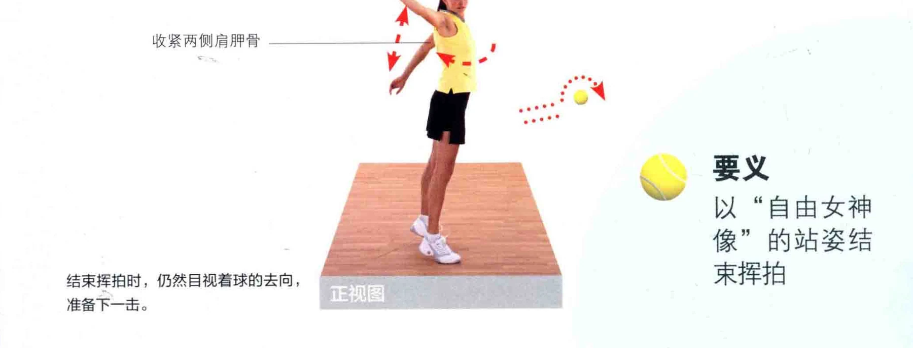
