### 上由上几人姬笑忆营

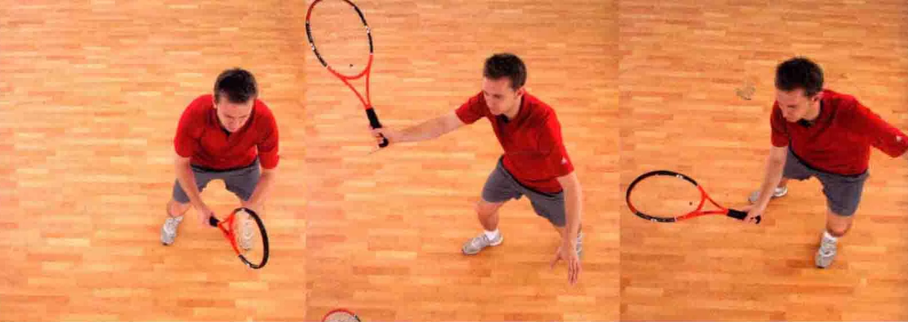

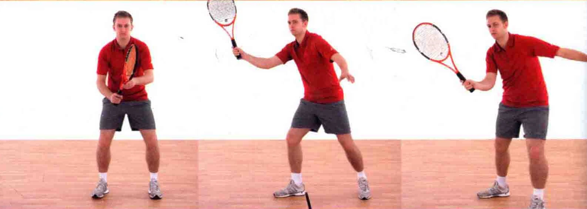

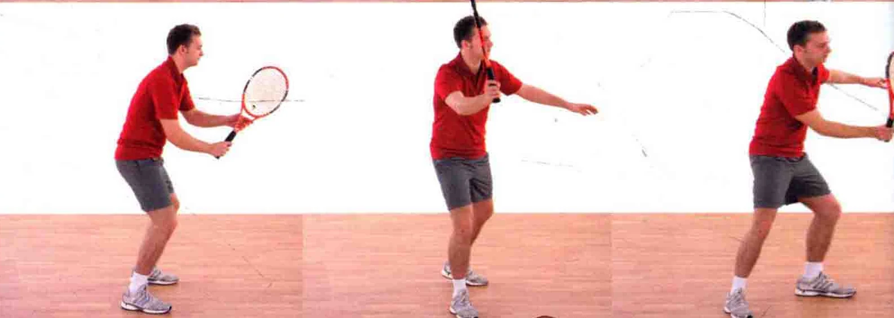

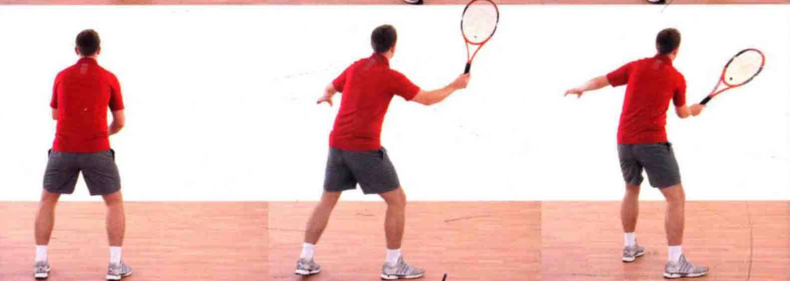

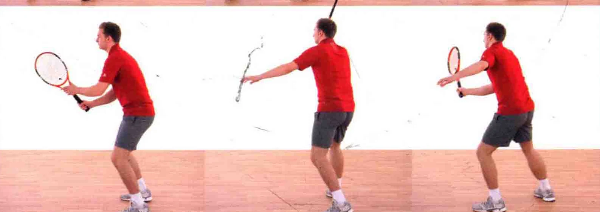

### ”正手高截击球

这种击球法通常用于网前打法，球在触地反弹之前，就被运动员迅速接住。截击球通常是得分的制胜一击, /视度在头部的截击球尤为如此。 全把握时机

所有成功的击球都是建立在正确把握时机的基础上的。

了汪让来球时，要快速地从1数到5。对手发球时开始数，数到“5 ”的时候打出截击球。

### 使球旋转

截击球的打法跟削球类似，因此它打出的球带有逆旋或

侧旋，或二者第有。 握拍法正手高截击球，通常采用

大陆式握拍法，也有一些

选手采用正手东方式握拍法 ( 见第13页 )。 预备当您发现自己正位于网前时，视情况或策 . 略，您必须有打出一记漂亮的截击球的技了头部保巧，从而得分。 有站非惯用手保持

### 身体平衡

上半身稍微偏转球拍下击并擦过球身， 击球后，球拍必须立刻

以预备姿势站立，球拍置于身体前方，用大陆式握拍

法。膝盖稍微这曲，以做好的旋光。 踏前一步，使姿态上知更自如“一AR

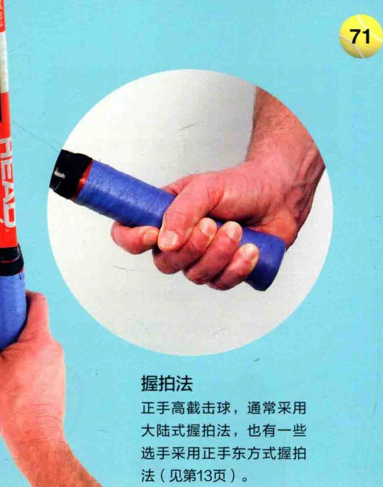

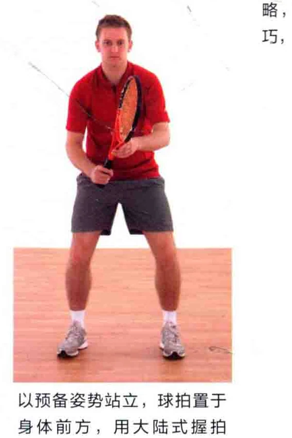

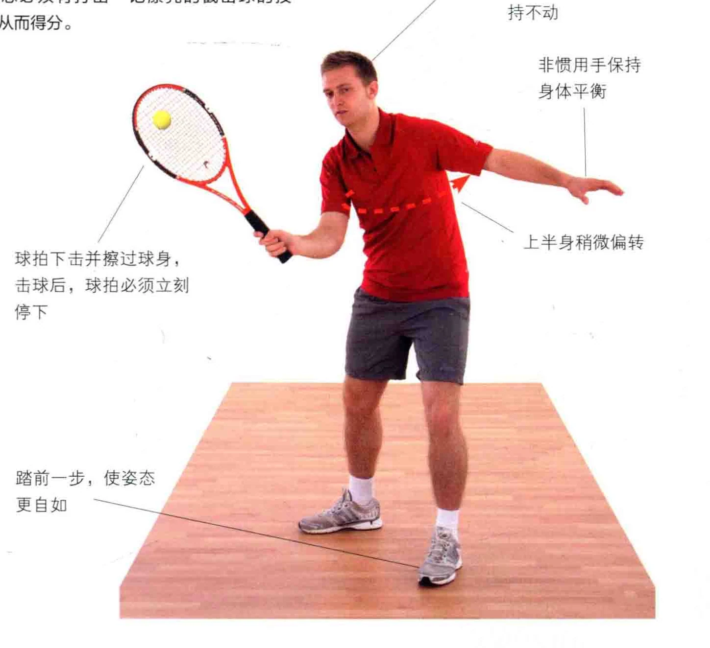

### 江夏半党全

### 迄味于咯

球拍位于身体前追踪来球时，球拍位于身体前方，高于方，追踪来球手部。 稍微将球拍后拉球拍的位置要高于手部，略微后拉。

身体自然地朝着球的方向移动，从

追踪来球时，身体重心稍微偏向正

手侧。 而让重心偏至正手侧。 而刘得局本上半身稍微转身要义

### 用球拍追踪来球

。 循着球路移动身体时，注意用非惯用手保持身体平衡。

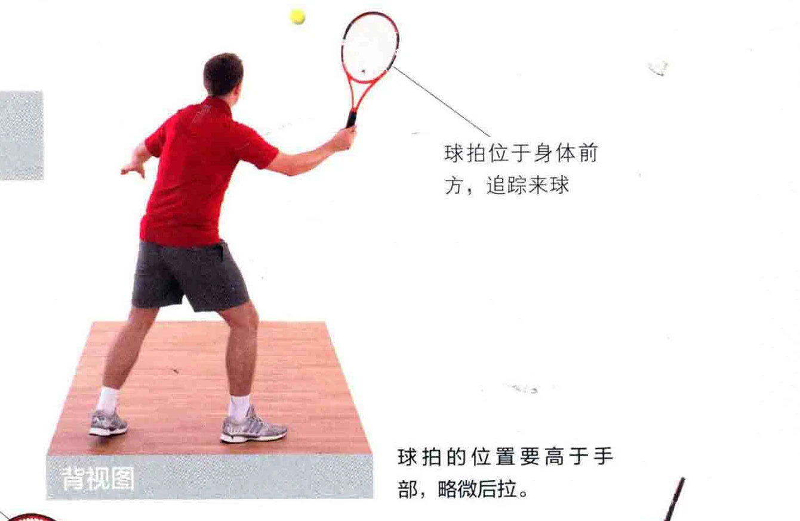

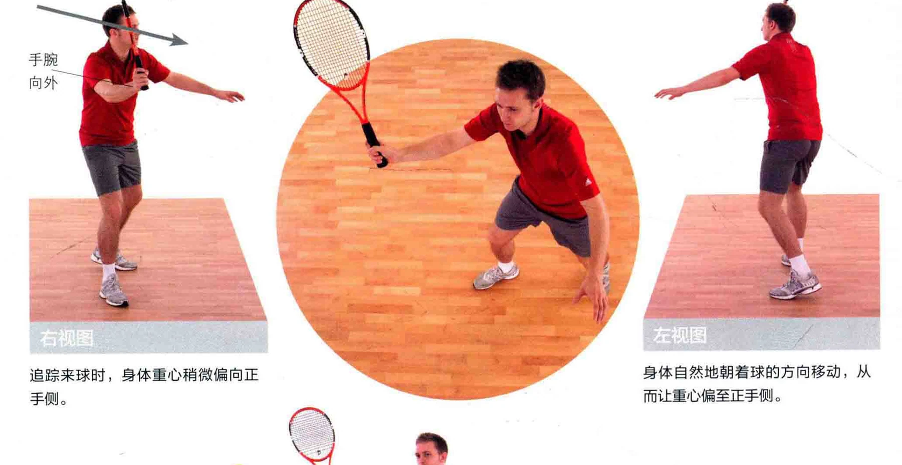

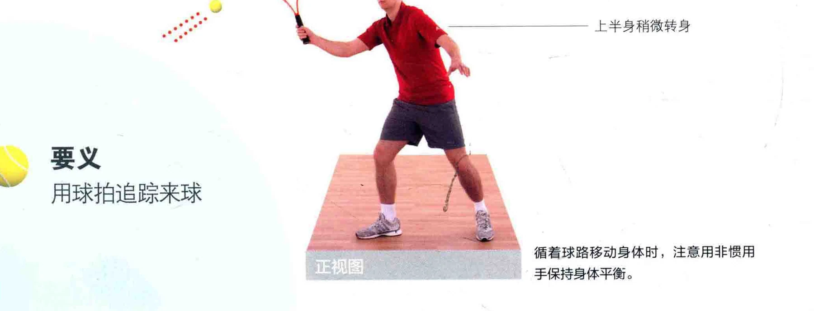

击球点碰到球后，球

默念击球时间，数到5时就是击球点，请拍停止挥动确保球拍在击球后立刻停下来。 胶部张开

### 头部保持不动

如图所示，以逆腕的握拍法，把球拍尾部拉回身体近侧。

球拍在击球后立刻停下，拍面稍微打开 e

图中的运动员采取了半闭合式站姿。您可以自如地移动双脚，朝着球走去。

### 上半身稍微转身一一

机义踏前一步，使姿态自如一击球后立刻售止挥拍，恢复球拍线在下侧擦过球身时，双眼专注预备站姿

地看着球。

### 直吕一尝贞十驯4H月

### 利呈

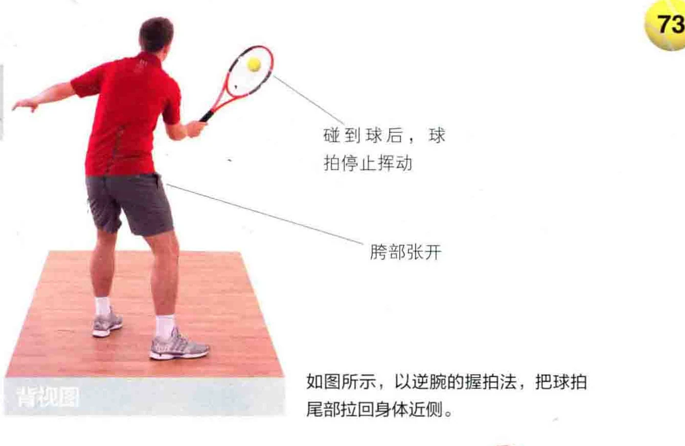

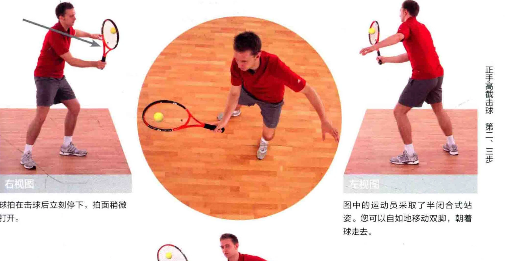

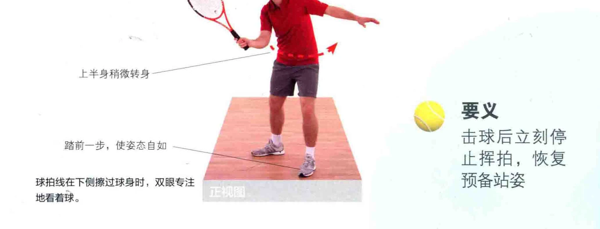
