### i亚全叮

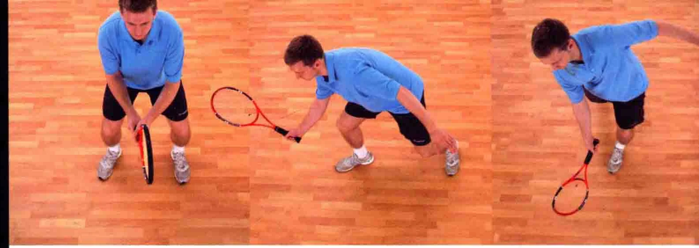

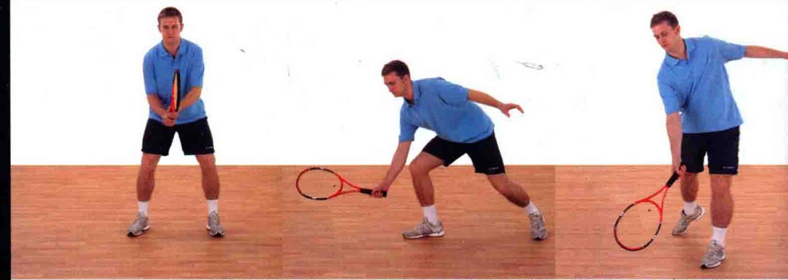

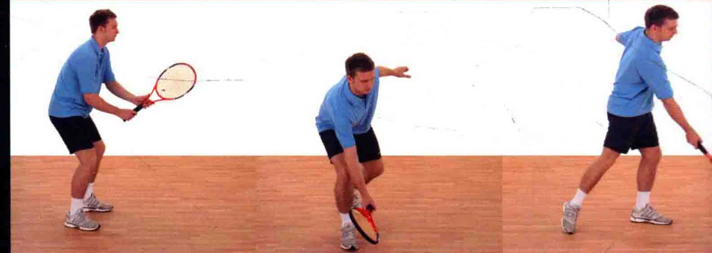

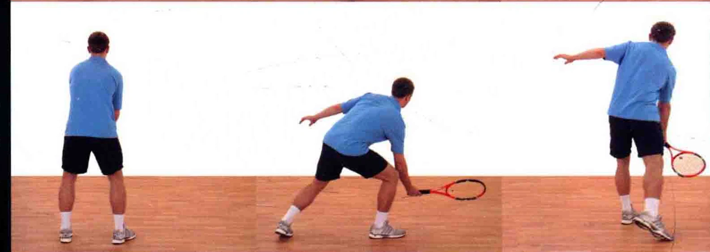

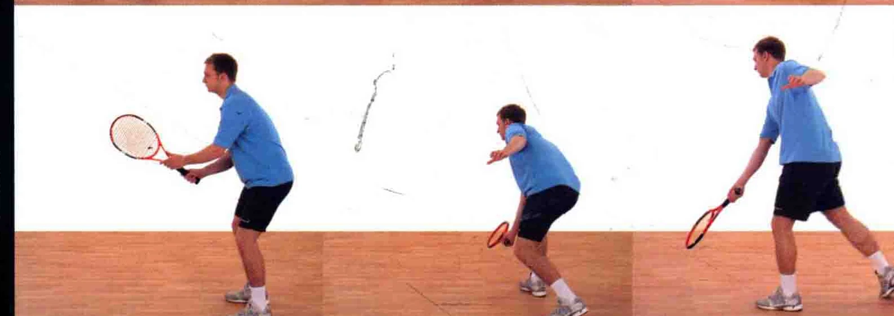

这种击球法通常用于网前打法，球几乎没有触地弹的机会，就被运动员迅速接住。当击球的位置低于时，必须采用低截击球的打法，朝上打出截击球。

### 把握时机

。 所有成功的击球都是建立在正确把握时机的基础上 _ 的。在“等待”来球时，要快速地从1数到5。对手发球时 ”天私数“1”，数到“5”的时候打出截击球。

使于旋转。 截击球的打法跟削球类似，因此它打出的球带有逆旋 ”或出旋，或二者皆有。

### 握拍法

正手低截击球，通常采用大陆式握拍法，也有一些选手采用正手东方式握拍法 (见第13页 )。

预备当您发现自己正位于网前时，视情况或一头部保持不动， 策略，您必须有打出一记漂亮的截击球 - 的技巧，从而得分。

### 加大持拍劈的力道一一一一

球拍下击并擦过球身以预备姿势站立，球拍置于身体前方，用大陆式握拍法。膝盖稍微杰曲，以便于移动。 踏前一步，使

### 姿态更自如

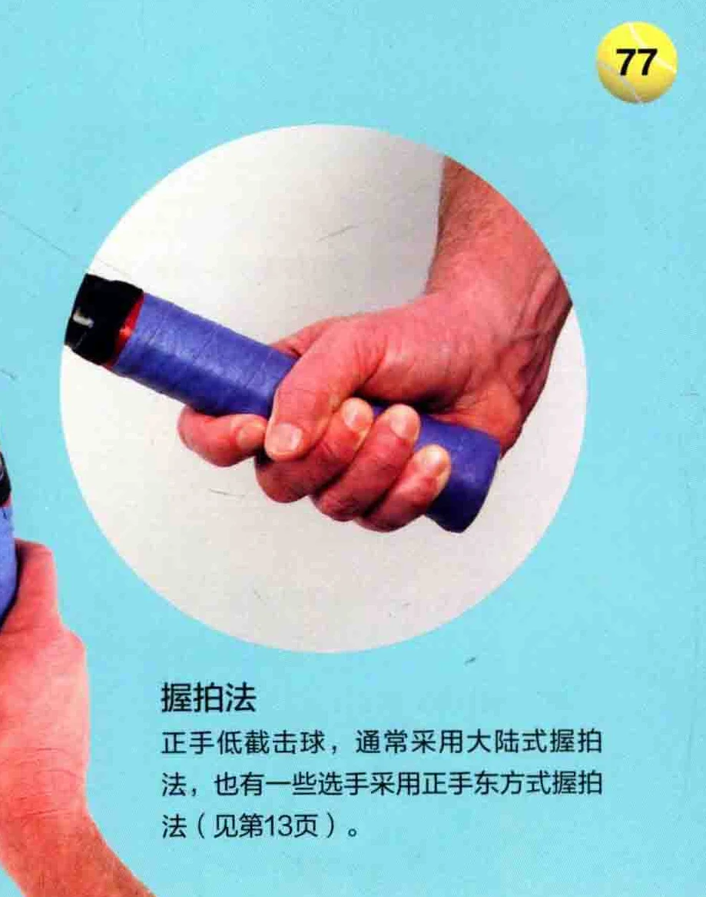

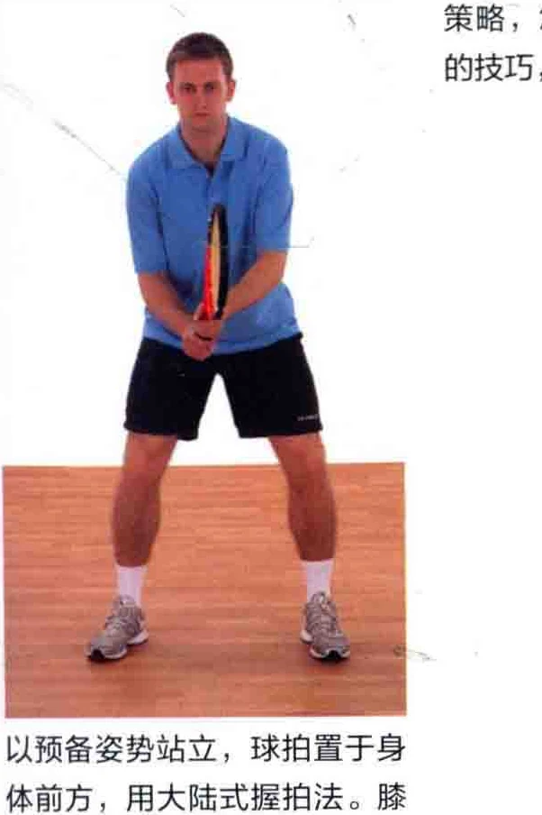

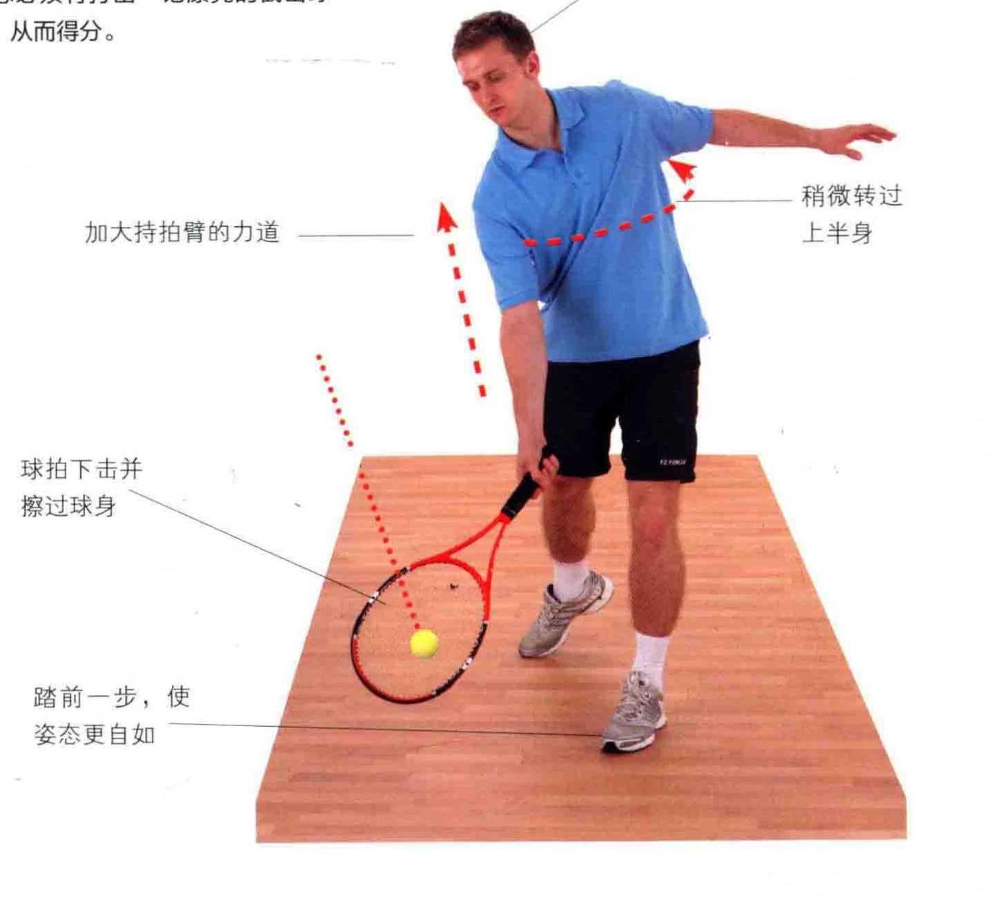

追踪球路追踪来球时，球拍位于身体前方，高于手部 D 球拍的位置要高于手部，略微后拉，。。 头部保持不动担面打开。 足下身体去接球 AN

追踪来球时，身体重心稍微偏向正手侧，两侧膝盖弯曲。

身体自然地朝着球的方向移动，从而让重心向正手侧偏移。

### 一目视着网球打开拍面 ee

包。 要义

### 追踪球路

循着球路移动身体时，注意让非惯用手来保持身体平衡。

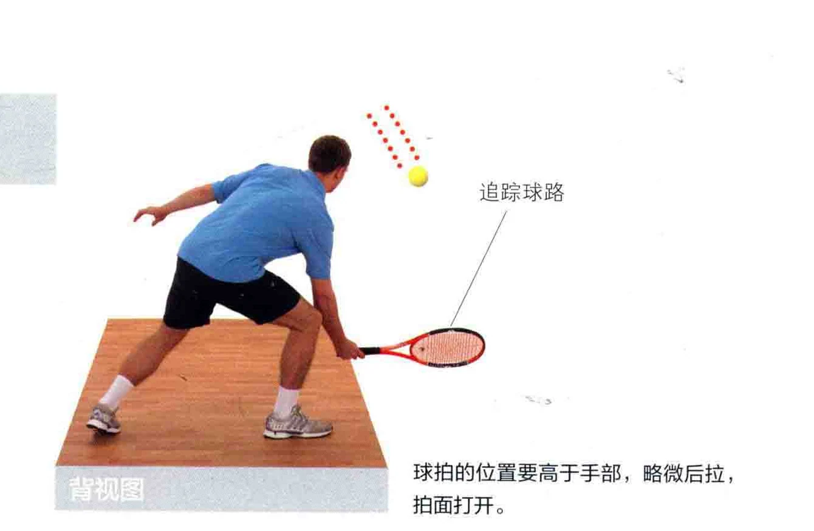

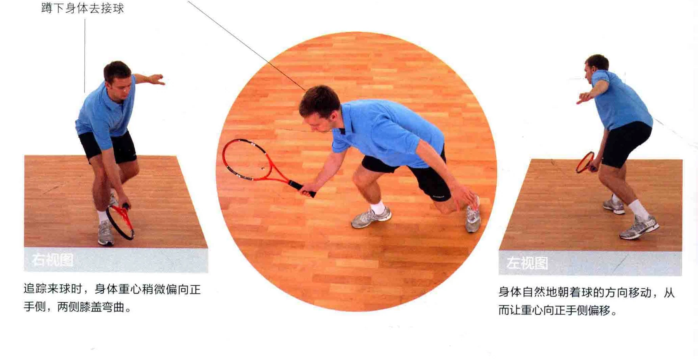

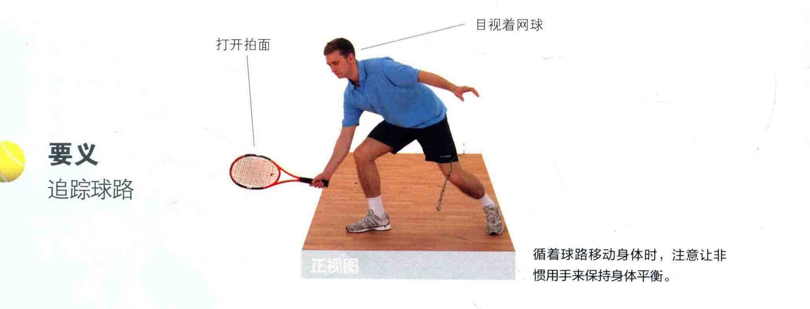

击球点默念击球时间，数到5时就是击球点，请确保球拍在击球后立刻停下来。

_夺到球后，球拍立刻 ” 停止挥动

如图所示，拍面打开并下击，此时身体自然地起立。

### 身体自然地起立

### 在身体前方击球 :

球拍在击球后立刻停下，相较于高图中的运动员采取了闭合式站姿。 截击球而言，此时拍面要打得更目视着球您也可以自如地移动双脚，朝着球开。( 见第70~73页 )。 走去。

### 稍微转过上半身要义

击球后立刻停止挥拍，恢复预备站姿

击球后，双眼专注地看着球。

### | |训”党而琶南州H

### 重呈

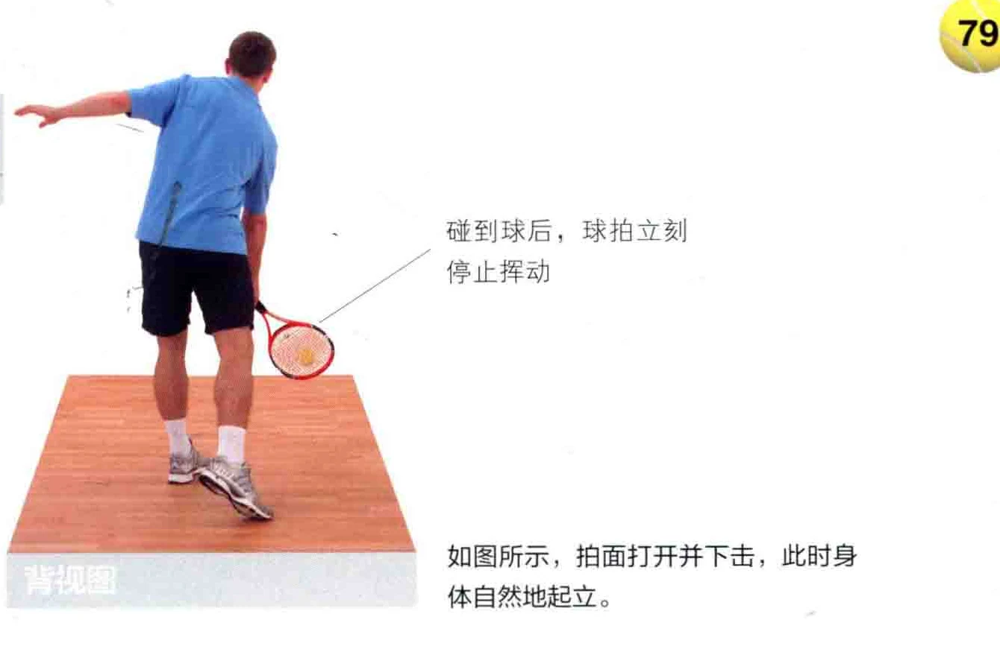

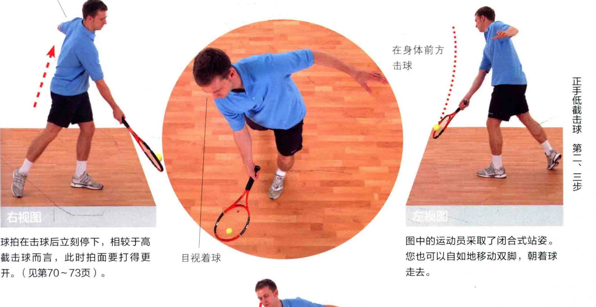

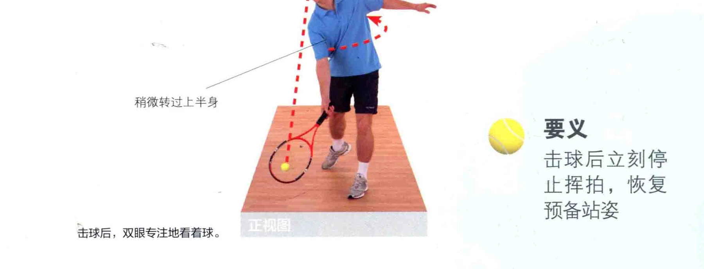
