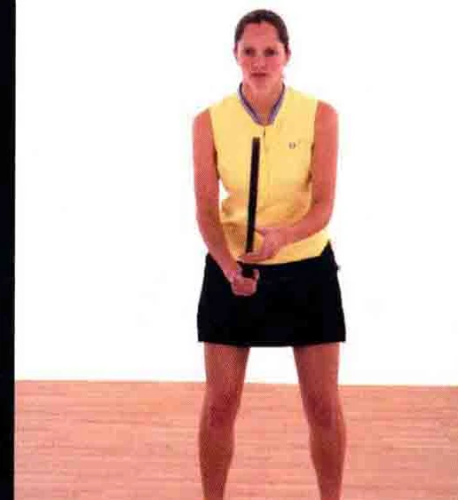
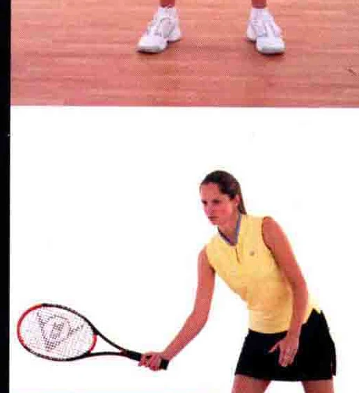
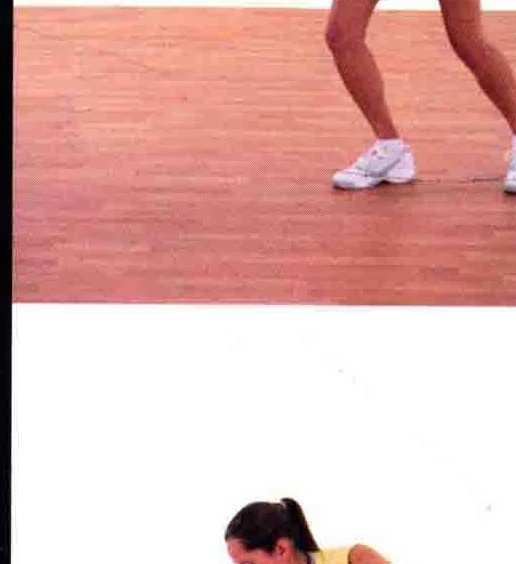
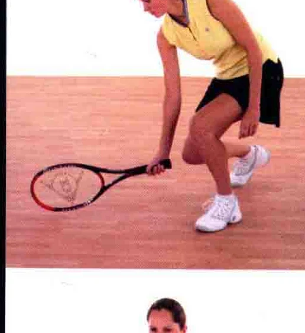
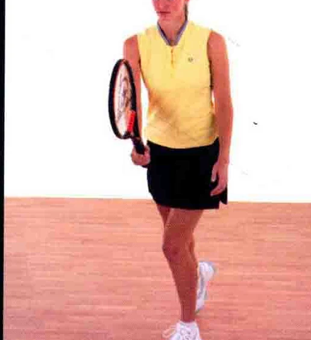
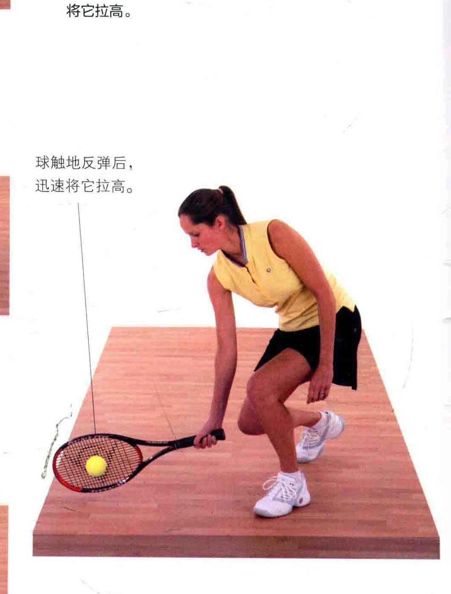
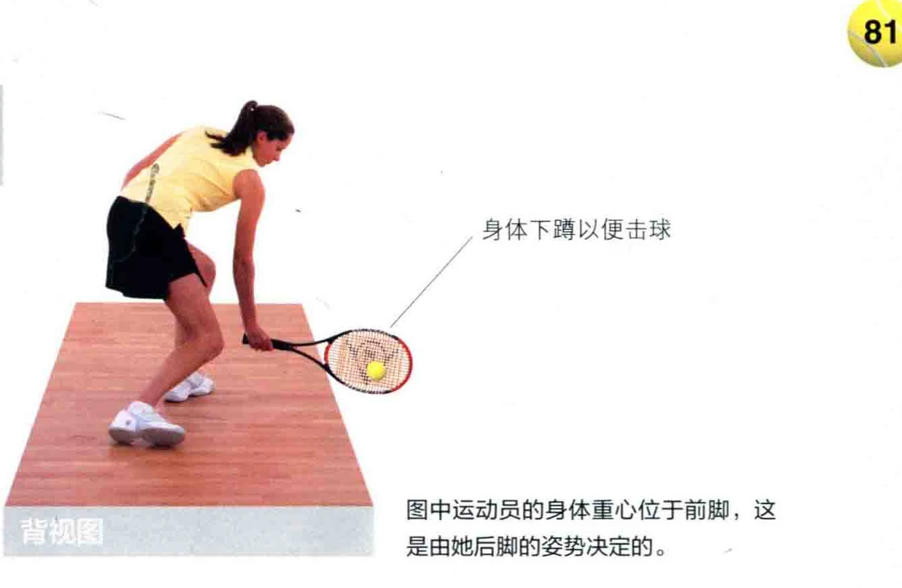
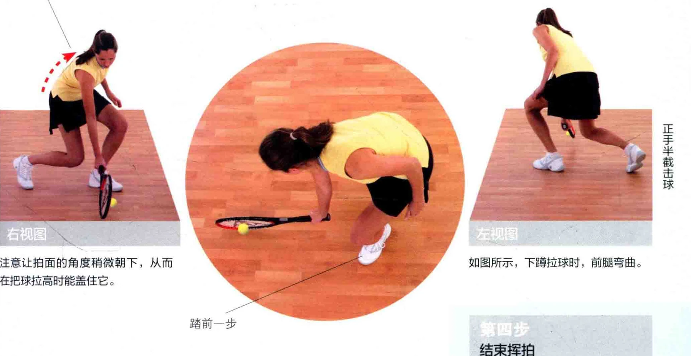
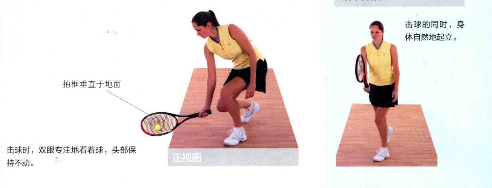

### 肝而于六山月

有时您在网前，而球在您拉拍前就已经触地反弹，这可能是球刚好落在您脚边的缘故。由于几乎没有时间做出反应，您必须在球触地后立刻把它拉高，此时就会用到半截击 ( Half Volley ) 的打法。

球触地反弹后，迅速做出反应，

将它拉高。

球触地反弹后，

迅速将它拉高。

### 击球点

运动员下蹲，以便击球。拍面稍微朝下，

从而在把球拉高时盖住球。 人

### 上半身向前弯下

图中运动员的身体重心位于前脚，这是由她后脚的姿势决定的。

注意让拍面的角度稍微朝下，从而如图所示，下蹲拉球时，前腿变曲。

在把球拉高时能盖住它。

### 结束挥拍

击球的同时，身体自然地起立。

### 拍框垂直于地面

击球时，双有眼专注地看着球，头部保持不动。

