### 区诛欧 T册庆异世原区

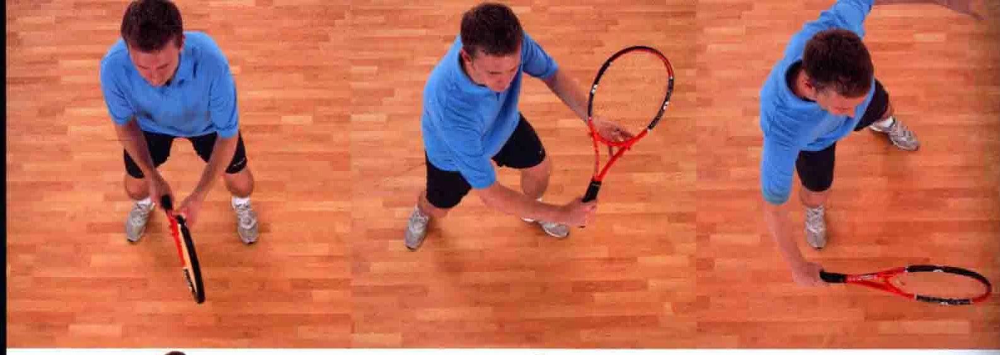

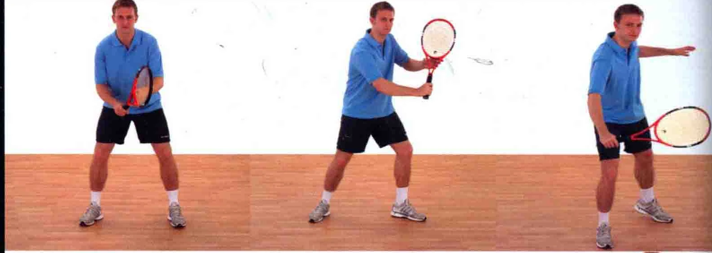

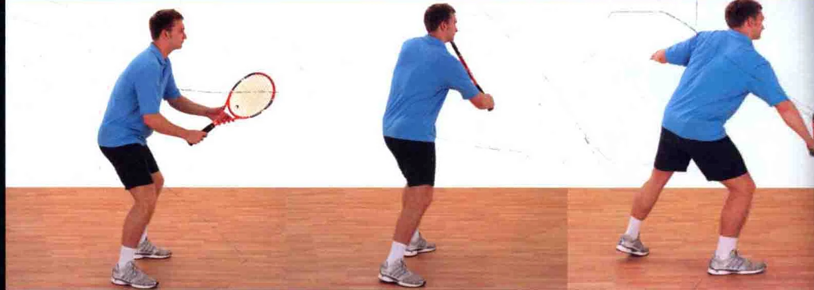

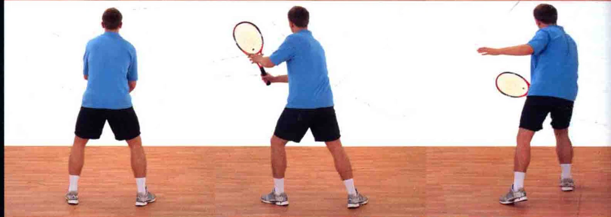

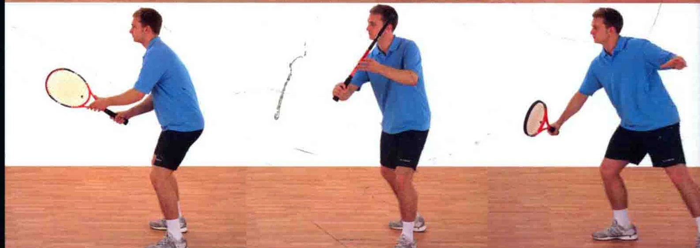

这种击球法通常用于网前球，球在触地反弹之前， 就被运动员迅速接住。

。 把握时机所有成功的击球都是建立在正确把握时机的基础上的。在“等待.来球时，要快速地从1数到5。对手发球时开始数“1 ”，数到“5”的时候打出截击球。

。 使球旋转截击球的打法跟削球类似，因此它打出的球带有逆旋或侧旋，或二者凡有。

握拍法反手中截击球，通常采用大陆式握拍法 ( 见第13页 )。

当您发现自己正位于网前时，视情况或策略，您必须有打出一记漂亮的截击球的技巧，从而得分。

稍微转过上半身本球拍下击并 ss sse / 探过球身踏前一步，以使姿态自如

以预备姿势站立，球拍置于身体前方，用大陆式握拍法。膝盖稍微弯曲，以做好移动的准备。

### 70%的体重放在前脚上

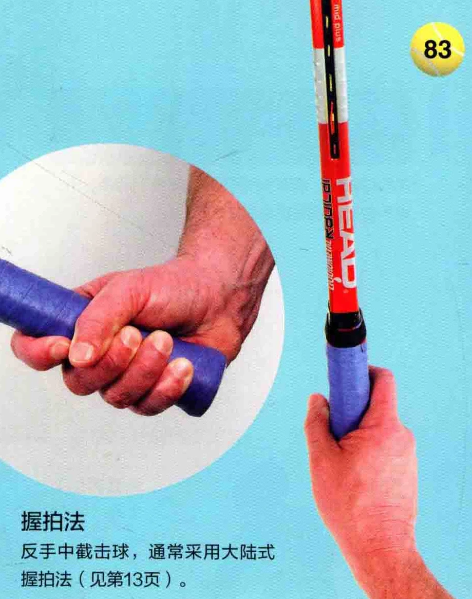

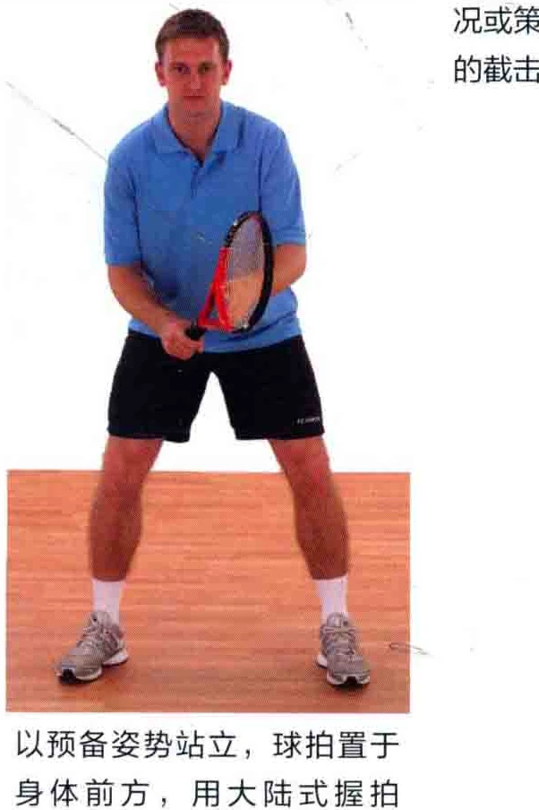

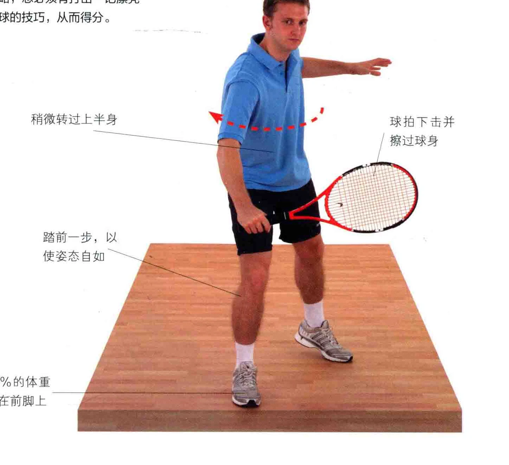

追踪球路时，将球拍持在身体前方，非惯用手在拍柄颈部辅助握拍。

追踪球路时，非惯用手辅助握拍

追踪球路时，身体重心稍微偏向反手侧。

### 目视着球

### 这只脚正要踏前一步

球拍的位置要高于手部，略微后拉。/y

如图所示，非惯用手扶着拍部，辅助性握拍。

### 逆腕

循着球路移动身体时，注意球拍头部始终要高于手的位置。

### 柄颈

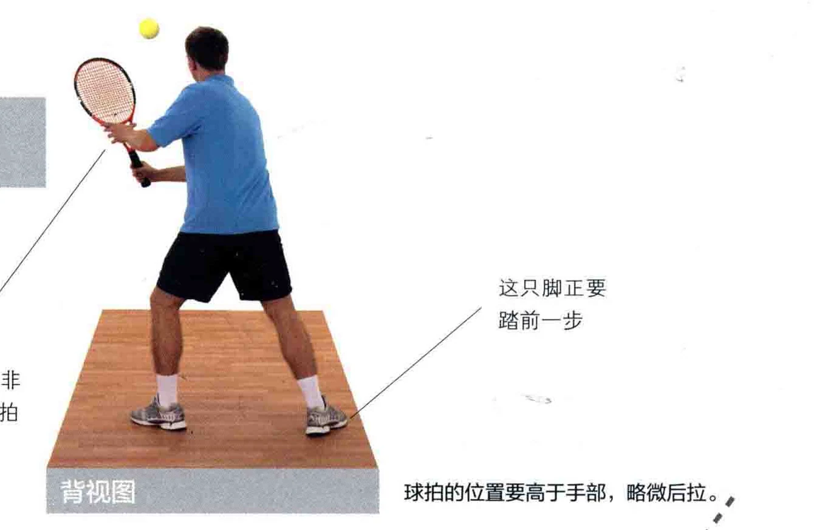

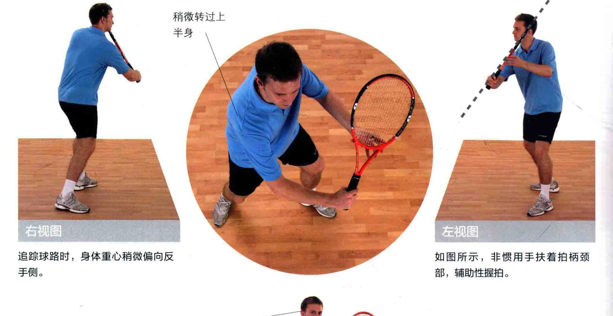

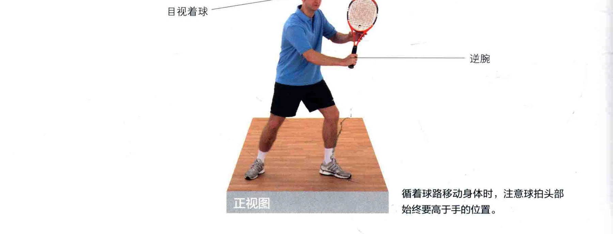

击球点二二默念击球时间，数到5时就是击球点，请确保球拍在击球后立刻停下来。 碰到球后， 非惯用手松开球拍球拍立刻售止挥动

区 | 球拍在击球后立刻停下，拍面略微打开。

### 上半身稍微舒展

击球后，继续观察球的去向。

、头部保持不动

击球时，拍面略微打开。

图中的运动员采取了半闭合式站姿，以便自如地朝着球走去。

### 击球点位于身体前方外全

### 要义击球后立刻停止挥拍

### "|各”江上而囊妖州河

### 利川

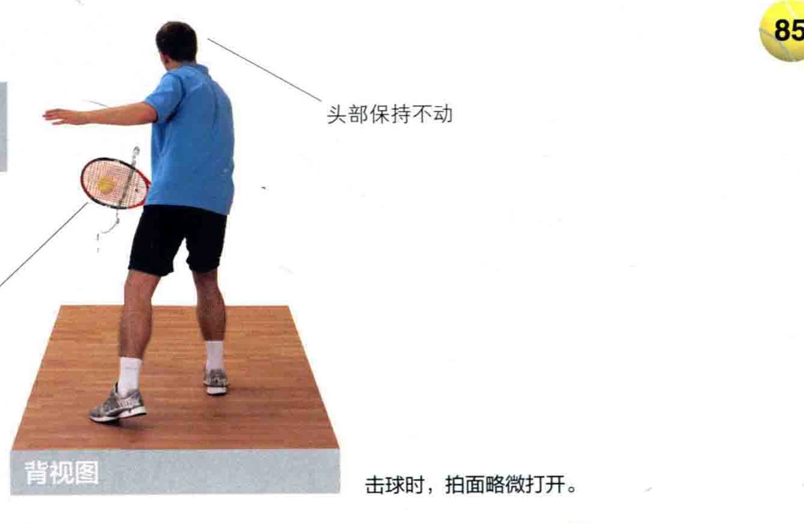

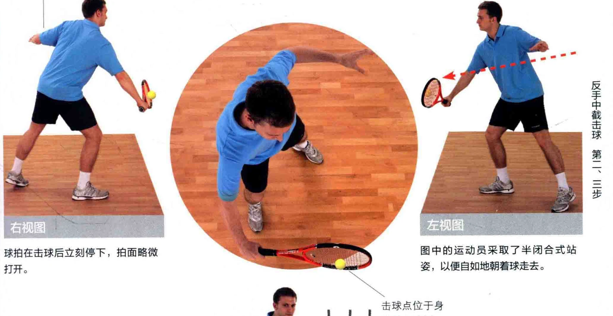

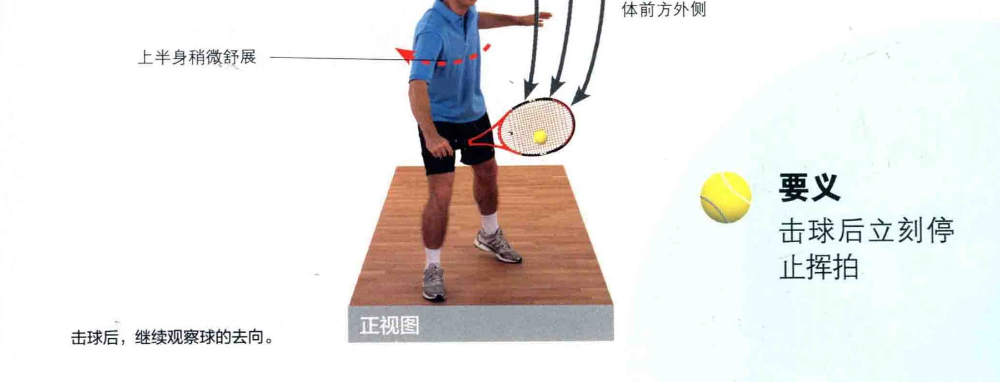
