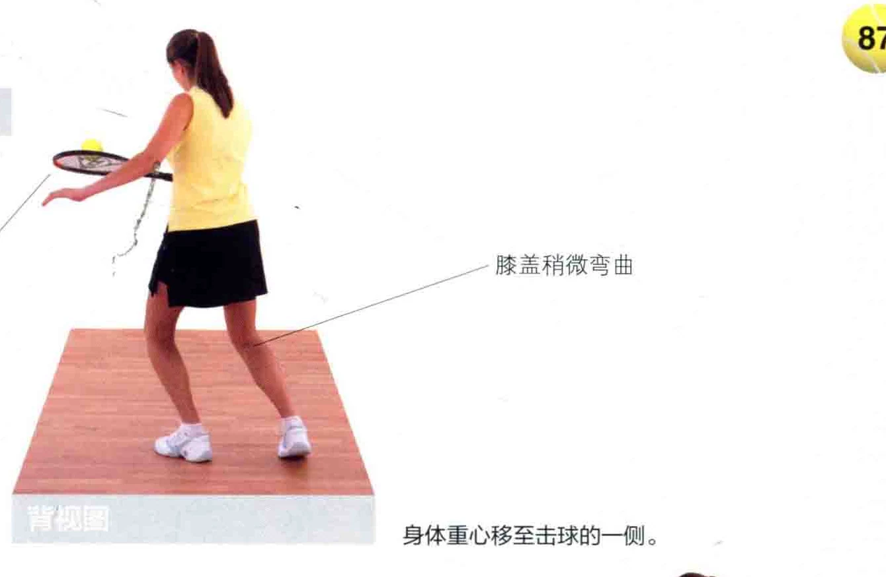

### 浓二过而如州河

捕捉对手漏洞的方式之一，就是用截击放小球的打法，把球打过网。比起通常的打法而言，此时拍面打得更开，从而形成下削〈Undercut )，让球落在刚刚过网的位置。

掀动球拍，从而打出过网

和急坠球妆全 ,打开拍面全 7 生 / 入叱 1/ 手腕保持弯曲间将球垫起，从

### 而缩短球程

图中展示了拍面打开的程度，这是为了把球拍放在球的下方。

7 “一膝盖稍微弯曲把球拍放在球的下广非惯用手帮助肢体平衡

身体重心移至击球的一侧。

击球点位于身体前方外侧。 拍面打开，以便打出下削球，从而打开拍面“让球明显地逆旋。 结束挥拍稍微转过将球拍尾部稍上半身微拉向自己，

结束挥拍。

图中运动员将球拍拉向自己，并放在球的下方，这个动作能让球产生侧旋。

### 器全寺贞于改河

