### 证逐苯

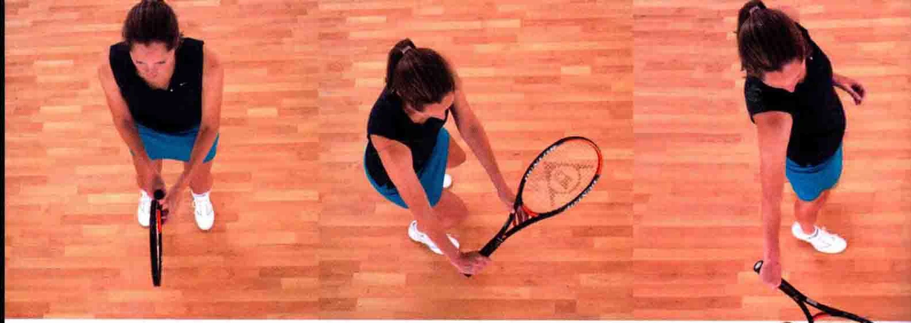

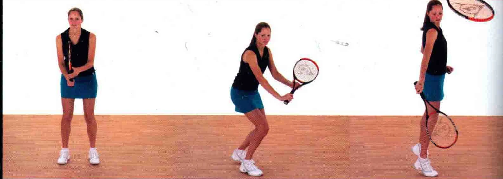

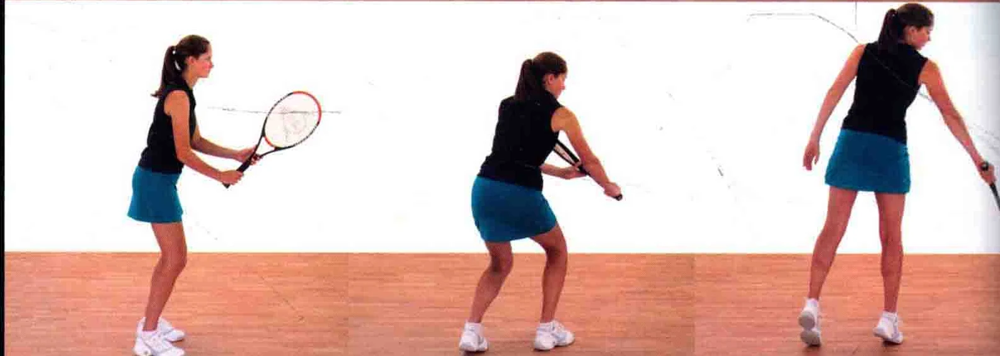

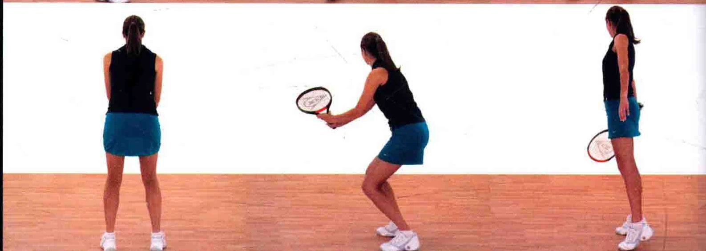

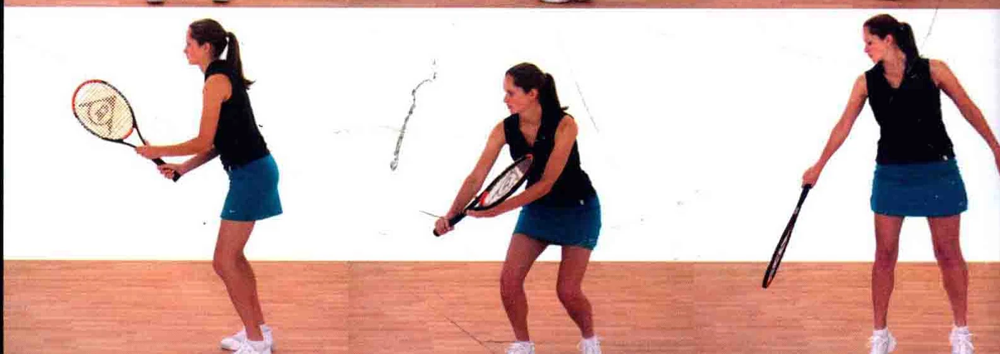

这种击球法通常用于网前球，球在触地反弹之前，就被运动员迅速接住。当击球的位置低于球网时，就要采用和低截击球的打法，朝上打出截击球。 i-

把握时机所有成功的击球都是建立在正确把握时机的基础上的。 在“等待”来球时， 要快速地从1数到5。 对手发球时开始数

，数到“5 ”的时候打出截击球。

截击球的打法跟削球类似，因此它打出的球带有逆旋或侧旋，或二者此有。

### 握拍法

正手低截击球，通常采用大陆式握拍法，也有一些选手采用正手东方式握拍法(见第13页 )。

预备当您发现自己正位于网前时，视情况或策略，您必须有打出一记漂亮的截击球的技巧，从而得分。

击球时，持拍

### 臂延展球拍下击并擦

### 过球身

### 顺着球拍杠的方向挥拍

以预备姿势站立，球拍置于身体前方，用大陆式握拍法。膝盖稍微弯曲，以做好移动的准备。

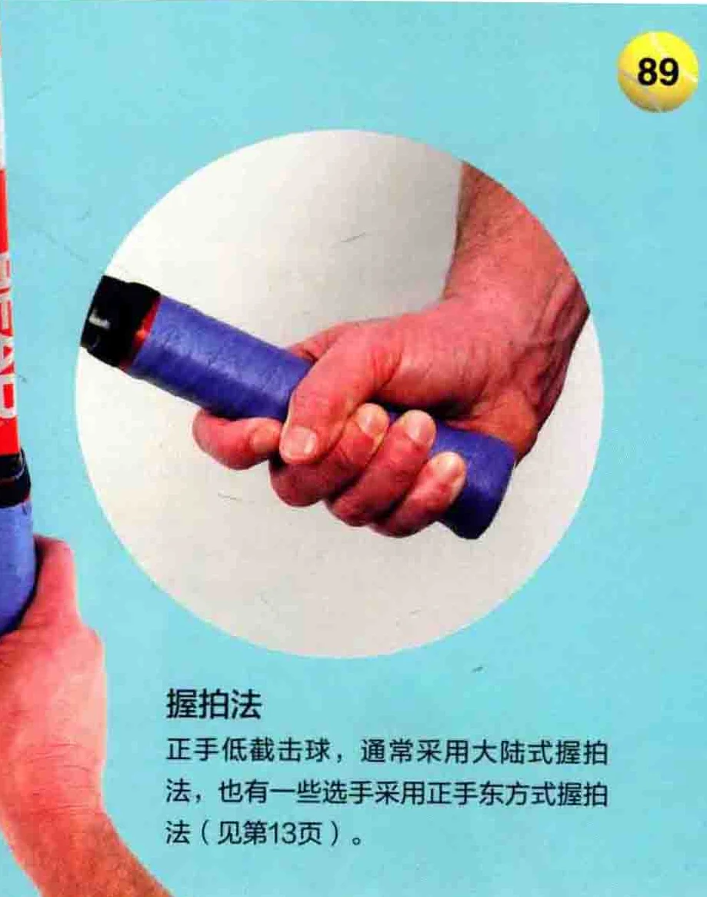

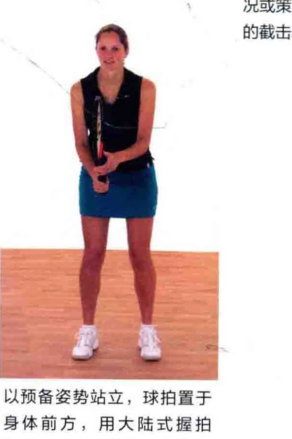

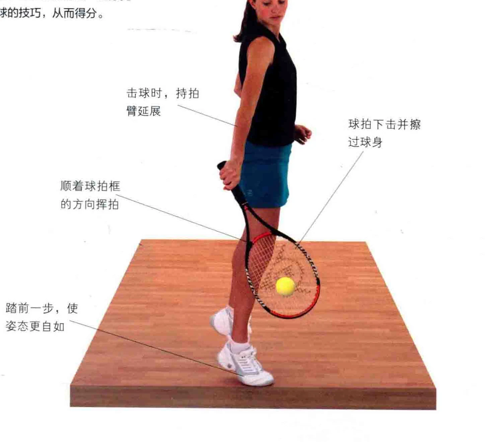

球 “追踪球路追踪球路时，球拍位于身体前方，高于手部。

### 将球拍持在身

球拍的位置要高于手部，上略微后拉， 拍面打开。

### 头部保持不动

追踪来球时，身体重心稍微偏向反

注意，追踪来球时，非惯用手辅助

手侧，两侧膝盖弯曲。 握拍的方式如图所示。 稍微转过上半身要义朵朝着球的方向总 1 追踪球路图中运动员正准备在数到

“5 ”时挥拍击球。

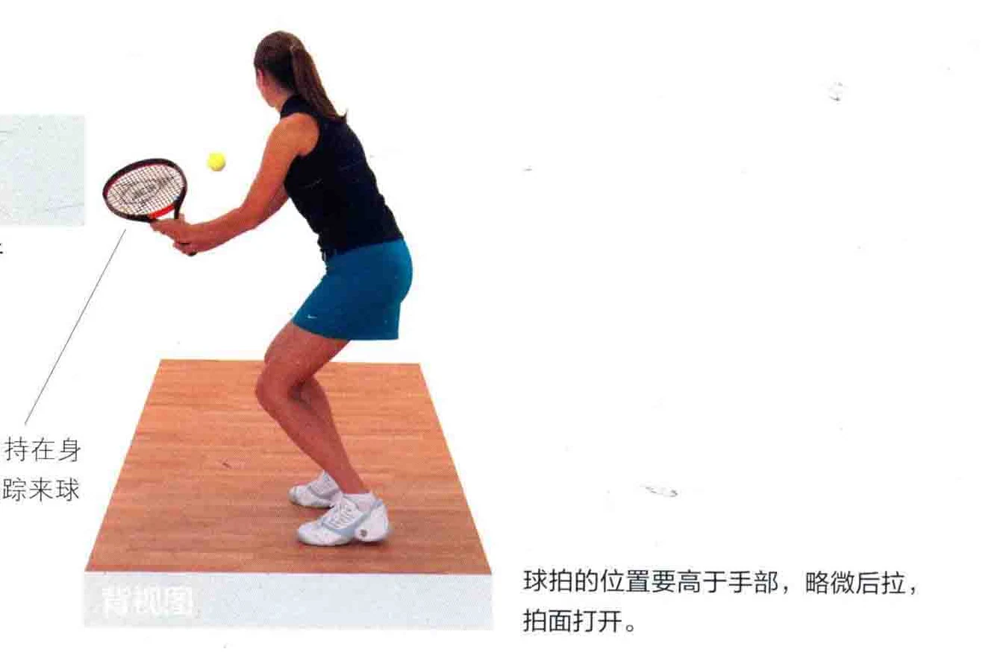

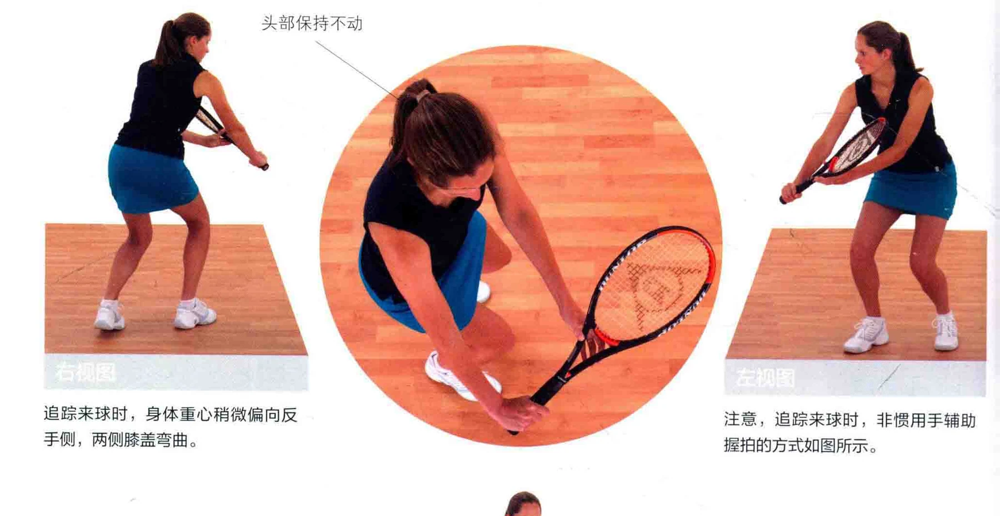

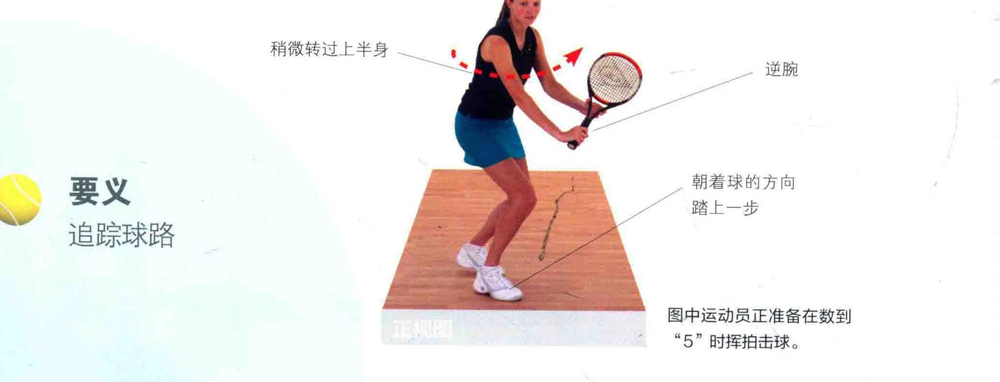

### 击球点

! 自然地将身体拉高默念击球时间，数到5时就是击球点，请 6 确保球拍在击球后立刻停下来。 碰到球后， 球拍立刻售身体后侧 Te

球拍在击球后立刻停下，相较于高截击球而言，此时拍面须打得更开。

图中的运动员采取了封闭式站姿。您可以自如地移动双脚，朝着球走去。

### 上半身自如地舒展

### 击球时手臂伸直

### 要义击球后立刻停止挥拍

击球后，双眼专注地看着球。

### 了| |证”吕布于击州河

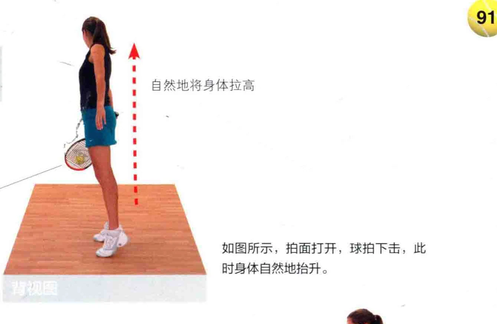

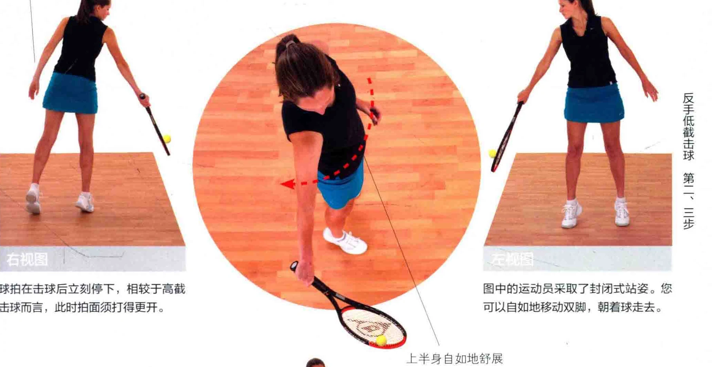

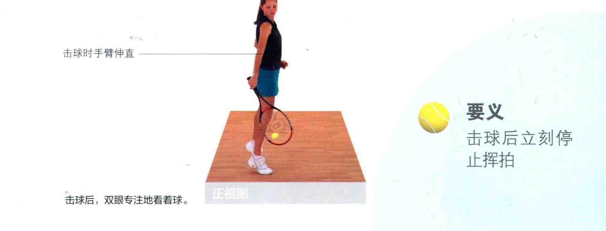
