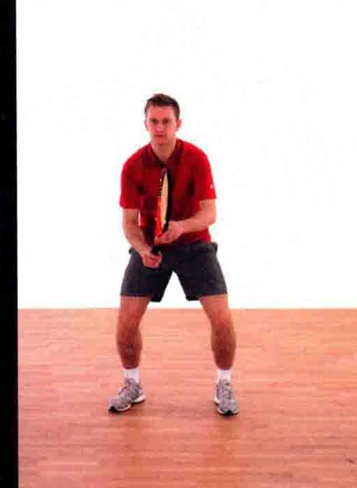
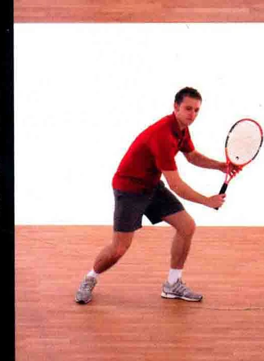
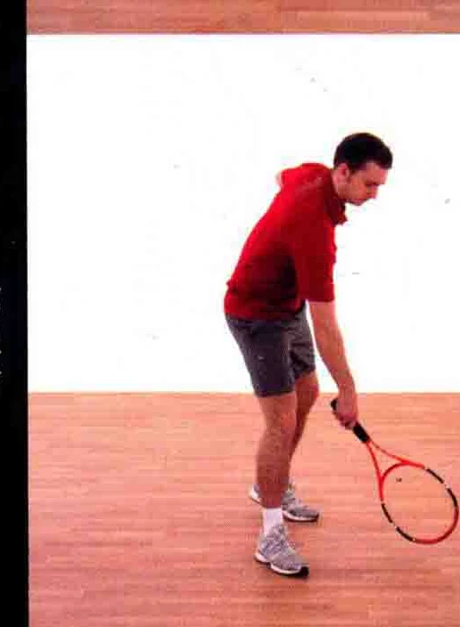
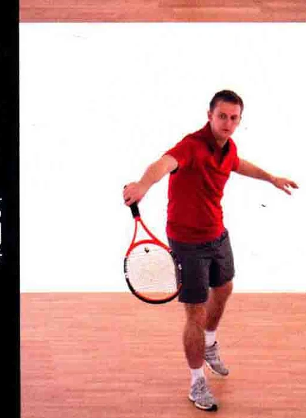
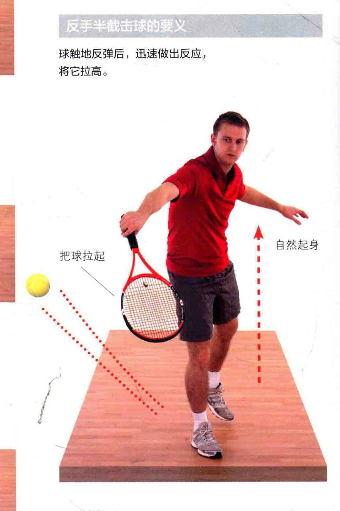
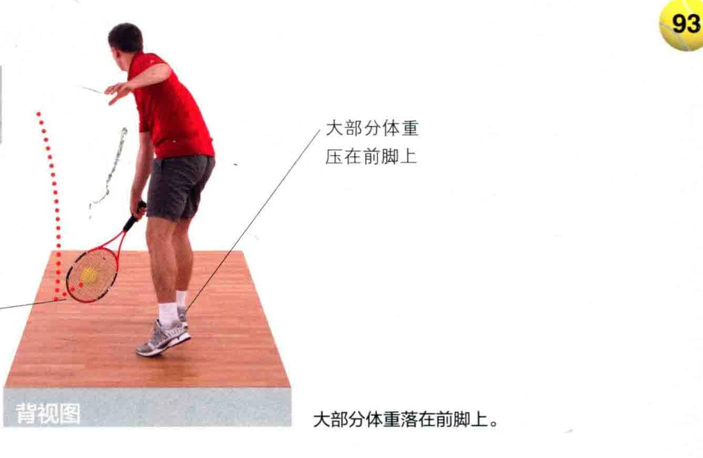
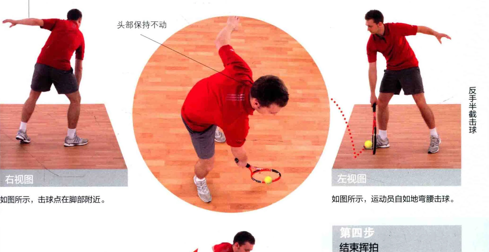
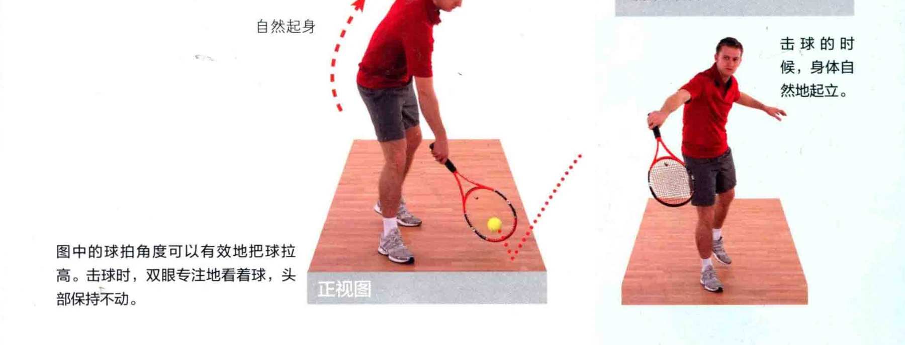

### 完而于米省河

有时您在网前，而球在您拉拍前就已经触地反弹，这可能是球刚好落在您脚边的缘故。由于几乎没有时间做出反应，您必须在触地反弹后立刻将球拉高，此时就会用到半截击的打法。

球触地反弹后，迅速做出反应，

将它拉高。

运动员身体下蹲，以便击球。拍面稍微朝下，从而在把球拉高时能盖住球。

### /大部分体重 ” 压在前脚上

### 朝着球弯腰

### 非惯用手辅助或下蹄

### 身体平衡

大部分体重落在前脚上。

### 头部保持不动

### 沉而开米州河

如图所示，运动员自如地弯腰击球。

eg JE RE ON 了人此 A 人 LI | 人 cc | 3 党芝条吕上

如图所示，击球点在脚部附近。

自然起身击球的时候，身体自然地起立。

图中的球拍角度可以有效地把球拉高。击球时，双眼专注地看着球, 头 | 部保持不动。

