### 肝汪亲

技术，这两个技术中任何一个习艺不精，都会让您的比赛陷入困境。这二者的发挥水平，通常会决定

得分高低。

### 把握时机

所有成功的击球都是建立在正确把握时机的基础上的。 “等待”来球时，要快速地从1数到5。球触地反弹时开始数“1”，数到“5”的时候打出截击球。对手击球时，随着球以碎步移动，从而调整

站位。

### 使球旋转

而阻止对手在握有发球权时取得先机，化被动为主动，乃至破坏对方的发球。

握拍法握拍法取决于您将采用何种击球法 ( 见第13至15页 )。

### 准备

采用警惕的站姿。

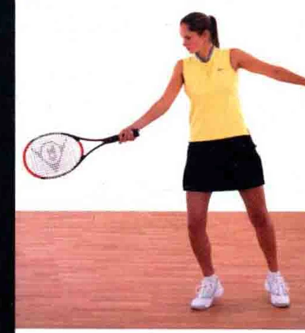

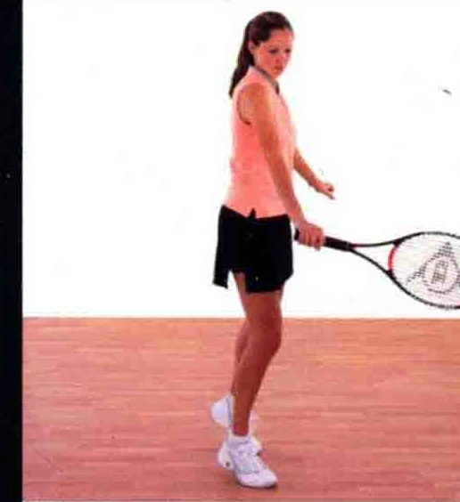

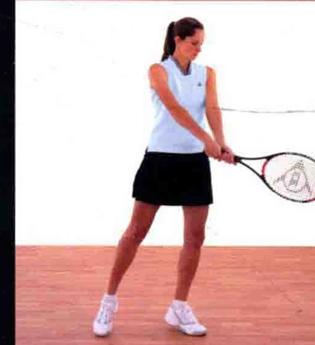

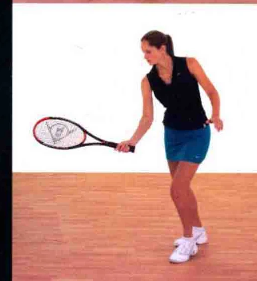

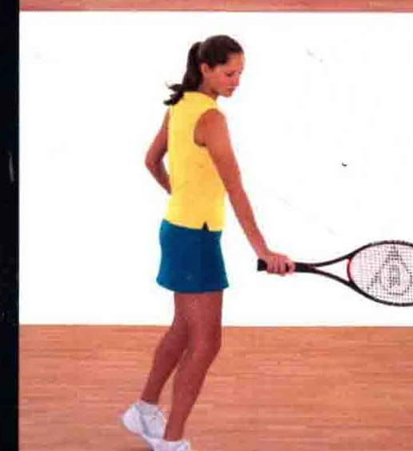

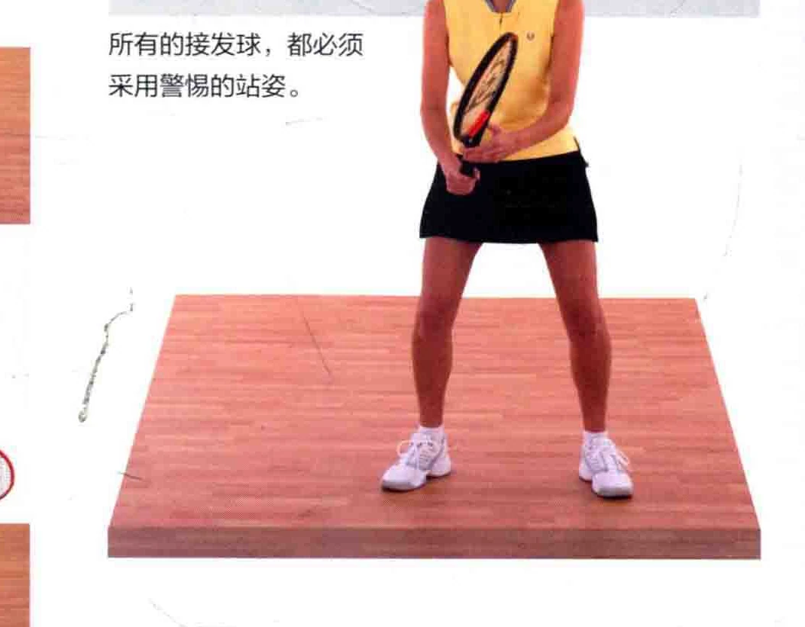

### 上各稍微膏曲正手上旋接发球

用正手上旋球的方式打接发球，其要领与正手上旋球类似 ( 见第16至23页 )，但它的击球时间可能更短，从而影响拉拍的幅度或力道。

图中运动员采用了开放式站姿， 身体肝三头肌和肪二头肌重心落在持拍击球的_“例。

发力，向前推送球拍

### | 六讲当加泛蘑

击球点位于身体前方。 如图所示，采用开放式站姿，以便于保持平衡。 用球拍弦控过球面，从而打出明显上旋的球一一这只手用于辅助 Ts 肢体平衡

击球时要密切观察球的动向。

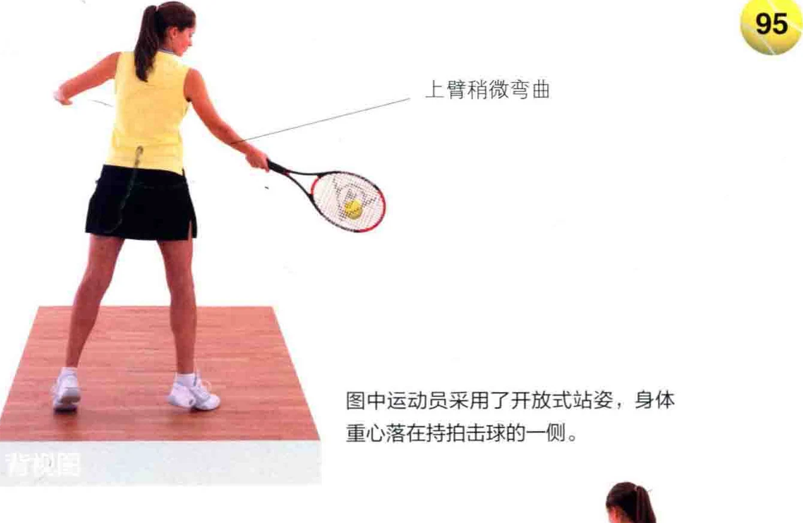

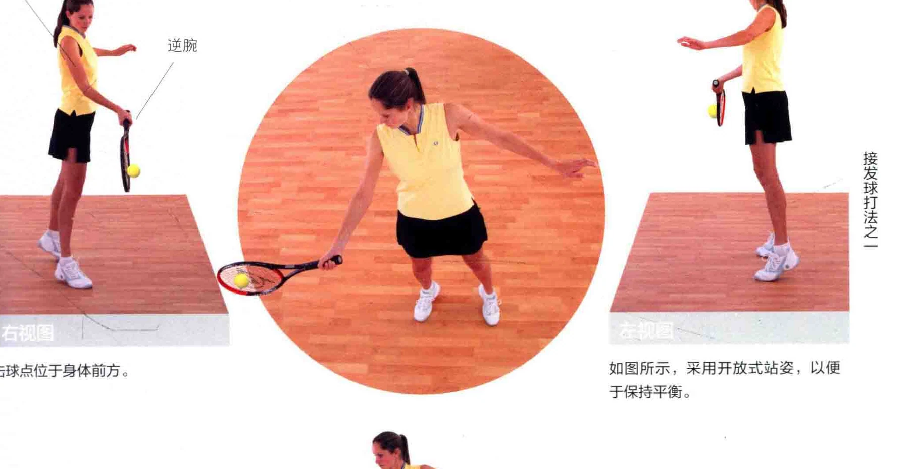

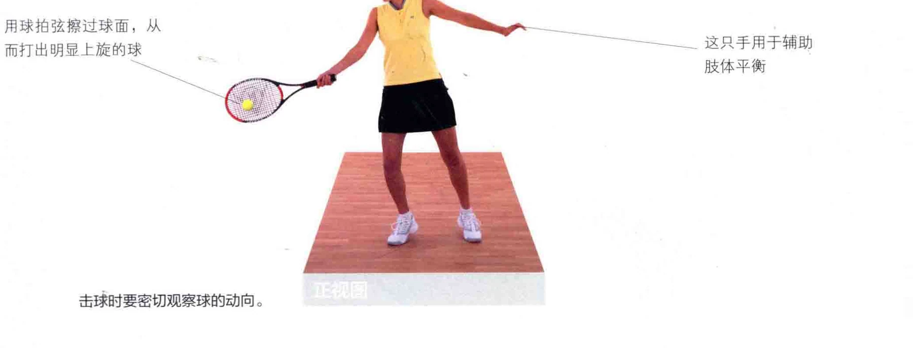

### 单手反手上旋接发球

用单手反手上旋球的方式打接发球，其要领与之类似 ( 见第32至37页 )。但它的击球时间可能更短，从而影响拉拍的幅度或力道。

### 让非惯用手来辅助肢体平衡

### 转过上半身

击球点位于身体前方。

### 有力地转过上半身一

击球时要密切关注球的动向。

### 一和部

图中运动员采用了闭合式站姿，以使肢体协调。如果发球力道很大，则采用开放式站姿。

拍面探过球的后部，从而打出上旋球。

，，，，，，， 头部保持不动

拍面探过球身， 形成上旋

根据球的具体情况， 采用开放式或闭合式站姿

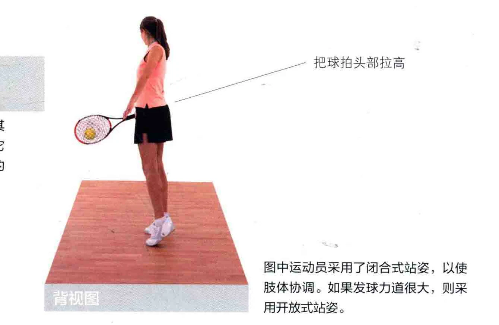

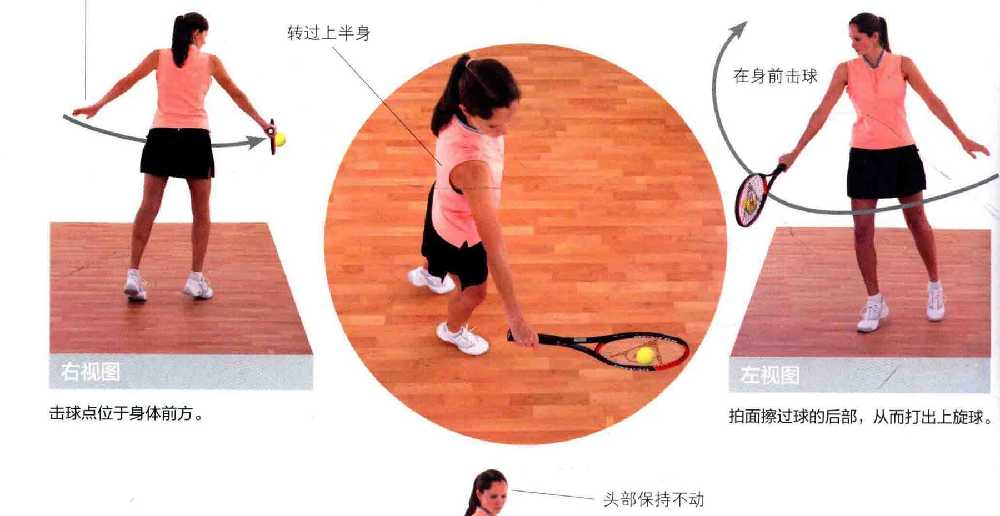

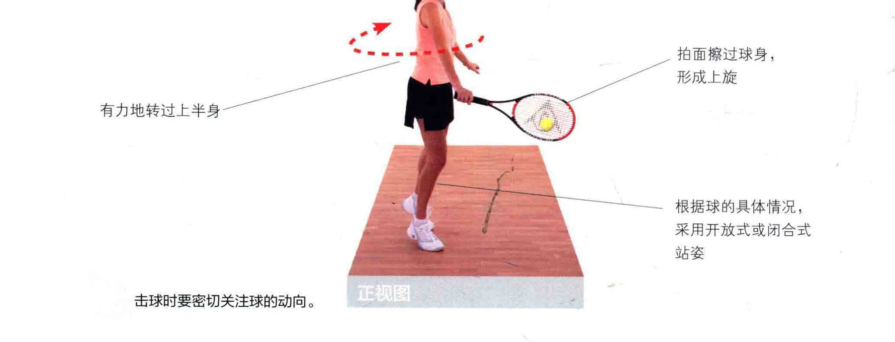

双手反手上旋接发球采用双手反手上旋球的方式打接发球， 其要领与之类似 ( 见第24至31页 )。它的击球时间可能更短，从而影响拉拍的幅度或力道。

### 非惯用手将球拍拉高

如图所示，身体重心移至反手侧。

击球时密切注视球的去向。

### 一开放式站姿

图中运动员采用了开放式站姿，从而能很快回到场地的中心。

图中运动员正准备用拍面擦过球的后部，打出上旋球。

### 惯用手只起辅助

### 要义循着球路而 “局击球

### 1NNE |人N旗当加水澡

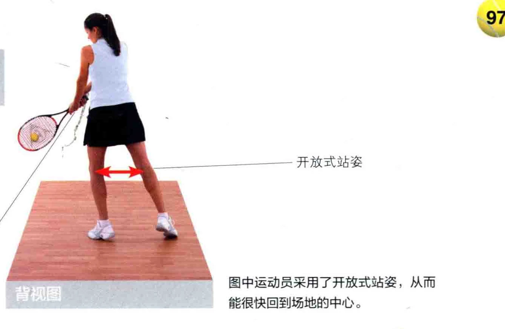

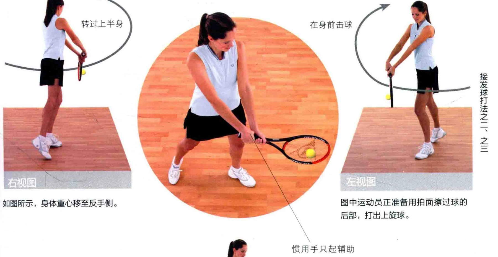

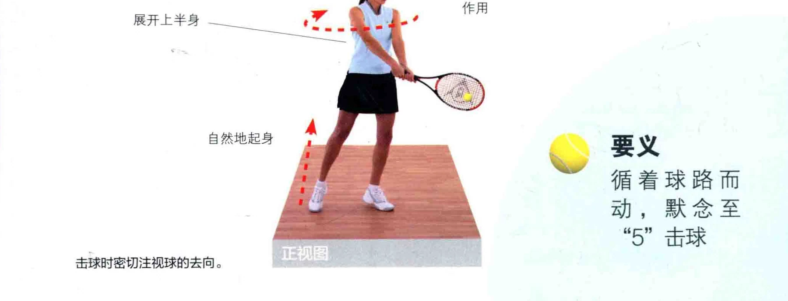

一球拍下击，控过球身

### 沉贞全涯他

### 正手削球接发球

采用正手削球的方式打接发球时，其要领要与之类似 ( 见第62至68页 )。它的击球时间可能更短，从而影响拉拍的幅度或力道。

图中运动员采用了闭合式站姿， 她正要采取削球上网 ( chip and charge ) 战术。

### 头部保持不动

### 打开拍面

如图所示，拍面打开的角度相当大，这样的角度能打出带有逆旋和外侧。 侧旋的球。 1

### 将拍柄尾部

### 拉向自己

### 图中运动员的击球点位于身体前方

### 稍微转过上半身

根据球的具体情况， 采用开放式或闭合式站姿

击球时密切关注球的动向。

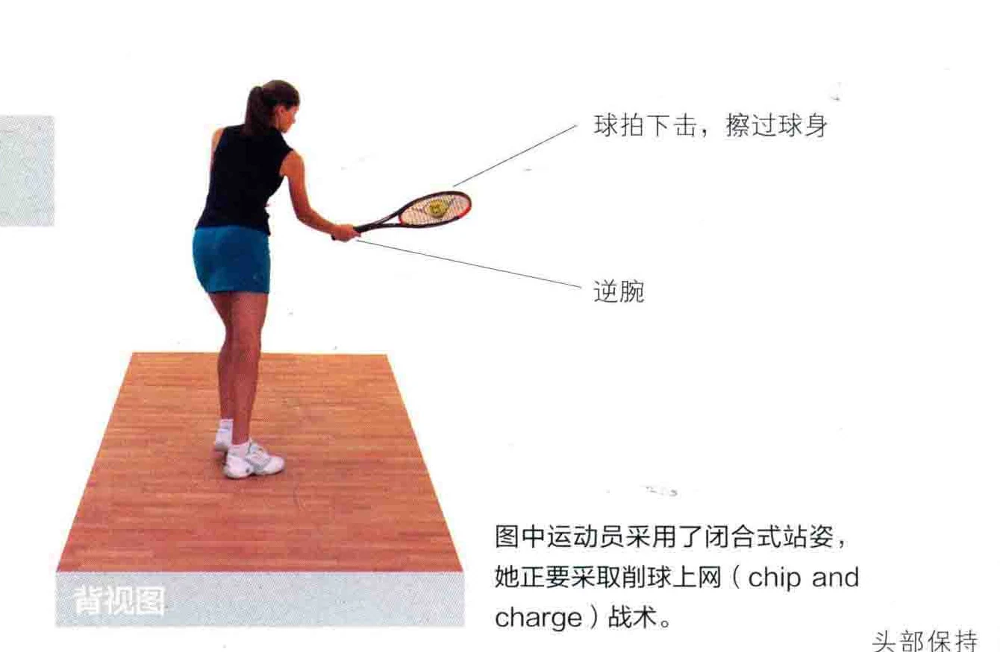

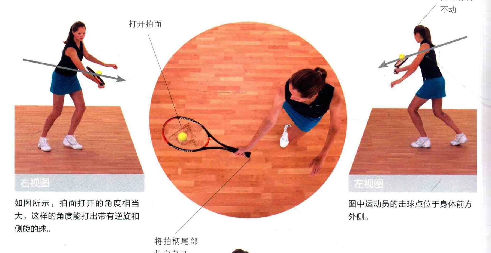

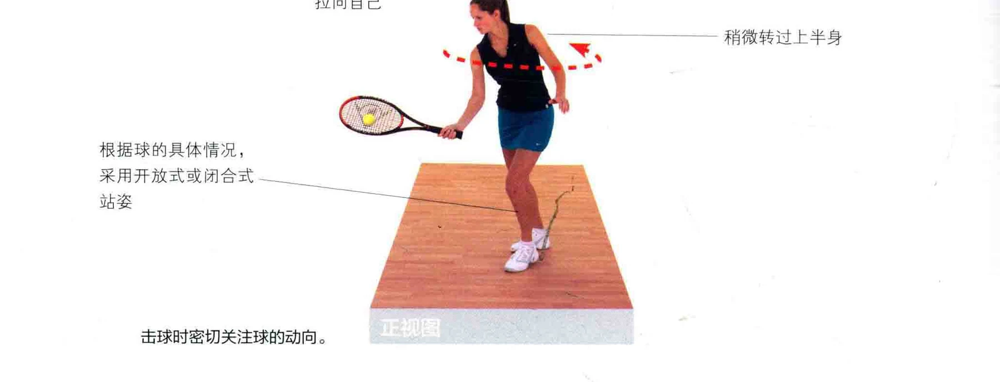

### 反手削球接发球

采用反手削球的方式打接发球时，其要领与之类似 ( 见第38至44页 )。它的击球

时间可能更短，从而影响拉拍的幅度或和根据球的位置 | 采用开放式或封力道。 闭式站姿球拍下击， 擦过球身图中运动员采用了封闭式站姿，她正斌

非惯用手帮助保持图采用削球上网 ( chip and charge ) 身体平衡战术。

图中运动员的击球点位于身体前方外侧。 0

将拍柄尾部 AN 例旋的球。 拉向自己保持首腕

### 稍微转过上半身

要义循着球路而动，黑念遇击球

_击球时，双眼专注地看着球。

### “国六讲当哎涟六

如图所示，拍面打开的角度相当大，这样的角度能打出带有逆旋和

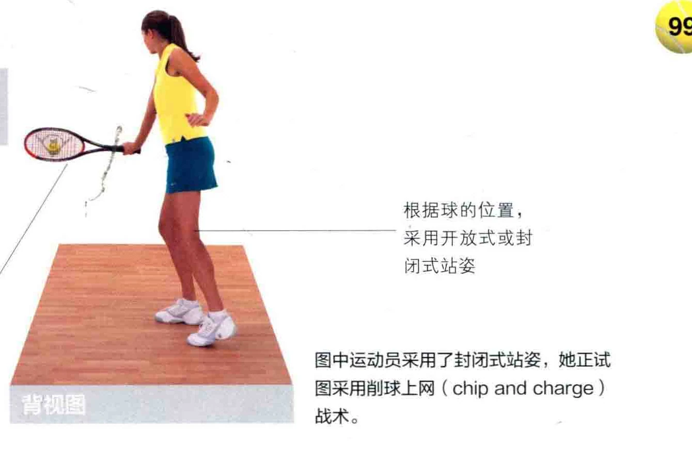

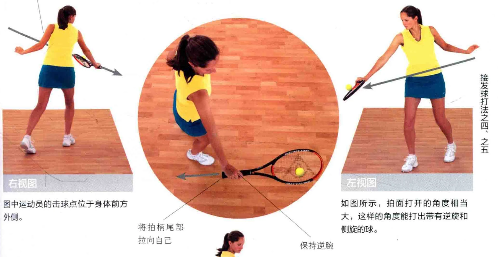

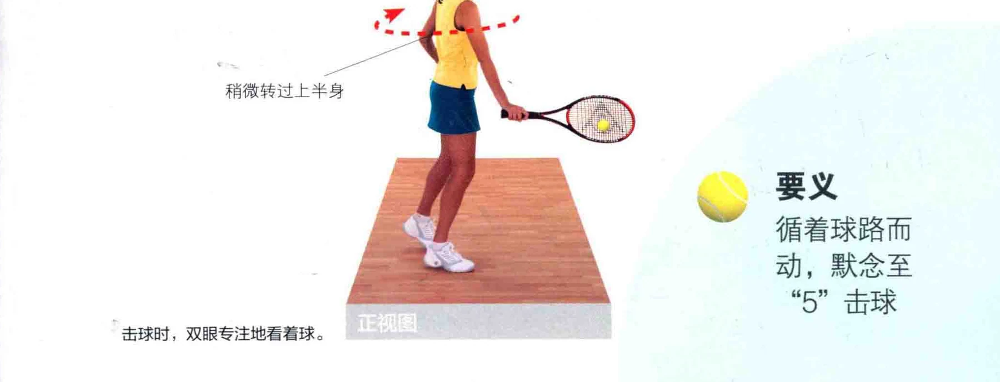
