### 泗尺区

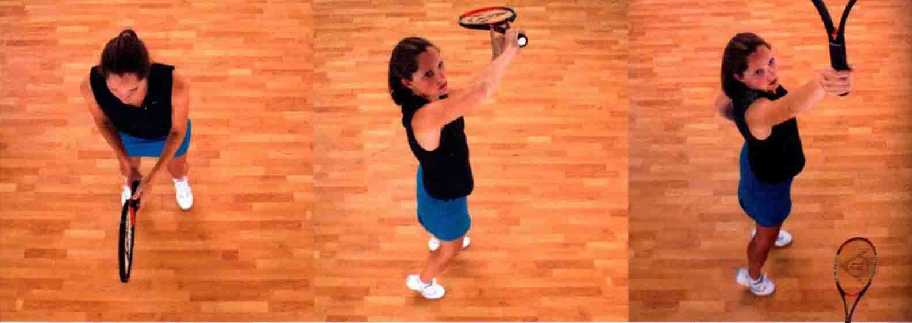

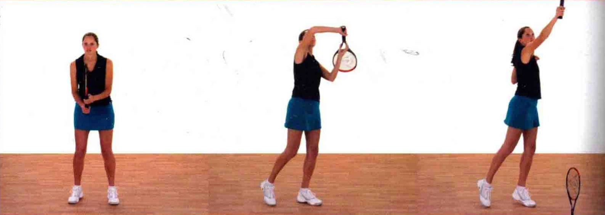

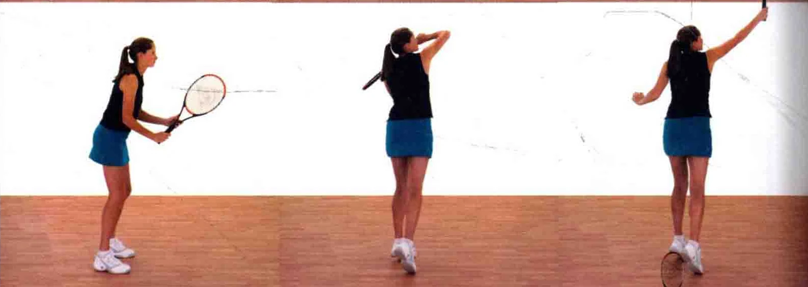

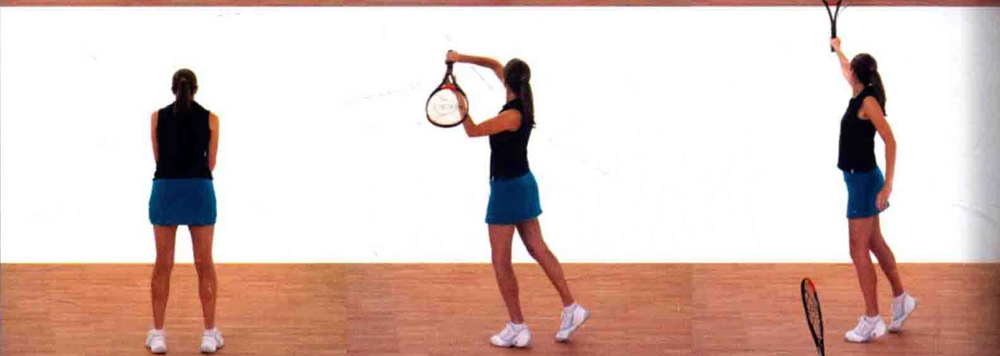

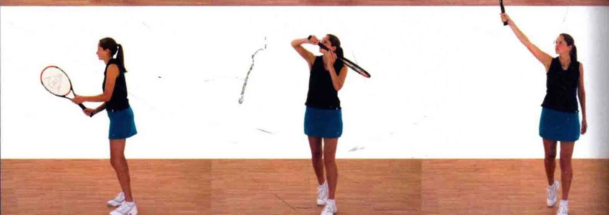

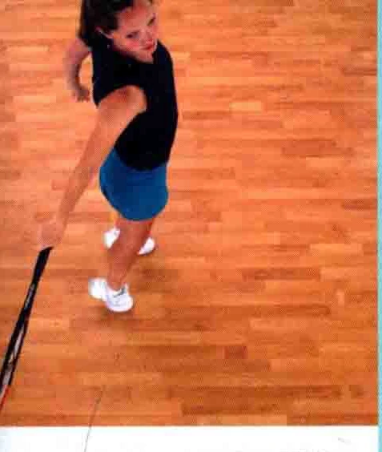

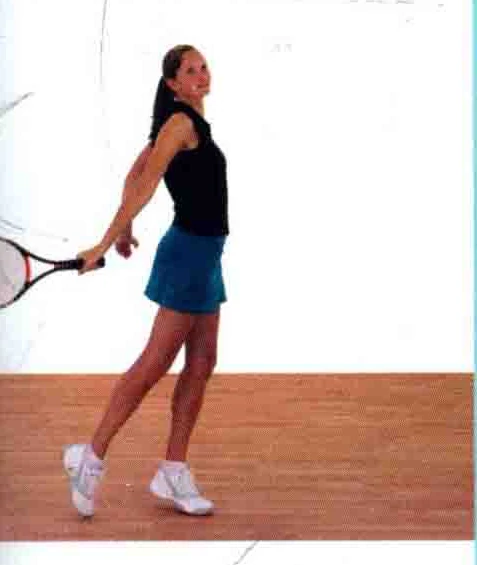

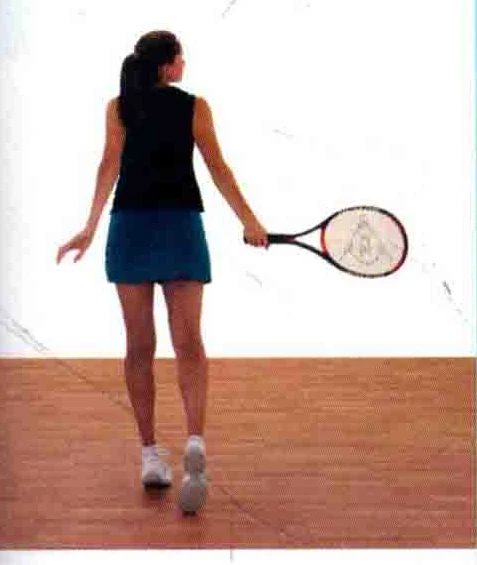

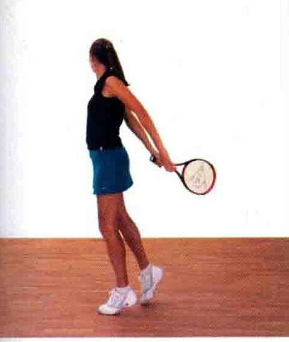

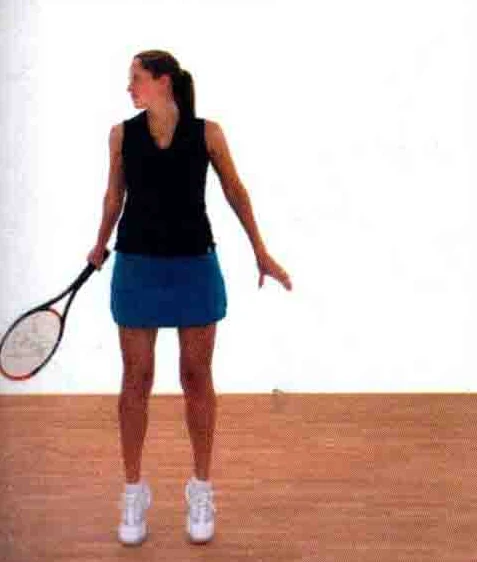

### 沈而言

只有在无法打出正手扣杀 ( 见第 114一119页 ) 的时候，才采用反手扣杀。

把握时机为了捕捉击球的时机，您可以用拍柄尾部指着球，追踪球路。

握拍法反手扣杀通常采用大陆式。 节拓击罗握拍法 ( 见第13页 )。 WU

预备当一个高吊球触地反弹并还在上升阶段时，用拍柄尾部追踪球路，然后用力地把球

打下。 和 8， 4 高高举起球拍击球， = 从而打出反手扣杀

### 上半身开始有力地转体

以预备姿势站立，球拍置于身体前方。

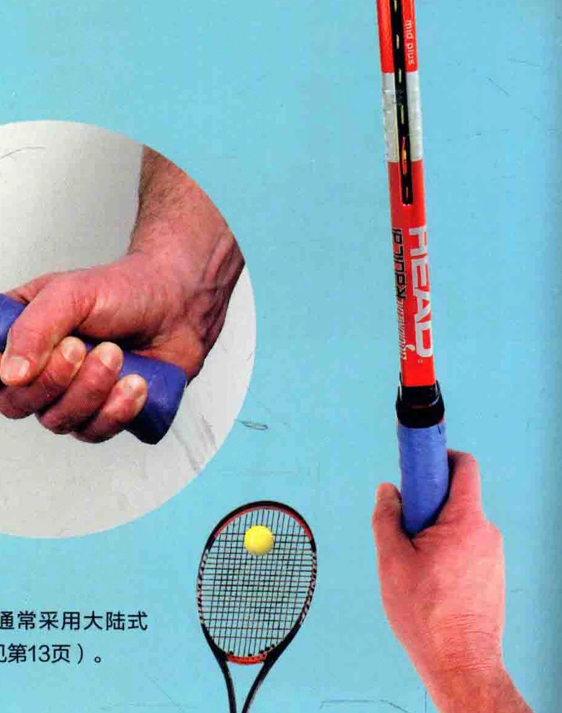

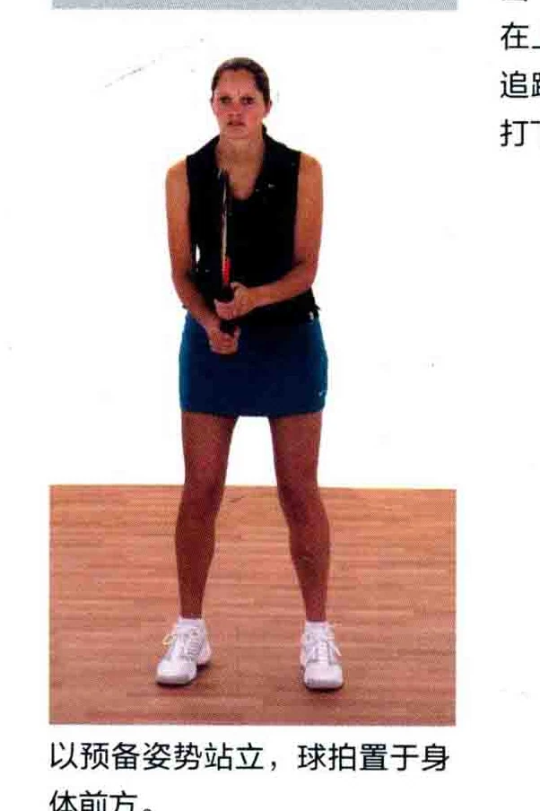

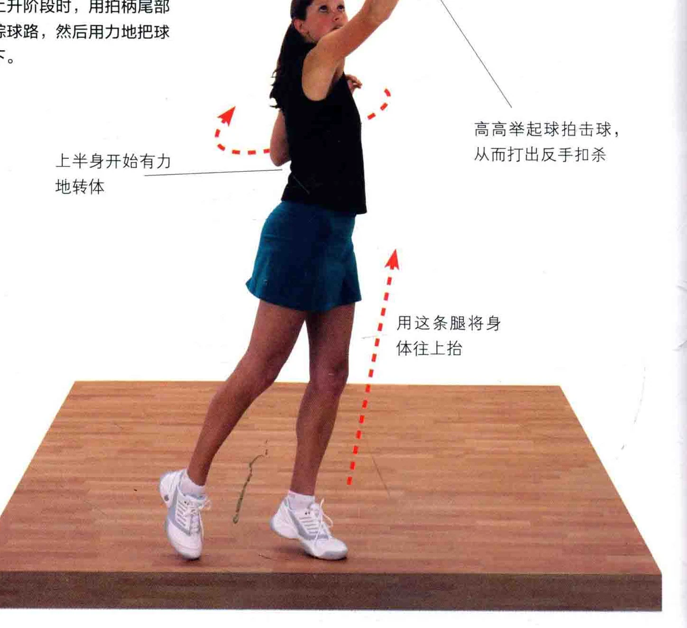

### 拍柄尾部指着球

追踪球路当高吊球触地反弹并开始上升时，用球拍尾部追踪球路。

追踪球路时，非惯用手扶在球拍颈部。

### 头部保持不动

### 洲首玫河

身体重心移至反手侧，手时朝前。 如图所示，球拍尾部指向前方。

### 要义用球拍尾部指着球

“始终注意着网球的动向。

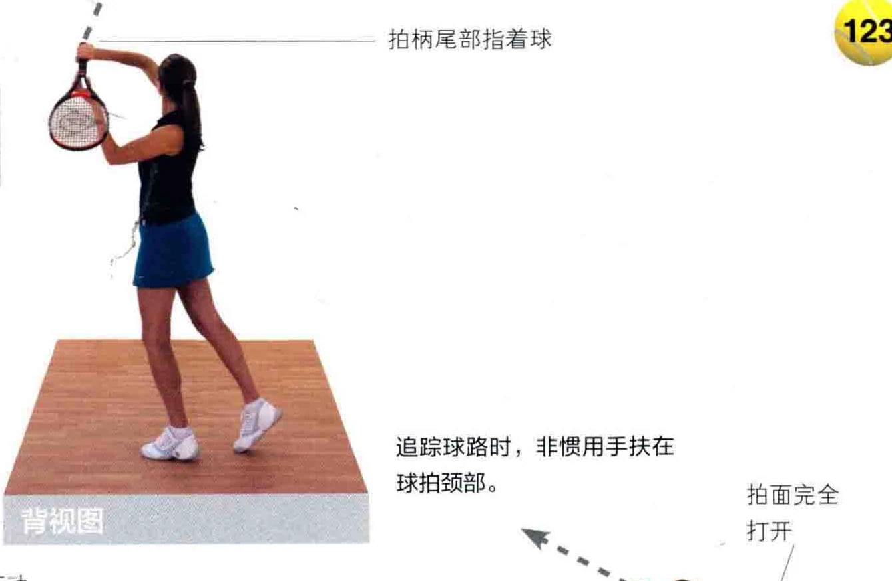

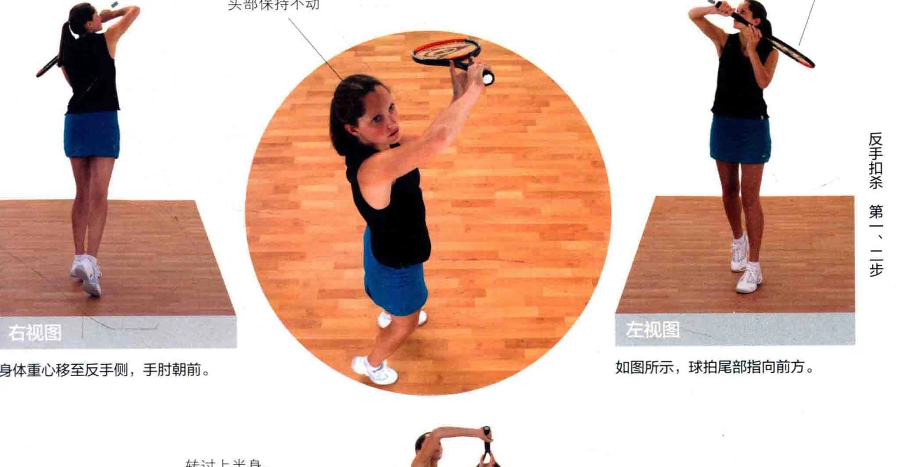

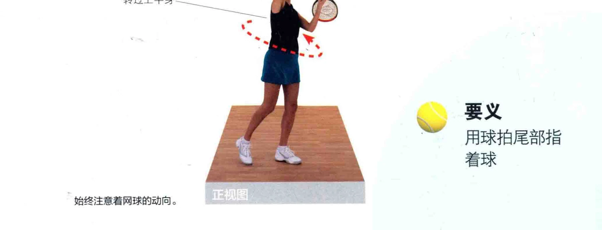

读。 击球点: 在高处接球和

高高了忆开 2 了杀。

高高地举起球拍击球，从而将球扣杀音体范作她南上下展

用拍面的上部击球。

此时运动员充分地延展肢体，以便把球打下。

### 头部保持不动

注意，球拍的角度如图所示，这样

注意手腕的角度，手腕要稍微向前才能把球扣杀。

倾斜，以便让球拍“盖住”网球。

### 给FR 头迪忆至在高举球拍接球

球拍上举并把球打下，此时要注意网球的去向。

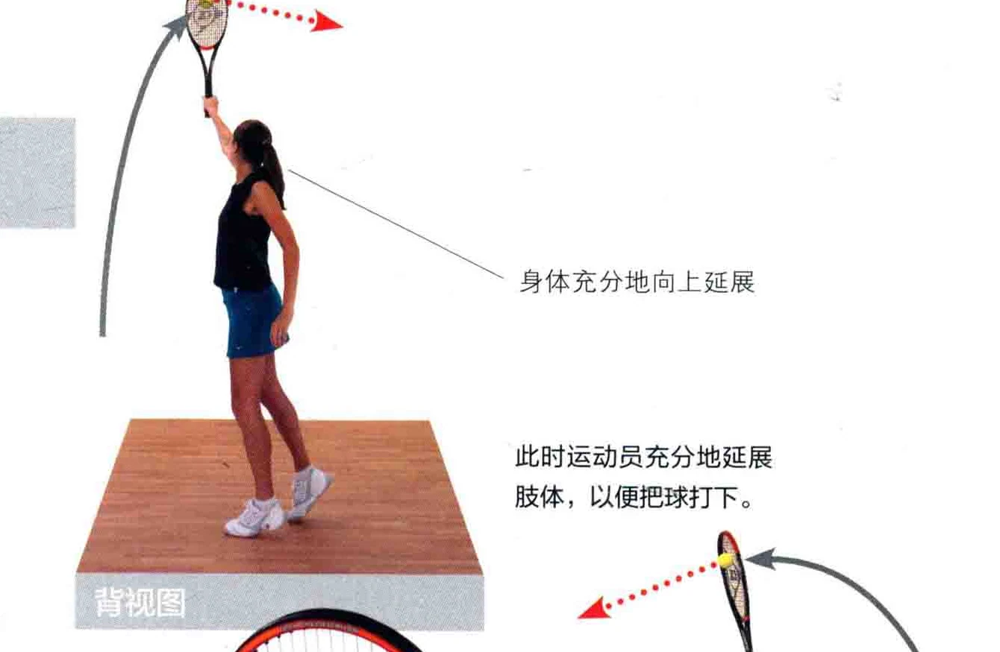

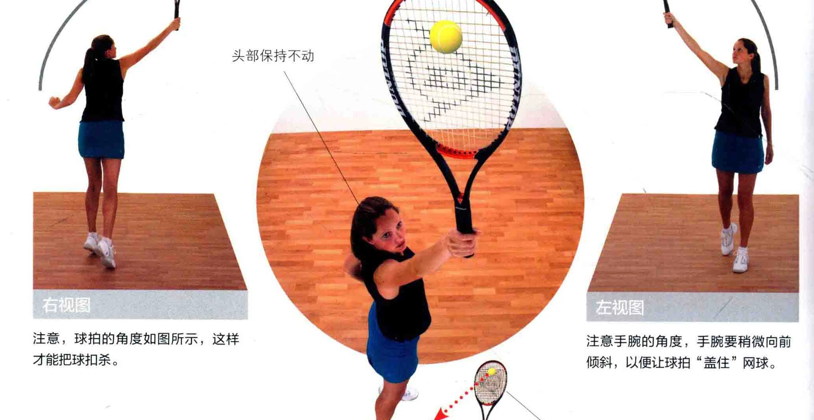

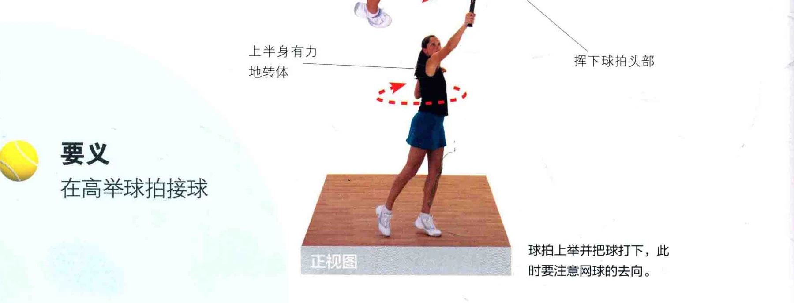

扣杀时，将两侧肩胛骨收拢，从而使之有力道。

如图所示，两侧肩膀向后拉回。

球拍捏下， “一一并绕过身体

扣杀后，仍然目视着网球，准备迎击下一球 o

### 两侧肩胛骨靠拢

如图所示，运动员向下击球，并将拍面横控过球身，两侧肩朋骨收拢。

要义两肩收拢，球拍下击，探过球身

### -川惧”洲当玫河

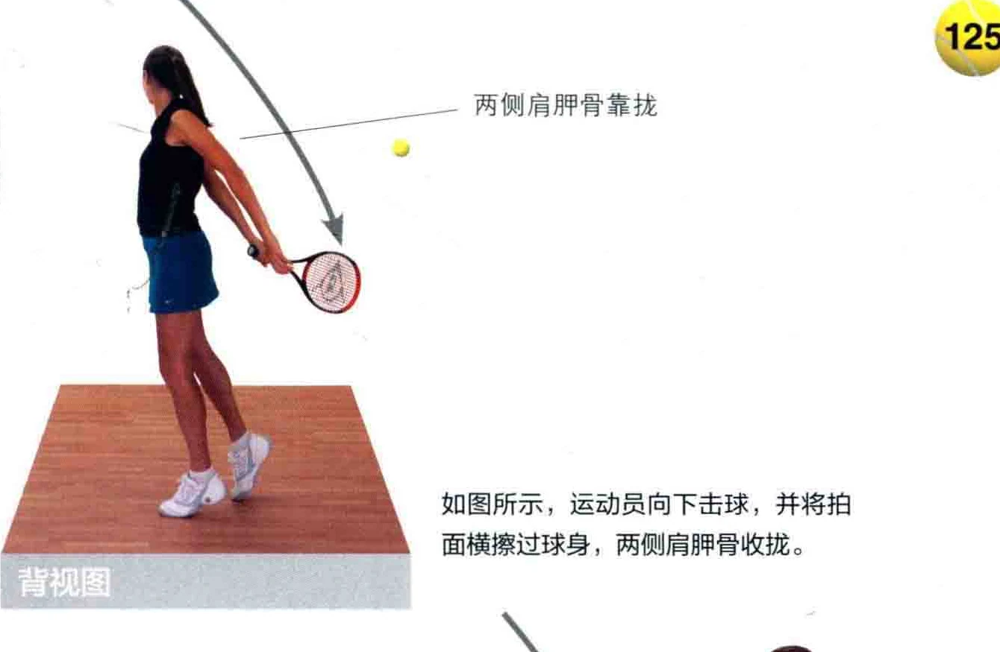

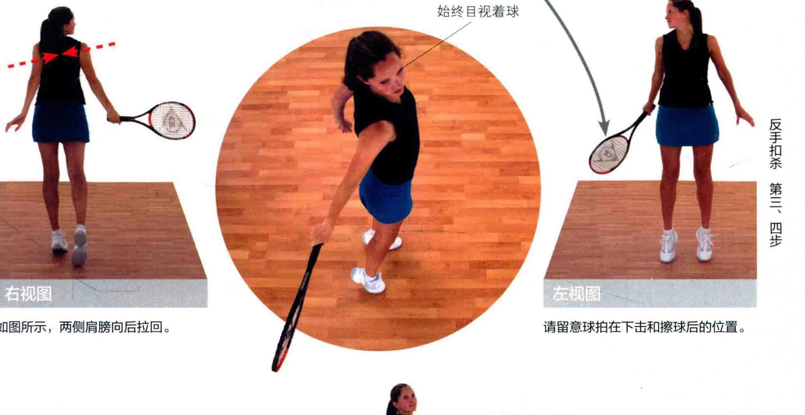

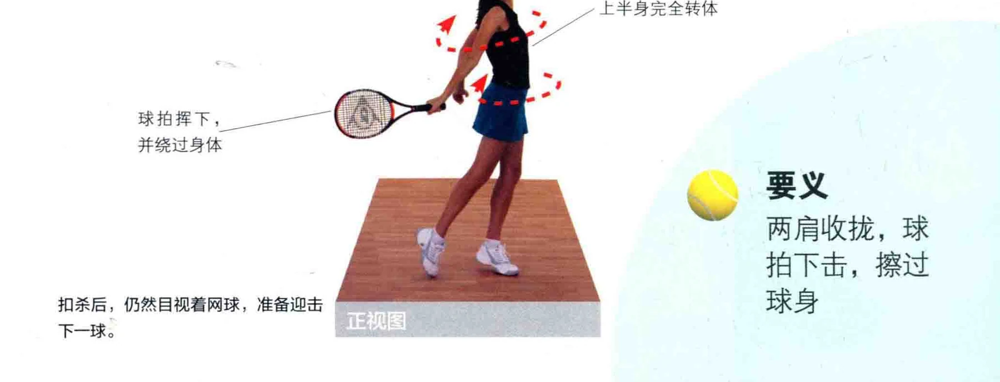
