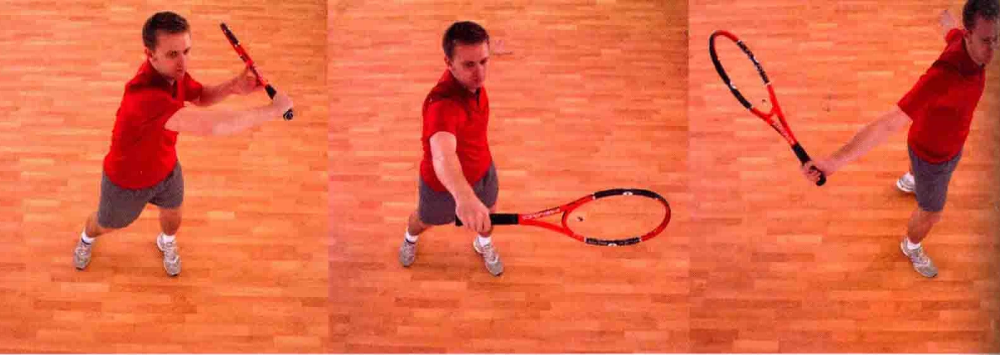

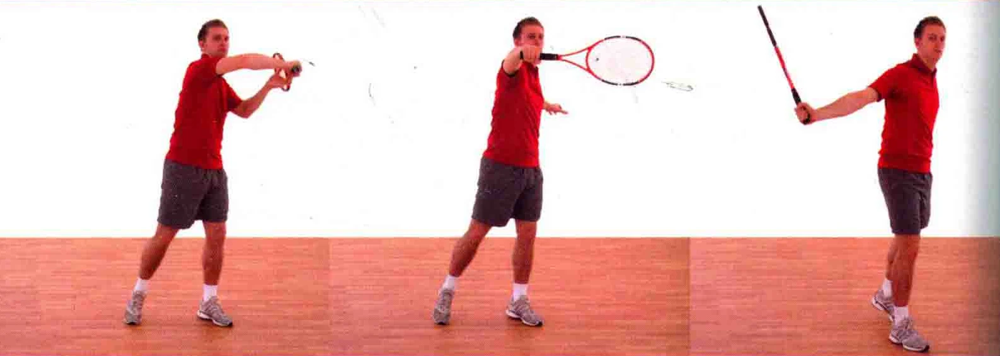

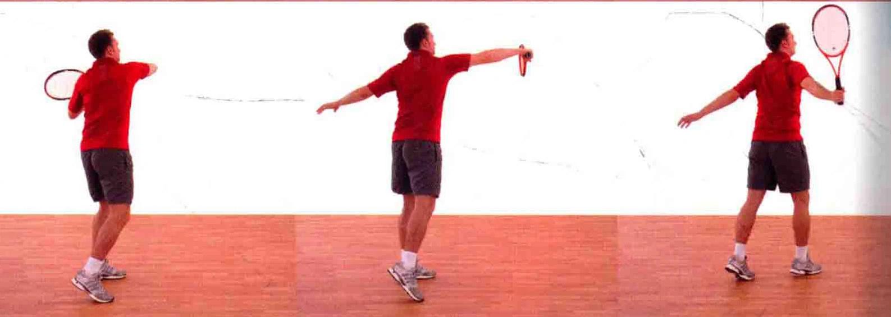

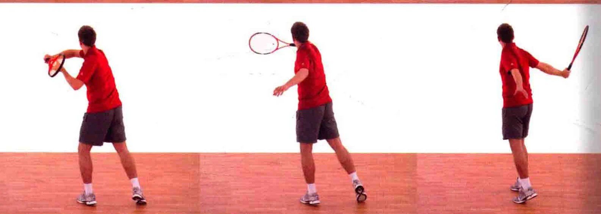

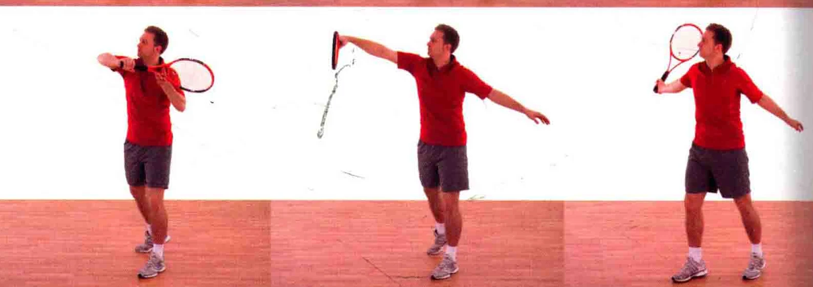

运动员从底线出击，在空中截击尚未触地 / 反弹的球时，可以采用抽球截击的打法，打出上旋球。这个打法很有攻击性，正手或反手均

能使用。 把握时机六对手击球时，在心中数“1”,，数到“5”

时击球。

### 握拍法

### 采用反手上旋球的握拍法

( 见第18页 )，图中所示

为半西方式。 当球还在上升时就追踪它，凌空接球并追踪来球打出上旋球。 握好球拍，用拍柄尾部指着

球，从而追踪球路。 拍柄尾部头部保持不动旨着球

### 上半身完全展开用拍面横扫

### 网球

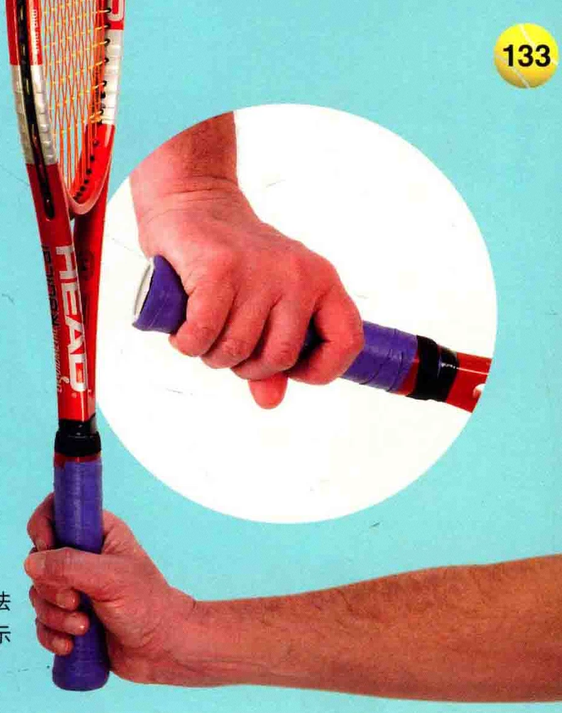

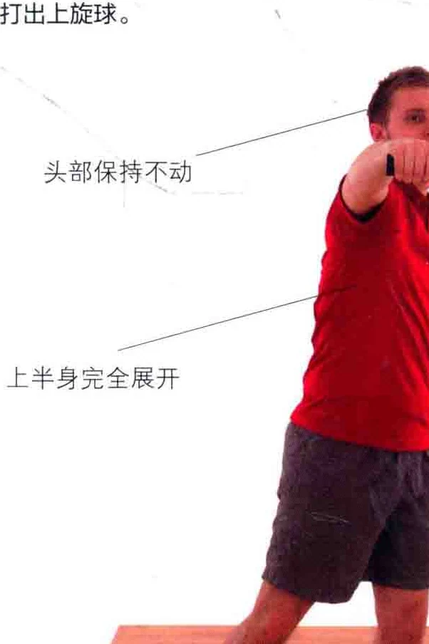

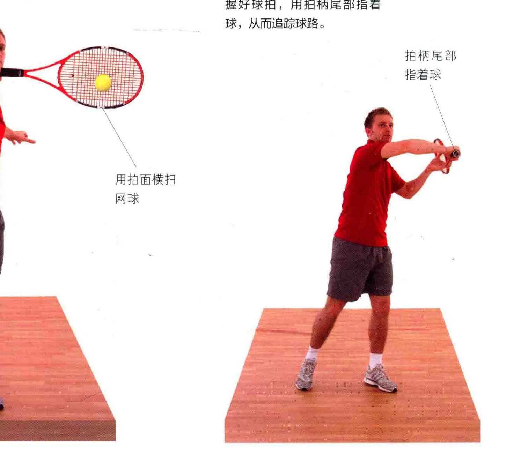

各。 击球点囊。 击球点

心中从“1” 默念至“5 ”，这时球拍由下至上挥过，并横扫过球身。

### 球拍由下至上并横扫过网球

的后例非惯用手放松，球拍头部和持拍手在

同一高度上。

如图所示，击球点位于身体前方， 击球时上半身挺起。

击球时，拍面与网球正面相碰。

如图所示，球拍弦擦过球身，此时运动员要专注地看着球。

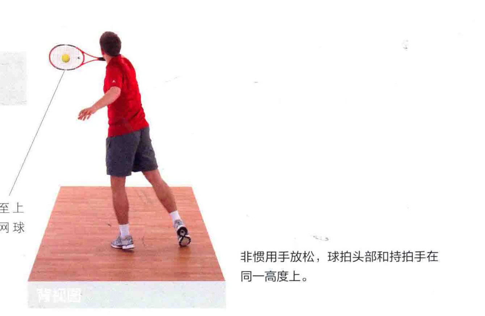

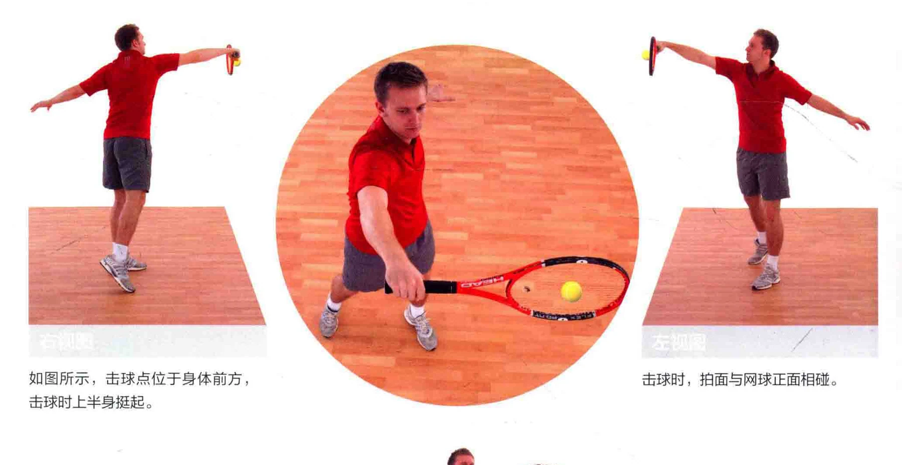

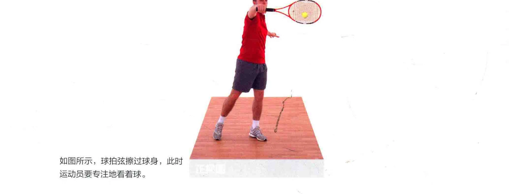

结束挥拍横扫击球后，球拍绕着身体继续完成挥

送动作，此时两侧肩胛骨靠拢，从而加大力道。

夹紧两侧肩妥骨，结束挥拍

如图所示，运动员两侧肩胛骨靠拢， 从而加大击球力道。

如图所示，两手都要向后拉至身体 SS 结束挥拍时，球拍立起，位于身体后方。 外侧。

### 上半身完全展开

国人收紧两侧肩朋骨如图所示，结束挥拍时，仍然关注网球的去向，准备迎击下一球。

### 中|识“而于加惠州河州考

### 喇川

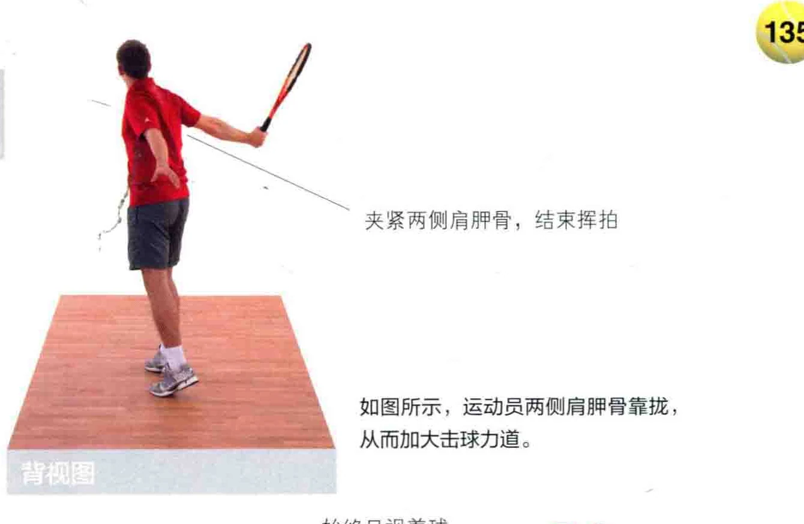

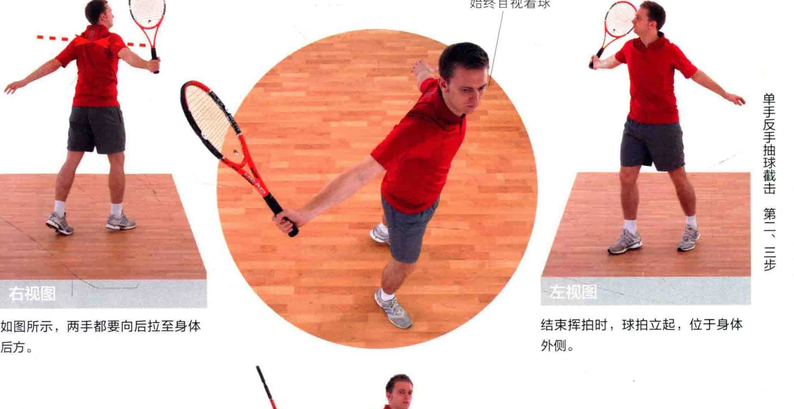

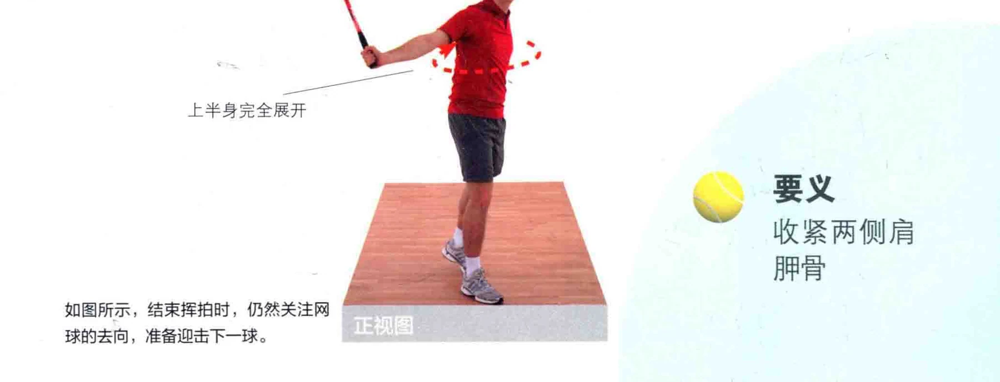
