### 泗怀区

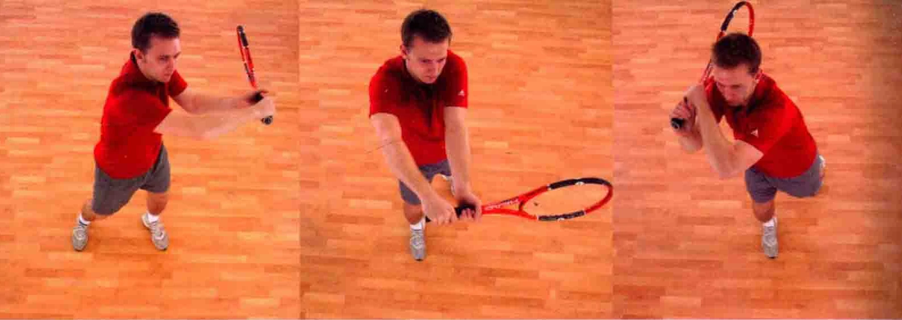

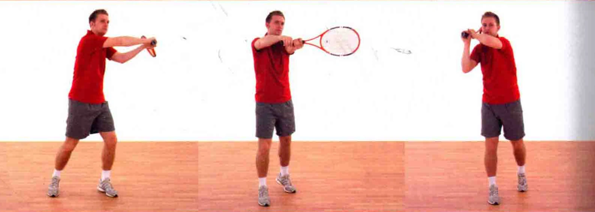

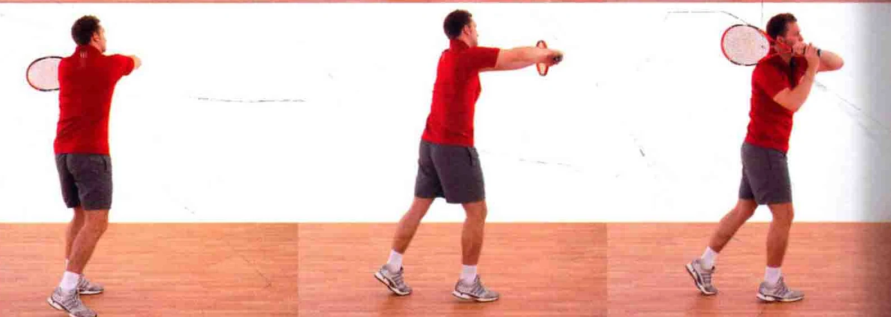

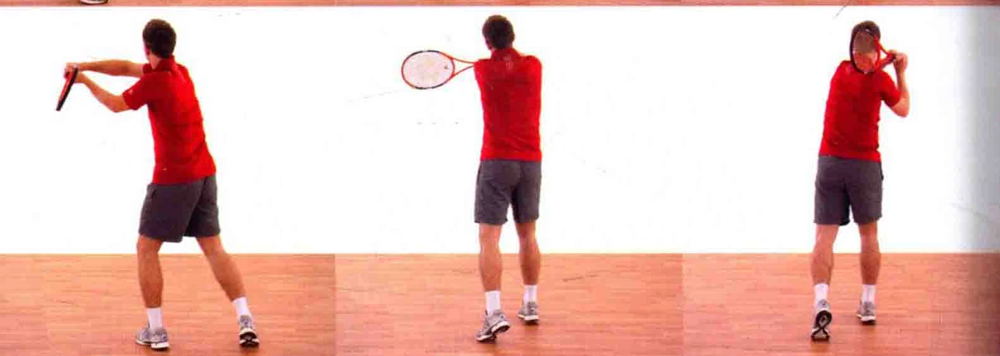

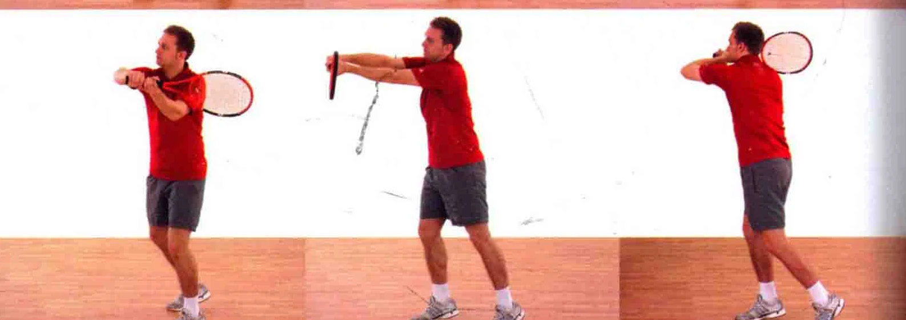

如果您更习惯打双手反手球，在打抽球截击球时,# 您很可能也会喜欢用双手握拍。和单手正手、单手反 ( 见本书第127一135页 ) 一样，双手反手抽球截击也是在运动员从底线出击，在空中截击尚未触地反弹的球时使用的。它能打出上旋球。这个打法同样很有攻击性。

二把握时机对手击球时，在心中数“1”，数到“5 ”时击球。

握拍法采用双手反手上旋球的握拍法 ( 见第26页 )。

当球仍在上升时就追踪球路，凌空接球追踪来球站出上旗球。 球拍置于身体前方，使之与网球成 - 一条直线，从而追踪球路。 头部保持不动球拍由下至上挥动

### 并横扫击球

### 转动上半身

### -上半身开始有力地转动

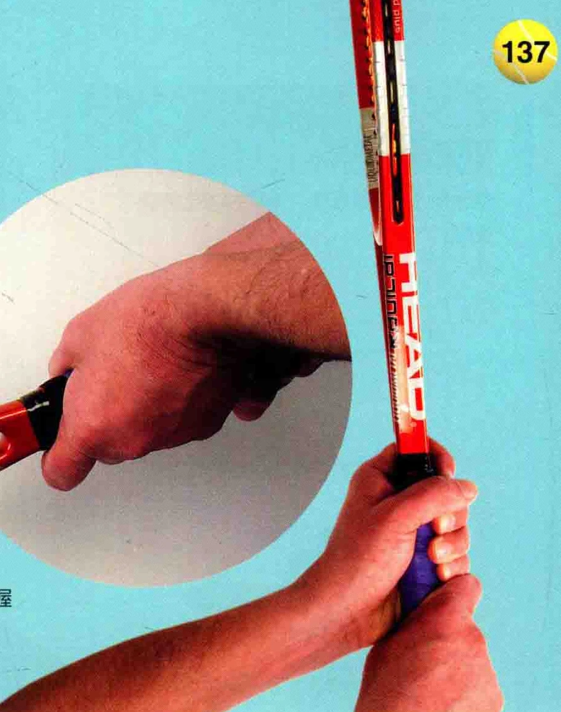

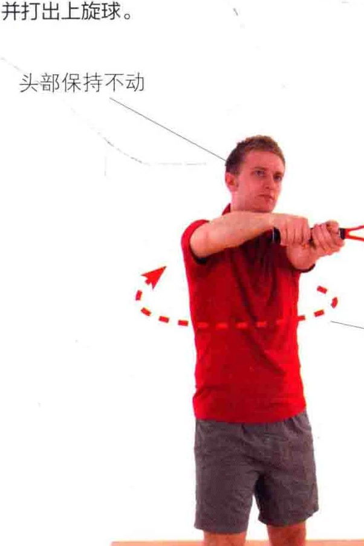

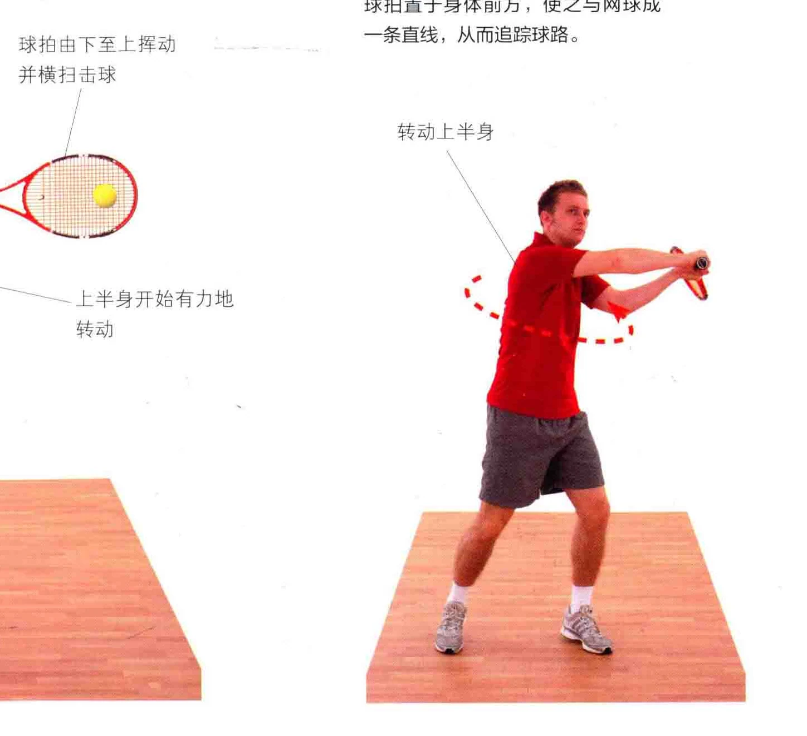

击球点默念至“5 ”时击球，用球拍凌空将球横扫。

### 球拍横扫过网球

横扫击球时，球拍头部始终略低于手的位置。

### 头部保持不动

### 前脚距地起身 ! Ia I

如图所示，击球点位于身体前方， 拍面与手的高度平齐。

击球时上半身挺起。 击球时，拍面相对于球而摊开

### 上半身有力地展开

在击球的一刻，拍面几乎是平摊在网球旁边的，用拍弦横扫过球身。

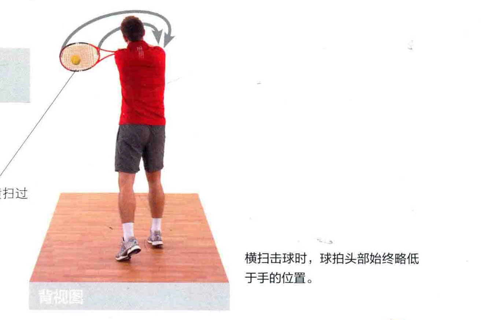

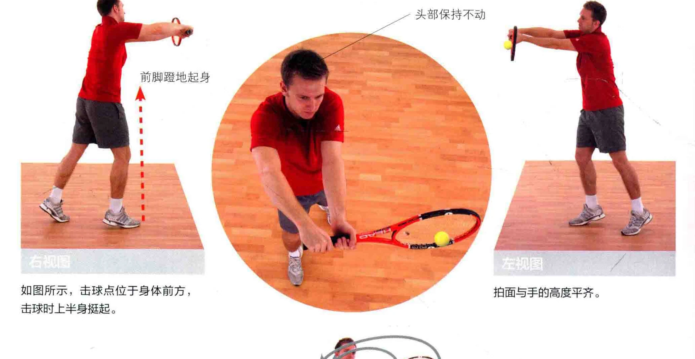

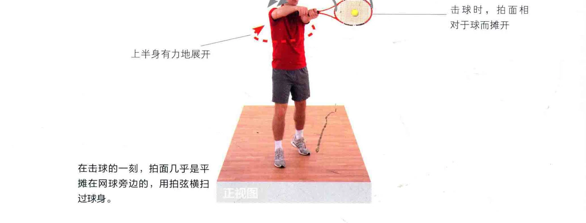

一一球拍挥送至肩部，

### 结束挥拍结束挥拍

球拍横扫击球后，非惯用手继续挥送球拍，使球拍头部绕过身体，到达对侧记膀的上方。

如图所示，身体重心回到对侧腿上。

### 上午上了器“布融尝坦州河和州治

将球拍挥送至肩，结束挥拍。注意结束挥拍时，球拍在肩部上方停止手有时低于脸颊，指向前方。 挥送。

### 上半身完全展开

### 要义完成结束挥拍动作

如图所示，结束挥拍时，仍然目视着网球，准备迎击下一球。

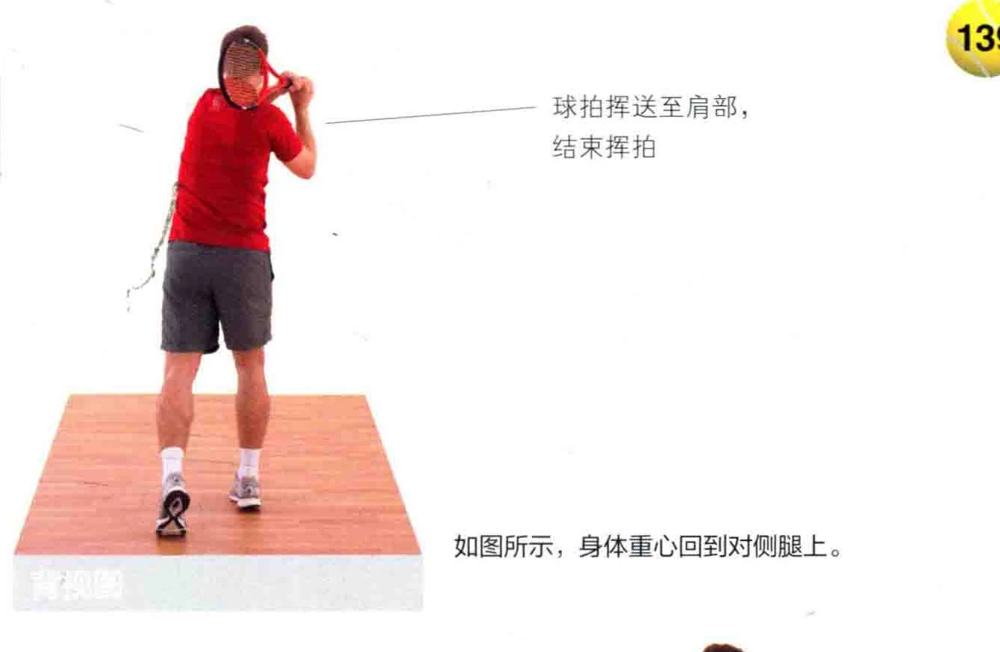

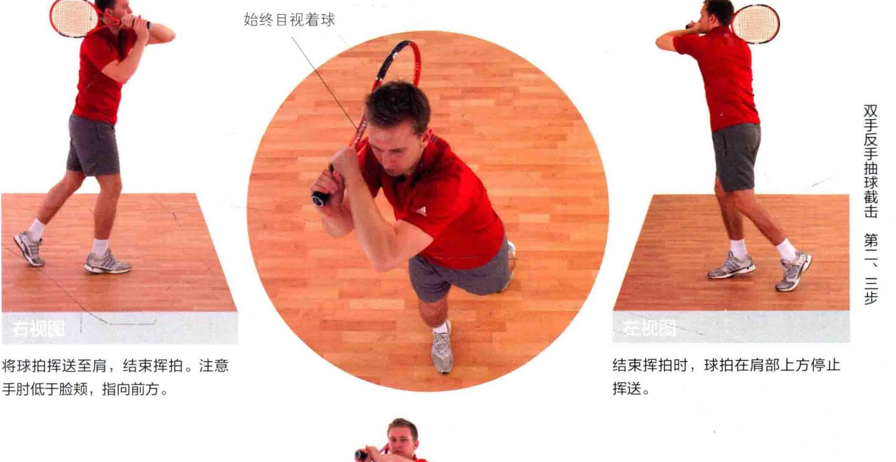

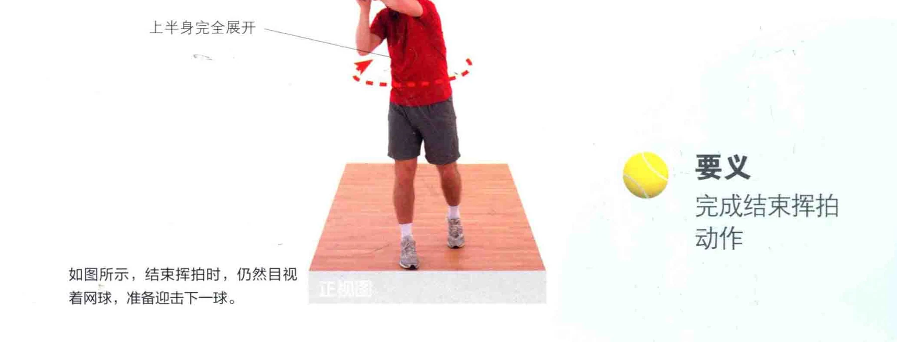
