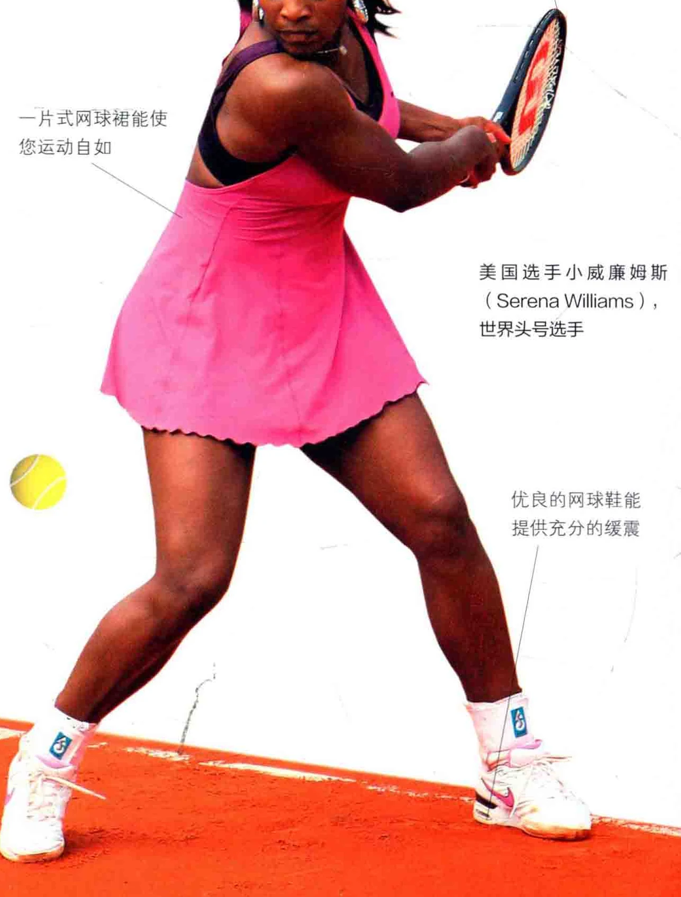
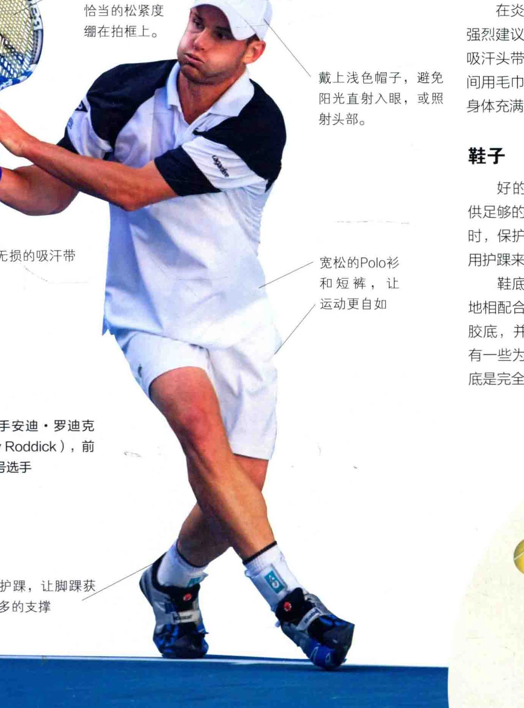

让。， 想开始学习网球，是用不着去抢银行的，但是基于一些实际的理由，仍然需要配置一些装备。此外，某些装备能使您在网球场上更为舒适自如。

### 网球

请使用优质的网球。网球在打了一阵子后会磨旧，请勿继续使用磨旧的网球，这样会患上网球肘，这是一种十分疼痛的病。何况使用磨旧的网球练习，也无助于技能提升。请丢弃它们，或是作为狗狗的玩具。

着装网球着装务必宽松自如，采用轻盈的材料制成。Polo实、T恤或背心都是理想的选择。无论男女都可以穿豆裤打网球，女性选手还可以穿网球短裙，或是一片式网球裙 (One-Piece Tennis Dress )。 袜子必须是纯棉毛巾质地的，从而吸收汗水的湿气，并为双脚起到组震作用。 每局比赛开始前，必须穿着运动外套，或是训练上衣，直到全身肌肉暖起来之后才脱下。开始打球前，不忘记做热身和伸展运动，运动后也要做放松运动。

### 着装规定某些私人网球俱乐部有

严格的着装规定，走上球场前，请知悉这些规定。

用束发带固定头发， 碳素球拍轻便结实， 使之不阻碍运动。 是打网球的好工具一片式网球禄能使

### 您运动自如

美国选手小威廉姆斯 ( Serena Williams )， 世界头号选手

### 优良的网球鞋能提供充分的缓震

### 网球拍与球拍圳

如今市场上有许多名牌网球拍， 也有名目繁多的针对青少年的不同尺才的拍子。球拍尺寸最小为21英寸， 适合四至五岁的儿童，最大为27英寸，适合成人使用。选择何种尺寸的拍子，则取决于个人感受和舒适度。

拍柄也有不同的尺寸，请咨询专业教练选择合适的尺寸，或前往有

结实耐用的球拍弦 ( Racket ”String )，以恰当的松紧度绷在拍框上。

美国选手安迪“， 罗迪克 (Andy Roddick )，前世界头号选手

穿上护踩，让脚趴获一得更多的支撑

品质保证的网球零售商。如果您正在使用的拍柄已经日了，或是太小，您能很容易地习到替换拍柄，或是吸汗带。

刚开始打网球时，有一个球拍就可以了。随着技能提升，打的次数越来越多，力道越来越大，您就需要多一个完全一样的球拍，万一在比赛中

习戴上浅色帽子，避锡阳光直射入眼，或照射头部。

_ 一宽松的Polo衫和短裤，让洒运动更自如

球拍损坏，还有可以用备用球拍。项尖选手可能有多达八个球拍，不过他们通常有赞助商，从而无需自己支付球拍钱。如果拍弦断裂，多数教练或零售商都能重新拉线。

购买一个尺寸合适的球拍圳，也是明智之选，它能把把所有装备都放进球拍历时。

### 防晒与降温

在炎热而暴晒的天气下打网球， 强烈建议您配备棒球帽、运动墨镜、 吸汗头带、防晒霜等，且每隔一段时间用毛巾擦干身体。饮水要足够，使身体充满水分。

### 鞋子

好的网球鞋必须经久耐用，提供足够的缓震，以便在您跑动和转身时，保护足部和脚踩。此外，还可以用护躁来为脚躁提供更多的支撑。

鞋底的纹路，必须和您所打的场地相配合。多数网球鞋都是轻质的橡胶底，并配有Z字形的橡胶纹路。也有一些为室内场设计的网球鞋，其鞋底是完全平滑而无纹路的。

### 说记做好准备工作

