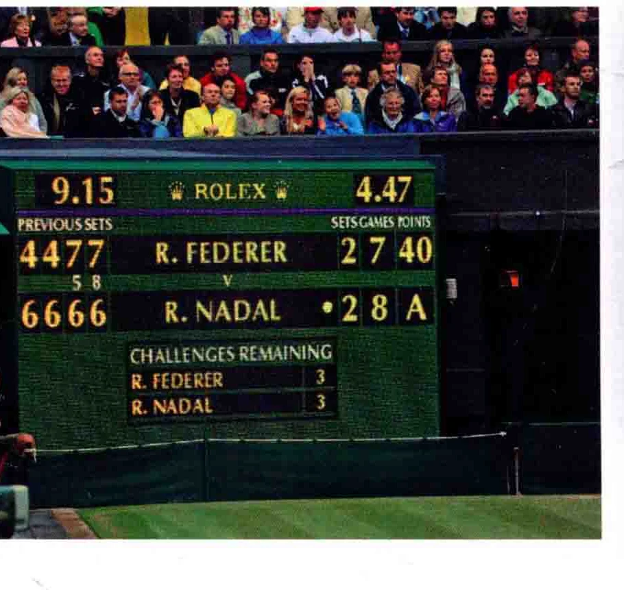
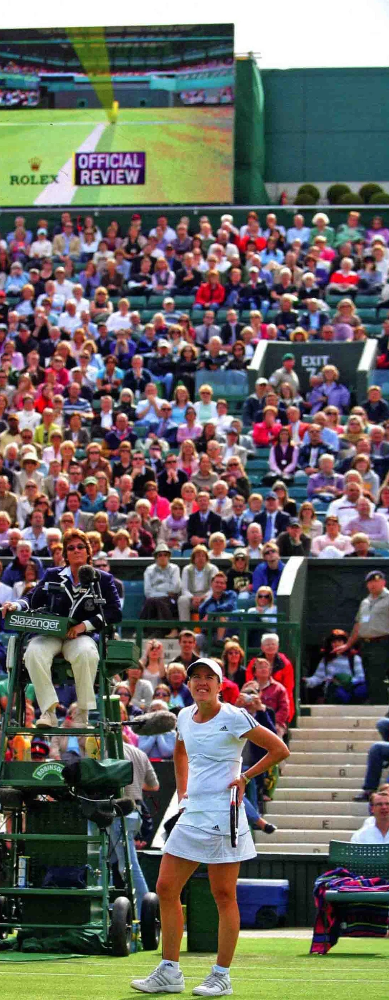

### 灾避名谭

网球运动是分为整场比赛 ( Matchn )、

盘 CSet)、局(Game)、分

(Point ) 来计算得分的。每盘比赛分为若干局，而要取得整场比赛的胜利，选

手必须拿下若干盘。 整场比赛

要取得整场比赛的胜利，您必须至4 全得三盘两胜。 0 是顿、澳奥网公开赛、美网公、法网

和男性选三胜，才能获得整场比赛

如果您是个休闲玩家， 可以依照喜好，随意打多少盘都行。

您可能要心算一下得分，职业选手则亲睐

局与得分要取得一局的胜利, 至少要拿下4 个得分点(平分除外)。双方选手的记

分都从零开始, 也就是所谓的“love。 胜出的第一球记15分, 第二球记30分第三球记40分, 第四球完局。

然而，若比分为40比40， 就是“平分 (Deuce ) ”。这时首先得分的选手称为“领先方 (Advantage ) ”，当他再取得两个净胜球， 一局才能结束。 如果领先选 ea 则比赛再次进入平分局面。 此时双方得分可能交替增长，直到一方再次取得两个净胜球而完局。

每当双方局数之和为单数时， 需要交换场地。比如，若双方得分为 3比2，则交换场地，而若比分为2比 2，就不需要交换场地。

**CHALLENGES RE**

只有拿下6局，并且至少连胜两局，才能取得一盘的胜利。因而当比分为5比5时，必须继续比赛，直至比分为7比5时，才能结束一盘。

如果比分变为6比6，则必须抢七 (Tiebreak )。每胜球记1分，首先取得7分的选手胜出，同时，该选手必有顷有两个净胜球，

如果抢七时比分为6比6，则比赛继续进行、直至一方取得两个净胜球。抢七时，双方选手每六球交换一次场地。

在职业锦标赛中，整场比赛的最后一盘，通常采用长盘制 Set )。这意味着最后一盘不设抢七， 因而时间是无限的，直到一方选手取得两个净胜局时，才结束比赛。

### 分是先报发球方的得

分，无论其分数多少。比如，AB两个选手的比赛中，A选手发球并得分，报分为15比零 ( 15一love )，如果B选手得分，报分为零比15。

如果双方得分均为15或30，报分为15平 ( 1$ all )、30平(30 all ) 如果双方得分达到40比40，就称为平分。如果A选手在平分后首先得分， 他被称为“领先方A”。此后如果A 选手再得一分，就取得一局的胜利

然而，这时如果是B选手得分， 就重新回到平分的局面。

贾斯汀海宁 ( Justine Henin ) 调用座眼赛球跟踪仪 ( Hawk-Eye ) 质询一次报分。应眼跟踪仪在网球锦标赛中广泛使用，是一种计算机模拟系统。

### hy 有NAN 机册

### 说记有

记分法十分复杂， 不妨通过比赛来学习和熟悉它

