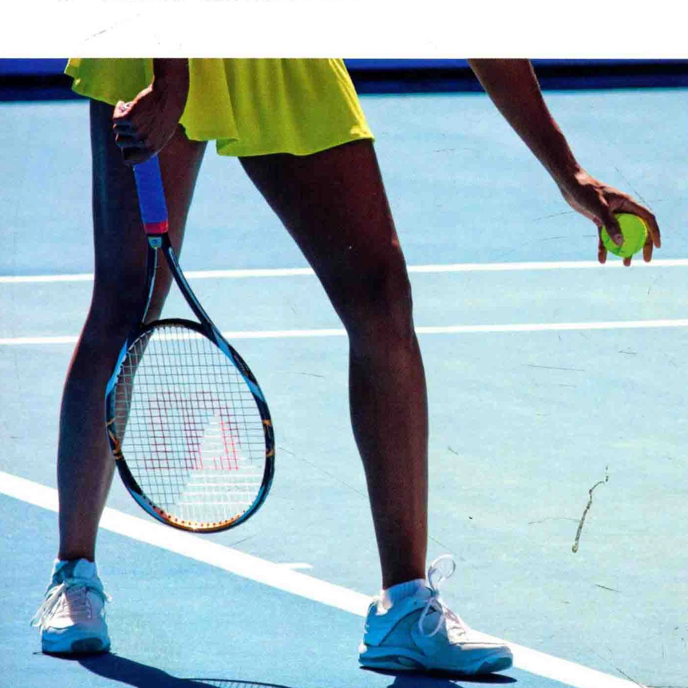
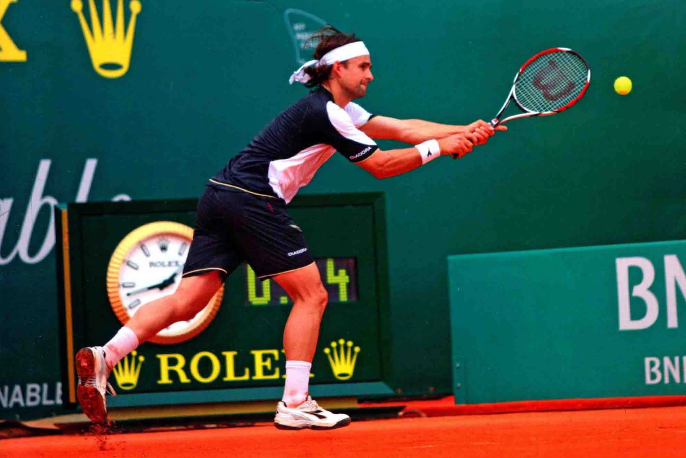

### 汤己司玉

发球、接发球和随之而来的对打阶段， 是每局比赛的得分机会。 因此，熟练掌握这些得分的取得办法，是十分重要的事。

### 发球

每局比赛的都在右半场开始第一次上发球。此时选手站在底线后方，把球友向对角线方向，从而让球在对侧的友球区触地反弹。

如果球落在发球区之处，或是触网而落在己侧，就是发球失误 (fault )。上球手还有第二次发球机会，称为第二发球。如果该选手

的二发也和失误，就是双误(double

fault )，对手将取得这一球的得分。 如果皮球手在发球前，任何一只脚或双脚触及或越过底线，也是失误，称为脚误 ( foot fault )。

### 对打

单打比赛的发球成功后，对手必须在球触地反弹后，把球接住并打过网，使之落在单打场地的界内。如果球落在单打与双打边线之间的区域， 在单打比赛中就会被判为“出界” (详见次页双打比赛规则 )。

发球后，双方选手都必须如上所述地对打。接球前，球至多只能触地一次，也可以在触地反弹之前击球。 必须一击过网，而不能多次击球，也不能用身体的任何一处接触球。把球打在自己一侧的场地内，而不越过球网，也是不行的。

如果一个选手未能成功接球，对手就得分了。

图中选手正在地上拍球，以使自己集中注意力，沉着冷静地做出发球的准备。

锦标赛中最长的对打纪录为643 次过网，纪录保持者是维奇. 尼尔森 ( Vicki Nelson ) 和让荷谱尼 ( Jean Hepner )，他们在 .1984年10月，美国弗吉尼亚州瑞奇蒙德的赛事中取得该项纪录。

### 双打 ( Doubles ) 规则

在双打比赛中，如果你是第一局的发球手，那么发球权将在第二局比队友，再次是您的另一个对手，

### 发球权再次回到您手中下和村太夫必

按照这个顺序交蔡发球。 下一盘比赛开始时,如果您愿

，可以和对手交换发球顺序一局比赛取得首次得分后，发球手从球

场左全发球，把球发到对角线方向的

发球区内。得分依照这样的方式继续票积，直到某一方选手取得一局的胜利，此时接球方取得发球权，

接球时，一旦定下您的接球区域，就不能在一盘比赛中改变。下一盘比赛开始时， 您可以依照意愿与队

### 友交换接球区

双打比赛中，如果对打时球落

### 在单打与双打边线之间的区域

被视为界内球，而发球时则被视

界外球。

最高速的发球: 美国选手安迪“。 罗迪克 (Andy Roddick ) 在对阵白俄罗斯选手弗拉基米尔。沃尔奇科夫 ( Viadimir Voltchkoy ) 的比赛中，以时速155英里 ( 时速249干米 ) 发球，这项纪录是在2004年9月戴维斯杯赛事中取得的。

### 由头)

尼古拉斯。基福尔 ( Nicolas Kiefer ) 以双手反手的方式接球，

### 轮椅网球

国际网球联合会 (ITEF ) 规定，轮椅网球的比赛规则与前述方式相同，只是网球可以触地反弹两次。选手坐在特制的轮椅上比赛，这种轮椅能够帮助他们在场上目如地移动

