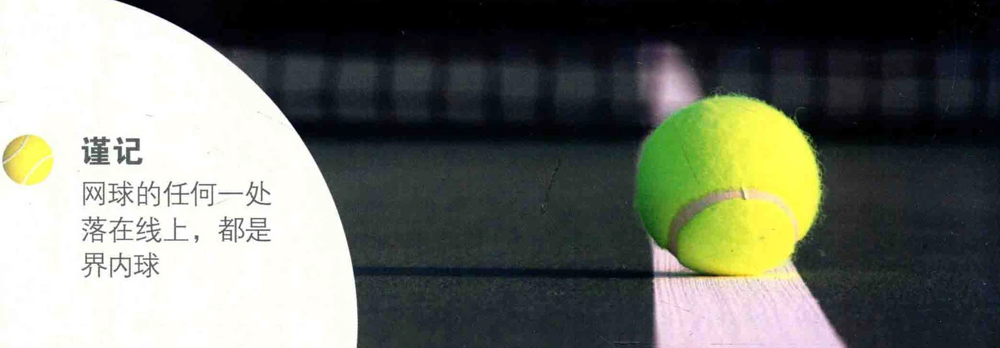
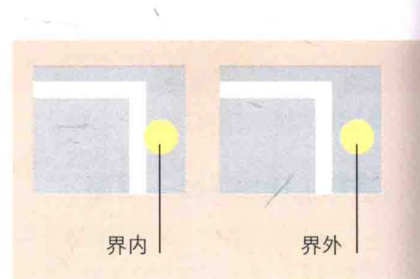

### >产: 机

章网球是一项很有对抗性的运动，有时会让人情绪高涨。尽量使自己举止得体，但也不要任由对手鱼肉，比如总是让他质疑你的每个得分，或是否决你喊出的出界判定 ( Line Calls )。

### 第一局开打

第一局比赛的发球权，通常是 ”选择先手或后手，或是选择在场地的用转动球拍的方式决定的。以球拍 “”哪一侧开打。比如，如果您猜对了， 弦上的绳结作为标记，强结朝上的 ”您就能选择先拥有发球权，而您的对一面是反〈rough )，另一面是正 ”手将选择场地。在户外比赛中，这一 (smooth )。也可以采用其他的标 ”决策是至天重要的。首局迎着太阳出记，比如球拍商标的方向。 击，是一种不错的选择，因为这样一

请您的对手猜一个方向，然后 “来，接下来的两局里，您就能逆着阳转动球拍并任之落地，猜对的一方来 “ 光打球了。

### 对打

在友谊赛或是锦标赛的头几轮 “”反暗后立刻表态，用清晰的声音使对里，选手必须上自己报分，并判定界内。” 手知道。

界外球。 0 文时是没有裁判来裁夺对于界内界外球, 双方有可能对比赛的。 是由您来判定对方的 “对方的判决让有疑问, 如果您不赞同

球， 0 因而您需要。” 对方的判决, 是可以重新打一次的, 不

尽量公正。如果对手的球落在界内， ”过通常而言， 是白做名最初沪新的一不必多言，把球击回去就可以了。如。， 方决定是再打一次, 还是坚持原判。这果您判定这球出界，就必须在球触地 ”里就要用到自由裁量权的概念。

### 界内界外

谨记网球的任何一处沙在线上，都是界内球

无论何时都请保持体育精神，包括: 在对手准备好之前 ( 准备好是指他们摆出准备姿势，面对着你的时候 )，不要发球。比赛结束后总是与对方握手，无论胜败。有裁判在场时，也要与裁判握手。

