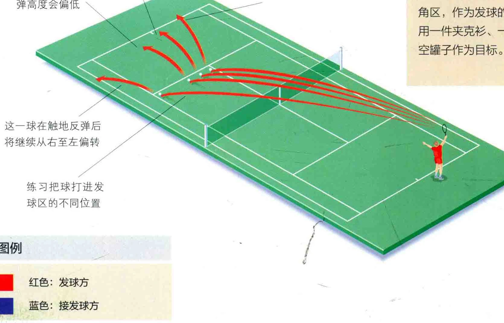
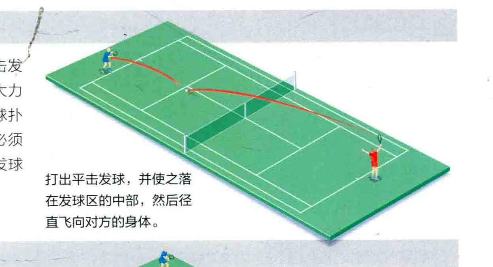
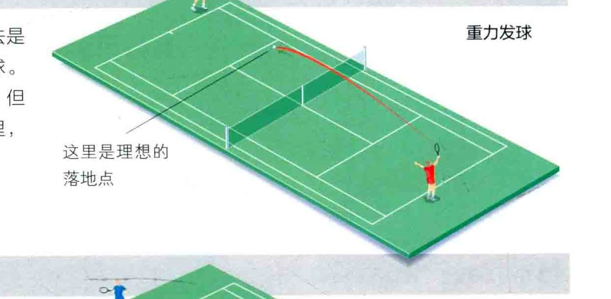
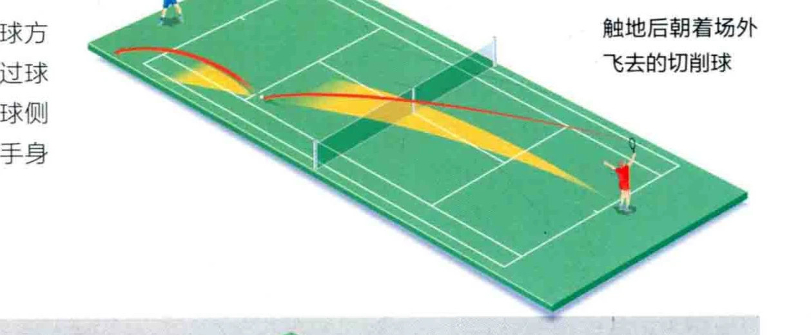
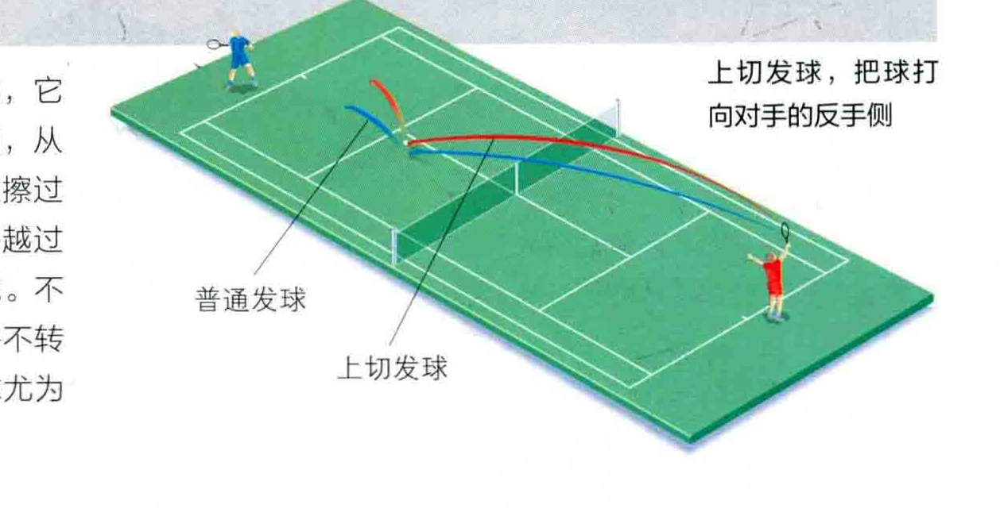

和网球比赛中， 最重要的击球莫过于发球了。 如果不擅长发球， 比如发生双误，或打出很容易被反击的发球， 就会让对手轻易得分。然而，如果能控制发于的菏地点或是打出高速的发球，您就足以令对手胆寒。

### 落地点

选择好的落地点是发球的关键。 当然球速也同样重要，它取决于击球的力道，但是练习控制落地点，不但能提升把球打进友球区的概率，还能使您稳定地捉准对手的弱侧来发球， 这样即使不能使之失球，至少也能人迫

够的发球力道能大量提升发球得分 (ACE ) 的机会， 0 把90%的发球打向对手的弱侧，

不错的办法。您还可以把球发本手的强势侧，或是打出近身球。一旦掌握了将发球的落地点控制在几英寸内

### 说记控制球的落地点

的发球手未必是那些在同时代中球速最快的选手。打出最高速的球，使之落进对方的接球区诚然是可以的，但对手通常角记抽球上旋球。但是如果球落在边线上，对手往往无能为力; 这样即使球

名把球挡回去，甚至回吉一

使对手回击的接发球相对较弱。 的技巧，您就能让对手一直猜测，下速不那么快，发球的得分机会也会大不过，如果您一直把球发进同 《一个发球会落在何方。 大提升。、 一区域，对手也会变得聪明些。足网球运动的历史证明，最成功标记、 人六

### 这一球在触地反弹后将直线向前飞行

### 这一球的触地反弹高度会偏低仆

触地反弹后，这一球将从左至右转向

### 这一球在触地反弹后将继续从右至左偏转

### 练习把球打进发球区的不同位置

### 图例

国。 红色: 发直方国政色: 接发B广

发球练习是多多益善的，然而您不可能总是有练习搭档。可以在球场上设置一些可拆卸的三角区，作为发球的落球点，或是用一件夹克实、一听网球或其他空钒子作为目标。

### 四种主要的发球方式

这种发球的力道很大，球几乎不旋转。平击发球通常只用于第一次发球。许多休闲玩家喜欢大力平击发球，如果发球失误，他们就再打一个让球扑通落下的二发，这注定是会被对手攻击的。您必须

。 尽快学会带有旋转的发球，它可以运用于任何发球

当中。

### 重力发球 2

首发和二发都可以用重力发球，这种发球法是用球拍弦擦击球的后侧，从而打出明显侧旋的球。 这种球的飞行路径看似很直，跟平击发球类似，但是在接球时，侧旋会使球“吃”进对手的球拍里， 从而让接发球方感到这一球的重量。

切发球也是一种可运用于首发和二发的发球方式。和重力发球相似，切发球也是用球拍弦擦过球面，只是它更多地擦击球的侧面。这同样会使球侧旋，但同时也会让球在飞行途中转向，朝着对手身边或是其反向飞去。

上切发球又称为上旋发球，或美式旋转球，它通常用于二发，当然，也可以在首发当中使用，从而让对手摸不着头脑。用球拍弦擦过由下至上探过球身，从而打出上旋和侧旋。球会彰上飞起并越过球网，同时发生偏转，后者取决于侧旋的情况。不过，球触地的情况和普通的切发球不同，它并不转向，而是由于上旋而变得更强劲，使这种发球万为施异。

打出平击发球，并使之落在发球区的中部，然后径直飞向对方的身体。

### 触地后朝着场外飞去的切削球

上切发球，把球打向对手的反手便

