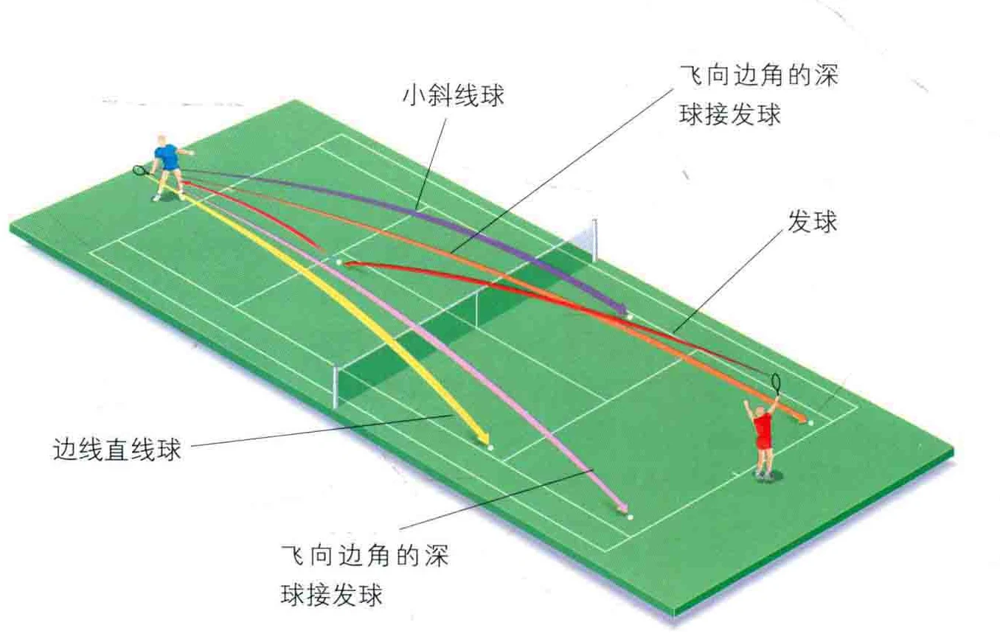
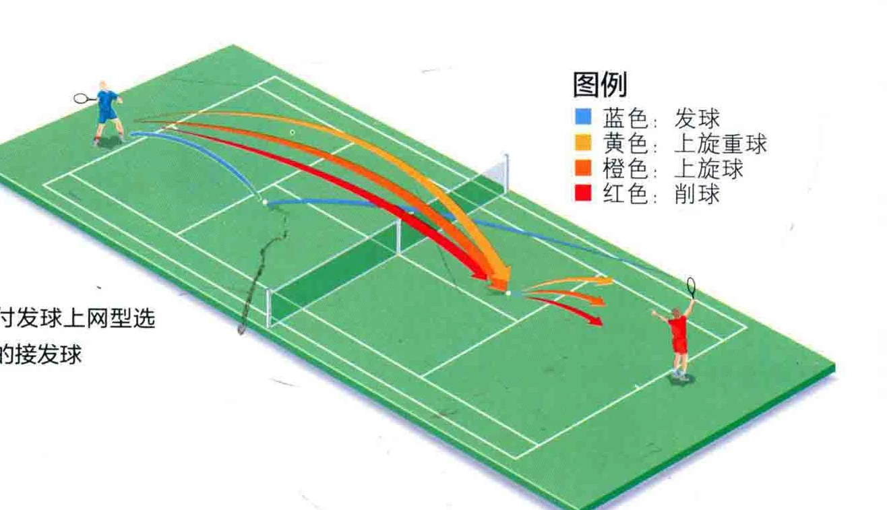
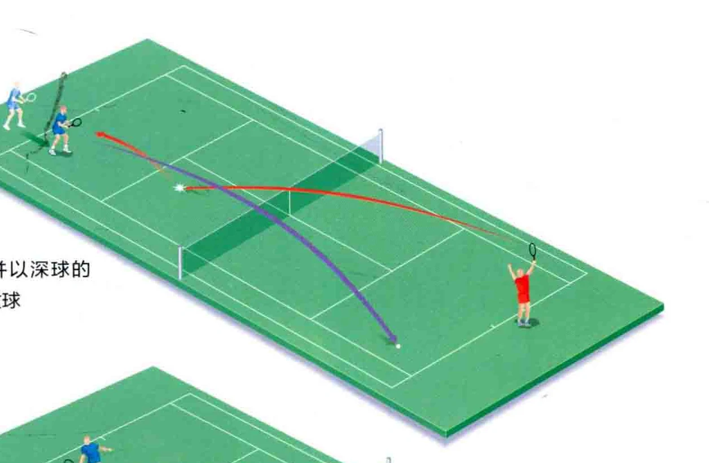
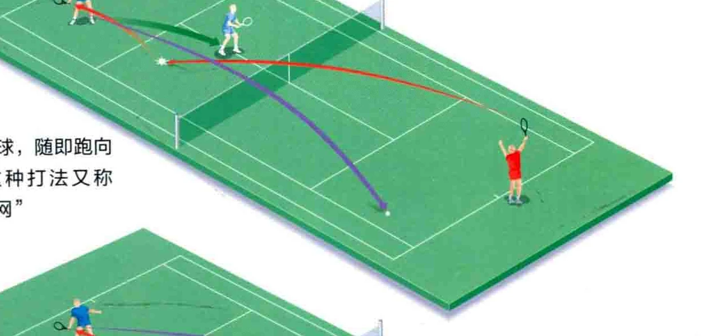
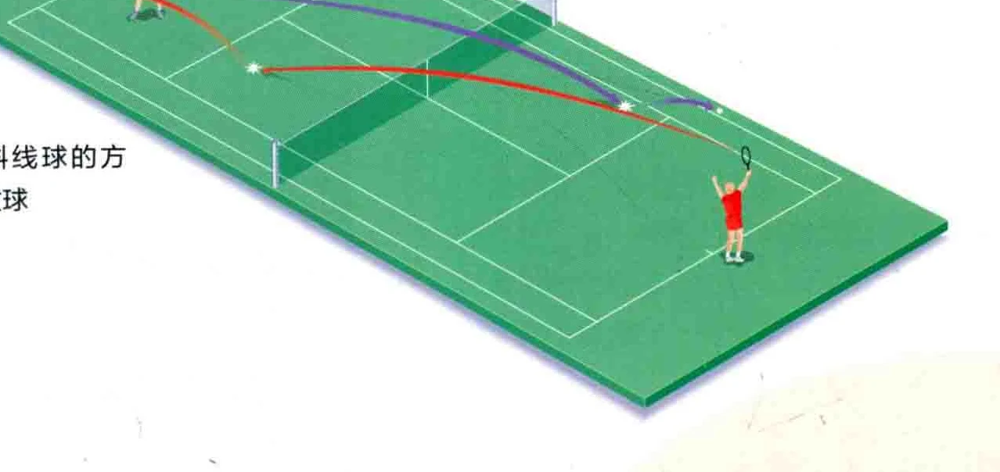

### 冰毒员

网球的几种击球方式当中，接发球与发球的重要性等量齐观。如果不能较好地迎击对手的发球，对方的自信和就会膨胀。如果接发球不成功，就不能进入

对打阶段，从而无法获取得分的机会。

### 防守还是进攻?

攻击还是防守，往往是在对方发球后球飞向你的一刻决定的。如果您的对手是一名攻击型的发球手，您可以站在底线后侧防守，把球打回去。

如果对方首发失误，或是他的首发特别差劲，您就可以试着更有进攻性地打出接发球。其方法是走进底线内侧，在球仍在上升时 ( On the Rise ) 予以回击〈见本书第161页 )，或是打出力道更大、上旋得更明显的接发球。

### 落地点

为了保证绝对的安全，把球打进对角线的方向吧，这种打法就叫斜线球〈Cross-Court，见第158页 )。斜线球将飞过场地的四分之三的长度， 或者也可以打出“深球 (Deep ) ”， 从而避免让对手轻易反击。

也可以直接把球打下，使之贴着单打区的边线落地，这就是“边线直线球” ( Down the Line，见第159 页 )。接发球时打出边线直线球，是很有攻击力的，但风险也更高，不过这种战术并无不可，尤其是在发球速度低而球程短的时候。

您的对手可能是个发球上网型选手(Serve and Volleyer，见第157 页 )，因而在接发球时，您最好选择挡球 ( Block )，或是打出上旋球， 从而让球落在发球区内。这样一来， 当对手跑向网前时，球就会落在他的脚边，亿使他防御性地把球拉高。接下来，您就有机会打出高吊球，或是让球飞到对手身后去。退而求其次的策略，是在对手跑向网前的时候，让球从任何一侧飞到他的身后。

### 飞向边角的深球接发球

### 小斜线球

### 边线直线球

### 飞向边角的深球接发球

### 对付发球上网型选手的接发球

### 冲向网前还是留在后场

如果对手是一名攻击型的发球手，您很可能始终处于防守状态，一直留在底线后方等待迎击下一球。但如果首发的球程很敌，或是对方的二发令您感到可以还击，您就有了冲向网前的好机会。这会使对手倍感压力，钥而走险地打出高吊球，或是超身球 ( pass )。如果您身手敏捷，喜欢截击或扣杀，就很可能得分一一当然，您得擅长此道才行。

可以用上旋球或削球的方式接发球，如果在接发球时冲向网前，这种打法被统称为“上网球”。上网球的落地点，必须能让对手失去平衡，比如攻击其弱侧。

跑上前的同时，要始终目视着对手。在他们准备迎击时放慢步伐， 为此时您可能需要突然改变方向来接住发球。对手击球时要小步跑动，两脚稍微向外分开，这种有爆发力的步伐能让您迅速避开从任何地方飞向肢边的球，从而快速接住它。

### 球如何旋转

您可以打出削球 ( 造成逆旋、侧旋 ) 或上旋球。上旋的接发球通常力道更大，而测球通常用于更具防御性的接发球，不过，削球的球路诡异， 也可以用于打乱对手的步调。

### 图例

### 力红色: 发球方荐蓝色: 接发球方

### 向前跑并以深球的方式接发球

打出接发球，随即跑向网前，这种打法又称 “削后上网”

### 以小斜线球的方式接发球

### 说记接球前小步跑动寻找击球操

