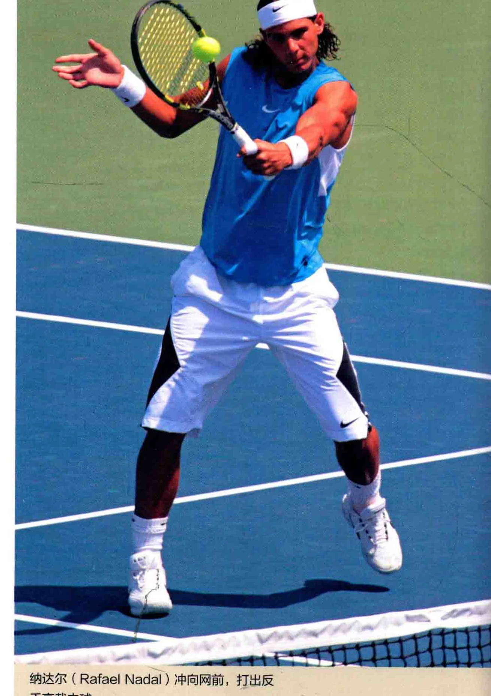
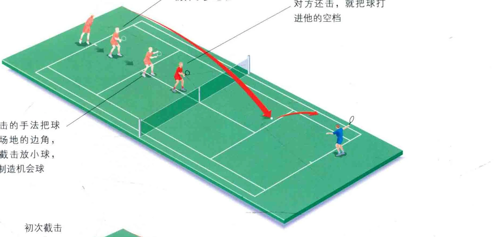
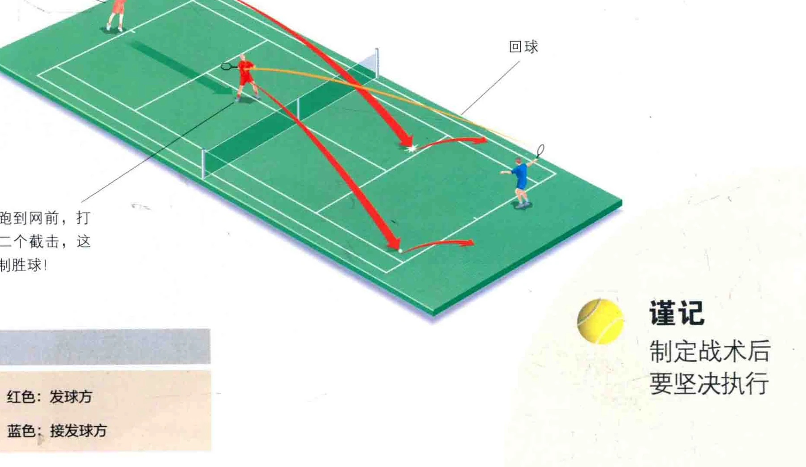

### 永王月

第一击指的是发球方打出的第二球， 其重要性不亚于发球与接发球。 加有二发球方没有发球人号分 ( ACE )，或是造成接发球的失误， 他们就会指望接发球

能够软弱无力， 从而使发球方找到机会，把球打进球声的边角。 这样一来，即使不能彻底获胜， 至少也能迫使对手失误， 这就是“受迫失误

### 防守还是进攻?

防守还是进攻，取决于对手的接发球的水准。如果您的发球足够毒辣，那么对手的接发球就会比较蔓脚，使您在第一击中拥有一定的优势。

如果您的发球比较弱，对手就可以反击，您就会被动地转入防守或持中良策略。

### 第一击之后

如果对手的接发球球程较短，您就有机会打出漂亮的第一击，然后跑向网前打出截击球或扣杀，从而制胜得分。

如果不擅长网前球，您仍然可以打出具有攻击性的第一击，然后继续留在后场,- 打出一记凑厉的击落地球，从而控制全场，它能迫使对手失

误，或是直接得分。

### 非受迫失误

如果球员并未处于不利局面，却发生失误，这就叫“非受迫失误”。网球运动的不二法门，就是把非受迫性失误控制在零附近。

纳达尔 (Rafael Nadal) 冲向网前打出反手高截击球。

### 发球上网

如果您的发球卓有成效，且热衷于打截击球或扣杀，不妨选择友球上网的打法，其要领是，发球后立刻跑向网前寻找截击的机会，从而稳操胜券。这一战术在双打中尤为有用。

### 发球上网

用截击的手法把球打进场地的边角， 或是截击放小球， 从而制造机会球

### 初次截击

然后跑到网前，打出第二个截击，这就是制胜球!

请注意，在发球前就要想好是和否采用这一战术，并且贯彻始终。 为这样一来，就没有足够的时间跑向网前了。

对手击球时，跑向

WE 最后直抵网前，如果

对方还击，就把球打

### 说记制定战术后要坚决执行

