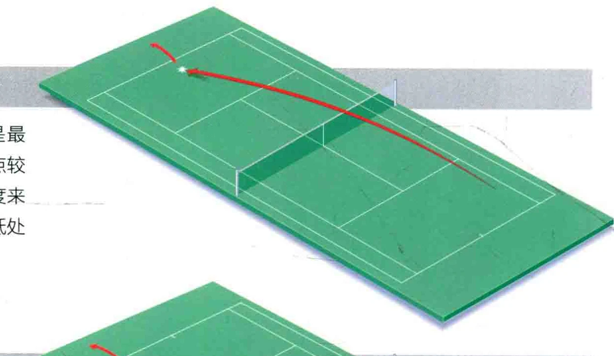
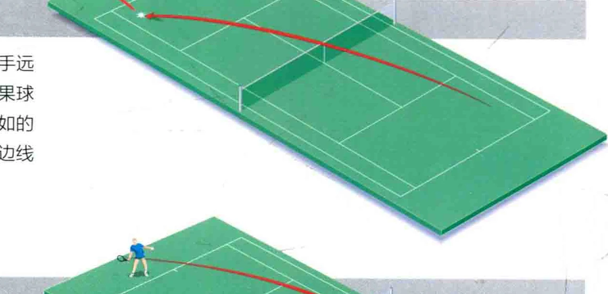
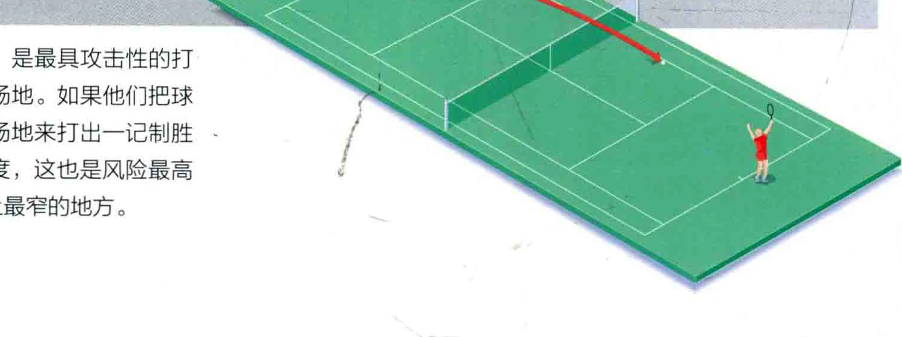

瑟比赛中当双方都位于底线时，有很多种战术可以采用。 用正手或反手把球打向对角线的方向，就叫做正手斜线球，或反手斜线球。这是一种保险的打法，因为它是朝着球场上最远的地方飞去的。所谓边线直线球，就是沿着单打边线 ( Singles Line ) 飞行的球 ( 在双打比赛中，球沿着双打边线飞行)。 如果您观看一场职业比赛，就会注意到多数的对打都是斜线球，直到一方露出破绽，从而打出边线直线球。

### 三种主要的斜线球打法

### 中央斜线球

朝着对手的底线的中央点斜向击球，是最为稳妥的方式。这是因为它可供选择的落地点较大，并且使对手无法找到一个挥酒自如的角度来反击。除此之外，中央斜线球是在球网的最低处飞过。

### 对角球

朝着最远端的边角斜向击球，会迫使对手远远地朝着球跑去，不过要警惕一点，就是如果球程太短的话，这种打法会给对手一个轻松自如的角度还击，打出一个位于您所在位置对面的边线直线球。

### 小斜线球

把球斜着打向单打边线，是最具攻击性的打法，因为它能迫使对手跑出场地。如果他们把球打回来，您就有了一大片空场地来打出一记制胜球。不过，由于其自身的角度，这也是风险最高的战术，因为您是在瞄准场上最窒的地方。

### 边线直线球

把球径直打向前方，使之沿着单打 (或双打 ) 边线飞行，是一种更具风险的战术，因为这种球的落地范围更为狭窒，而且通常球是以斜线球的方式飞来的，还击时需要改变球的方向。此外，这种球是在网的最高处过网的。不过，别对之望而却步，因为许多选手都苦练这一战术，无论用正手还是反手，这都是他们最喜欢的击球法。

### 战术抉择

随着练习时间的增长，您会凤得何时应该打出边线直线球，以反击斜线球。斜线球是最稳妥的方式，因而您会希望能多打斜线球。不仅如此， 当一记高速的深球飞朝着您的身体飞来时，改变球的方向也不容易，于是您就更想继续打斜线球了。不过，您应当设法使对手满场跑动，所以耐心等待一个可以打出边线直线球的机会吧。如果对手力道较小，您就有更多的机会打出边线直线球

正手反斜线球、正手反直线球

在反手位打出正手儿线球，也没什么不可以的，这就是正手反斜线球 (inside-out forehand，也称为逆向正手球，即off forehand。如果想打出边线球，就叫正手反直线球〈inside-in forehand )。如果对方的球速较慢， 或是球程较短，您就有时间跑到反手侧去打出正手球。但打这种球必须遵循一定的章法，它并不是因为您无法打出反手球才用的，而是因为您的正手球更有力道。仔细看顶尖的职业选手，您就会发现，他们都经党打出正手反和斜线球 ( 或直线球 )，但他们反手的技艺也都极为精湛。

费德勒 ( Roger Federer ) 用拍柄尾端指着球，继而打出单手反手上旋球。

### 说记

在有机会打出边线直线球之前，要一直打和斜线球

