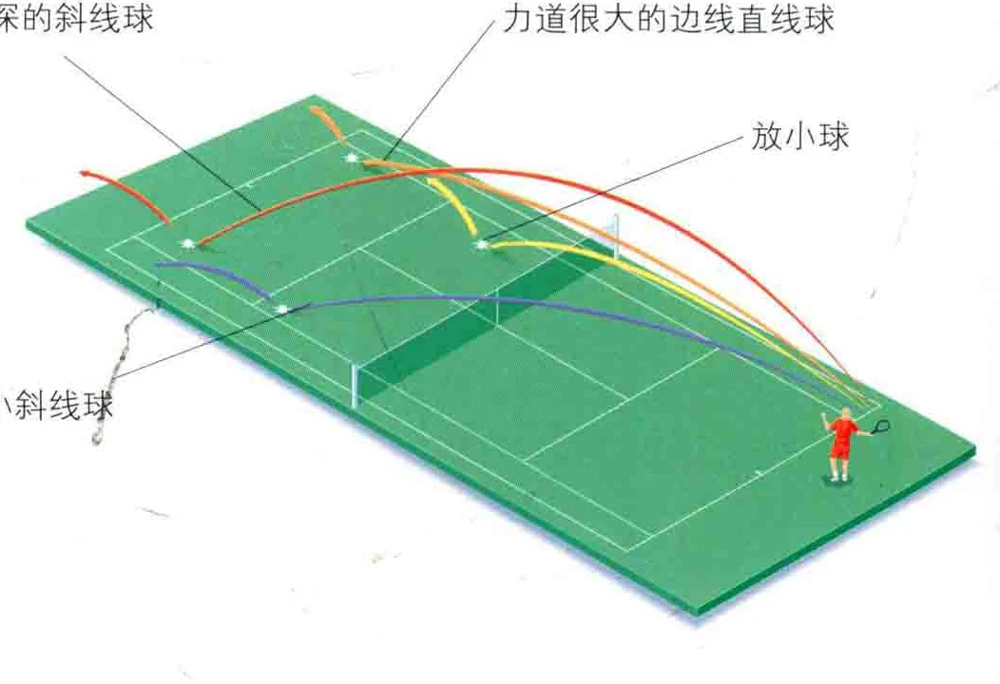
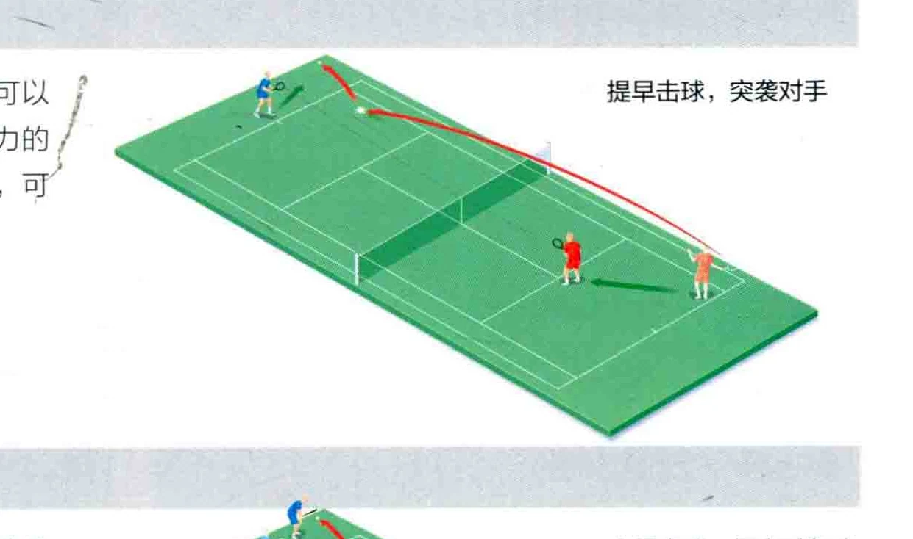
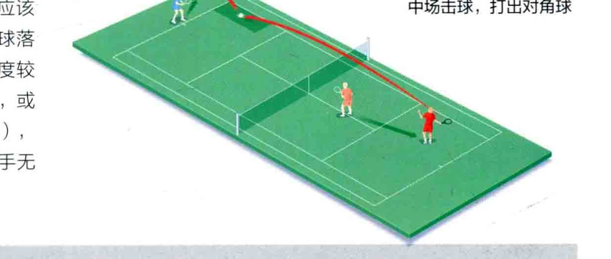
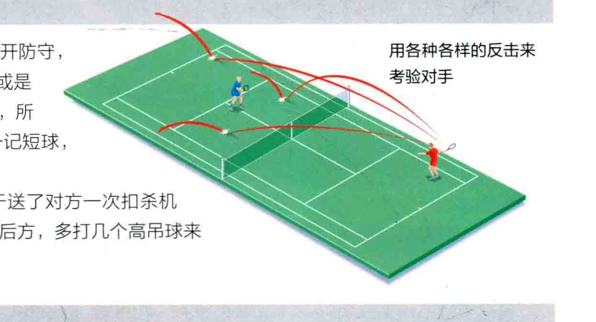
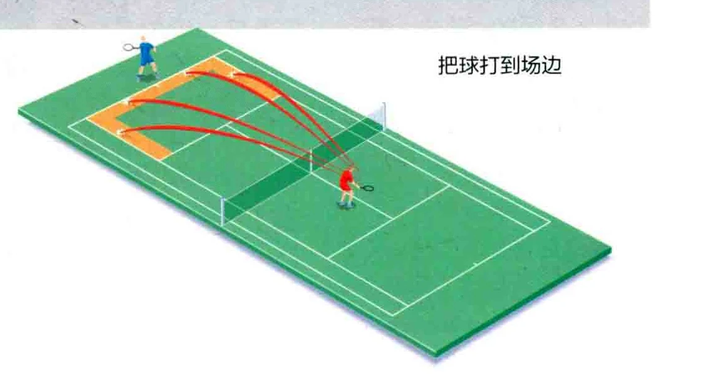

### 阔恶贿民

,发球步骤过后，您就进入了对打阶段，也就是与您的对手互相击球。对打的要局， 有就是记坎各种击球法冷静地击球，等待对手露出破绽，或是迫使他

们舌误。

### 改变球速和球的旋转

对打过程中，最好不时改变球的速度和旋转方式，这能让对手失去平衡，并且使其无法捕捉一般的击球时机。继而您就会帮现对手的各种失误，比如因为接球太匆忙而打出速度很慢的回球。

有时，您必须同时改变球的旋转方式和速度，这取决于您当时正在进攻、对打还是防守。

改变球的高度、深度和角度

除了改变球速和旋转方式，您

要改变球的过网高度， 人高度为球网上方4英尺 ( 1米 )，

种高度能打出稳定的过网球，

### 底线外侧战术: 对打

当您处于在底线上时，对打的要点是尽可能地打斜线球，同时偶尔地打出边线直线球 ( 见第158 至159页 )。

这时您要寻找对方的弱点，等待他的失误，或至少是一次较弱的回球，从而取得胜利。底线是可以打出制胜球的地方，这一球的过网高度要有至少4英尺〈1米 )，球要足够上旋，从而使球程足够深。

较有深度。

如果您被对手的击球压迫到底线外，就把球打高一点，其理由已如前述，而且这样一来，您就有时间回到位置上。打近身球时，过网高度就要低一点。

掌握球速、旋转与高度的变换

您的对手可能既擅长变换球的高度，又擅长改变其速度和旋转方式， 这种情况下，您必须小心地观察他击球的方式，这能使你发现一些迹象， 比如这一球的旋转方式，从而预判其触地反弹的情况。通过仔细的观察， 您还可以预判其落球点、过网高度和球速。

### 又高又深的斜线球

在对方击球前、击球时和击球后，都要留意其身体语言，因为这能鲜明的表现出对手的舒展与平衡，并且使您知道他何时会展开攻击，或只是把球打回来。

在球上升时击球提早击球，意味着对手的准备时

间会更短，但是请留意，这并不是说要提早拉拍，而是在球鲁地后的上升阶段就击球，也就是所谓的“在上升时击球”。

这就能突效您的对手，减少他们在自己击球后归位的机会，这种击球也更有力道，因为球在触地后的上升阶段有着十分充分的动能

如果您正处在底线内侧，就有很多种战术可以了采用，比如可以提早击球，或是打出更具攻击力的边线直线球，或是放个小球。在底线内侧击球，可以有很多创造性的打法，并制造得分机会。

提早击球，突效对手

在中场击球时您是处于优势的一方，这时应该打出触地球，甚至截击，让这些具有攻击性的球落在对方的边角。攻击时，要设法让球的过网高度较低。此时您应该谋求制胜一击( Winning Shot )，或打出具有对对方有压迫性的一球 ( Forcing Shot )， 以便在接下来的一击中跑到发球区内，打出对手无法回击的球，从而得分。

中场击球，打出对角球

### GE证二攻二 Re 让生同T 0

### 用各种各样的反击来考验对手

“如果您正要迎战一次中场攻击，请在底线展开防守， 这样就能应对超身球、追身球、落在脚边的球，或是飞过头顶的高吊球。您的对手也许并不擅长截击，所以尽可大胆地把球直接打回去。也可以故意打一记短球， 从而让他们跑到无法自如挥击的位置上去。

如果您的高吊球没有飞过对手头项，就等于送了对方一次扣杀机会。请尽早意识到这一点并立刻后撤，跑到底线后方，多打几个高吊球来防御。

抓住截击或扣杀的机会，从而制胜得分。当对手放小球时，您也会因为接球而来到这个区域。

