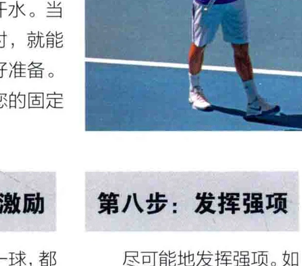
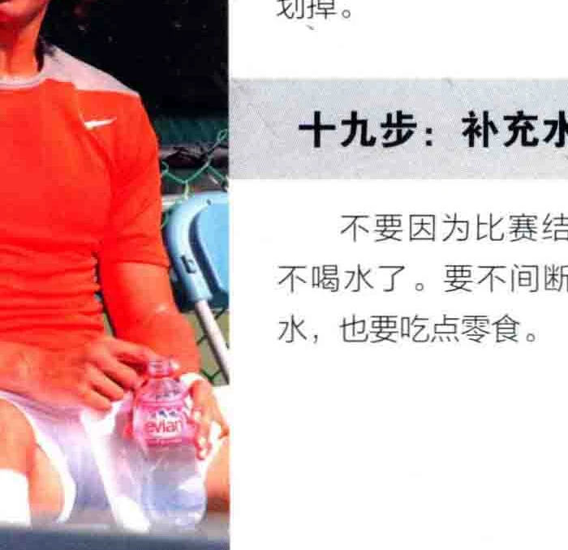

### 攻进入临场状态的20个步骤

不纵观那些最成功的网球选手，他们不仅熟练掌握网球运动的技巧，也能保持精神的高度集中。无论您的水平如何，良好的精神状态都能使您事半功倍， 以下将介绍一些集中注意力的必要步骤，不妨跟着学习一下。

第一步: 做好准备第二步: 上场制定一套适合您的准备运动。比赛前的一晚，放松肢通常而言，

体，不妨重温一场您最喜爱的赛事，或是洗个热水澡。晚餐要吃好，并保证优质的睡眠。

的，如果有可能， 听赛前指示。

### 第三步: 找准自己的打法

时刻准备着猛烈攻击，但只在恰当的时候爆发。如果您观看顶尖选手的比赛，就会发现他们并不总是用尽全力来击球，或是每时每刻都拿出杀手铀，而是不断地对打并乐在其中，从而寻找制胜的机会。然而，当战局变得充满危机时，他们会紧盯着一个转折点，继而展开更激烈的攻击，用直接发球得分的方式摆脱困境。您可以兰试着用您最擅长的方式来得分，在准备得分时，务必上发挥出最大的潜能。

每次得分后，都可以背对着对手走向后场。这时您应该盘算着下一次对打的战术。利用这珍贵的几秒钟镇定下来，或是擦干汗水。当您重新回到底线上时，就能集中注意力，并做好准备。 请让这一动作成为您的固定

程式。 第五步: 设想对打 ”第六步: 出手前设准备发球或接发球的准备击球时，在脑海每打出成功的一球, 都

同时，要根据此前的比赛经验，想象一下接下来的对打的情形，并盘算着第一击的沙球点。

中想象这一球的成功打法，包括球离开拍子后二样旋转，怎样以至少4英尺〈1米) 的高度过网，

又怎样落在您选定的落地点上。

要激励自己, 这样您就能保持良好的状态。一些选手喜欢把手插进口袋里, 好像要把这一球装起来, 以便下次再打出同样漂亮的一球。 其他选手则握紧拳头, 喊着

“再来! "您可以据此举一反三地找到适合自己的激励方式。

早一点抵达赛场做热身运动是有好处可以在场上打几球。赛前吃点零食， 并补充适当的饮水。还可以戴上Mp3听上听音乐，或是听

### 第四步: 回到后场重整旗鼓

### 第八步:

### 发挥强项

尽可能地发挥强项。如果您喜欢截击, 就抓住每个机会攻击对方的网前。战术要简洁, 用您最习惯的方式击球, 偶尔可以尝试一些更有难度的打法, 但是要记准您的局限。了解对手的长处和弱点, 这样您就能打乱他的球风, 继而制定策略来击溃他。

### 第九步: 向对手祝贺上

太多的人在对手得分时狂恕不已，其实对手也玉过是想得分罢了，所以当对手赁着自己的本事得分肝， 不要有“我怎能让他得了这分呢”这样的念头。他们并不是像一些初学者所说的那样，是因为侥幸，而是因为技艺精湛而得分的，所以何不向对手说句“好球”? 即 “使在您打出一击很弱的球，而白送给对方一次得分机会时，这样说也能让自己也舒服点儿。

### 第十步: 击球后呼气

击球后深呼一口气， 能有助于放松和释放激情。 击球时, 身体为了使出最大的力道而绷紧, 之后您必须呼一口气, 从而达到完全放松。一些选手也喜欢在呼气时大声叫喊。

### 十一步: 变幻莫测

比赛开始时您要想好一个方案，它是基于此前的经验和诸如场地类型、 天和气状况之类的其他因素而制定的。但方案并非一成不变的，如果一项方案行不通，试试另一个，或

### 十二步: 习惯动作

比赛当中, 保持一些自己的习惯动作是至关重要的, 它能让您感觉良好。 发球前可以扯一人T恤, 或是拱措额头, 这些习惯到底有什么作用, 可能只是迷信， 不过看看那些顶尖选手, 他们都有小动作。

### 十五步: 保持体能

可以带点饮水和香八，场间休息时要保持充足的水分。香芍富合钾元素，是很好的能量来源。

### 十八步: 忘掉失误

网球运动里充满了失误，打出制胜球的次数是很少的。所以它的获胜要诀，就是比对手失误得更少。不要对失误恋恋不忘或是勃然大把，这只会让您失误得更多。干脆地忘掉它，做好准备迎击下一球吧。

十三步: 比赛间隙里小跳几步当您感到紧张时，也许会呆立不动，在比赛间隙里小跳几步有助于缓解这一现象。

### 十六步: 稳扎稳打

别急着得分，否则您

就会自乱阵脚并且失误。 找准自己的节奏，享受比赛吧。

许两个方案并用会更好。 让对手猜吧。

### 十四步: 不要时惧不可控制的因素

您可以掌控自己的击球方式，但其他因素却是不可控的，比如天气，或是一个脾气糕、总是质疑边裁判决的对手。这些因素都是必须面对的，不要让它们成为您输掉比赛的借口。如果是在有裁判的锦标赛中，您可以在必要时向载判指出对手的行为，然而天气仍然不是借口，因为它对双方都是一样的。您甚至可以把它变为 _ 优势，比如当一阵风刊过时，利用它来压低您的球。

### 十七步: 重温成功一刻

无论比赛结果如何，都要找出其中的亮点。您是否达成目标? 这些目标可以是在一场与高手的对决中赢得一二球，或是在比赛中成功实施了某个战术。如果达到了有目标，就祝贺自己吧。保持写下目标的习惯，在达成后将它划掉。

二十步: 建设性的分析如果比赛失利，无论您发挥如何，都不要过分自责，尤其是在比赛刚结束时。要做出建设性的分析和评估。

### 十九步: 补充水分

不要因为比赛结束就不喝水了。要不间断地饮水，也要吃点零食。

