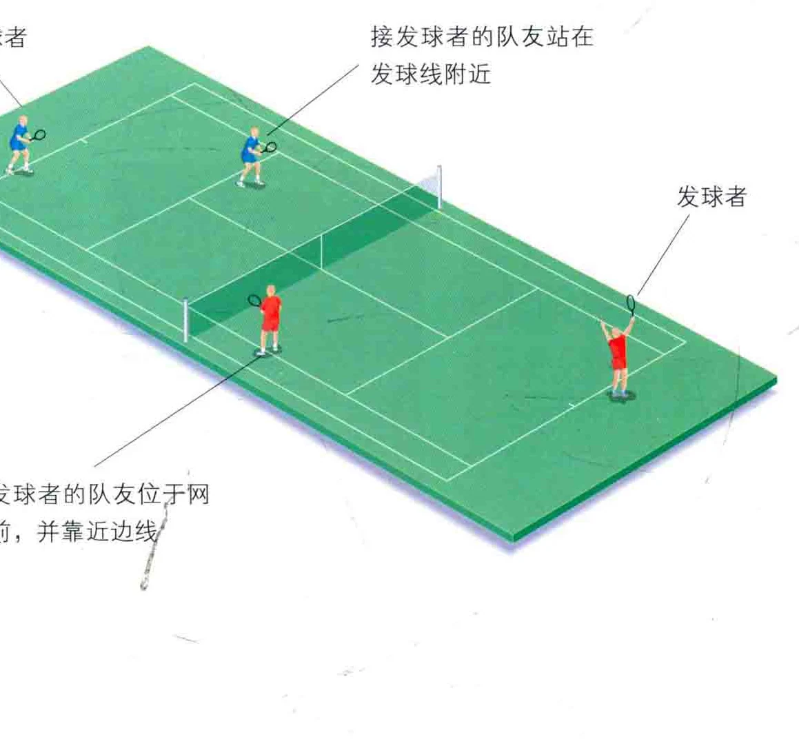
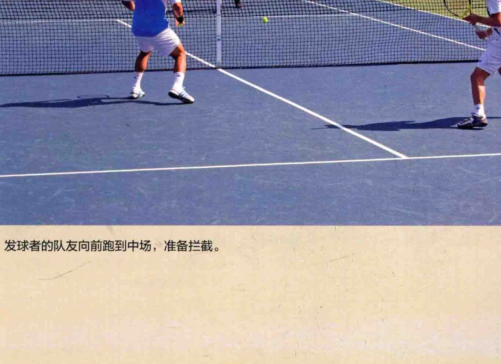
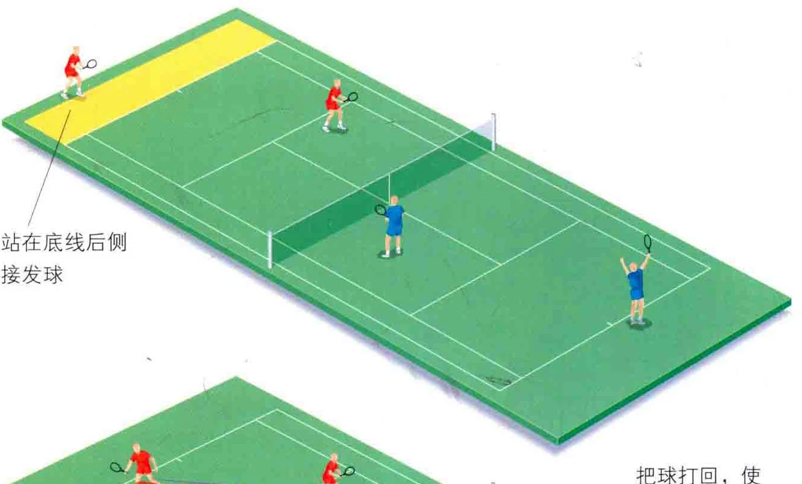
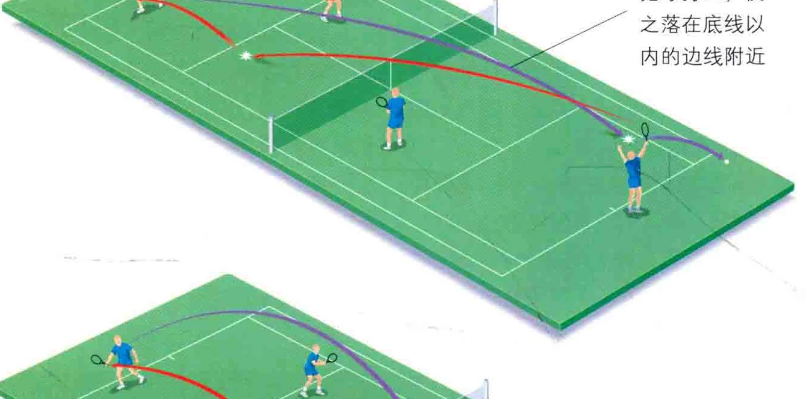
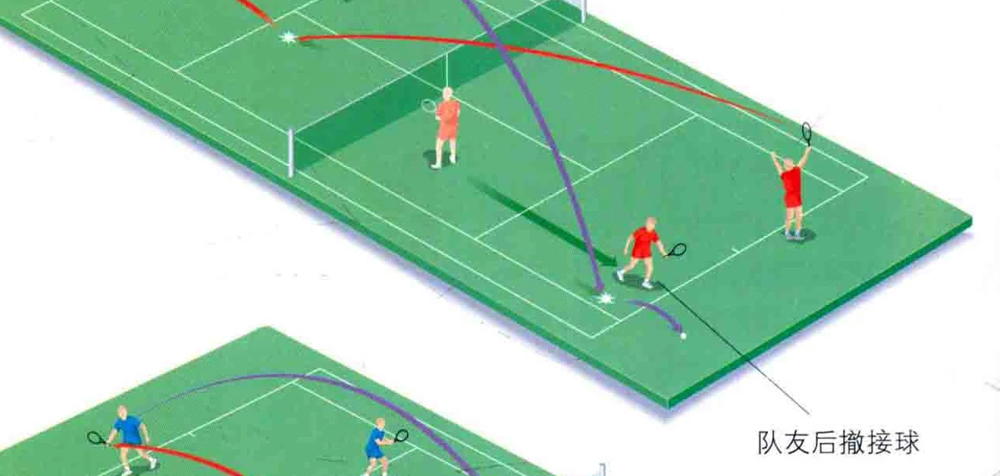
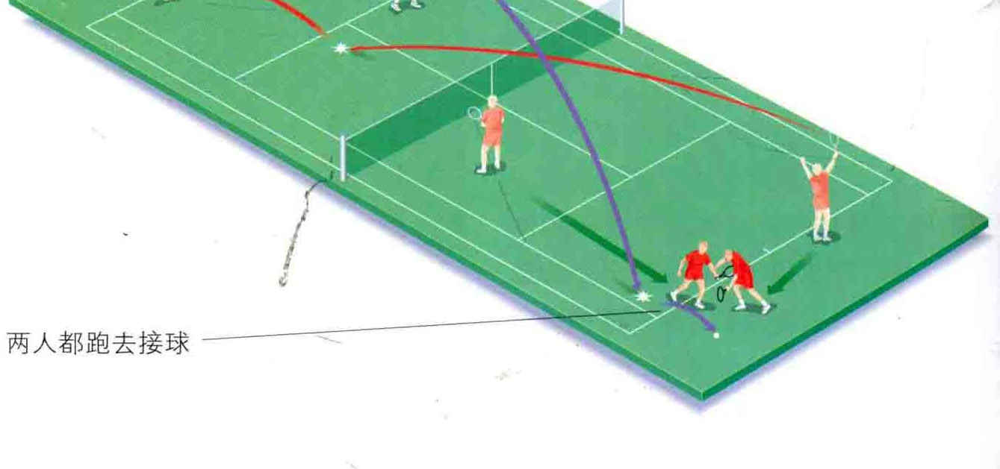
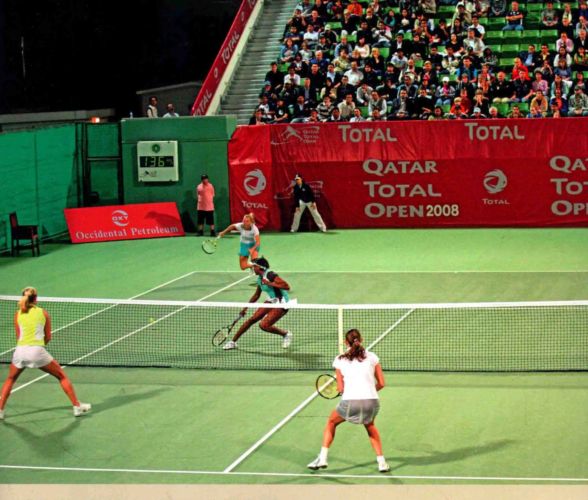
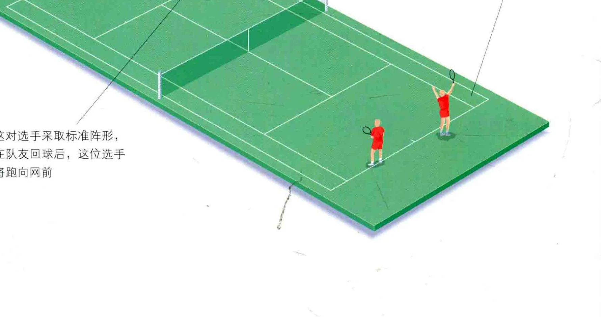
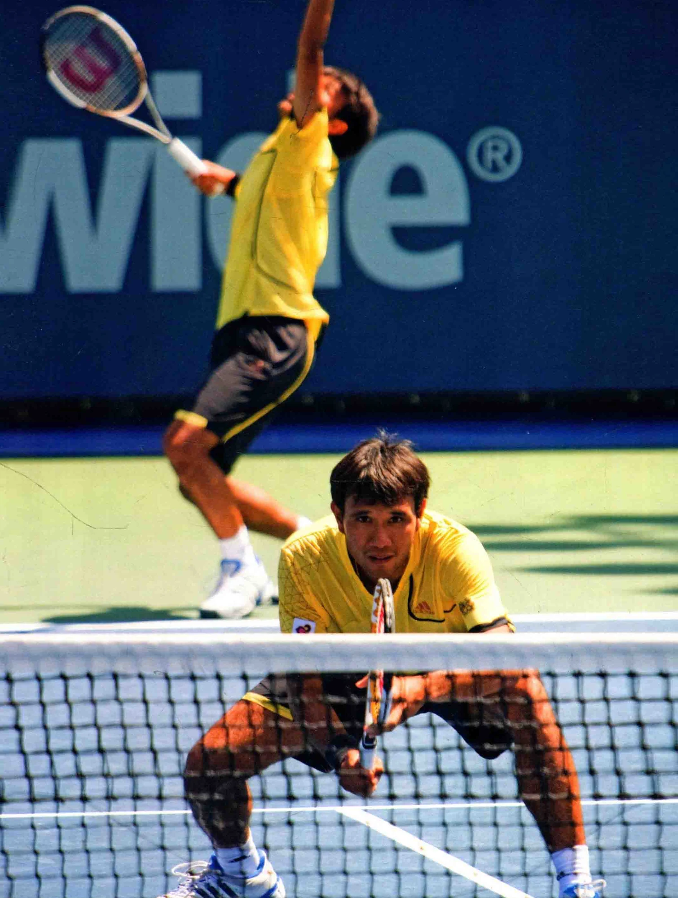

世界上最优秀的双打组合，都是心有灵犀，且对彼此的比赛风格了如指掌

的。他们知道如何在削球时让队友燃气斗志，

### 第一步: 交错阵形与战术

本质上说，双打是一种团队运动。您必须了解队友，熟知他们的强项和弱点，而尤为重要的是，在赛场上要始终与他沟通。经验丰富的双打搭档通常都在每一球之前讨论战术， 而后在队友发球时，向他示意您所和希望的这一球的落地点，以及您在发球后将跑到哪个位置去。信不信由你， 在网前的选手能背着做手势，使双方

### 双打交错阵形 ( 即一前一后 )

这是最常见的双打阵形，在网球俱乐部中尤为常见。发球者站在底线后侧做好发球准备，其队友站在半场的另一侧的发球区内，面对接发球者。接发球方的两个人也采取相似的阵形。发球方是进攻方，而接发球方是防守方。

接发球者尽量靠后站，以便接球。他的队友不像发球者的队友那样站位靠前，而是通常站在发球线上， 以防御对方的友球，和随之而来的截击。这一阵形十分适合新手，也便于在练习中使用。

也明白怎样发挥长处压制对手。

沟通。 双打比赛中，单打与双打边线之间的区域是属于界内的，因而球场会更加开壮。然而每个选手需要兼顾的范围却更小了。

双打的要诀，就是尽快杀到网前。但如果您才刚刚起步，从底线开始攻击，直到对手打出一记短球时才冲向网前会更好。

发球者的队友位于网前，并靠近边线/

### 接发球者的队友站在 _一发球线附近

### 发球战术

双打的发球技术和单打并无不同〈见第152页 )，但是由于有了队友，您的发球位置就得靠边些，通常是在中线标记与单打边线的中间。

跟单打一样，您必须在脑内过一遍这个发球的打法，以及对方的接发球的情况。您至少得策应队友，使之轻松地打出截击或扫杀，使对方无法回击。因而您的角色至关重要。

对于初学者而言，发球后最好留在后场，在底线对打。只有当对方的球程很短时，才跑到网前。一些女性职业选手也采取这一战术，因为站在底线上比较自如。

当您的发球逐渐变为一种犀利的武器，并且熟练掌握各种技巧时， 就可以采用发球上网战术 ( 见第157 页，“发球上网” )。双打的要领是控制网前，如果您做不到，您的对手就控制了网前。大体而言，双打比赛中截击型选手能击败底线型选手， 因为底线型要面对两个网前攻击者。

发球者 ( Server ) 的队友进入这一角色后，您就会伺机攻击对方接发球的弱点。 首先摆出预备站姿，站到发球区的中部，双打边线和中线的中间。 队友发球时，注意调整自己的朝向和站位，使自己与球成一条直线， 从而能够追踪球的路径，这样才能打出截击，制胜得分。 接发球者击球时，碎步跑动以调整位置，两腿向外张开以便于追赶。 即使对方打出斜线球，也要碎步调整，但不要去接球，回到一开始的位置上，让队友击回它，直到球朝着您飞来，或是逮住一次拦截 ( poach， 见本页上方 ) 的机会。

拦截、网前截球 ( Intercept )

拦截指的是网前选手跑到其队友的半场，打出截击或所杀。这种打法常见于网前选手的队友站在后场，在底线对打的情况下。

这一战术在业余爱好者当中有着许多廖见，有的人认为这是粗鲁地侵犯队友的球权，然而交错阵形的规则，就是网前选手对球有着优先取舍权，因而网前拦截的做法是绝对正确的。

抓住机会出手拦截，总比呆若林鸡的站着要好。然而如果队友把每一球都拦截了，这也令人扫兴，像这样的队友就不该呆在场上。

那么，什么时候可以拦截呢? 这并没有一定之规，但您必须自己判断，在对方准备打出下一个斜线球时，您就要毫不犹豫地决定是否拦截

发球者的队友向前跑到中场，准备拦截。

它。有个办法可以判断何时拦截，当对手艰难地接球，而其身体语言暗示他准备打出斜线球的时候，就是出手时机。

对手击球前，碎步调整站位，两腿发力跑向队友的半场。此时对手最好已经击出斜线球，这样您就可以拦截并用截击球得分。

跑动的时机是至关重要的。跑得太早的话，对手会发现，并把球打在您空出的场地上。如果跑得太晚，就很可能接不到球。

每球开打前，请与队友商量何时拦截，要像团队那样协同作战。

### 接发球者 ( Returner )

作为接发球者，就要设法弄清发球者的球风。他是一位底线型选手 (Baseline Player )，还是擅长发球上网? 第一球会以怎样的形式发出? 是否犀利? 我可以反击吗? 二发时也要注意这些问题。

尽量打出斜线球，使之远离对方的网前选手。如果您给了网前选手太多机会，他们就会使你们无法回击。 不过，时不时给他们一两球，可以测试其网前技能的水准，或是看看他是否保持警惕，您会为此震惊的。

如果发球又慢又短，不妨用和斜线球予以回击，同时跑向网前，与队友一起在网前制胜得分。也可以用高吊球，使之飞过对手的头顶。

您也可能要面对发球上网型的攻击型对手，用挡球或者上旋球的方式回球，此时对手正在跑向前，球就会落在他的脚边，这样他就得把球拉高，从而您就有机会打出高吊球,或是超身球。

### 站在底线后全接发球

### 两人都跑去接球

把球打回，使之落在底线以内的边线附近

伊莲娜.利霍夫采娃 ( Elena Likhovtseva ) 和薇拉， 杜奇维娜(Vera Dushevina，位于前场 ) 在双打中对阵大威廉姆斯 ( Venus Williams ) 和卡洛琳。沃北尼亚奇 ( Caroline Wozniacki ) 放了一记小球，威力无穷。

### 接发球者的队友

开打时站在发球线(Service “队友朝他击球时，如果对方回赠一记 ”这一分。

Line) 后方, 靠近其中点, 巡视着发球 ”和斜线球，您就可以打出完美的截击您的队友也可能打出漂亮的剑的落地点。这个位置的视野绝佳, 如果如果队友的高吊球球程太短，对 ” 线球，并跑到发球区内，, 您发现球出界了, 一定要喊 “出界。 方的网前选手就会扣杀，这时您必须 ”网球运动中，防守和反击束在一球之

朝着对方的网前选手弓起身，当。 迅速后撤，和否则就会吃亏，甚至丢掉。” 间，反之亦然。

### 其他双打阵形

接下来要介绍一些令人振奋的双打阵形，其用意在于迷惑对手。双打是一种智取的运动，站位与球感比单纯的力量更为重要，因为在双打比赛中，您要面对两个对手，因而打出让对手无法回击的球是很困难的。

这一阵形 ( 见下方图示 ) 里， 两个选手都位于后场。它通常在接发球时运用，采用此种阵形的原因，可能是对方的发球十分强劲，而接发球会被对方轻易地截击，也可能只是因为其中一个队员并不能自如地应对网前。

这对选手采取标准阵形， 在队友回球后，这位选手将跑向网前

这种阵形只适合发球方。网前选手并不站在另一个半场，而是与发球者站在同一侧。基于多种原因，这种阵形是有风险的，但是如果经验丰富的选手在开打前已经讨论过可能遇到的情况，就大可以采用这一阵形。比如，接发球者会看见对方的两人位于同侧，那么他就会瞄准对方留下的巨大空档，这却正中对方下怀。发球方正是要引诱接发球者瞄准这个空档， 而他们之中的一员就在最后一刻冲出来作网前拦截，并打出截击球。简直老奸巨猫，不是吗?

### 或“ 1 人

这一阵形里〈《如图右侧所示 )， 发球者几乎站在底线的中点上，而他的队友则在两个发球区之间的中线上扎下马步。一旦发球打出，网前选手就依计行事，跳向左边或右边，而他的搭档则跑去填补空场。

### 这对选手摆出站位靠后阵形

