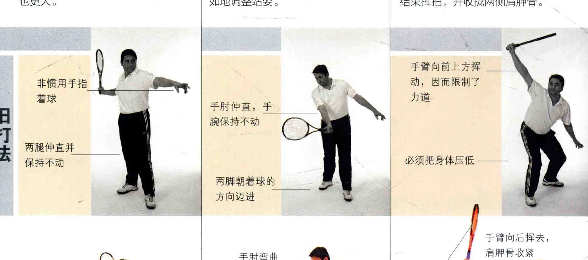
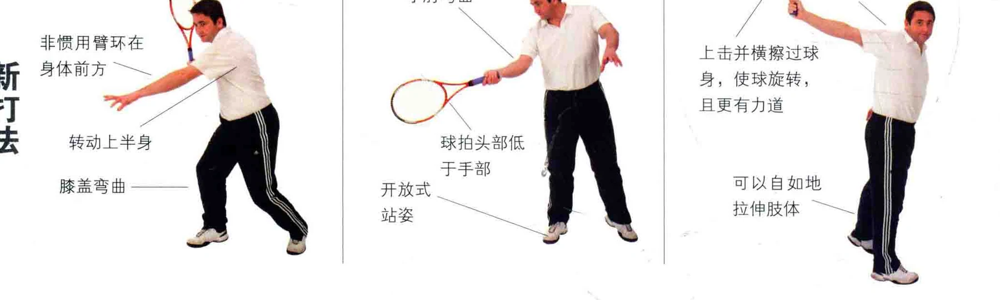
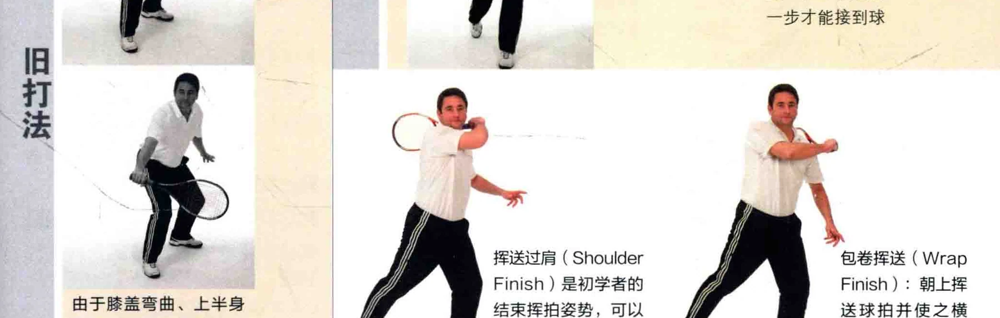
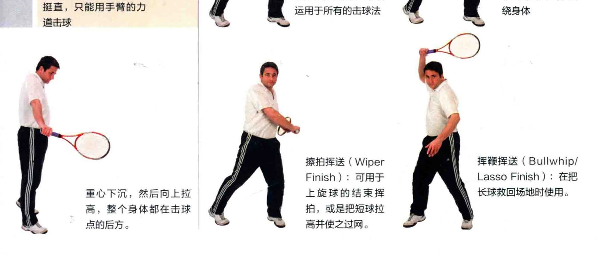

如果在几年的空白期后重归赛场，您或许会发现一些上目的套路和规矩已经面目全非，这些早年由教练灌输给你的规则已经改变或废止，总的来说，比赛变得更简洁了，现在的网球运动更注重肢体动作的自然，以及使球带上旋转。

### 击球时转体

以前的教练会说，要侧身对着球，向后拉拍并等待球《过来。而现在更注重让挥拍更自如而连贯，在球触地反弹时拉拍，击球时展开上半身，从而有利于快速反应，球的力道也更大。

### 非惯用手指 Rs 着球 |

### 两腿伸直并保持不动

### 非惯用臂环在

### 转动上半身膝盖弯曲一一一

### 临场应变

或许您以前学习的是，不管以何种方式接球或击球，都要向球跑去， 球拍头部要与手腕平齐。现在则更偏好临场应变。接球时手臂放松，像用恭子抽那样加大击球的力道，两腿自如地调整站姿。

手肘伸直，手_ 腕保持不动

### 两脚朝着球的方向迈进

于手部开放式、 站次

### 球拍头部低

### 第一步: 交错阵形与战术

如下图所示，上反手击球结束时， 旧的站姿是球拍挥向前上方，从而把球拉高，这个做法限制了击球力道。 当代的教练更可能教你向上挥拍，并使之横过身体，有效利用背部肌肉来结束挥拍，并收拢两侧肩胛骨。

手臂向前上方挥动，因而限制了力道

### 必须把身体压低一一一

手臂向后挥去， 肩胛骨收紧

上击并横榨过球身，使球旋转， 且更有力道

### 可以自如地拉伸肢体 “

### 拉升肢体

也许您被教导过，一些击球法需要弯下身，与球处在同一高度。这种姿势是很有局限的，因为运动员只能用手臂来使劲。如果利用转动身体的力道，像弹簧松开那样击球，就自然多了，也更不容易受伤。在这种击球方式下，运动员是用全身来发力的。

由于膝盖弯曲、上半身挺直，只能用手臂的力道击球

重心下沉，然后向上拉高，整个身体都在击球点的后方。

### 结束挥拍

通过慢镜回放，全世界的网球教练和选手都能够仔细分析职业选手是如何击球的。他们在球场上身手敏捷，充满活力，而先进的碳素球拍瞬间就让比变得更快速而流畅。现在的网球选手有多种结束挥拍的方式，其动作也更灵活、自然而健美。您自己在比赛时，或许会发现挥拍过肩的方式处处可用，不过掌握其他结束挥拍的方式，总是有利于您稍作变通，从而更容易制胜得分。

非惯用手在身前持拍电全部重心落在前腿上，必须踏前一步才能接到球 ee

挥送过肩 ( Shoulder 包卷挥送( Wrap Finish ) 是初学者的 Finish ) : 朝上挥

| 结束挥拍姿势，可以送球拍并使之横运用于所有的击球法绕身体

挥鞭挥送 ( Bullwhip/ Lasso Finish ) : 在把长球救回场地时使用。

掠拍挥送 ( Wiper Finish ) : 可用于上旋球的结束挥拍，或是把短球拉高并使之过网。

