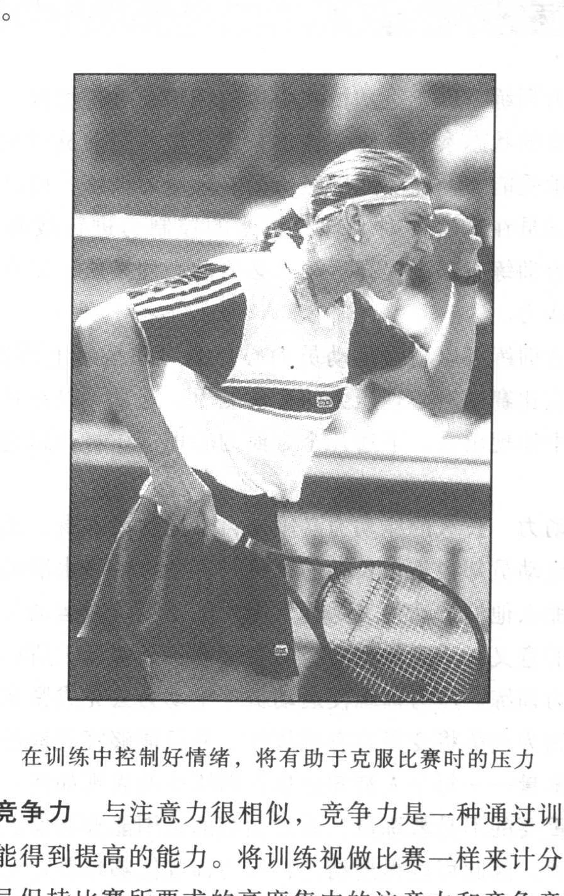
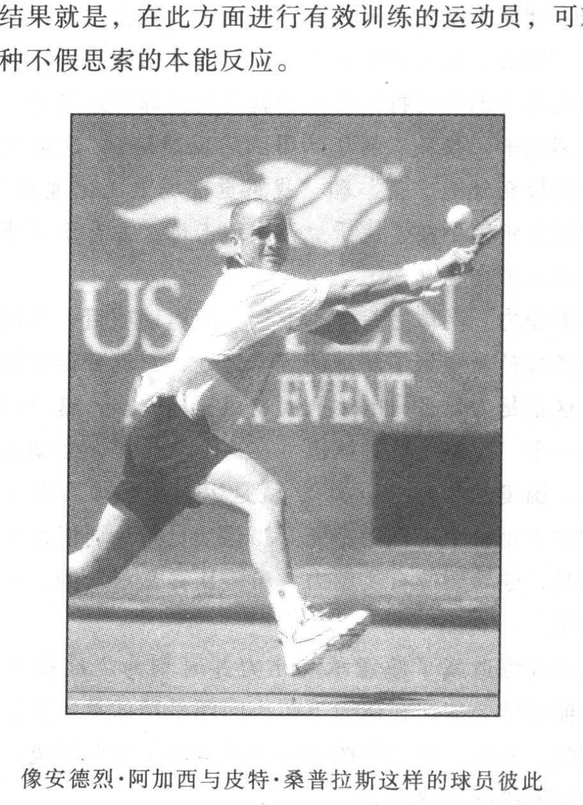

作为一名教练员，我经历过振奋人心的胜利，也体验过令人心碎的失败。我的球队曾在全国锦标赛上以5:4赢过，也曾以 4:5输过。然而，对我执教影响最大的是在1991年全国锦标赛中第三组的一场比赛。我们在四分之一决赛中以4:5败给了最后的冠军球队，运动员和教练员对彼此的表现都不满意，我们感觉到在与更强的球队对抗时，我们需要做的事情还很多。运动员想要在比赛中争取主动以控制节奏，而不是被动地跟着对手的节奏走，教练员则希望运动员养成更守纪律的训练习惯，并对自己在比赛中精神上的懈怠负责。他们的看法都是正确的。幸运的是，我已经找到了解决的方法——进行压力训练。

压力训练就是在训练中一定要模拟比赛中的压力。因为，平时训练中由教练员抛球打出的正手直线球与比赛中要争得一分时打的正手直线球截然不同。换一种情况，如果是在第三盘中打到5:4时，打正手直线显然就成为一种挑战了。

当然，如果是在决定全国冠军的团体比赛中总比分为4：4，最后一场的第三盘5:4的情况下处理这种正手直线时，我们就会理解压力意味着什么了。我们肯尼亚学院队在1991年恰恰就是被这种情况所击溃，奖金很高，但我们未能有效地克服压力而失去了冠军，因为我们没有训练如何去面对压力—对此我们毫无准备。

### 理解压力

在压力下进行比赛是对运动员的真正考验。当网球运动员一想到压力时，他们通常会认为，那是在比赛关键时刻所产生的精神和情绪上的反映—自身经验在大脑中的反映。压力在这些情况下完全是对于比赛形势和状况的主观反映。然而，研究表明，在比赛中由其他因素产生的压力要多于仅仅由心理因素产生的压力。例如，在比赛中很难攻破对手或防御对手的攻击，或者对手很少让你运用长处去攻击他，以及对手将比赛控制在他所适应的情况下等等。进行网球压力训练的目的就是对这些比赛中的压力能有所准备并有效应付。

网球运动员在比赛中存在以下4种压力：

- 心理压力；

- 战术压力；

- 技术压力；

- 身体压力。如果运动员在心理，战术、技术、身体的压力之下进行比赛，那么在训练课上就要为他们提供与比赛情况相同的练习和环境，以此为比赛做好准备。为了使训练获得最大的效果，就必须在训练中将4个核心领域（心理、战术、技术、身体）的发展尽可能地综合起来，在模拟比赛的速度和压力的情况下进行练习。

遗憾的是，通常的网球训练没有给运动员那种正式比赛的压力，实际上大部分训练是将重点放在技术上，在没有任何压力的情况下进行，身体上的压力除外。一般年轻队员都是在舒适的环境中达到对击球的“良好感觉”。一般来说，传统的网

球训练就是沉浸于追求击球（技术）的完美，在没有压力和比赛氛围的情况下进行击球练习。

长期以来，网球训练都是在这种传统的氛围中进行。作为一名大学网球教练员，我也同样如此。我所指导的训练大都围绕技术进行，只是偶尔模拟比赛的情景进行训练。我的队员通过不断的击球训练已经掌握了击球技术，而且坚持刻苦训练。然而正像我已经领悟到的那样，仅仅靠努力训练是不够的，一定要进行科学的、有目的的和有压力的训练，也就是训练要为比赛做好准备。

压力训练可以显著地提高运动员驾驭比赛压力的能力。每天的压力训练，给运动员打下坚实的驾驭压力的基础，使其脱离舒适的境域，去面对不熟悉、不适宜和不可预测的情况，从而挖掘运动员驾驭比赛压力的最大潜能，使他们更好地应付比赛及比赛中不断变化的形势与状况，简而言之，就是练习将不适应的变成适应的。总之，压力训练使运动员从网球中得到了更多的乐趣，并且使他们的心理、技术、战术及身体方面更加强大，经验更加丰富，因此，压力训练对于网球训练是必不可少的。

### 压力训练的好处

在进行压力训练的时候，每一项练习都综合了心理、战术、技术和身体的4个方面的内容，并使这些能力得到发展。只有当运动员面对类似比赛中的压力时，这4个主要方面才能得到真正的发展。由于压力训练模拟了比赛时的压力，所以每个练习都能促进运动员的进步。压力训练对运动员上述4个方面的发展都有巨大的益处，下面将其列出并阐明。

压力训练的好处

1. 心理方面

- 动力；

- 注意力；

- 竞争；

- 意志力；

- 责任感；

- 应变力；

- 自信心；

- 承受力。

2. 战术方面

- 作出决断；

- 解决问题；

- 线路变化；

- 战术组合；

- 自我训练；

- 击球的变化；

- 场上位置；

- 能力范围。

3. 技术方面

- 随机应变的能力；

- 比赛的节奏；

- 评价技术的优缺点。

4. 身体素质方面

- 高强度、高密度；

- 专项移动能力；

- 持续运动能力。

磨练意志

压力训练有助于运动员在心理与情绪上进行控制——使其对不适宜的状态泰然处之，这也是为了培养运动员对比赛压力的心理承受能力。在实践中经历的心理压力训练，可以使教练员和运动员在比赛前对心理与情绪的控制力进行战略上的部署。压力训练有助于提高运动员必要的心理素质，以发挥他们的潜在能力。

压力训练可以增强运动员的心智能力和情绪上的稳定性。运动员在比赛中对心理压力的适应能力，通常可以在日常的基础训练中体现出来。下述几个方面的心理素质将会迅速、明显地改善。

- 动力 长久的原动力必须来自于运动员本身。然而在现实中，运动员却很难在长期的训练过程中维持高水准的强度和动力。那么他们的动力又是什么呢？除非训练对运动员来说具有一定的意义，否则他们的努力程度会忽高忽低，所以，必须进行压力训练。压力训练使运动员产生动力去完成紧张激烈的比赛，因为训练将变得富有挑战性，并且能够客观地通过训练指标来衡量—每个人都知道你在训练中的表现如何。对于训练，最重要的不是教练员，而是训练的氛围能够激发出运动员的原动力。因此可以得出结论，压力训练能够培养运动员最渴求的动力——自发的动力。

- 注意力运动员在比赛中的专注能力是十分重要的。比赛时间越长，维持高度的注意力就越困难。依据网球运动员的特性，压力训练要求运动员在整个训练中要始终保持高度的注意力。在压力训练之后运动员经常说，他们感到心力衰竭。这

对于刚开始压力训练的运动员来说十分正常，但他们会发现，他们将很快提高长时间集中注意力的能力，并逐渐适应这种压力训练。

在训练中控制好情绪，将有助于克服比赛时的压力

- 竞争力 与注意力很相似，竞争力是一种通过训练中的竞争才能得到提高的能力。将训练视做比赛一样来计分，以便使运动员保持比赛所要求的高度集中的注意力和竞争意识。这不是为了培养比赛狂。无论运动员是否具有与生具来的竞争意识，只要处于比赛之中，他们会很自然地进入或准备进入竞争状态。发展这种基本的心理素质是必不可少的，它可以使注意力与竞争力更有效地运用在长时间的艰苦比赛中。

什么是竞争

竞争的概念经常会被误解，尤其是我们的文化对成功和胜利的曲解。竞争这个词来自拉丁文，指的是共同探索，如果你竭尽全力，那么我就必须尽我所能去迎接你的挑战。竞争的气氛促进了运动及个人的发展，并为成长提供了良机。对竞争的正确理解是，它是一种帮助人发挥自身最大潜能的、健康的、行之有效的手段。无一例外，每一位伟大的运动员都有强劲的队友和对手与其“共同探索”，从而使其发挥得最好。就最近而言，在职业棒球比赛中马克•格威尔与塞米•索萨的本垒打竞赛，就是一个在相互尊重基础上各自追求卓越的例子。在网球史上也有很多这种良性竞争的范例，如博格与迈克安路奈罗、罗斯威尔与拉弗、埃夫特与纳夫拉蒂诺娃、埃德博格与贝克尔、格拉夫与塞莱斯，以及桑普拉斯与阿加西等等。那些能够理解竞争会成就彼此的运动员与运动队，都拥有一个绝顶的优势，即能够最大程度地发展他们的能力。

- 意志力一场比赛自始至终都在检验运动员的意志。通常考验运动员的意志力有两种情形，第一种是如何应付在整场比赛中不断出现的诱惑。例如，想要将球击到对方的空当，或者在比赛中总是按自己的意愿行动，而没有根据场上形势随时应变。第二种是当运动员感到不适应对手时仍被动地继续进行比赛。那么当对手抑制了你的特长发挥，或用他的特长攻击你时，你应该怎样对付呢？在你已陷入不利境地或已经输掉了第一盘时，又应该怎么办呢？你是来取抗争还是逃避呢？

运动员意志力的本质，就是在竞争激烈的比赛中进行选择和决断的能力，并且必须在训练中加以提高，以便正确处理比赛中出现的诱惑和困境。总之，压力训练就是训练运动员对不

适应的状况泰然处之。你的队员愿意做到这一点吗？

- 责任感 当训练的成果被客观地评价时，责任感才会存在。压力训练提供了一种衡量训练成果的指标，可施之于每天、每周，直至一个赛季，甚至于整个职业生涯中。当练习变为比赛时，运动员就会知道每一次击球和每得一分都十分宝贵，并且他们应对自己的表现承担责任。运动员因此会发现自己的承受能力更强了。除了鼓励承担责任，记录训练结果也会提高他们的注意力、竞争力和意志力。

- 应变力 运动员在场上的语言展露了他们的内心活动。例如，运动员在比赛中说“我的正手不行了，发球也不灵了”，似乎正手与发球各自独立而不相干。对比赛负责任的运动员会说“我正手打得不好了，我发球出界了”的话。他们通过说“我”来实现自我控制，把不利的主因归为自己而不是击球动作。这里的应变力是指运动员处理好与坏两种境况下的能力。当比赛形势不利时，运动员该怎样应对呢？压力训练能够反映比赛中出现的而且运动员必须面对的境况和形势，使其通过自已的态度与努力作出应对措施，如同维克特尔•弗兰克在《探求人类意义》中指出的，人类在刺激与反应之间有作出抉择的自由。运动员不应被环境或动作所左右，他们可以自由地塑造结果和选择态度，通过选择决定如何去行动。

压力训练能够为运动员创造出那种必须解决并作出决断的情景。运动员在训练与比赛时所采取的态度应一致，如果他在比赛陷入困境时选择放弃，那么在压力训练中你会看到同样的情况。只要运动员在压力训练中尽其所能地控制住他们的态度及行为，他们就会有所长进。此外，压力下的训练与训练指标的客观性，有助于提高应变力，并抑制运动员的狡办和自责，而且这种训练体系还鼓励运动员去寻求帮助，取得更大的进步。总之，运动员有自由作出适当的选择和回应。

- 自信心 我最赞赏的自信的定义是前佛罗里达大学主教练，现肯尼亚学院助理教练帕尔勒莫所作的。帕尔勒莫经常说：“自信就是有信心将球击在场地内。”如果队员失去了信心，他们首先要做的是将注意力集中在将球回到对方的场地内。如果球能不断地击回到对手的场内，你会发现运动员很快就恢复了信心。压力训练正是一种有力地增强自信心的训练方法，因为压力训练的特性强调的就是要将球打进场内。在半年的压力训练中，我从衣阿华队得到的反馈是，“这是我在赛前所做过的最充分的准备”和“我感觉在场上无比地自信”。他们认为建立自信不在于成千上万次地击球，而在于将成千上万的球成功地击在场内。

- 承受力网球是一个难度很大的运动项目，不过一旦运动员和教练员领悟到了网球的难点之处，它就变得既简单又有乐趣，这就是为什么我的球队要有目标的原因，这个目标就是要成为一个“竞争者”的队伍。在这个队伍里，运动员愿意承受困境，困境意味着“压抑”，就是运动员必须面对压力，尽管这通常不是一个准确的定义。当运动员与一名值得尊敬的对手比赛时，他希望能有所压力，希望比赛是艰苦的，并希望能承受困境。

压力训练造就了愿意承受压力并时刻为之准备着的运动员，使他们学会如何在压力下解决问题是网球及所有运动的本质和精髓。所以，压力训练就是要让运动员面对困境，从而提高他们对困境的应变能力。

提高战术

压力训练围绕战术决断的三个主要方面，设计清晰简明的战术结构，它包括什么时候改变击球方向、运用何种击球方

式，以及在场上如何站位。

- 作出决断 压力训练包含了大量的不可预见的情形，并不断地要求运动员运用判断能力。经过足够时间的压力训练，可以使运动员的决断能力发展成为一种反射性的、本能的反应，其结果就是，在此方面进行有效训练的运动员，可对境况作出一种不假思索的本能反应。

像安德烈•阿加西与皮特•桑普拉斯这样的球员彼此

在比赛中都能带动对方发挥出最高水平

- 解决问题 用比赛锻炼解决问题的能力十分简单有效。问题在整场比赛中大量而频繁地出现，特别是当运动员对对手、比赛条件、不利局势作出回应时，他们就面临着更为频繁的、连续的考验与挑战。比赛是一种最有效的压力训练方式，

因为比赛中会不断出现各种问题有待运动员去解决。

- 线路变化 压力训练采用击球线路作为战术的基础（击球线路将在第三章提及）。在战术体系中，击球线路占有相当大的比重，这部分战术体系使击球线路的选择科学化。

- 战术组合 运动员十分需要合理地、有规律地进行训练和比赛。战术组合在面对压力的情况下十分重要，我的两名运动员能够取得全国冠军的一个直接原因，就是他们有合理运用战术组合的能力，而对手在这方面却不如我们。

- 自我训练 为了确保运动员能从所犯的错误中有所醒悟，他们首先必须了解所犯错误的症结所在，也就是说，运动员必须在比赛中有一个稳定的战术基础。接受压力训练的运动员很了解良好的战术由什么组成。如果运动员能准确地作出三个主要的战术决定（什么时候改变击球线路、运用何种击球方式、场上如何站位），他们在击球和作出改变击球方向时就能迅速意识到自己决策中的错误。如此，运动员可以通过必要的战术调整和避免错误的反复发生来进行自我训练。

- 击球的变化 棒球比赛中，投手要投出变化多端的球使击球手无法击球，同样，网球运动员必须能够将球的旋转、节奏、落点及深度充分地综合运用。压力训练提供了在随机的活球情况下击出旋转球和反击旋转球的机会。运动员学会击出旋转变化的球就可以使对手难以判断，同时还能将球击到对手不擅长的击球位置。

- 场上位置 运动员的站位很重要的，积极占据合理位置的运动员就能控制比赛，就能打出各种战术组合并提高整场比赛的控制能力。压力训练均是以场上位置作为实施战术的基础的。

运动员必须明确自己在场上的位置，然而同样重要的是要明了对手在场上的位置。哪里是对手喜欢的击球位置？哪里是

对手擅长的击球位置？要让对手陷入不适和被动的境地，打乱他们的节奏和击球方式，最终使他们产生失误，从而陷入困境。

- 尽力而为的比赛

（比赛控制在你的能力范围内）每名运动员都有其能力范围。运动员的能力范围有高限，也有低限，运动员必须清楚，而且要知道什么时候比赛会超出自己的能力范围。我知道在压力下运动员通常会有超出他们自身能力范围的行为。如果运动员不能充分发挥其能力，通常是由于过于谨慎和担心失误所造成的。而急于摆脱压力时，运动员通常会采取大力发球和过于冒险的击球等方式，这时运动员就处于超出其能力范围的状态了。

在平时的训练中，由于失误不会带来什么后果，因此运动员经常会在训练中超出自己的能力范围。他们可能把握得很好，也有可能完全超出自己的能力范围，因为压力训练的成果是可测量的，所以运动员必须在自己的能力范围内进行训练。从事压力训练的球队在比赛时也会像他们在训练中一样—一在自己的能力范围内进行。

改良技术

对运动员技术的真正检验，在于比赛中面对压力时能否采取特殊有效的击球。压力训练可提供以下几个锻炼机会。

- 比赛中的随机应变 运动训练学认为，不可预测的练习叫随机练习，它能反映出比赛的随机性模式。处理不可预测的事件叫随机应变。促使训练习惯向比赛习惯转移的最好训练方法是什么呢？训练学专家认为应该是随机性练习，尽管运动员在随机训练中不会感到应付自如，但他们应对突发事件的能力在比赛中会自然而然地增长。

- 比赛的节奏 除非运动员练习新的或特的击球动作，否则采用教练员或机器“喂”球的方式，在不变的情况下练习对运动员的技术起不到锻炼的作用。一旦运动员已掌握了基本技术，要使训练有所成效，就要反复地在比赛节奏和压力下进行训练。在随机及不可预测的情况下训练击球，有利于运动员在比赛压力下维持较全面的技术。

- 揭示技术的优劣 如果你想了解运动员技术的优缺点，就要看他们在比赛中的表现，因为压力训练是模拟正式比赛进行的。通过压力训练，队员技术的优缺点会像在比赛中一样清楚地暴露出来，运动员通过训练结果能够了解他们自身的技术。压力训练绝对不会给运动员一种技术完美的错觉，运动员在压力训练中的表现将与他们在比赛中的表现一样。

发挥训练的最佳功效

适当的模拟实战训练的目的，是为了让运动员适应比赛时的身体负荷和实战要求。压力训练能发展无氧能力与有氧基础，并促进力量的增长。压力训练的要求如下：

- 充沛的体能 压力训练是大运动量、高强度的训练，要求队员以近似实战的拼劲来完成训练，这种模拟比赛强度的训练是对体能的考验，它对实战很有帮助。

- 专项移动能力 由于压力训练是在随机的环境下进行，因此运动员的移动和步法实际上与比赛状况一样。通过这样的训练，队员在比赛中的移动能力将会得到提高。

- 运动的持续性 在压力训练中除了偶尔有90秒钟的饮水时间，或临时的比赛解说时间外，几乎没有休息时间，训练一直保持在高强度中进行。如果训练成为一种乐趣就会感觉时间飞快，我就经常听到运动员说压力训练下时间似乎过得很

快。

网球是一项有压力的运动项目，运动员克服各种各样的压力之后才能真正掌握它。如果训练中没有压力，运动员就不可能体会到网球运动的实质，也不可能得到成长与发展。网球压力训练可以让你了解运动员如何在压力下作出选择、承担责任、随机应变。压力训练通过每天对困难、危机的挑战及对自信心和勇气的鼓励，使运动员的比赛能力得到了真正的提高和发展。更重要的是，运动员将有机会充分挖掘自己的最大潜能并体会到真正的快乐网球，还有什么比这些更让运动员渴望实现的呢？

网球的伟大就在于它对运动员的考验与挑战，也让他们学会如何去做一名网球运动员及如何做人。

压力训练最终是为比赛做准备。你找不到比它更全面、更实用、更高效的训练方法，来综合提高运动员所必备的4种能力，压力训练赋予了运动员在比赛中的信心和保证，使他们面对挑战时胸有成竹。
