压力训练的战术核心，就是击球线路。1992年，我首次对凯尼恩学院的二号选手凯瑟琳•莱恩进行击球线路方面的指导。凯瑟琳获得过全美单、双打冠军，是一位实力型的选手，有最杰出的底线技术。她虽然脚步移动不快，但能用杀伤力很大的正手控制比赛局面，以弥补在场上移动能力稍差的弱点。凯瑟琳的位置感极佳，常常站在底线以内击球并随时准备上网，但击球过猛、过急的弱点，使其在进攻时的非受迫性失误增多，大多数失误都是出边线或下网。在战术上凯瑟琳需要加强以下方面：

- 高成功率击球；．

- 攻击的杀伤力；

- 场上的预测能力；

- 身体动作——运用自然转髋和转肩的力量击球。凯瑟琳是否每一拍球都要改变击球路线呢？这一问题的核心就是要让其明白，“我是要变线还是按原路线回击球”。查克•克里斯在他的《网球训练》一书中指出：“不改变球的线路就能做到尽可能少地出现失误，并确保球拍触球的角度正确。”当然任何击球方式都要符合生物力学原理，也就是说在击球中要能自然合理地运用转髋、转肩。如果改变击球线路时能很合理地运用身体力量，并符合生物力学原理，即便是拍子接触球的角度有变化，也能顺利地完成回球。

### 网球战术的三大要素

在1998年的一场团体比赛中，衣阿华大学的卡罗莱娜•德尔加多在决胜盘的前三局以0:3落后于密歇根大学的六号选手。对手稳扎稳打，而卡罗莱娜却失误频频，看来她快要输掉这场比赛了，这是团体赛关键的一场球，卡罗莱娜感觉到了巨大的压力。为了扭转这种情况，我鼓励她在接下来的比赛中将注意力放在击球线路上，并尽量站在底线能积极进攻的位置，用反手平击代替反手挑高球。听从建议后，卡罗菜娜便连赢了5局，并最终以7:5获得这盘比赛也是整场比赛的胜利。她的获胜使衣阿华队以总分4:3取得了最终胜利。

卡罗莱娜在第三盘中反败为胜的真正原因是什么呢？答案很简单，卡罗莱娜运用了她在日常训练中的战术模式。卡罗菜娜在第三盘前3局的失败是因为她将精力过多集中在对手的优势上而不是自己的优势上。我的任务就是要在队员面临困境时，提醒他们将比赛看做是平时训练中的某一项练习——击球线路的控制、保持合理的站位（底线内外）和选择适当的击球方式。

通过线路、站位、击球方式这三大要素，建立一个网球战术的基本体系：

1．什么时候改变击球线路；

2. 站在场上什么位置；

3. 运用什么样的击球方式。运动员的技术打法并不重要—无论是底线型、积极底线型、发球上网型或是综合全面型，都会受到战术的这三大要素对比赛的影响。另外，这也是构成运动员比赛战术的基本要素。

### 内侧底线和外侧底线

击球线路的精髓在于它并不是简单意义上的正手和反手，正手包括内侧正手和外侧正手，反手包括内侧反手和外侧反手。

- 外侧底线击球例如，在两人斜线对打中出现的开放式击球，之所以叫开放式击球是因为球落在击球者体前外侧。

图1和图2显示运动员在进行正反手斜线对打。图1为正手外侧底线击球，图2为反手外侧底线击球。

图1 外侧正手

图2 外侧反手

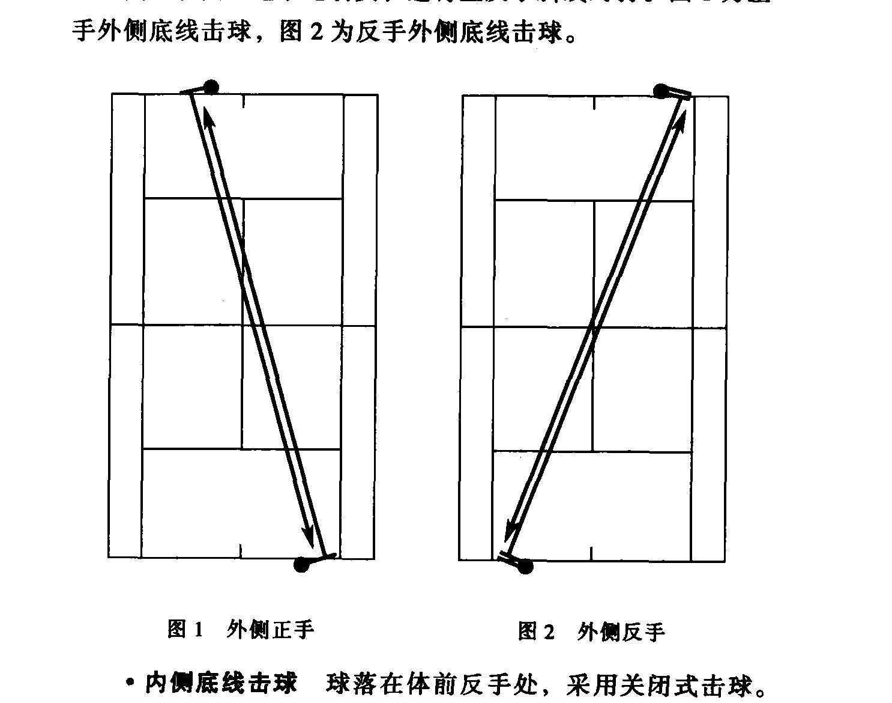

- 内侧底线击球 球落在体前反手处，采用关闭式击球。照片显示的是内侧正手底线击球。图3为运动员P1 和P2 在外侧底线反手对拉斜线。图4为运动员 P2 的回球迫使P1 用正手

外侧正拍

P1

P2

P2

图3 运动员 P1和P2在底线外侧反手对拉斜线

图4 运动员P1用内侧

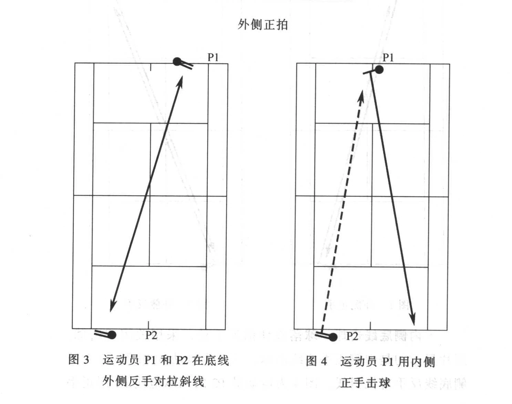

正手击球

回球，此时运动员 P1 的正手就要用内侧正手击球方式，因为球飞向身体内侧正手而不是飞向身体外侧反手。下面是内侧反手击球。运动员 P1 和P2进行斜线外侧正手对打（图5），直到P2击出的正手球造成P1需用反手击球的动作回球，图6中P1运用的就是内侧反手击球，因为球飞向P1 身体的内侧反手而不是斜线飞向身体的外侧正手。

内侧反手决定采用内侧底线，还是

P1P1

P2P2

图5 运动员P1和P2进行斜线外侧正手对打

图6 运动员P1用内侧

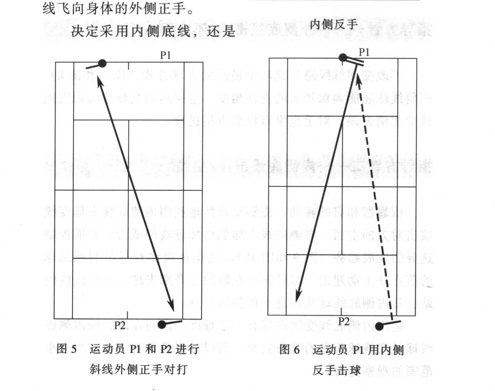

反手击球

外侧底线动作回球的标准，是球与运动员之间的位置关系。如果底线击球时球在身体的斜前方，则用外侧底线击球动作。如果球不在身体的斜前方，而是飞向身体内侧，则用内侧底线击球动作。

只有理解内侧底线和外侧底线击球之间的区别，才能对击球线路的选择有正确的把握。如果运动员未能清晰地理解两者的区别，建议再看一下前面的解释部分，直到真正地理解。

记住——清晰的理解十分重要。现在的运动员分为两种类型，一种是均衡型（正、反手实力非常均衡），另一种是力量型，通常是正手优于反手。下面的三个战术指导方针是针对第一种的，然后再介绍后者。

指导方针———外侧底线击球/不变线

不改变回球线路是成功率最高的击球方式（图7和图8）。回斜线球还能确保较大的击球角度，这样运动员将最大限度地减少无谓失误，对手也没有机会直接进攻。

指导方针二——内侧底线击球/变线

依靠髋和肩的转动，能够很自然地利用内侧底线击球变线攻击对方的空当。内侧底线击球能增加进攻的威力，并能控制这分的发展趋势（图9和图10）。运动员应注意尽早判断来球的落点并主动迎击，尽可能地在球的上升期击球。在底线内的站位是内侧底线球获得进攻优势的要点。

运用内侧底线变线击球有一定难度，因为在准备回内侧底线球时变线球落点的视角较窄，所以就要具备对场地空当大小范围的观察能力。

P2

图7 外侧正拍不改变线路

图8 外侧反拍不改变线路

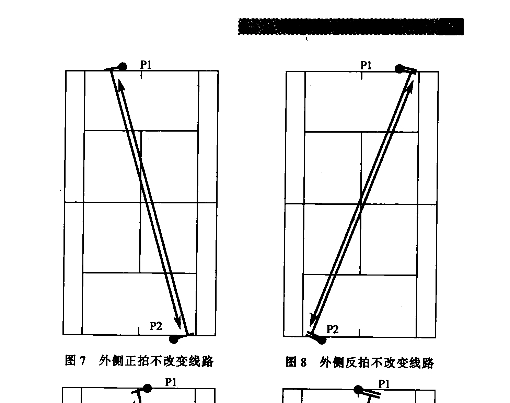

P1

图9运动员 P1采用内侧正手击球改变线路

图10运动员 P1采用肉剑反手击球改变线路

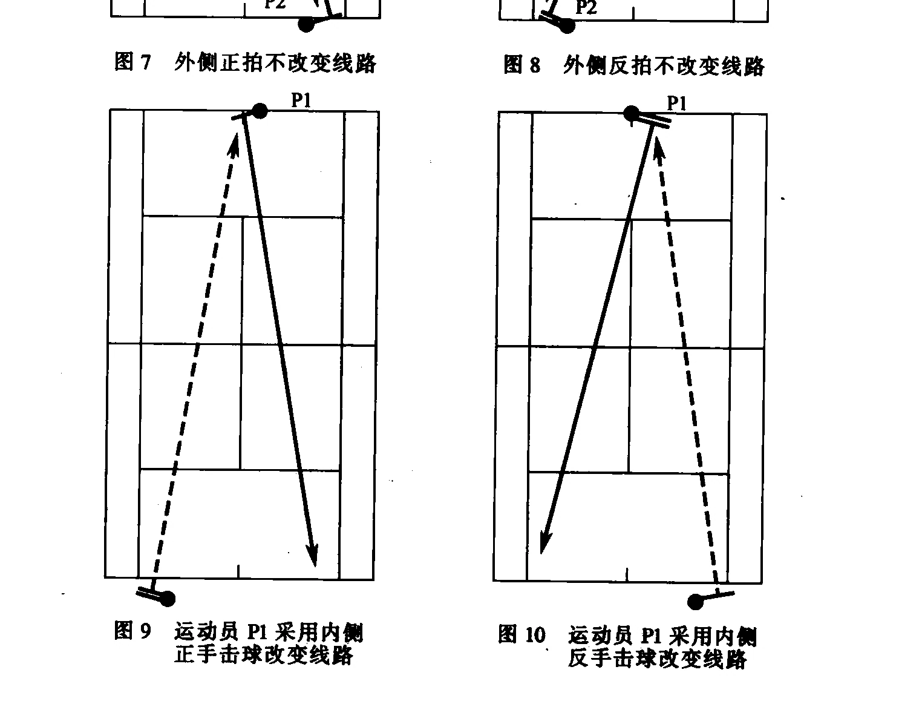

指导方针三——外侧底线击球90°变线

显然在击很深的外侧底线球时，按来球线路击回（不变线）是一种合理的击球方式。然而当对手出现斜线浅球时，运动员就需要采用变线的方式争取得分。

在运用外侧底线击球变线时，将球回向垂直于（90°）对手的底线处（图11和图12）。如果在边线内3英尺处击球（1英尺=0.3048米，下同），那么球应落在对方场内距这条边线同样3英尺的地方，这就是所谓的90°变线。

### 90°变线

通常，运动员利用外侧底线击球变线时，总是想“将球打在边线上”。因为他们想的是“线”，所以参照物自然是边线，这必然导致一些无谓的失误。如果将参照物由“线”转变为“90°”，运动员就能减少无谓失误，也不会冒很大风险去进攻。此外，运动员可以用球的深度使球更具穿透力和杀伤力。

P1

P1

图11 运动员 P1正手90°变线

图12 运动员 P1反手90°变线

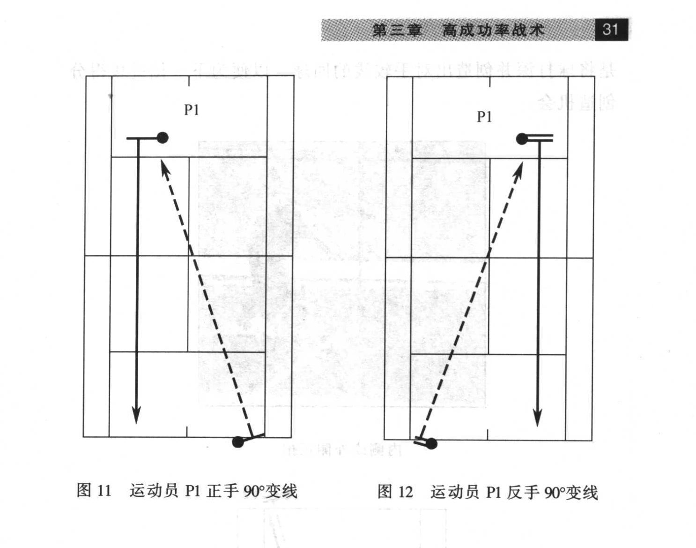

关于有效的底线技术指导方针

绝大多数顶级运动员在比赛中都有其共同之处，他们通常利用杰出的正手击球来建立优势和控制比分，并经常利用突出的正手换到反手位作为杀手铜进行底线强攻，高水平选手会频繁利用内侧底线正手做到这一点。下面两种类型的底线内侧正手就是他们惯用的。

内侧正手一：对角侧身正手不变线

要想在比赛中运用杀手锏，就必须做到侧身正手击球。这种内侧正手是一种不变线的正手击球（图13），它的击球要点

是将球打深并创造出对手较浅的回球，以便为下一拍进攻得分创造机会。

### 内侧或外侧正拍

P2

P1

图13 运动员 P1的内侧正手不变线击球

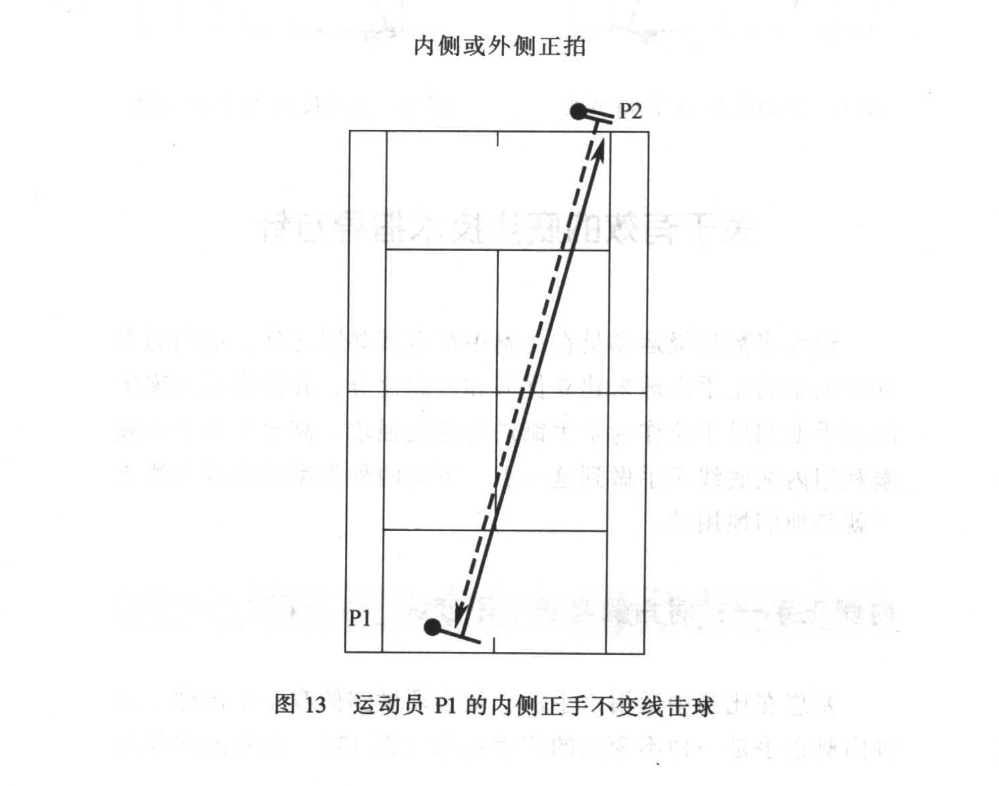

内侧正手二：内侧正手90°变线

运动员在场地左区使用的正手杀手锏，通常是采用90°变线的侧身正手击球。这种球要注重深度和穿透性而不是角度。当对手的回球较深并落在本方球场中间偏反手的区域时，运用这项技术。记住，一定要前移到场地以内进行90°变线进攻，这点非常关键，它能确保进攻的威力（图14）。

P2

图14 运动员 P1 的内侧正手90°变线击球

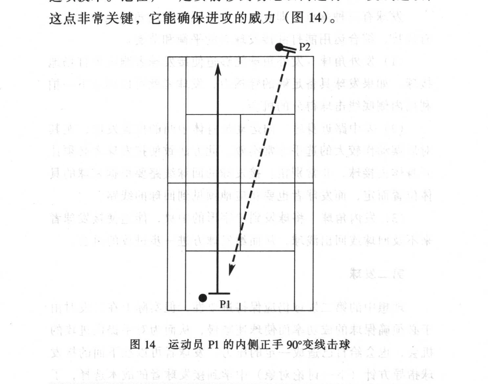

发球和接发球

发球者和接发球者的目的都是想给对手制造压力，使对手的回球较弱，从而建立自己的优势，有利于得分。在一发

时，发球者发出具有攻击性的球，而接发球者的目标只是尽量将球回过去。如果对手一发失误，那么接发球者就可以通过对方较弱的二发给对手施加压力。对发球与接发球线路的准确判断，可以给对手施加很大的压力。每一球的开始是很重要的。

第一发球

发球有三种落点，即外角、中路近身和内角。三种落点各有优势，综合运用能打乱接发球者的平衡和节奏。

（1）发外角球 发外角球能够迫使接发球者跑出单打场地接球。如果发球具备足够的穿透力，发球者就可以创造下一拍利用内侧底线击球得分的机会。

（2） 发中路近身球 向运动员身体中间的位置发球，尤其对后摆动作较大的选手非常奏效。此方法致使接发球者必须让开身体去接球，非常别扭。接发球的回球线路要根据来球的具体位置而定，而发球者也要相应地预见到回球的线路。

（3）发内角球 将球发到T字形的中央，能迫使接发球者来不及回球或回出浅球，从而给发球方进一步进攻的机会。

第二发球

理想中的第二发球仍应保持进攻性，但实际上在二发时由于必须确保球的成功率而使球速减慢，从而为对手提供进攻的机会，也会给自己造成一定的压力。发球者可以在下面的接发球指导方针（下一讨论对象）中学到接发球者的战术选择，了解接发球者的最佳选择后就会有利于提高场地控制范围及预测能力。

接发球指导方针

第一分都是从发球、接发球开始。每一分的第一回合，比后面的回合更能影响这一分的结果，但人们时常忽略发球和接发球的重要性。在职业网球比赛中，发球者具有明显的进攻优势，这就可以理解为什么在技术分析中强调接发球得分，即接发球的有效性。运用线路的变化进行接发球将给对手制造一定的难度，同时也是一种高成功率的接发球方式。这就是运动员取得比赛优势的最佳手段。

接第一发球

当皮特•桑普拉斯以120英里/小时（1英里=1.6093公

### 发球和接发球者

里）的速度发球，且发球节奏和落点变化莫测时，要想破掉他的发球局有多难。作为顶尖职业选手，第一发球往往就是运动员直接进攻得分的手段。

因为第一发球往往具备很强的攻击力，所以此时接发球者所要做的任务就是化解它的优势，也就是先将球尽可能地接过去。

右区的接发球

除靠近身体内侧的来球，对所有的第一发球应尽量不变线、（图15和图16），这样就可以减少许多高难度接发球所造成的失误。内侧接发球（球发向近身反手位）时最好采用90°变线（图17）。

接发球

接发球

图15 接中路来球时的不变线回球

图16 按原路线回外角球

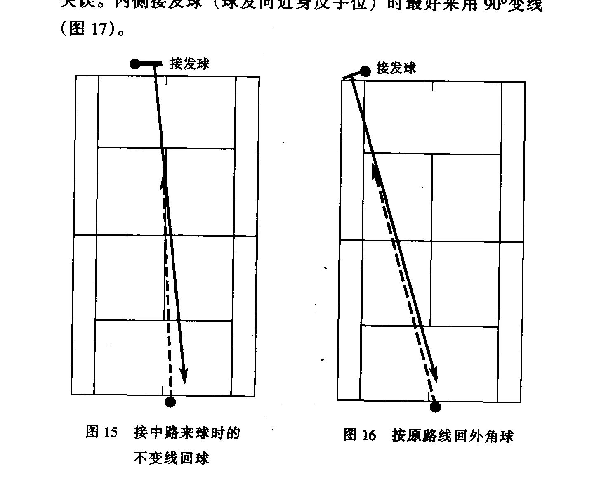

—接发球

图17 内侧底线反手回90°变线球

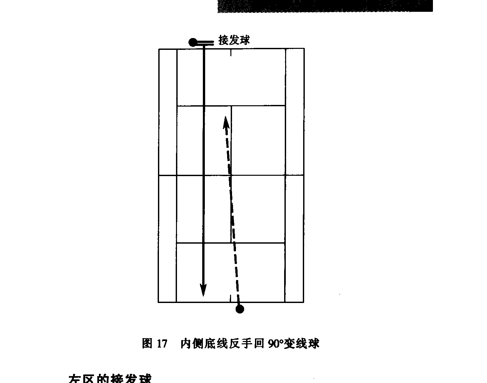

左区的接发球

除了靠近身体内侧的来球外，对所有的第一发球应尽量不变线（图18和图19）。由于不变线，可以减少许多高难度接发球时所造成的失误。内侧接发球（球发向近身正手位）时，最好采用90°变线，而对正手大力接球者既可打90变线，也可打出正手外角斜线球（图20和图21）。

接第二发球

接第二发球时，接发球者的任务就是利用对手发球速度较慢的机会展开进攻，利用场上位置的变化、击球的节奏及穿透力向对手施加压力。打快球、长球时，接发球者往往将网带中心物作为进攻的参照物，而不是两侧的边网，这样就能在进攻

接发球

接发球

图18 接中路来球时不变线

图19 接外角发球时不变线

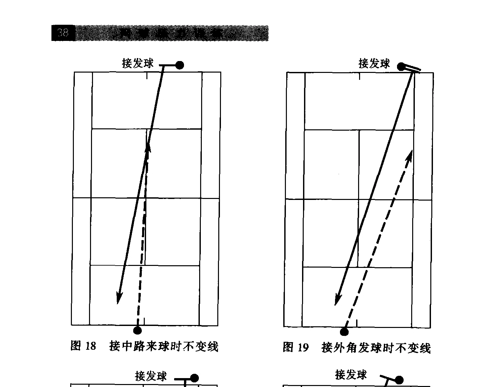

接发球接发球

T

图20内侧底线正手 90°变线球

图21内侧底线侧身正手按来球路线回球

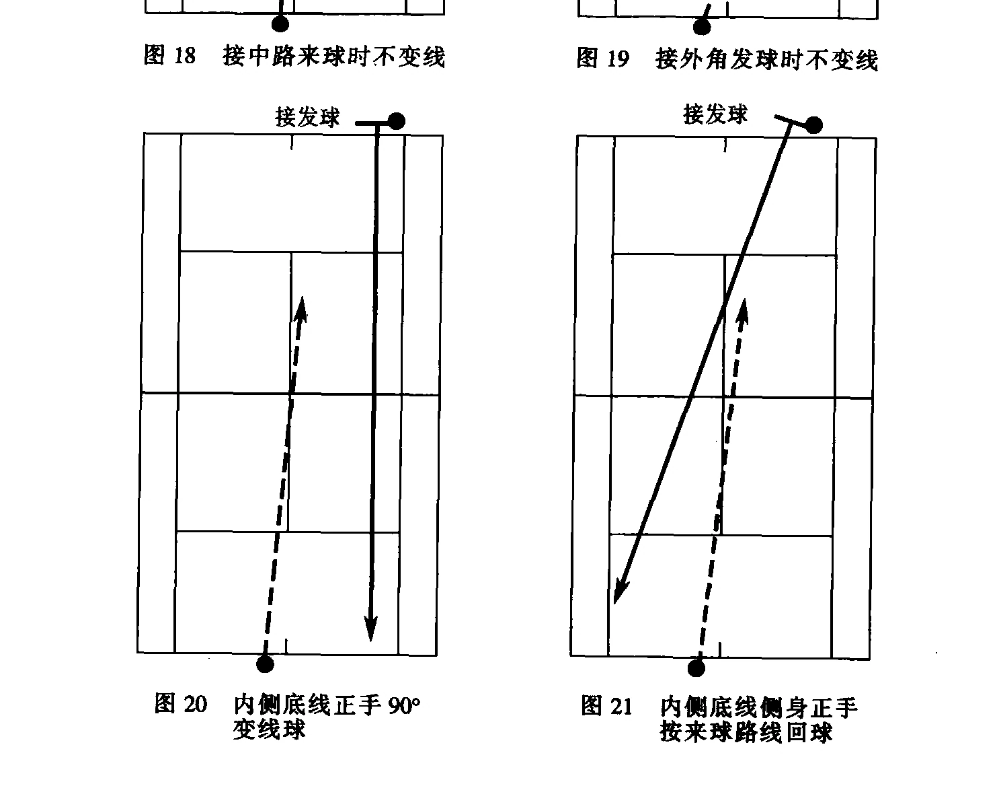

的同时减少无谓失误。

高水平运动员能直接用正手对二发取得绝对的主动。他们接右区发球时的站位靠近底线的中央，在左区接发球站位时，左脚几乎踩在单打边线上。采用侧身正手接发球最具威胁。对手的第二发球是为接发球者创造施加压力并直接得分的一个好机会。

另一种针对二发的有效进攻方式是利用削球接发球上网。通常可能出现两种有趣的固定形式，一是接外角球，向对手中路削直线球（使发球者的下一拍采用内侧底线击球动作），并上网对斜线的穿越球进行封网（图22），向对手的边线击斜线球（图23）。二是接内角球，削边线直线球并上网封住直线穿越球。

P2P2

图22 削外角球于对方中路并上网对斜线穿越球进行封网

图23 削内角球于边线并上网对直线穿越球进行封网以区

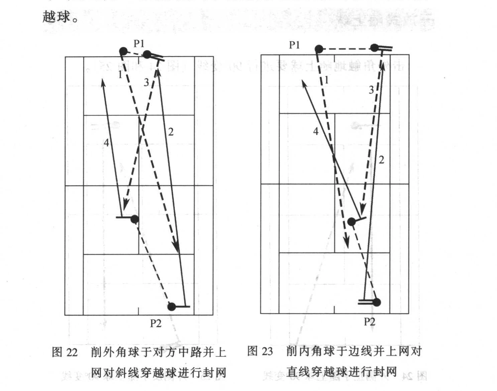

### 随上球的指导方针

随上球可为网前截击创造得分机会，它应被理解为随上和拦网的整体结合技术的一部分，而不是单个技术。打随上球要求有足够的深度，大约在底线附近，当然，也有放小球上网的情况。除了线路变化外，要想处理好随上技术，一定要记住底线触地球与中场触地球在技术要领上有很大的区别（打随上球时后摆基本在肩的高度，动作是向前下击球）。

开放式随上球

图24 外侧正手随上球90°变线

图25 外侧反手随上球90°变线

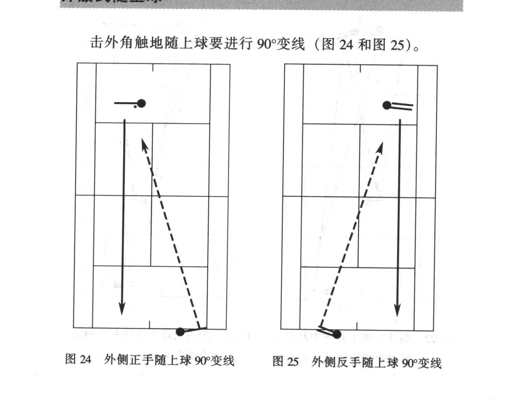

关闭式随上球

运动员打内角触地随上球时，如果正反手技术均衡，可采用变线（图26 和图28）。如果运动员正手强于反手，则可以用正手变线或不变线的正手外角斜线球进攻（图27）。

内侧正手随上球变线

正手外角斜线随上

图26至场地另一侧

图27球不变线

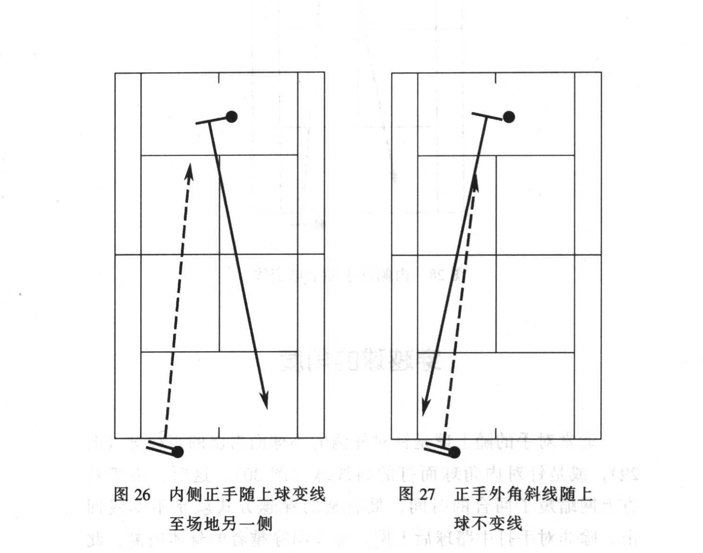

图28 内侧反手随上球变线

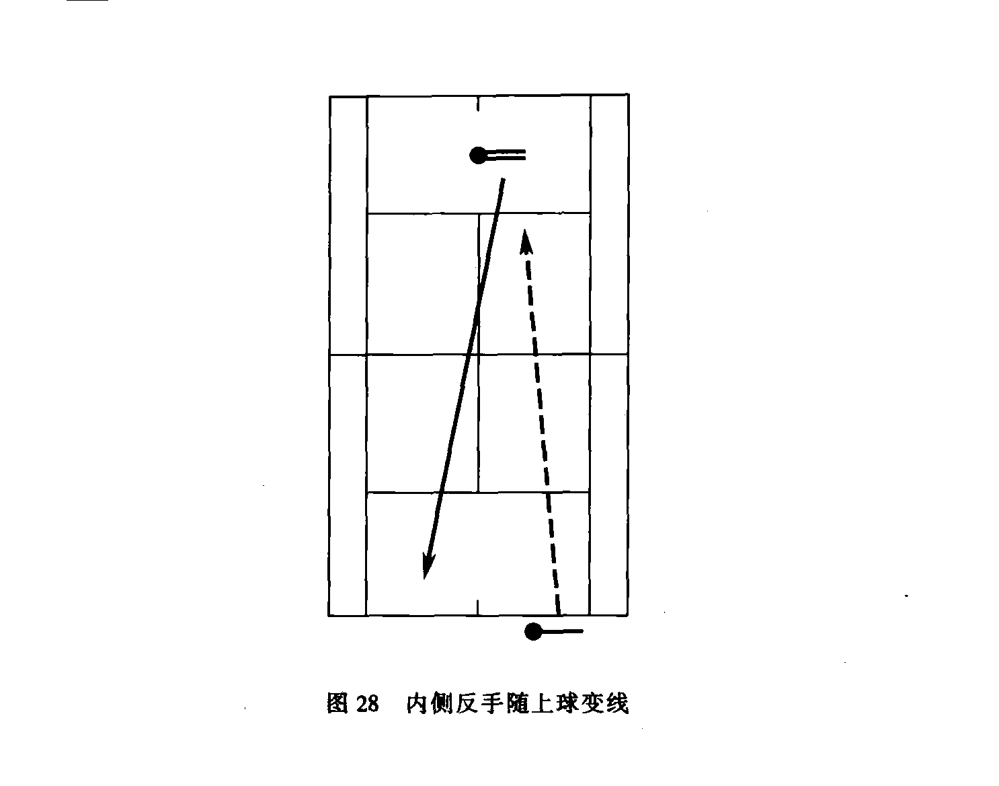

### 穿越球的角度

通常对手的随上球是针对外侧的小球而击出的直线球（图29），或是针对内角球而打的斜线球（图30）。这时，由于对方上网缩短了回合的时间，最有利的穿越方式就是不变线回击，除非对手打中路球后上网，球飞向穿越者的身体内侧，此时，穿越球需要进行变线（图31）。

P1

- 

P2

图29 运动员 P1 打直线穿越球

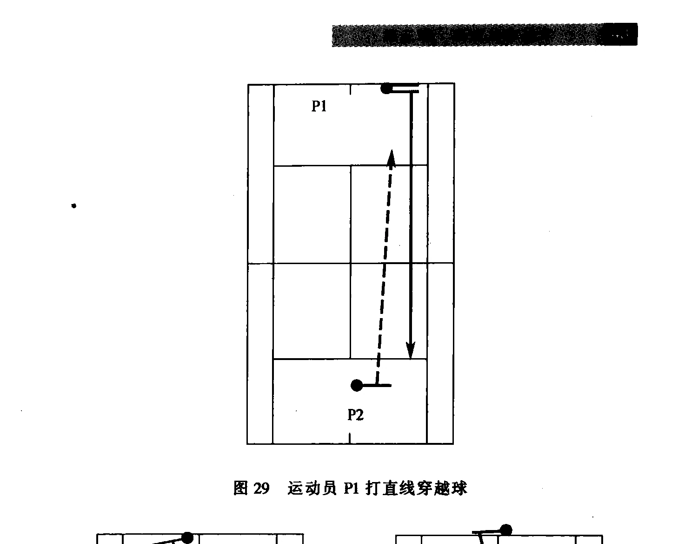

P1

P1

P2

P2

图30 运动员P1进行不变线穿越

图31运动员 P1 变线穿越对手中路的随上球

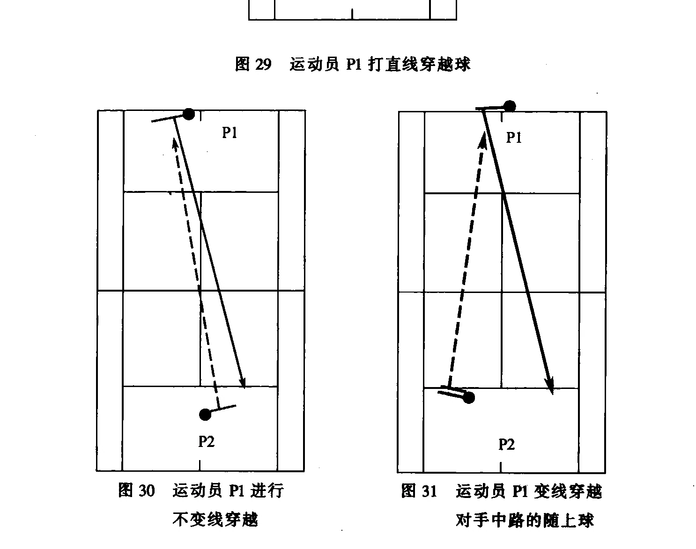

在对手随球上网之后，运动员进行穿越时，要运用上述穿越球的指导方针，尽量不要变线，穿越者应将注意力集中于回球的角度（不变线），而不是截击者。

如果比赛一开始，对手就随球上网，此时成功的穿越球会使对手十分狙丧，并使其在下一次随球上网时或者过于凶狠，或者过于谨慎，面对较浅的球可能不敢轻易上网，这时就能不断地给对手施加压力。当然，有时对手也会看出你的穿越球模式，而提前移动封网，这时改变击球线路能够使对手的判断失误。

### 截击球的线路

击球线路的变化也适用于截击球，在穿越球类型的基础上有些小的变化。

外侧截击

外侧截击有三种情况：

1. 由于对手的穿越球较高或较慢，运动员可以轻易控制截击。

2. 由于对手的穿越球较低或速度很快，运动员不能轻易控制截击。

3. 由于对手的穿越球比较凶猛刁钻，运动员只能轻点或条件反射性地截击。

注：当穿越球比较刁钻时，只能进行轻点或反射性地截击。考虑到截击的难度，此时惟一的选择就是打直线截击球，而截击者在这种情况下容易失去平衡，但重要的是将球截回去

以待下一拍机会。

如果外侧截击能够轻易实施时，运动员应选择不变线（图32） 或进行 90°变线（图33）。

图32 不变线的外侧截击注：外侧反手截击可参照正手截击的镜面线路

图33 90°变线的外侧截击

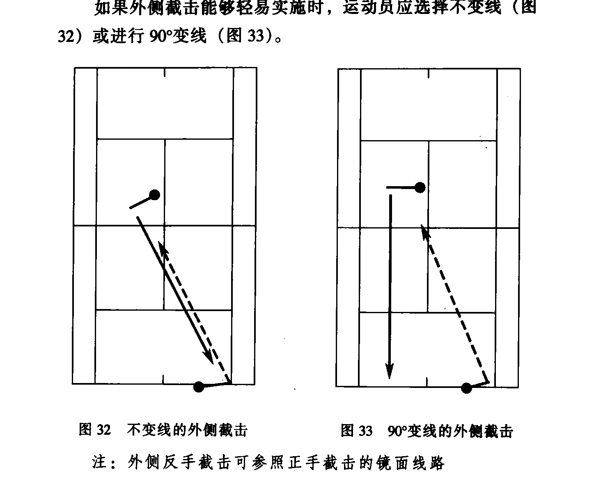

球在高于网的地方截击就能比较好地控制线路和落点，运动员必须依据对手的场上站位（站在原地还是向另一侧移动）选择最佳击球方式。同时自己的站位应尽量靠近网，要给予对手有判断难度的攻击（不能总是将球击向对手的空当，这样会使对手提前移动救球）。

当不能轻易控制外侧截击时（低球和快球），最好不要变线。截击者不得不承认当对手打出一记好球时，自己较难控制来球，这时，不变线的截击能使自己通过最短的移动距离去封住对手的下一次穿越，在这种情况下，封住对手的第二次穿越才是理智的选择。

内侧截击

与打内侧落地球一样，内侧正、反手截击也要求变线（图34 和图 35）。

P1

图34 正手内侧变线截击

图35 反手内侧变线截击

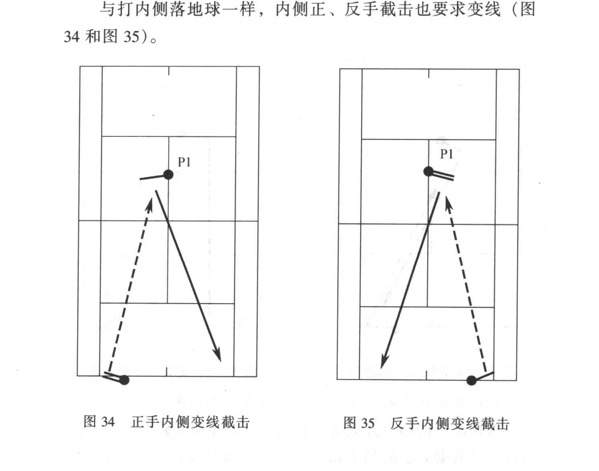

### 复位还原

在压力下，运动员尽力确保自己和对手处于相持局面，最理想的是处于主动攻击状态。复位还原是指恢复曾失去的优势地位。要训练自己在受到攻击时保持冷静，并选择恰当的击球方式，关键是对来球的判断和反应，而不应受环境的影响。压力下的运动员通常会有两种反应，即打落地相持球或者拉上旋

高球。

- 击落地相持球 击落地球进行相持时，要遵循底线线路指导原则——外侧击球不变线而内侧击球变线。对于远离单打场地的被动回球来说，打不变线的外侧球非常重要。通过运用上述指导原则迫使对手变线，从而为自己创造更多内侧击球的机会，以摆脱被动相持局面，夺回主动权。

- 上旋高球 当被对手大角度拉开时，运动员需要足够的时间回位，这时可采用挑高球或上旋球以争取时间，迫使对手选择难度较大的底线凌空抽球继续进攻。

### 预测感

1993年，凯尼恩学院一名大学一年级的运动员，用美国网协所制定的标准衡量，她的速度素质属世界优秀级水平，她能够通过任何标准的速度测试，但在球场上，她的步法移动到位的能力却处于一般水平。她的问题不是没有移动能力，而是掌握移动的时机不好，即缺乏预测能力。速度慢、体力差但预测能力强的运动员，在场上的移动控制范围要强于速度快、体力好而预测能力差的运动员。

对于网球教练员来讲，需要解决的问题是“如何对预知感进行培养”，因为预测能力依赖于直觉和经验。优秀运动员的预测能力很强，如果运动员对某种情况经历得多，那么这种经历就有助于其在比赛中对这种状况作出提前预测。预测是可以通过训练来提高的。

运动员如何通过训练来提高预测能力呢？让运动员根据对手击出的球作出正确的反应，正如他的对手也是根据来球线路击球一样。大多数运动员均遵循这个原则是因为线路的变化可

以反映出真实的比赛。如果对手击出一记内侧落地球，那么你就要移动到位回击对手斜线球，如果对手击出一记外侧底线深球，那么你就要提前知道对手可能不变线并仍回击斜线球。看一看职业比赛就会知道上述模式有多么普遍。

综上所述，在对手击球之前用移动来保护场上的位置空当是预测的关键。运动员在场上灵活自如地移动，是保证击球线路和提高预测能力的前提。
