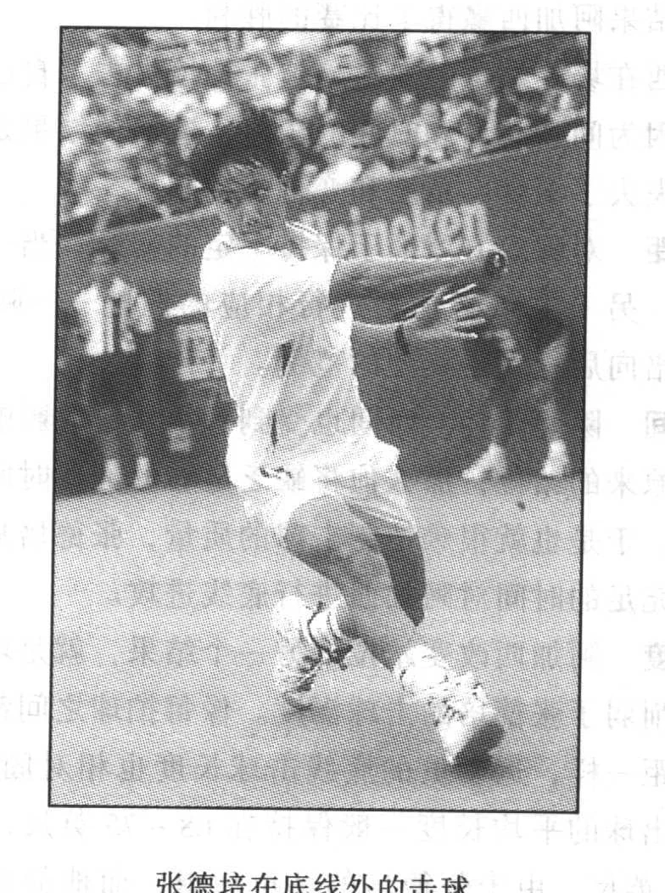
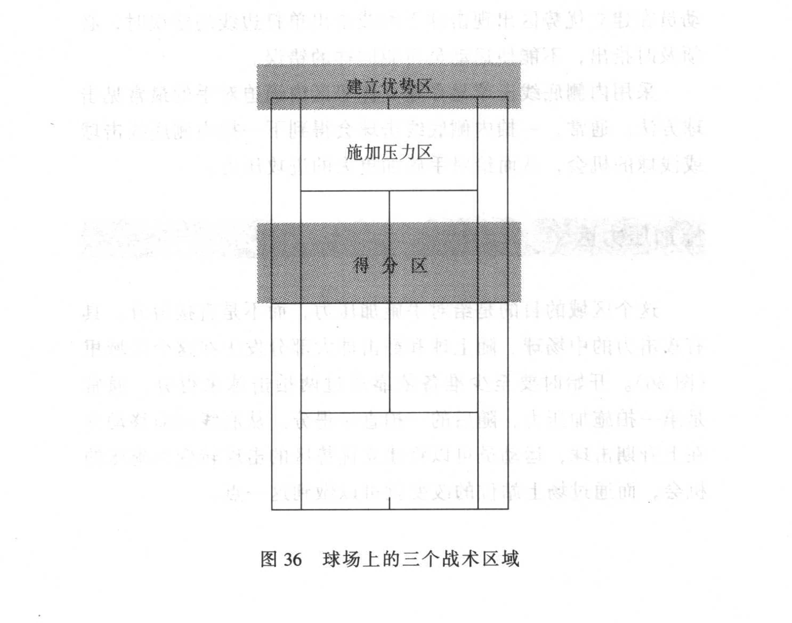

阿加西与张德培在法网公开赛上的比赛，就是场上良好站位的真实写照。比赛一开始两人都站在底线对拉，在第一盘处于拉锯战时，阿加西逐渐站在场地内击球，而张德培则向底线外后移了2~3英尺，阿加西通过积极的跑位很快控制了比赛的局势，结果阿加西赢得了比赛的胜利。

阿加西在场上站位的变化逼迫张德培失去了自己原有的位置，这是因为间隔距离和时间的压迫，造成的结果是张德培的击球逐渐失去了深度、角度和变化的控制。

- 间距 对阵双方习惯于保持一定的间臣，当一方改变场上的位置，另一方势必也会进行相应的调整——阿加西向前移、张德培向后移就是典型的范例。

- 时间 除间距外，时间也受到对手站位的影响。如果张德培维持原来的站位，那么他将续乏足够的准备时间迎接阿加西的来球，于是也就很难控制击球的质量，张德培只有向后移动才会有充足的时间对阿加西进行底线进攻。

- 深度 阿加西改变站位的另一个结果，就是增加了击球的深度并削弱了张德培的击球深度。像每拍球之间都有适宜的时间和间距一样，运动员的底线击球长度也相对固定。例如，张德培击出球的平均长度一般保持在68~75英尺，而场地的长度是78英尺，由于张德培的站位后退，而他的击球长度仍保持在68 ~75英尺，这就造成其击球深度不够，从而使阿加西能够在场地内展开进攻。

- 角度 运动员离网越近，击出球的角度就越大。由于阿加西站在底线之内，因而他能击出较大角度的球调动对手，而张德培站在底线之外，因此其回球角度相对变小，所以经常处于被动防守的局面。

- 变化 由于张德培站在底线外，所以他的战术选择受到局限，只能在对方的攻击下救球和防守。相反，阿加西的场上站位为其提供了多种可选择的战术变化机会，如大角度的斜线球、网前放小球或随上等各种进攻手段，使自己的战术充满了各种变化。

张德培在底线外的击球

### 寻找你的区域

全场型打法要求运动员能够在球场的任何区域应付自如。网球场可以分为三个战术区域，即建立优势区、施加压力区和最终得分区，并要求在各区域内应具有不同的战术选择和技术运用（图36）。区域的大小与每名运动员的技术能力有关，正如桑普拉斯能够轻易地利用正手在底线施压，而张德培则善于在中场施压一样。战术区域从哪开始、到哪里结束关键取决于运动员自身的能力。

建立优势区

施加压力区

得分区

其感的进明。会”

图36 球场上的三个战术区域

建立优势区

建立优势概念的含义引出了现代底线打法的本质—建立优势，直至给对手形成压力。

这个区域通常位于底线前后，在此区域的击球通常被描述为积极主动的、有控制的击球。在此区域击球时，运动员的主要目的是迫使对手回球质量下降，击出较弱的球，从而进一步给对手形成进攻压力。在这个区域时，运动员要始终保持积极进攻的态势，但必须在成功率较高的基础上加强球的攻击性，只有做到这一点，才能把握住战术的重点。作为教练员，当运动员在建立优势区出现击球下网或击出单打边线的错误时，必须及时指出，不能使运动员再犯同样的错误。

采用内侧底线击球是在建立优势区内逼迫对手的最常见击球方法。通常，一拍内侧底线击球会得到下一拍内侧底线击球或浅球的机会，从而给对手施加更大的进攻压力。

施加压力区

这个区域的目的是给对手施加压力，而不是直接得分。具有攻击力的中场球、随上球和截击球大部分发生在这个区域里（图36）。开始时要至少准备依靠通过两拍击球来得分，通常是第一拍施加压力，随后的一拍直接得分。从底线向前移动并在上升期击球，运动员可以将建立优势区的击球转变为施压的机会，而通过场上站位的改变就可以做到这一点。

得分区

在施加压力的进攻后，运动员就会得到最终得分的机会，通常是截击、高压球或二者的结合。最理想的是，在实施压力性进攻后，应该能够一拍得分，但运动员也必须做好球被击回的准备。一个本以为能得分的球被击回，有时会造成局面的逆转

正如阿加西与张德培那场比赛展现的那样，场上最佳站位并控制场上主动的运动员通常会取得比赛的胜利。而且，控制和掌握比赛的主动权要比被动地回应有意思得多。

出于战术考虑，运动员不仅要清楚自己在场上的站位，而且也要注意对手的站位。尽管听起来很简单，但令人不解的是，通常运动员只关注自身，并认为困境是自己造成的。在阿加西与张德培的比赛中，很容易看到张德培将被动归咎于自己失去了位置，但真正的原因却是由于阿加西积极的站位使张德培失去了自己的位置。因此，张德培必须在以后的训练中加强位置感的练习，尤其是当对手改变位置时，如何保持自己的站位。场上的站位，一定要根据对手的位置去不断地调整。

### 击球的选择

1998年法网公开赛第四轮桑切斯战胜小威廉姆斯的比赛，真正体现出多方位选择击球方式的重要价值。在小威廉姆斯利用其强劲的大力击球以5:2领先时，桑切斯变化多端的击球方式和旋转使年轻的小威廉姆斯逐渐乱了节奏，从而出现大量的主动失分并最终输掉了比赛。

现代网球运动体现出了强劲的拍头加速度及上旋的趋势，加上高技术含量的球拍和开放式的站位，使运动员击球及发球的速度和旋转不断增加。尽管上旋和力量是现今网球的主导方向，但对于高水平网球运动员来说，击球的变化还是很重要的，桑切斯就证明了这一点。

运动员至少要能击出上旋抽球、切削球和上旋拉高球三种不同方式的球。

桑切斯

- 上旋抽球 运动员掌握正手和反手的击球方式，通常是学习网球的第一项技术。击出上旋球会在比赛中占据优势，因为上旋球能够保证运动员击球的攻击性，但典型的进攻性底线上旋球过网时通常高于球网1~3英尺。

注意：使用这一技术的最佳时机是在建立优势和施加压力

时。施加压力时的上旋球要比建立优势时的上旋球略平一些，这样能确保速度更快，威胁更大。

- 切削球 切削会使球产生下旋，由于切削球落地后弹眺很低，会迫使对手向上击球才能避免下网。切削是放小球的必备技术，也是有效地随球上网和化解上旋来球的技术。

注意：变化较多的击球常用于建立优势和向对手施加压力时打随上球（底线球或截击球），而截击最终赢得比分。在建立优势区和施加压力区使用切削球时大多使用反手。

- 上旋拉高球 切忌与挑高球混淆。上旋拉高球与上旋球一样具有攻击性，只是旋转更强，过网弧度更高。上旋拉高球穿越底线落地反弹时至少要高于对手的肩膀。

注意：上旋拉高球是建立优势时的最佳选择，这种球会令对手很难保持原有的底线站位，造威回球较浅，从而处于压力之下。

运动员不仅要熟练地掌握这三种击球方式，而且还要熟练地回击这三种方式的来球。每名运动员都有适合于自己击球的理想区域和击球方式，通常最佳的击球高度是在大腿到胸部之间。要尽量不让对手在理想的击球高度击球，而是让其在膝部以下（切削）、肩部高度或肩部以上（上旋拉高球）击球。青少年选手很少意识到这一点，因为他们只倾向于沉浸在最好的击球动作和感觉中，这种击球看上去效果很不错，自己感觉也很好，但对手在比赛中不会提供这种击球机会，也就是说，比赛不是总按运动员最希望的方式进行。想像一下，如果对方投手只将球投入他的理想击球区，迈克•格威尔能击出多少个本垒打啊？！

总之，作为一名全面的网球选手就如同棒球投手一样，回击球时尽量将球回到对手的非理想击球位置或其弱点位置之外。所有的运动员在感觉好的时候，都能达到最高水平。从战

术角度而言，运动员要通过变化多端的击球方式和旋转迫使对手离开他们的理想击球位置，从而打破对手的平衡使之处于不利境地。正如俗话所说，“变化是生活的调味品”，网球战术更离不开多样性！
