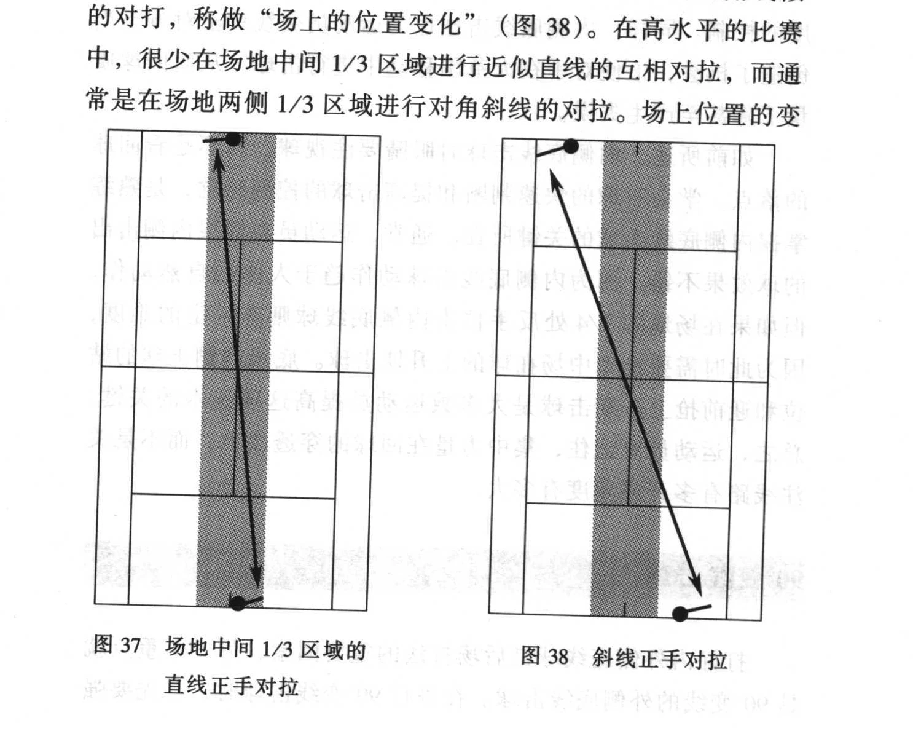

教练员不仅要具备完整的战术理念，而且还要将其有效地传授给运动员，并设计出能够真正运用到比赛中的训练方法。下面是一些见解和建议。

第二章 已经提到网球技战术教学中的三阶段教学方式：

- 第一阶段，慢速送球 送球者在击球者前5~10英尺进行下手送球，送球者接近运动员就可以通过轻松的话语和仔细的观察使训练更加有效。集体训练时可以通过运动员相互送球来完成这一计划，教练员在一旁指导。

- 第二阶段，隔网送球 慢速送球后，就可以站在发球线或底线进行隔网送球。通过隔网送球练习使运动员模拟比赛时的球速和角度。通常，这种练习中不必回球。

### 教练员轻轻地将球抛给运动员

- 第三阶段，实践对练 对打直到分出胜负。这种计分式的对打，使运动员能在近似比赛的节奏下练习技战术。

“念动”训练

通过对战术概念进行说明，以及在场地或图板上的描绘之后，运动员会很容易明白，但事实上他们必须学会如何进行战术思考，而有效的方法就是“念动”训练。例如，如果运动员明白了内侧底线与外侧底线击球的区别之后，则要求他们在外侧底线击球时说“外侧”，在内侧底线时说“内侧”。运动员说出其击球手法，可以使教练员了解到他们是否掌握了击球要领，是否清醒意识到自己的所作所为。

任何时候运动员首先要理解和掌握概念——不管是线路、站位，还是击球的选择。让运动员进行“念动”训练，能够更好地了解运动员真正的想法，使他们说出自己的想法。

击球线路的教学

多种线路组合在一起时要充分考虑它的合理性，以达到在

练习战术的同时，也练习技术运用的效果，而且不能输掉比赛。这一过程最好的方法就是通过教学强调以下三种击球：

1. 外侧底线击球；

2. 内侧底线击球；

3. 90°变线击球。

### 外侧底线击球

典型的得分手段有以下方式，即从底线斜线对抽到出现内

侧底线击球，或较浅的外侧底线击球的机会。底线斜线击球（包括正手斜线球）是进攻与防守的基础，要想成为一名战术卓著的运动员，第一步就要学会如何进行外侧底线击球。在教学中主要强调耐心、击球落点、深度、旋转和速度，并要按此顺序贯穿于训练中。虽然外侧底线击球的威胁性不大，但通过高成功率和较深的底线球能诱使对手产生变线或失误。外侧底线斜线击球虽然不能使运动员轻易得分，但往往使对手在与你的相持中很少有主动得分的机会。

开始时，外侧底线击球要注重击球的落点和深度。外侧底线对拉需要击出角度而不是直线，就是指在场地的中间1/3处进行对角击球（图37），从近乎直线的对拉转变为对角线似的对打，称做“场上的位置变化”（图38）。在高水平的比赛中，很少在场地中间1/3区域进行近似直线的互相对拉，而通常是在场地两侧1/3区域进行对角斜线的对拉。场上位置的变

图37 场地中间1/3区域的直线正手对拉

图38 斜线正手对拉

化就是在场地两侧处击球，迫使对手离开场地中央。事实上，斜线球的角度越大，线路变化的效果就越明显，高水平的比赛要通过深达底线的击球来控制线路。总之，底线击球首先要注重穿透力，而不仅仅是将球打在边线上的大角度球。

### 内侧底线击球

打好外侧底线球可创造出许多内侧底线击球的机会。要想获得场上的主动，关键要将得到的内侧底线击球机会转变成攻击性很强的主动击球。主动是来自于球的穿透力而不只是对角度的控制。同样，内侧底线击球也为运动员变线攻击对方空当创造了机会，迫使对手在大范围移动中进行击球，从而回球质量下降甚至产生失误。

如前所述，内侧底线击球时眼睛要注视球，而不是看回球的落点。学会对球的快速判断和提高击球的控制感觉，是熟练掌握内侧底线击球的关键所在。通常，运动员在底线内侧击出的球效果不错，因为内侧底线击球动作趋于人体的自然动作，但如果在场地的3/4处反手位击内侧底线球则有一定的难度，因为此时需要抢到中场在球的上升期击球。底线内侧击球的站位和迎前抢上升期击球是大多数运动员提高这项技术的关键。总之，运动员要记住，集中力量在回球的穿透性上，而不是关注线路有多开或角度有多大。

90°变线击球

打好内外侧底线球是后场打法的重要因素，另一个重点就是90°变线的外侧底线击球。在进行90°变线击球时，首先要强

调与内侧底线击球一样，注重球的穿透力，而不是角度。这些击球通常是进攻的组成部分而不是最后得分。运动员必须认识到，从中场或场地3/4处击球与从底线击球截然不同。变线时的技术动作要求运动员与不变线时有所区别。运动员经常在打随上球时将球打深而出现失误，这是由于他们使用底线技术去打中场球。

### 斜线对拉

上述练习步骤将有助于培养运动员的战术能力，同时运动员不同的个性会使其形成独特的个人风格。他们在体能、心理、情感及技术的优缺点在练习中表现得十分明显。运动员是正反手实力均衡还是正手明显优于反手？他们是否会向大打正手击球的方向发展？运动员将成为全能型、底线型还是发球上网型选手呢？

变线的诱惑

按照线路变化原则打球，会使比赛变得轻松、自然，并给

对手制造无数变线的诱惑。当运动员作出正确、适当的变线，并给对手产生很大的压力时，对手就很容易上钩——将球击向空当，或在变线中出现失误—通常是在较深的位置采用外侧底线击球。运用变线时会引起两种诱惑：

1. 内侧底线击球过分追求角度。一般不会出现失误，也很少打出边线，而且运动员能控制场上的主动，但得分的机会不大。内侧底线击球练习时要尽量保证球穿过底线而非穿过边线，这样就可以不受变线诱惑的影响。需要再次强调的是，注重底线球的穿透力而不是角度的大小。

2. 深球采用外侧变线将深球击向对手一侧的空当看上去很简单，但相对来说有一定难度，而且得分率也较低。因为，如果打不出90°变线，运动员的击球或者会出边线，或者太靠中路，那么对手就可以进行内侧底线击球从而掌握场上的主动权。运动员必须理解深球的局限性并谨慎选择变线的时机，越短的外侧变线球，效果越好。

战术塑造了整个压力训练体系，赋于每个练习和每次击球明确的目的性。设计战术并不难，而教会运动员如何运用战术，特别是在有压力的情况下才是难点所在。压力训练是一种有计划的系统训练，是使运动员逐步正确自如地运用战术的练习方式。运动员技术水平的高低并不重要，重要的是他们必须在一定的压力下进行训练。
