压力训练的核心与灵魂就是各种实战性练习。单打练习中利用各种战术手段并采用计分的方式进行（如同在网球比赛中一样）。这种训练为运动员创造了解决问题、作出决断的环境。单打训练的过程富有挑战性、启发性、压力性、刺激性及娱乐性。

单打练习由下述5个战术部分构成：

1. 发球、接发球；

2. 建立优势；

3. 旋转；

4. 施加压力；

5. 复位还原。

发球、接发球练习

成功地进行发球和接发球是运动员必须掌握的最基本要求。这个要求看似简单，但实际上存在很多问题，如同篮球的罚篮和击高尔夫球入洞一样。发球的结果完全在运动员的控制之下，队员有足够的时间思考可能出现的积极或消极的情况。但无论在什么水平的比赛中，发球都会产生压力，而在比赛关键时刻出现的双误绝大部分是发球者的心理压力造成的。

作为发球者，首先强调的是第二发球的质量，其次是双打的一发，最后才是单打的一发。作为接发球者，则强调接第一发时要力争得分，而在接第二发球时向对手施加压力。

令人惊奇的是，在比赛中包括发球和接发球在内，1分球

往往很难持续4拍以上。让运动员意识到前几抬球的重要性很关键，还要让他们了解造成发球、接发球的练习只持续2~5拍的原因。在高水平的比赛中，发球、接发球预示着每一分球的走向，运动员要么在一发时主动施压得分，要么在二发时尽力回击来球。

建立优势练习 建立优势或在底线训练中如何给对手施压是网球比赛的基础，运动员要保持积极的进攻态度，抓住对手回球较浅和内侧底线击球的机会。

旋转或击球选择练习（上旋高球、切削球或上旋抽球）运动员至少应该掌握三种形式的击球方法，及如何回击这三种形式的来球。利用旋转的变化可以使运动员适应不同的对手，并且最重要的是将球打到对手意想不到的区域。

施加压力练习 回击强有力的底线球后随上和从3/4区域进行截击会给对手制造压力。压力练习无疑是一种高强度的训练。

复位还原练习 运动员会经常进行复位还原练习，虽然提高复位还原能力主要是为了加强防守能力，但它也会给对手造成压力从而直接得分。

除了战术练习之外，还有一些“疯狂”练习，主要是单打方面的，非常有趣，也对比赛很有帮助。每一盘比赛，每一个抢七局都可能有不同的打法，因此，做这些练习时一定要有明确的目的性，并在一定的压力下完成才会有效果。

### 发球和接发球练习

### 练习1 接20个第二发球的两拍球练习

**目的**

练习第二发球和接发球的回球线路。

**时间**

自定（约10分钟）。

**方法** ——单打场地

1. P1 在右区和左区各发10个第二发球，P2进行不同线路的接发球。

2. P1 与P2轮流交换练习。

3. 接发球后此练习结束。

P1 发球，P2接发球：

P1 发第二发球；P2 用不同线路接发球（外侧击球时不变线或内侧击球时变线）。左区可以采用正手外角斜线球。

**记录**

记下发球的数据。例如，P1 发20个第二发球，发中18个。成功的标准是发20个球成功17个以上。

**要点**

- 接发球者要调动对手（开始时尽量打对角斜线），迫使其移动。

- 线路的变化是接发球的指导方针—不变线的外侧击球和变线的内侧击球。

接发球P2

图39 接20个第二发球的两拍球练习

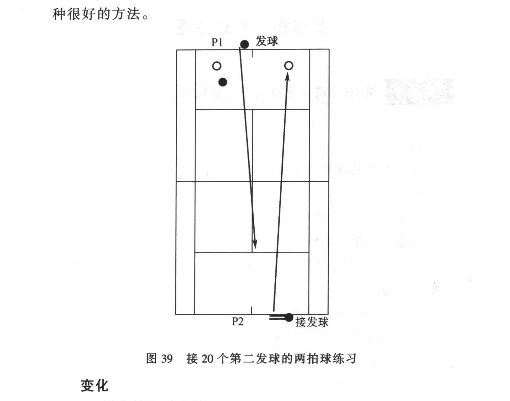

**变化**

1. 提高接发球质量。

2. 对发球者限定第二发球的落点。

3. 发球者可以全部或偶尔采用发球上网。

4. 接发球者必须用正手进行接发球。

5. 在左区接正手外角斜线球。

### 练习2 接20个第二发球的4拍球练习

目的1.练习第二发球及接发球的回球线路。

2. 练习前4拍击球。

**时间**

自定（约15分钟）。

**方法** ——单打场地

1. P1 在右区和左区各发10个第二发球，P2进行不同线路的接发球。

2. 发球与接发球后，P1和P2交换练习。

3. P2 进行20个第二发球，P1 接发球重复练习。

P1 发球，P2 接发球：P1 进行第二发球；P2 回击第二发球；P1 击落地球；P2 击落地球。在第4拍击球（P2 的第二拍球）后结束练习。

**记录**

记录发球的数据。例如，P1 在20个第二发球中成功18个。标准是发20 个球威功17个以上。

**要点**

- 这是一个对第二发球和接第二发球非常有益的绿习，练习时强调快速、积极的反应和运用穿透力强的接发球。

- 在比赛中很少出现超过4拍的击球，运动员要学会如何开局。

**变化**

1. 对发球者限定第二发球的落点。

2. 发球者可以全部或偶尔采用发球上网。

3. 接发球者可以接发球上网。

4. 接发球者必须用正手接发球，并立刻给对手施压。

发球P1

接发球P2

图40 接20个第二发球的4拍球练习

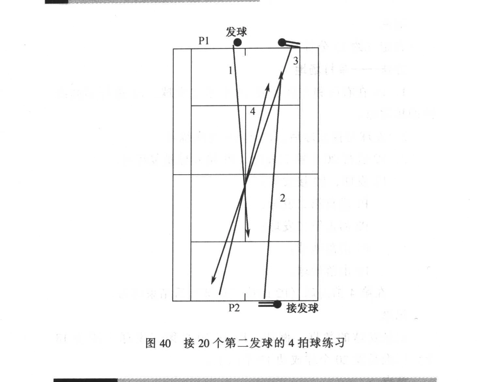

4 拍施压接发球练习（“x”为运动员站位处）

### 练习3

**目的**

掌握如何运用正手向对手的第二发球施加压力的技巧，以取得这一分的控制权。

**时间**

自定（约15分钟）。

**方法** ——单打场地

1. P1 在右区和左区各发10个第二发球，P2接发球。

2. 在发球和接发球之后，运动员各打一拍落地球。

3. 接发球者用正手接球。

4. 在发球者发球时，接发球者要将左脚踩在画“x” 的地方（右区发球时“x”在底线的中央，左区发球时“x”在单打线和双打线之间）。

P1 发球，P2接发球：

P1 发第二发球；P2 运用正手施加压力；P1 回一个落地球；P2 再次施加压力。击4拍球后结束练习（P2的第二拍施压击球之后）。

发球P1

一接发球

P2

图41 4 拍施压接发球练习

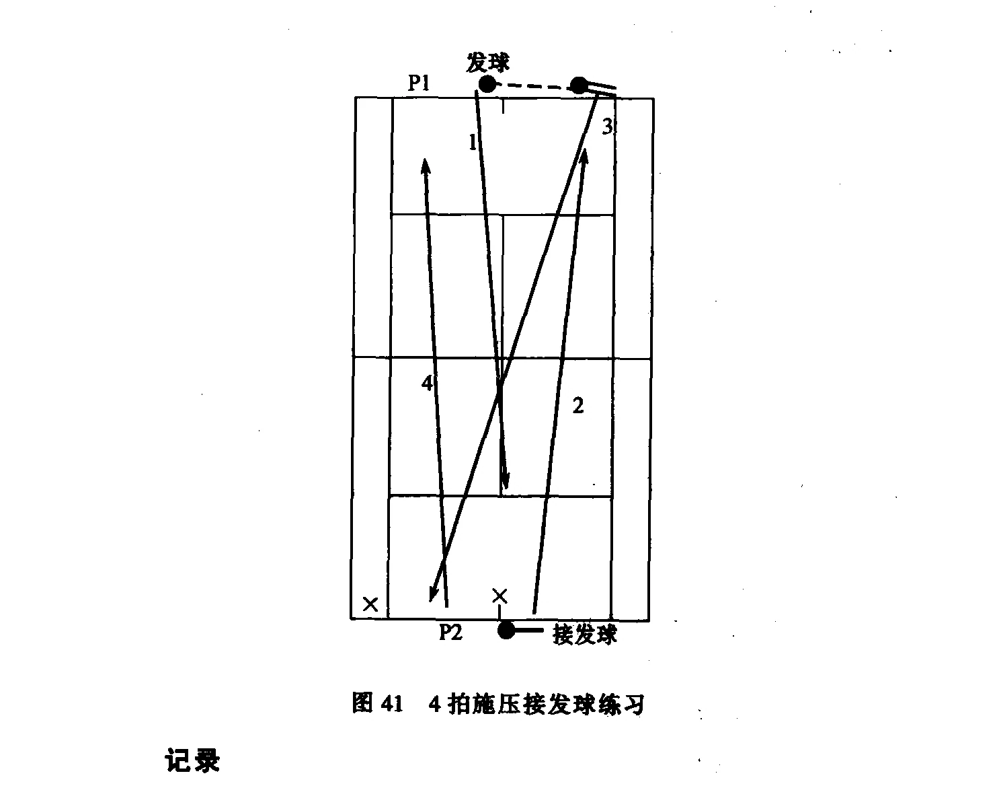

**记录**

记录发球的数据。例如，P1 发20个球中18 个。成功的标准是发20个球成功17个以上。

**要点**

- 接左区发球时建议使用侧身正手击球。

- 利用正手给发球者以巨大的压力。接发球者从“x”处开始给予对手强有力的进攻，正手接发球会带来意想不到的效果。

**变化**

1. 对发球者限定第二发球的落点。

2. 接发球者可以接发球上网。

### 练习4 接20个第二发球的前5拍练习——发球上网

**目的**

练习发球上网，提高二发上网的前5拍能力。

**时间**

自定（约15分钟）。

**方法** ——单打场地

1. P1 发球上网。在右区和左区各发10个第二发球，P2接发球。

2. 发球、接发球后，发球者打两拍截击，接发球者打一拍落地球。接发球时要保证发球者能打到第一拍截击。

3. 第一拍截击后，接发球者可以打穿越球，此球结束于P1 的第二拍截击。

P1 发球，P2接发球：P1 发第二发球；P2 回第二发球；P1 截击；P2 进行穿越；P1 截击。

这一球在第5拍（P1 的第二拍截击）后结束。

**记录**

记录发球数据。例如，P1发20个球中18个。成功的标准是发20个球成功17个以上。

发球P1

### 4

P2

接发球

图42 接20个第二发球的前5拍练习—发球上网

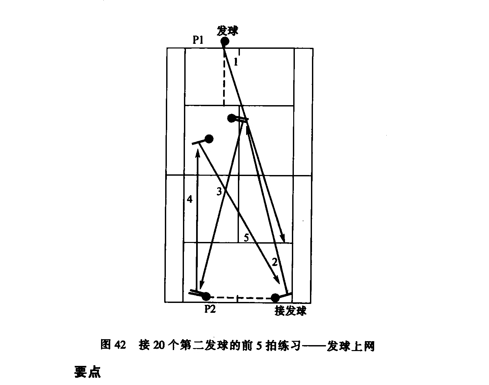

**要点**

- 这是一个提高发球上网截击水平的有效练习方法，同时也训练了接发球者如何应对上网攻击类型运动员的发球。

- 截击时要学会用第一拍截击给底线制造压力，为第二拍截击得分创造机会。

- 最好练习线路变化的截击。

**变化**

1. 对发球者限定第二发球的落点。

2. 接发球者要运用线路的变化。

3. 截击时要遵循线路变化的指导原则。

4. 第一拍截击要深，第二拍截击要打大角度浅球。

### 练习5 接20个第二发球时放小球的4拍练习

**目的**

练习接第二发球时放小球技术。

**时间**

自定（约15分钟）。

**方法** ——单打场地

1. P1 在右区和左区各发10个第二发球，P2接发球时放小球。

2. 在发球和接发球放小球之后，发球者任意回球，接发球者可选择穿越或挑高球。

P1 发球，P2接发球：P1 发第二发球；P2 接发球时放小球；P1 回小球；P2 穿越或挑高球。此练习在第4拍球（P2 的第二拍球）后结束。

**记录**

记录发球数据。例如，发20个球中18个。成功的标准是发20个球成功17个以上。

**要点**

- 接发球者放小球时要遵照线路变化的指导原则。

- 发球者回击小球时回直线，以限制接发球者的穿越角度。

接发球P2

图43 接20个第二发球时放小球的4拍练习

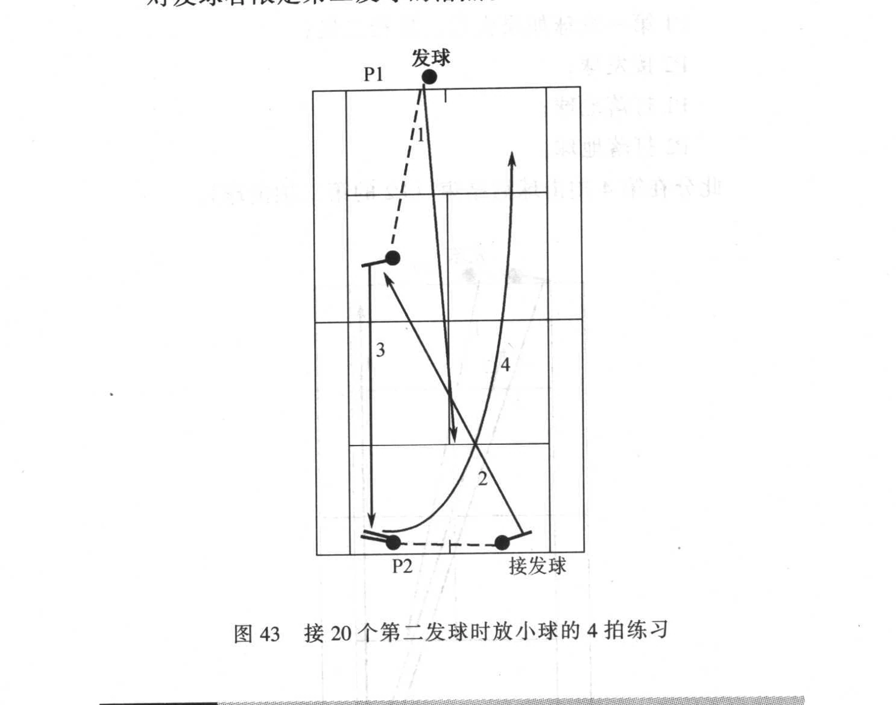

### 接20个发球的4拍练习

### 练习6

**目的**

练习接第一发球和第二发球时给对手制造压力。

**时间**

不限（约15分钟）。

**方法** —单打场地

1. 发球者在每一分中进行连续一发和二发。

2. 每名运动员发20个球—10个右区、10个左区。

3. 发球、接发球后，每人各打一拍落地球。P1 发球，P2 接发球：P1 第一发球如果失误，进行二发；P2 接发球；P1 打落地球；P2 打落地球。此分在第4拍击球后结束（P2的第二拍击球）。

发球 P1

P2

接发球

图44 接20个发球的4拍练习

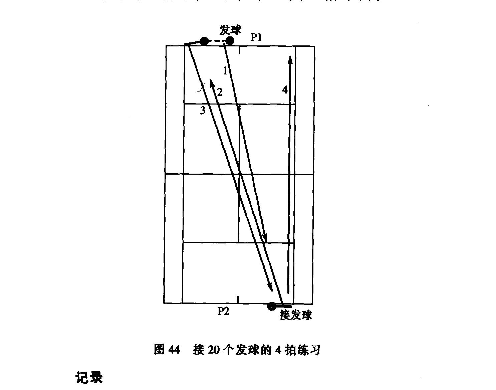

**记录**

一发失误和双误的个数。两个以下为达标。

**要点**

- 由于有两次发球机会，发球者要利用一发给对手施加压力，而接发球者接二发时也要给对手施加压力。

- 发球者要把握好一发的机会，迅速占据主动。

- 接发球者要集中注意力接好一发，而在接二发时要给发球者施加强大的压力。

**变化**

1. 对发球者限定一发、二发的落点。

2. 接发球者要遵照线路变化原则进行回球。

3. 发球者可以发球上网。

4. 接发球者可以接发球上网。

5. 接发球者用正手接第二发球，迅速给对手施压。

### 练习7 一发练习

**目的**

练习利用一发给对手施加压力。

练习积极、凶狠的一发。

**时间**

3~5分钟。

**方法** —单打场地

1. 着重强调一发给对手的压力，发球者在每次发球时可以发3次，即两个一发和1个二发。

2. P1 发两分球，左右区各1分。P2发球时同P1，连续反复练习，直到规定的时间。

P1 发球，P2接发球：P1 如果一发失误后，可以再发1个一发，失误后进行二发；P2 接发球。双方直至打完这一分。

**记录**

总比分。

**要点**

- 一发的落点与速度同样重要。

- 发球者通过发外角及内角球，调动对手创造得分机会。

- 内角压线球很难接，接发球者的站位可以靠前。

- 接发球时要遵循线路变化原则进行回球。

**变化**

1. 对发球者限定一发和二发的落点。

2. 可以发球上网。

3. 接发球者必须遵照线路变化指导原则。

4. 接发球者接发得分算得两分。

5. 接发球者可以接二发上网。

6. 利用正手给对手的二发以迅速直接地回击。

### 练习8 发球直接得分的练习

**目的**

1. 提高一发的直接得分能力。

2. 练习通过一发给对手施加压力。

**时间**

两部分 ×3分钟。

**方法** ——单打场地

1. 只进行一发。如果发球者第一拍就解决问题—发出Ace 球、对手回球失误或过浅，以及发球上网轻易得分，记发球者得分。

2. P1 在右区发球直到发球直接得分，再在左区发球直到发球直接得分。重复练习。

3. P1 和P2各发3分钟球。

P1 发球，P2接发球：P1 只发第一发球；P2 接发球。直至这一分结束。

**记录**

一发直接得分球。

**要点**

- 得克萨斯大学的杰夫•穆勒强调提高一发的杀伤力。

- 发球者要采用积极进攻的态度——我要先进攻。

- 一发的落点与速度一样重要。

- 发球者通过外角及内角球创造得分机会。

- 内角压线球很难接，接发球站位可以稍靠前。

- 接发球者要遵循线路变化的原则进行回球。

**变化**

1. 对发球者限定一发的落点。

2. 接发球者必须遵循线路变化的原则进行回球。

### 发球和接发球施加压力的练习

### 练习9

**目的**

1. 在一发和接二发时树立给对手施压的概念。

2. 练习在一发和接二发时给对手施压。

**时间**

3~5分钟。

**方法** —单打场地

1. 发球者进行一发和二发。

2. 发球者利用一发、接发球者利用接二发给对手施压。

3. P1 在右区和左区各发1分球，然后P2同P1，重复进行。

P1 发球，P2 接发球：P1 利用一发施压。一方失误后接着进行二发；P2接第一发球并利用对手的第二发球给对手施压，直到此分结束。

**记录**

如果运动员一发直接得分，或接第二发球直接得分记2分，否则记1分。需要强调，施压意味着使发球者和接发球者通过积极主动的进攻获取场上优势。直接得分当然最好，但有时运动员也需要作出判断，不管是两拍还是5拍，关键问题是要考虑发球或接发球时的施压是否能确保得分。

**要点**

- 在发球和接发球时首先要有明确的态度——积极进攻，创造得分机会。

- 这个练习对运动员有很大的帮助，一旦对如何得分有了明确的认识，直接的结果就是运动员能够抢先给对手施加压力。

**变化**

1. 接发球者可接二发球后上网。

2. 接发球者必须用正手回对手所有的第二发球。

### 建立得分优势练习

### 练习10 左右两区的斜线练习

**目的**

利用外侧落地球进行建立得分优势的练习。

**时间**

3~4分钟。

**方法** ——单打场地对角半场

1. 在左右两区的对角上进行。

2. 运动员必须复位到距底线中央（T点）一步左右的画线处，右脚踩线，而左脚放在右区内。复位是确保运动员保持在整个单打场地击球时的移动习惯。理想的是在右区只用正手击球，左区只用反手击球。

3. P1 发两分球，然后P2发

P1两分球，每分球只有一次发球机会。

P1 发第二发球；P2 接发球打斜线；P1 正手打斜线；P2 正手打斜线。这一分在斜线上进行。

**记录**

下网、出底线和边线的失误次数。可针对队员的具体情况加以纠正和提高。

P2

**要点**

- 网球的战术，特别是线路

图45 左右两区的斜线练习

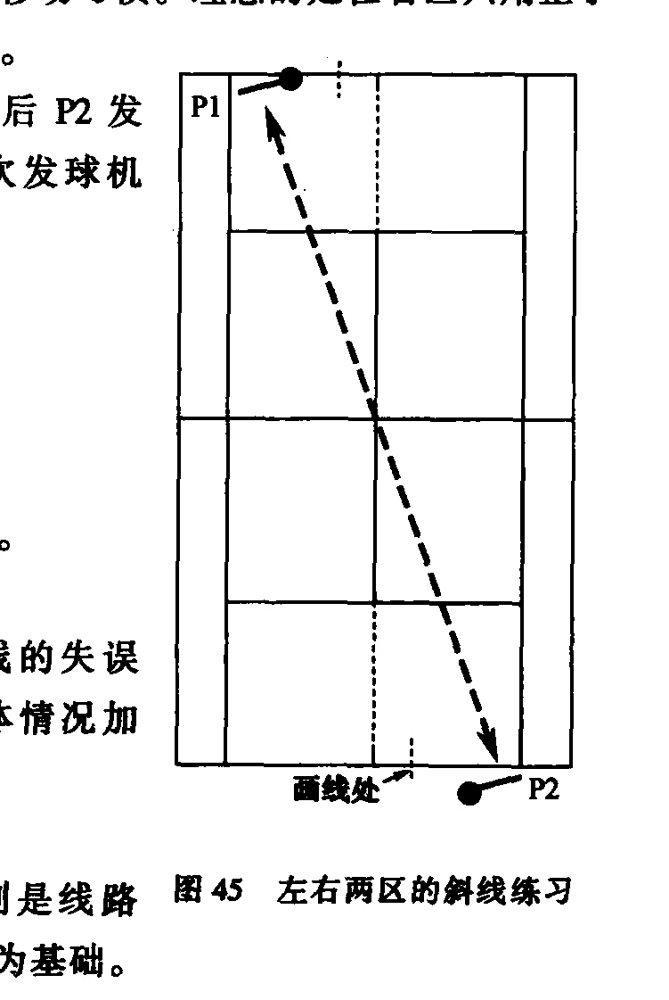

上的变化必须先以斜线球为基础。

- 斜线球练习是网球中最基本的练习内容。

- 高质量的斜线球可造成外侧回浅球的机会。

- 运动员应注意过网高度，避免球出边线。

- 运动员在建立得分优势期时的进攻性上旋球和弧线球是最有效的得分手段。

**变化**

1. 下网和出边线失误判失两分。

2. 可用送球代替二发开始。

### 练习11 斜线——正手内角斜线（左区）

**目的**

练习在左区建立优势期时使用正手内角斜线击球。

**时间**

4分钟。P1 和 P2 各进行两分钟的正手内角斜线练习。

**方法** ——对角线上的半块场地

1. 发球者和接发球者各在自己场地的左区，发球者用反手回斜线，接发球者采用正手内角斜线回球。

2. P1 用反手将球击至 P2 距底线中央一步左右的画线位置，让P2尽可能在合理的位置上进行正手内角斜线击球。

3. P1 击球后用自己的内侧脚（右脚）踩在距底线中央一步左右的画线位置。

4. 运动员在每1分中只有一次发球机会。

P1 在左区进行第二发球；P2 利用正手内角斜线回球；P1 斜线反手击球；P2 正手内角斜线击球。在左区斜线上进行练习。

**记录**

比分。

**要点**

- 习惯正手大力击球的运动员必须多练习这项内容。

- 侧身内侧正手击球时必须要有穿透力，并且过网高度合

适。

- 目的是使对手回球过浅，从而给其施压。

P1

P2

正手内

角斜线

图46 斜线—正手内角斜线（左区）

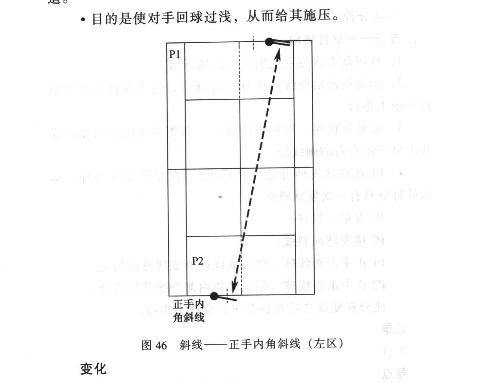

**变化**

1. 下网或出边线算失两分。

2. 如果运动员在底线内进行侧身位的内侧正手击球，就可以将球击向对手的右区，进行900变线，然后将此球打完（单打全场）。

3. 每分从送球开始而不是从发球开始。

### 底线内侧正手斜线击球练习

### 练习12

**目的**

练习在建立优势期时创造并捕捉底线内侧击球的机会。

**时间**

3~4分钟。

**方法** —单打场地

1. 练习从右区或左区的任意区域开始。

2. 运动员击出变线的内侧底线球后，这1分就在整个单打场地上进行。

3. 运动员在每一次外侧击球后，都要尽可能地回到距底线中央一步左右的画线处。

4. P1 在右区发两分球，然后 P2再在左区发两分球，运动员每分只有一次发球机会。

P1 发第二发球；P2 接发球回斜线；P1 正手击斜线球（创造底线内侧变线球的机会）；P2 正手击斜线球（创造底线内侧变线球的机会）。此分在变线之后在整个单打场地上进行。记景比分。

**要点**

- 此斜线练习，要求运动员掌握底线内侧变线球攻击对手空当的能力。

- 变线时注意站位要靠前，并尽量在球的上升期击球。

- 积极的具有穿透力的外侧击球才能创造出更多的内侧变线击球的机会。

**变化**

1. 下网、出边线或变线上的失分不能多于两分。

2. 每分从送球开始而不是从发球开始。

P1

画线处

P2

图47 底线内侧正手斜线击球练习

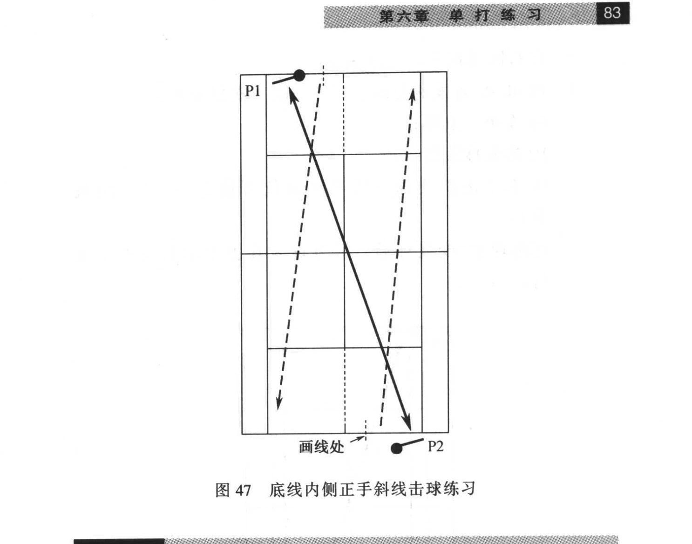

### 练习13 90°变线球

**目的**

1. 练习在对手回球较浅时利用外侧击球施压。

2. 按90变线的原则进行外侧击球变线。

**时间**

3~4分钟。

**方法** —单打场地

1. 练习时可以从右区或左区开始。

2. 当出现90变线后，此分在整个单打场地上进行。

3. 为了使练习具有合理性，运动员必须将右脚（在右区时的左脚）复位至距底线中央一步的画线处。

4. 在右区用正手，左区用反手。

5. P1 和P2 各发两分球，每分只有一次发球机会。

P1 发第二发球；P2 接发球回斜线；P1正手击斜线球（适当的站位可创造90°变线的机会）。在出现90°变线球后，此分球才在整个单打场地上进行。

画线处

P2

图48 90°变线球

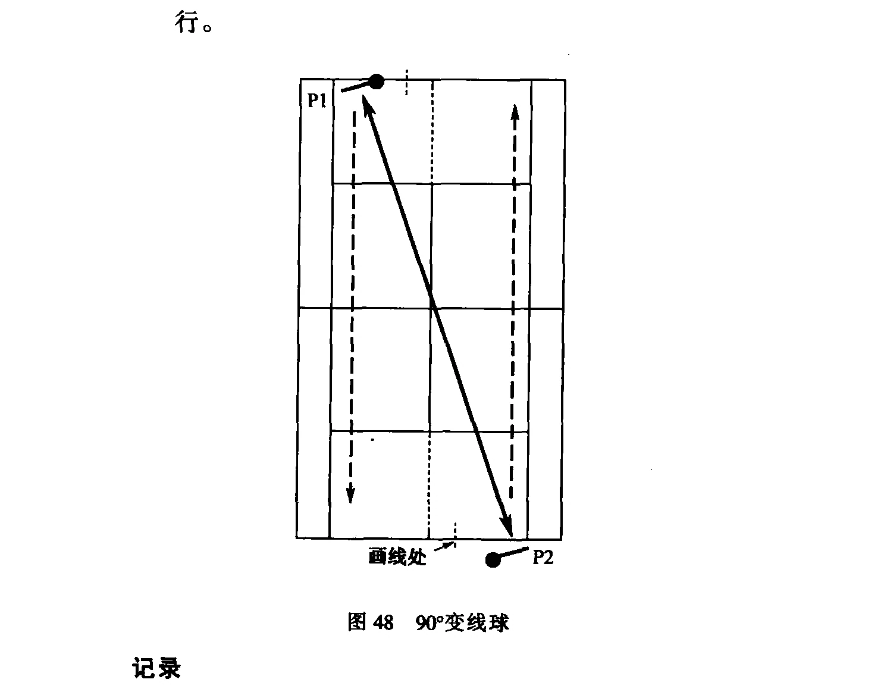

**记录**

比分。

**要点**

- 运动员应学会依据场上位置站位（在底线内还是底线上），把握90变线的机会，学会保持平衡并控制压力的能力。

- 每名运动员都有各自进行900变线的能力，了解这种能力十分重要。

- 在运用外侧击球变线时要遵循90°变线原则。要充分利用攻击性强、有穿透力的外侧底线球，创造出较多的900变线进攻施压的机会。

**变化**

1. 下网、出边线或变线失误记失两分。

2. 由送球开始而不是由发球开始。

变换场上位置

### 练习14

**目的**

练习在底线将直线球转换成斜线对拉。

**时间**

3~4分钟。

**方法** ——单打场地

1. 依据送球的位置，决定练习是在右区还是在左区进行。

2. 运动员将内侧脚（在右区时的左脚）放在底线中央的画线处。

P1 送球至中路；P2 变换正手或反手击球（击正手球向右区移动，击反手球向左区移动）；然后进行斜线对拉直到此分结束；P1 与P2各送两分球。

**记录**

比分。

**要点**

- 网球是一项对角运动而不是直线运动。

- 高水平的网球运动是在斜线上对打——底线中间1/3处以外对打。

- 变换场上的线路是指击球至对方底线中路1/3处以外，运动员的通病是对打线路过直而无法调动对手。

P2

P1

图49 变换场上位置

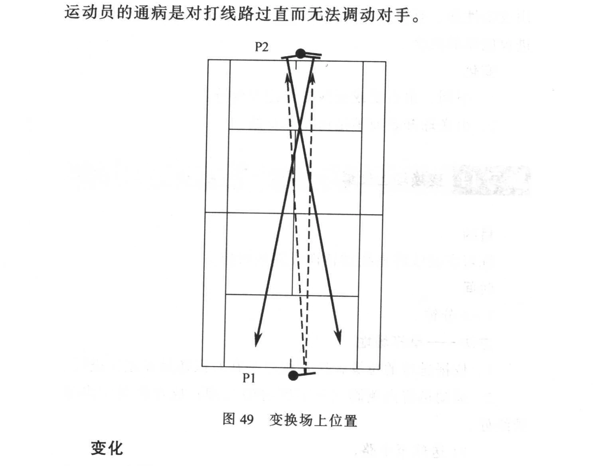

**变化**

1. 下网及出边线失两分。

2. 改变位置后再进行全场对打（可用角度的变化）。

### 练习15 线路—教练员送球练习

**目的**

使运动员理解击球线路的概念并学会控制落点。

**时间**

2×3分钟，也可进行计11分的练习而不计时间。

**方法** ——单打场地

1. 给运动员送深的内侧和外侧球，或浅的外侧球，要求其击出内侧深球或外侧浅球。

2. 运动员在回球时要喊出“内侧”“外侧”“900”，这样有助于对线路概念的掌握。

3. 教练员在单、双打边线间距网3/4处送球（两侧均可）。

教练员送内侧、外侧和外侧浅球。P1 根据来球进行外侧、内侧击球或进行90°变线；P2运用线路变化的回球，在整个单打场地上与P1 打完这分球。

P1

Coach

P2

图50 线路一

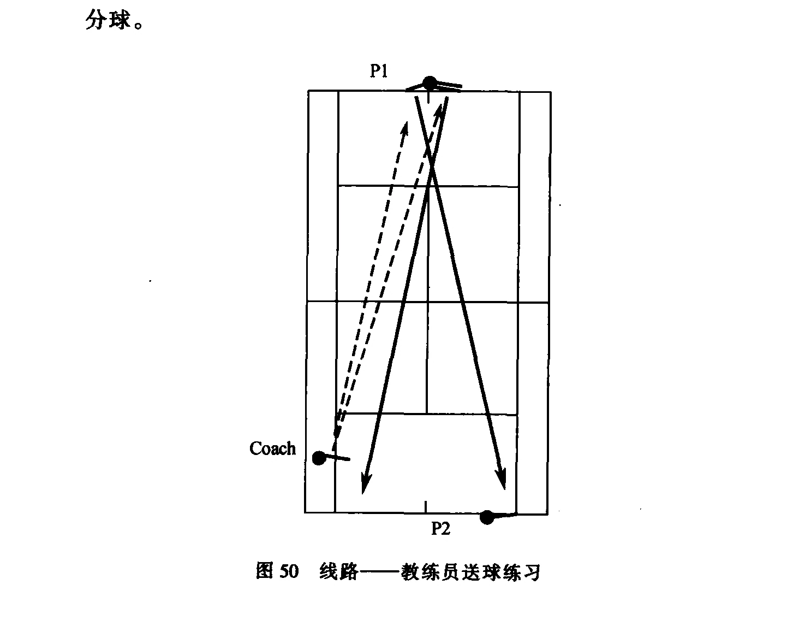

### 教练员送球练习

**记录**

比分。

**要点**

- 采用这种针对线路变化的练习方法非常有效，它是查克•克里塞发明的。

- 这是一种非常典型的线路变化练习，可在比赛中使用。

**变化**

1. 下网及出边线失两分。

2. 教练员送球位置可以任意变化。

### 练习16 线路—内侧击球变线

**目的**

练习外侧不变线击球和内侧变线击球。

**时间**

5分钟。

**方法** —单打场地

1. 运动员在击球过程中只能在内侧击球时进行变线。

2. 每打完一拍外侧击球后，运动员一定要复位，并将右脚（在右区时的左脚）放回距底线中央一步左右的画线处。

3. P1 和P2各发两分球，分别在左右区各发一个。

4. 每分只有一次发球机会。

P1 发第二发球；P2 接发球时如果在外侧击球则回斜线，如果在内侧击球则变线；P1 根据变线原则打斜线球，只在内侧变线时才得分。

**记录**

比分。

**要点**

- 此线路练习只允许在内侧击球时进行变线。

- 运动员可以击出中路球给对手内侧击球变线的机会。

- 在接发球时，只有接内角发球才变线。

**变化**

1. 下网和出边线失两分。

2. 运动员有两次发球机会。

4. 运动员在变线时要喊出“内侧”。

### 练习17 线路——内侧90°变线

**目的**

练习线路变化模式和外侧击浅球变线。

**时间**

5分钟。

**方法** ——单打场地

1. 在对打中，运动员只能在内侧或外侧击浅球进行变线时才计分。

2. 在外侧底线击球之后，运动员必须复位，并将右脚（在右区时的左脚）放回底线中央的画线处。

3. P1 和P2 在左右区各发1分球。

4. 运动员每分只有一次发球机会。

5. 接发球时，只能在接内角发球时变线。

P1 发第二发球；P2 如果接外侧发球则回斜线球，接内侧发球则变线；P1 外侧底线回球遵循线路变化原则；在对打中运动员用内侧和外侧击浅球进行变线。

**记录**

比分。

**要点**

- 要求运动员在进行内侧底线球和外侧击浅球变线时，双脚要站在底线以内。

- 运动员可以击中路球，以迫使对手在内侧底线击球变线时失误。

**变化**

1. 下网和出边线算失两分。

2. 90°变线失误算失两分。

3. 运动员有两次发球机会。

### 练习18 线路—侧身正手内侧击球

**目的**

练习利用正手大力击球进行线路变化，提高侧身正手内侧击球技术。

**时间**

5分钟。

**方法** ——单打场地

1. 只有在击内侧底线球和正手外角斜线球时变线才计分。

2. P1 和P2 在左右区各发1分球。每分只有一次发球机会。

3. 接发球时，只能在接内角球时变线，但在左区接内侧球时，可以侧身正手击球变线。

P1 发第二发球；P2 接外角球回斜线球不变线。在左区接内角球则采用变线；

P1 运用线路变化原则回底线球；只有运动员击内侧底线球变线才计分。

**记录**

比分。

**要点**

- 提高运动员侧身正手内侧击球技术，从而加强正手的杀伤力。

- 侧身正手内侧击球一般出现在左区，主要目的是在建立优势期时制造出对手回浅球的机会。

**变化**

1. 下网或出边线算失两分。

2. 运动员有两次发球机会。

3. 可以进行90°变线击球。

### 练习19 线路—变线制造压力

**目的**

练习回击内侧底线球和外侧浅球时变线给对手施压。通过场上位置的移动进行进攻。

**时间**

5分钟。

**方法** —一单打场地

1. 在这个线路变化练习中，如果运动员在变线之后随球上网，计1分。运动员在回击内侧底线球和外侧浅球时必须随球上网。

2. 在接发球时，只有接内角球才能变线。

3. P1 和P2各发两分球（左右区各1分）。运动员在每分中只有一次发球机会。

P1 发第二发球；P2 接外角球回斜线，接内角球变线；P1 击底线斜线球或在变线后随球上网。

**记录**

比分。

**要点**

- 变线时要站在底线以内，变线后随球上网对于获得有利的拦截位置至关重要。

- 这项练习可提高运动员快速向前移动的能力。

**变化**

1. 球下网或出边线算失两分。

3. 90变线失误也算失两分。

4. 运动员可以有两次发球机会。

### 练习20

### 线路——强劲的正手

**目的**

提高反手相持时运用正手进攻的能力。

**时间**

5分钟。

**方法** —单打场地

1. 运动员用正反手击球均可（包括接发球时）。

2. 只能在内侧击球时使用反手变线。

3. P1 和P2各发两分球（左右区各1分）。每分只有一次发球机会。

P1 发第二发球；P2 正手接发球，反手变线时遵照线路变化原则进行回球；

P1 击强劲的正手落地球或反手相持球时，同样遵照线路变化原则进行回球。

**记录**

比分。

**要点**

- 运动员尽可能用正手击球。

- 反手击球时遵照线路变化原则进行回球，以创造正手灵活击球的线路。

**变化**

1. 球下网或出边线算失两分。

2. 90°变线失误算失两分。

3. 运动员可以有两次发球机会。

### 练习21

外侧与中路练习

**目的**

练习击内侧底线球制造压力。

**时间**

4分钟的练习分成两个2分钟。

**方法** ——单打场地

1. P2将球击向 P1 中路计1分，P1 回内侧底线球，或不变线的外侧底线球计1分。

2. P1 和P2各送球2分钟。

P1 送球至场地中路；P2 在场地的中路击球；P1 击内侧底线球；P2 在场地中路击球；P1 击内侧底线球（也可以是外侧底线球，然后打完这

一分）。

**记录**

比分。

**要点**

- 练习的目的是创造出内侧底线球的机会。

- 运动员要在合理的位置上进行有攻击力的击球，最好在底线内并在球的上升期击球，给对手施加压力。

- 通过中路送球，提高运动员快速复位的能力。

P1

P2

图51 外侧与中路练习

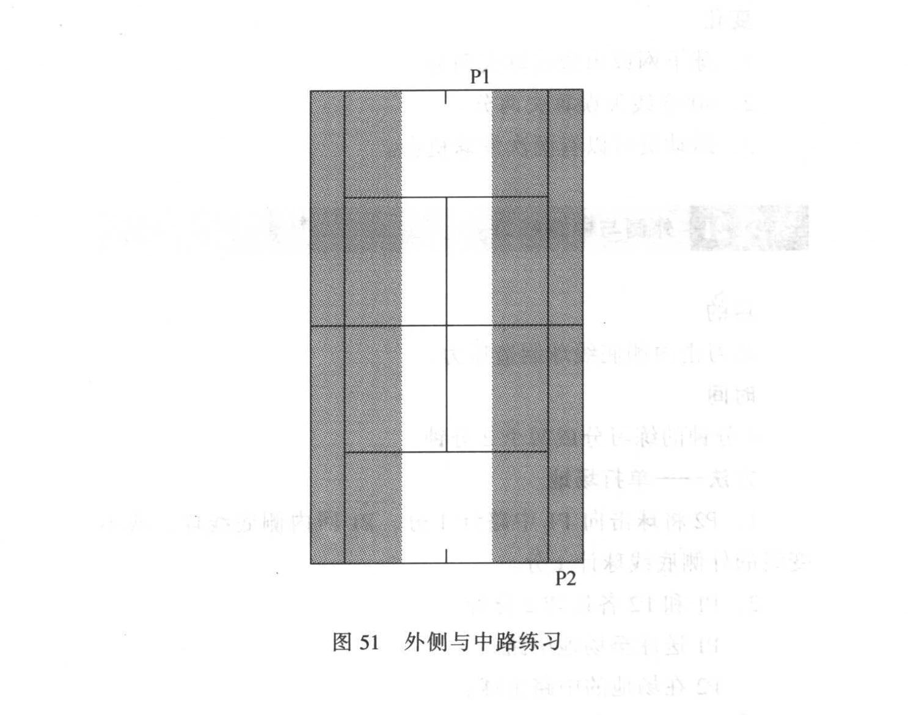

**变化**

下网或出边线算失两分。

### 大目标练习

### 练习22

**目的**

练习将球高弧度地击过网并与边线、底线保持一定距离。

**时间**

3分钟。

**方法** ——单打场地

1. 大目标放在左右两区各距边线和底线三步的两个角上（图52）。

。大目标

大目标

P2

图52 大目标练习

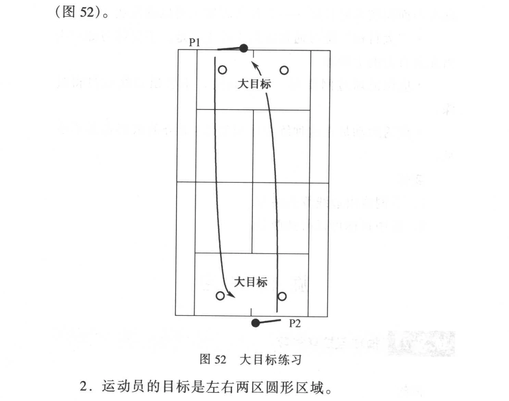

2. 运动员的目标是左右两区圆形区域。

3. P1 或P2进行不定点地送球。

P1 送落地球给 P2；

P2 向右区或左区的“大目标” 击出强劲有力的高弧度上旋球；P1 向右区或左区的“大目标”击出强劲有力的高弧线的上旋球，两人打完这一分。计分开始。

**记录**

比分。

**要点**

- 所谓“大目标” 是相对于小的圆形目标而言，运动员将球击向面积较大的目标—在很大程度上可以确保成功率。

- “大目标”练习通常适用于红土场地，主要练习如何击出强劲有力的上旋球。

- 应保证球过网要有一定的高度，不会出边线或打得过深。

- 优秀运动员在这种练习中只得2~3分的情形也并不少见。

**变化**

1. 下网或出边线算失两分。

2. 击中目标可以得到两分。

### 旋转练习

### 练习23 抽球与拉球练习

**目的**

练习抽球以对付拉球，练习拉球以对付抽球。

**时间**

2×2分钟，两名运动员相互抽球与拉球。

**方法** —半块双打场地

1. 抽球的人为送球者。

2. 两分钟后互换击球方式。

P1 送球至3/4后场；P2 回上旋拉球；P1 回上旋抽球；P1 抽球、P2拉球，计分。

**记录**

比分。

**要点**

- 练习目的就是学会如何运用上旋抽球对付上旋拉球，以及上旋拉球对付上旋抽球。

- 运动员应记住，抽球只略带上旋，不要想一拍置对手于死地。

- 拉弧线球的反弹高度要超过对手的肩膀或更高，以迫使对手远离最佳击球位置。

**变化**

P2

1. 从发球开始，接发球回斜

图53 抽球与拉球练习

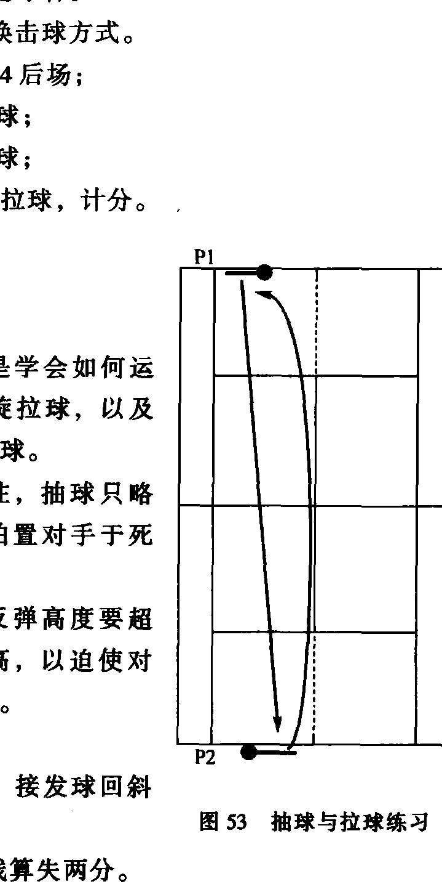

线。

2. 下网或出边线算失两分。

3. 在整块单打场地进行。

### 练习24 抽球与削球练习

目的1. 用抽球对付削球。

2. 用削球对付抽球。

**时间**

2×2分钟，运动员轮换进行两种方式的击球。

**方法** —半块双打场地

1. 抽球的人为送球者。

2. 两分钟后互换击球方式。

P1 送球至场地后3/4处；P2 回削球；P1 回带上旋球的抽球；

图54 抽球与削球练习

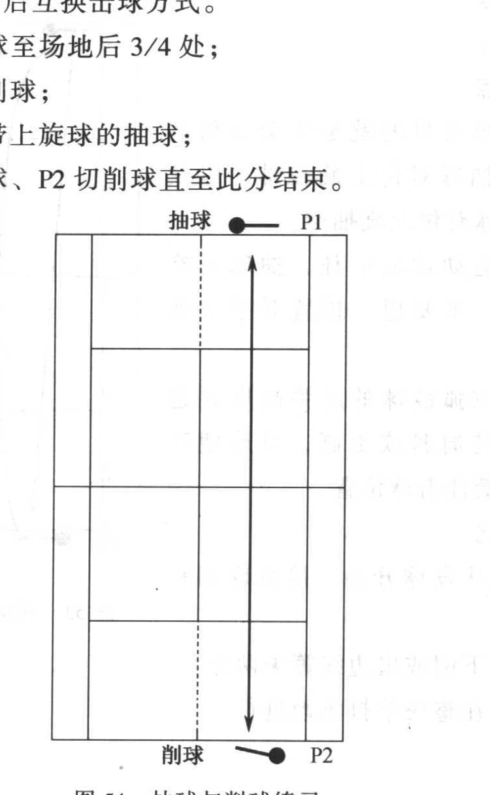

**记录**

比分。

**要点**

- 掌握如何用带上旋的抽球对付削球，以及如何用削球对付抽球。理想的切削球要使对手在膝关节以下击球，从而迫使其向上拉高回球，减弱攻击力。

- 正手和反手都可以进行削球练习。

**变化**

1. 从发球开始，接发球回斜线球。

2. 只在左区打斜线，因为现代网球的切削球只在反手时使用。

3. 在整块单打场地进行。

### 练习25 削球对削球

**目的**

练习削球对付削球。

**时间**

3分钟。

**方法** ——半块双打场地

P1 和P2各送2分球。P1 将球送至对方场地3/4处；P2 回削球；P1 回削球；P1 与P2 切削球对打。

**记录**

比分。

削球•P1

图55 削球对削球

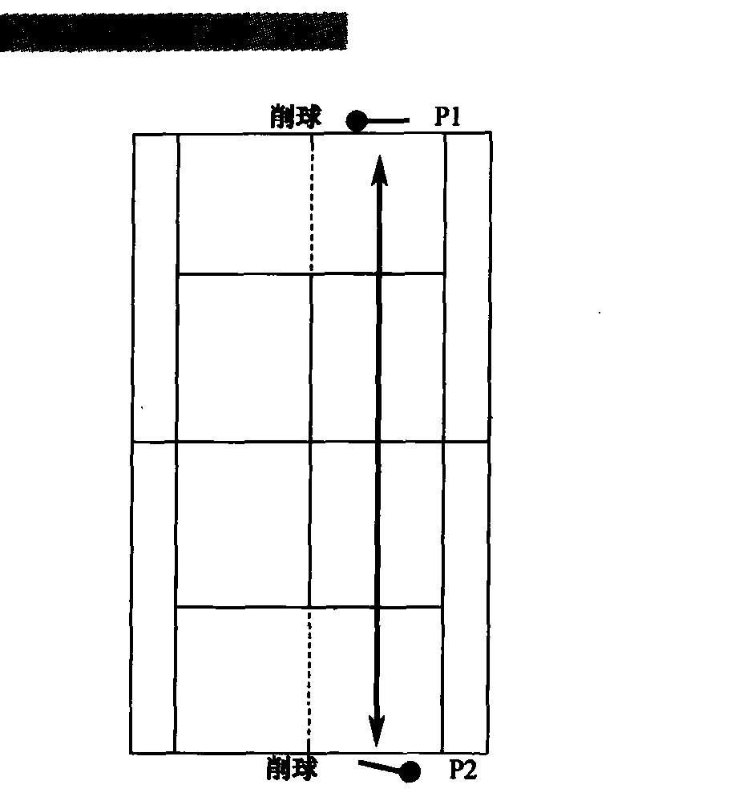

**要点**

- 练习如何利用削球对付削球。对付低削球的最好办法就是切削，直到出现抽球的机会。

- 正手和反手都可以切削。

**变化**

1. 从发球开始，接发球回斜线。

2. 只在左区进行斜线对削，因为现代网球比赛中切削球几乎都出现在反手位。

3. 在整块单打场地进行。

4. 对于落在发球区内的球可削球上网，同时对手可利用上旋球或下旋高球破网。

5. 利用切削球放小球直接得分，算两分。

拉球对拉球练习

### 练习26

**目的**

利用拉球对付拉球。

**时间**

3分钟。

**方法** —半块双打场地

1. P1 和P2各送两分球。

2. 为确保深度，发球区画在底线外。

P1 送球至场地3/4处；P2 拉球落点在发球线外以确保深度；P1 同P2。两人进行弧线球对拉。

P2

图56 拉球对拉球练习

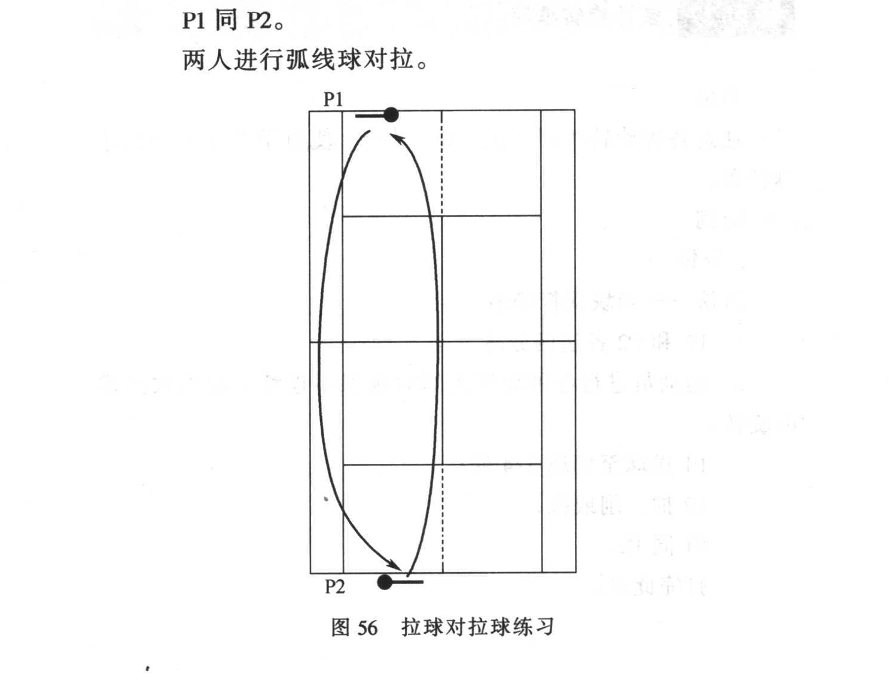

**记录**

比分。

**要点**

- 拉球要带有强烈的上旋，反弹高度要超过对手肩部，迫使对手在底线外较远处击球。

- 通过反弹高的拉球，创造出抽球进攻的机会。

- 拉球的深度非常重要。

**变化**

1. 从发球开始，接发球回斜线。

2. 当一方出现浅球时，另一方则可以利用抽球后随球上网得分。

### 练习27 多种旋转练习

**目的**

通过各种旋转练习（抽、削、拉），使对手处于不利的击球位置。

**时间**

3分钟。

**方法** —半块双打场地

1. P1 和P2各送两分球。

2. 运动员进行各种旋转击球时确保不连续出现两次同样的旋转。

P1 送球至场地3/4处；P2抽、削或拉；P1同P2。打完此分。

**记录**

比分。

P2

抽球/削球/拉球

图57 多种旋转练习

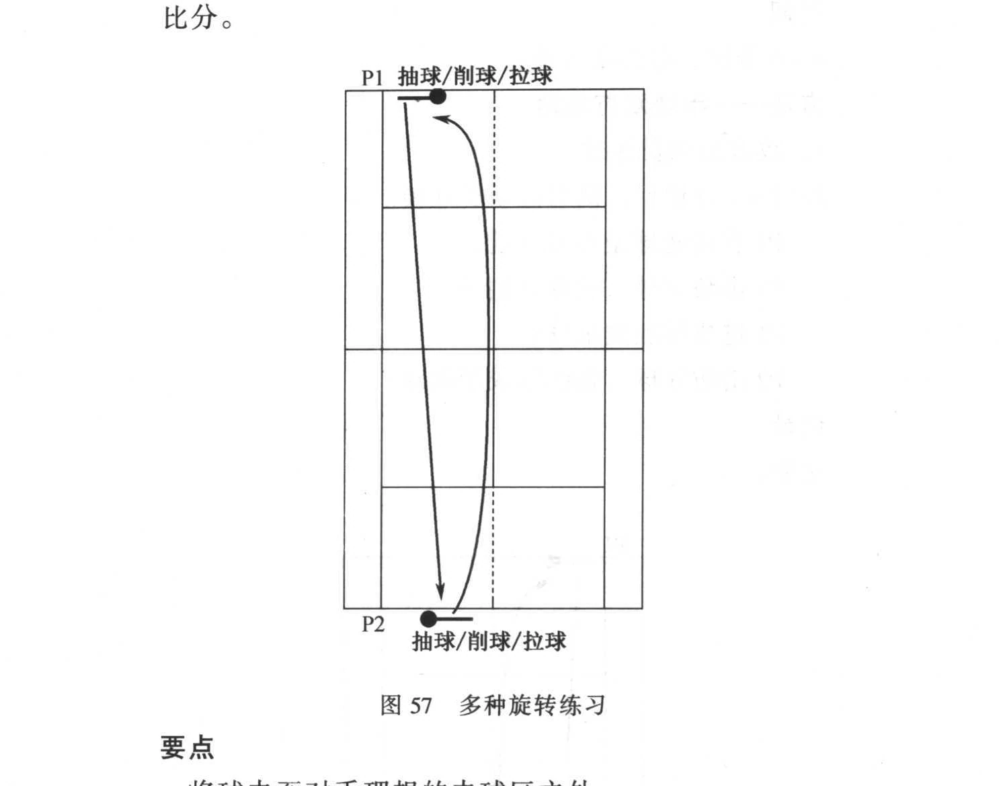

**要点**

- 将球击至对手理想的击球区之外。

- 不要连续出现两拍同样类型的旋转球。

**变化**

1. 从发球开始，斜线击球。

2. 在整块单打场地上进行。

进攻与防守

### 练习28

**目的**

1. 练习给防守方施加压力。

2. 练习压力下的防守以化解进攻方的攻势。

**时间**

4~6分钟，分两部分进行。

**方法** ——半块双打场地

1. 攻方运动员送球。

2. 2~3分钟后，两名运动员互换。

P1 直接送球至对方身前；P2 击防守球（拉球或削球）；P1 进攻性底线抽球；P2 击防守球（弧线球或切削球）。

**记录**

比分。

P1

P2

图58 进攻与防守

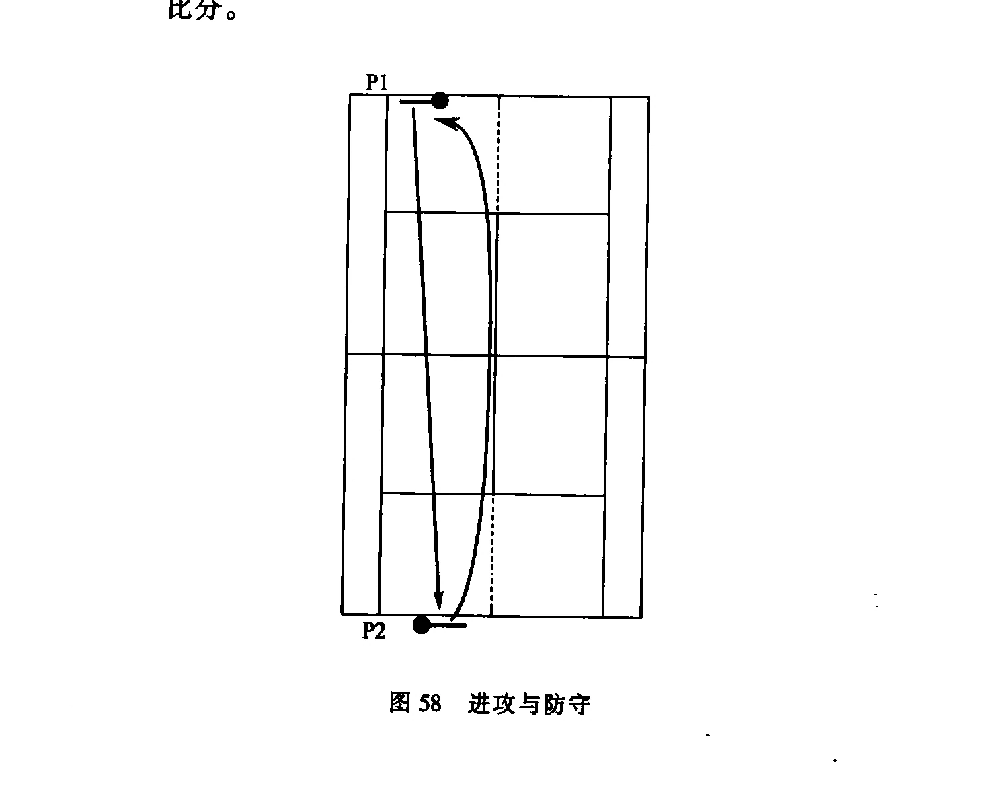

**要点**

- 进攻队员要尽可能地积极进攻，发挥其最大潜能。

- 用半块双打场地练习是为了减少得分机会，从而有更多的空间让进攻队员展示其强劲的攻击力。

- 防守队员击弧线球或切削球，但当进攻方上网时，可以用挑高球或穿越球破网。

**变化**

1. 上网前不能挑高球。

2. 出现浅球时，要主动进攻。防守队员也可以进攻。

### 压力练习

### 练习29 压迫式截击练习

**目的**

防守对方在底线或底线以内的抽球破网。

**时间**

2×2分钟。

**方法** ——半块单打场地

1. P1 在发球线处，P2 在底线或底线内。

2. 两分钟后互换。

P1 站在发球线处送球至 P2处；P2 击落地球给 P1；P1 上前封网截击；P2 在底线与 P1 对打，但不能挑高球。

**记录**

只记截击者的分数。两人轮换各截击一次之后，得分多的

截击者为胜者。底线击球者必须在底线上或底线内击球，否则算失分。

P1

图59 压迫式截击练习

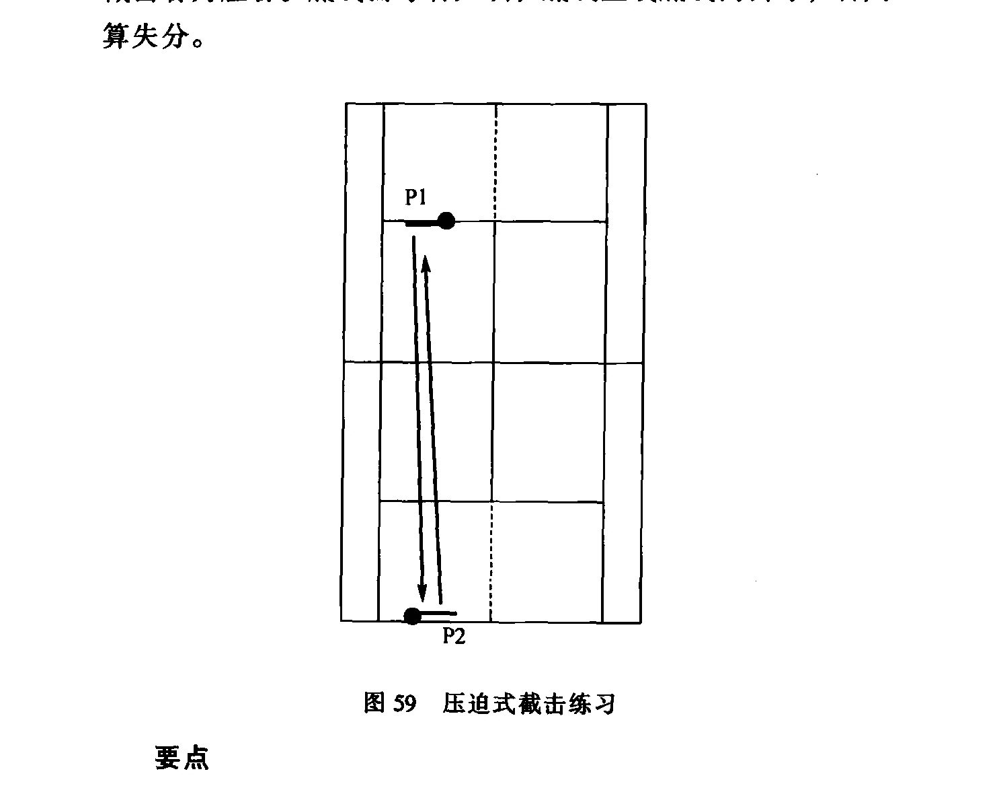

**要点**

- 压迫式截击对于提高截击能力非常有益，同样，底线的快速反应对打破压迫式截击也很有用。

- 现代网球的单双打比赛，网前和底线快节奏的对抗非常重要，有助于提高运动员的快速对抗能力。

- 此练习迫使运动员要在极短的时间内处理网前或底线的来球。由于是半块单打场地，所以根本没有什么空当，就看谁先失误了，是网前者还是底线者？

**变化**

1. 非受迫性失误（无论是截击还是底线球）算失两分。

2. 网前截击两拍后，底线击球者可以挑高球。

3. 底线击球者可将球击至对手脚下，使其打反弹球（对于网前者来说，这是练习脚下反弹球的好机会）。

4. 可以在半块双打场地上进行。

### 单人近网截击练习

### 练习30

**目的**

提高随球上网、一拦、截击得分和高压球的能力，练习化解对手的进攻。

**时间**

3~4分钟。

**方法** ——半块双打场地

1. 两名运动员从底线开始。

2. P1 和P2 作底线者各送两个球。

P1 直线送球至发球线附近，并一直留在底线；P2 击球后随球上网；P1 回击球给 P2，让P2 截击或打反弹球；P2 截击并打完这一分。

**记录**

比分。

**要点**

- 运动员回击浅球后随球上网。

- 底线者要使网前者一拦成功并控制主动。一拦的深度有益于确定良好的站位以便截击成功。

- 截击封网是许多运动员的最爱，也是最常用的技术。

**变化**

1. 限定能否挑高球。

2. 非受迫性失误或截击下网算失两分。

3. 截击者必须削球后上网。

P1

P2

图60 单人近网截击练习

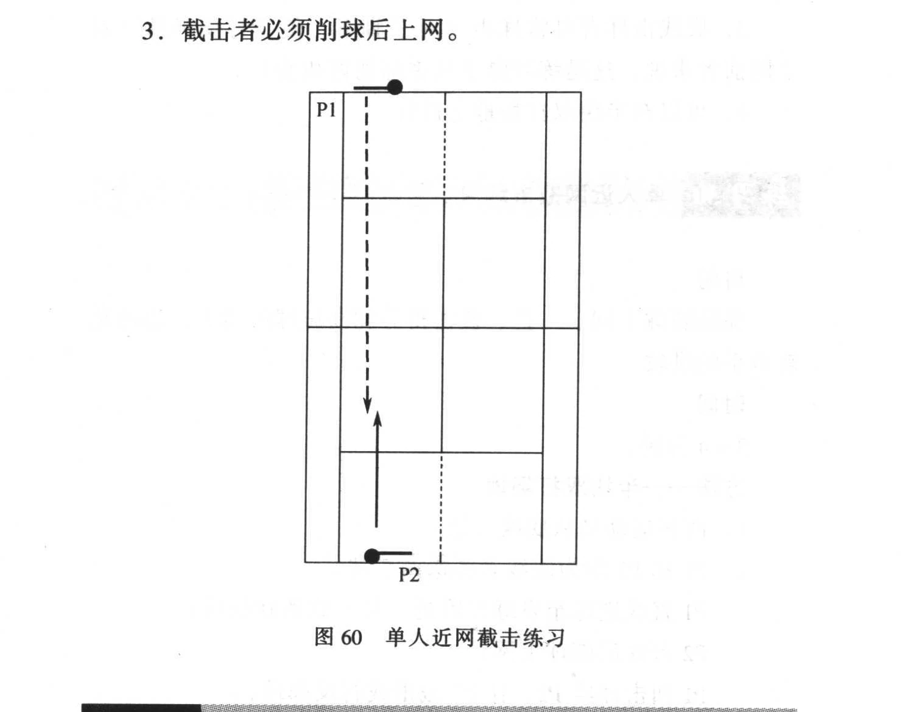

### 练习31 中前场近网截击练习

**目的**

1. 提高随球上网截击、近网截击、截击得分及高压得分的能力。

2. 提高如何瓦解对手进攻的能力。

**时间**

3~4分钟。

**方法** ——半块双打场地

1. 两名运动员从底线处开始练习。

2. P1 和P2 作为底线者各送两分球。

P1 送高球至后场；P2 击凌空球后随球上网；P1 击底线球让P2 截击或击反弹球；P2 截击至此分结束。

P2

P1

图61 中前场近网截击练习

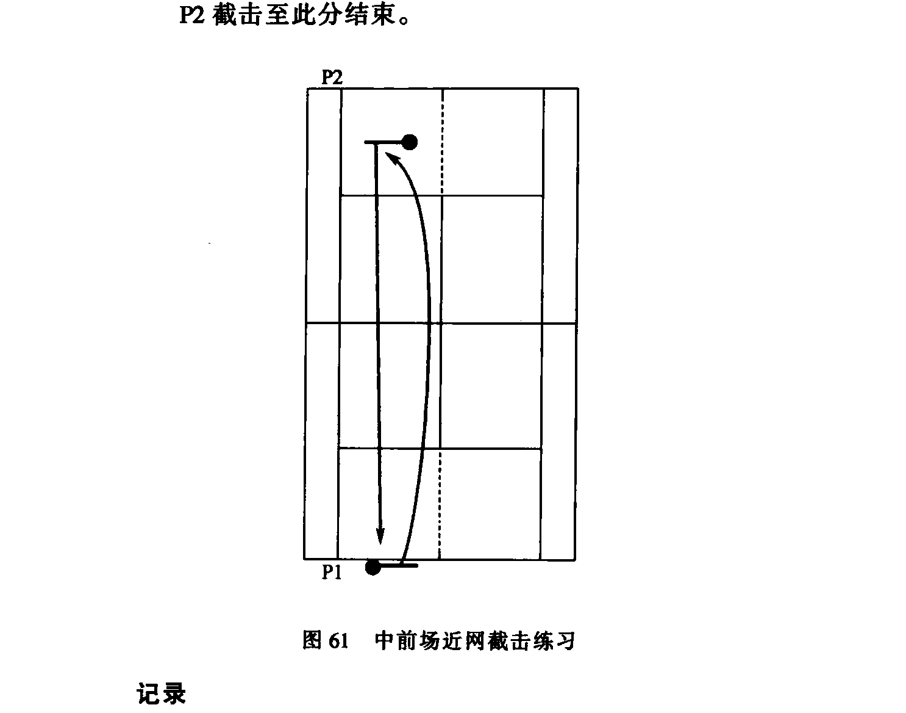

**记录**

比分。

**要点**

- 运动员在回中路后场高球时，要及时抓住凌空击球的机会，并随球上网。

- 提高在此区域空中击球的能力。

- 后场的拦击很少会直接得分，往往是在两拍连续击球后才能得分。

**变化**

1. 规定是否可挑高球或穿越破网。

2. 底线队员非受迫性失误或网前队员截击下网算失两分。

### 练习32 两名运动员的近网截击

**目的**

提高网前封网时的快速截击能力。

**时间**

3~4分钟。

**方法** ——半块双打场地

1. 两名运动员从底线处开始练习。

2. P1 和P2各送两分球。

P1 直接送球至发球线处并上前封网；P2 回球（必须将球击给P1，不能穿越）并随球上网；P1 截击给 P2；P2 进行截击直至此分结束。

**记录**

比分。

**要点**

- 注意节奏要快，脚步迅速移动至近网。

- 在过网的基础上尽量将球压低。

**变化**

1. 自行限定能否挑高球。

2. 一拦球必须回到对方手上。

3. 运动员用切削技术随球上网。

4. 在半块单打场地进行。

P1

P2

图62 两名运动员的近网截击

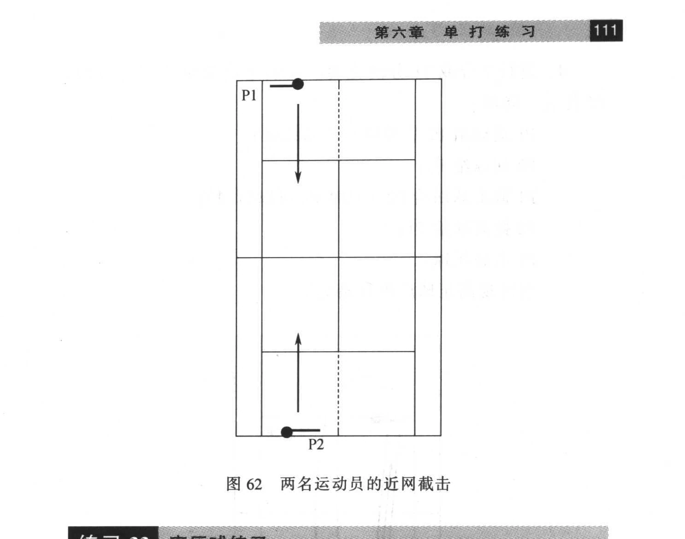

### 练习33

高压球练习

目的 提高将施压区的优势变成最终得分的能力。

增强防守对方高压球的能力。

**时间**

不计时间（约15分钟）。

**方法** —半块双打场地

1. P1 和P2分别站在发球线及底线处。

2. P1 和P2各送3分球，每分直到有高压球出现时才开始记分。

3. 一旦出现高压球，则开始记分（此后P2 不必再挑高球）。如果送球或挑高球失误，则重新开始，直到对手能打高压球为止。

4. 进行7分或11分的比赛。两名运动员机会均等（P1、P2各送一局球）。

P1 送球给P2 后停留在发球线处；P2 回球给 P1；P1 截击球回给 P2（此时P1 可以封网）；P2 挑高球给 P1；P1 击高压球。当出现高压球后再开始记分。

P1

挑高球

P2

图63 高压球练习

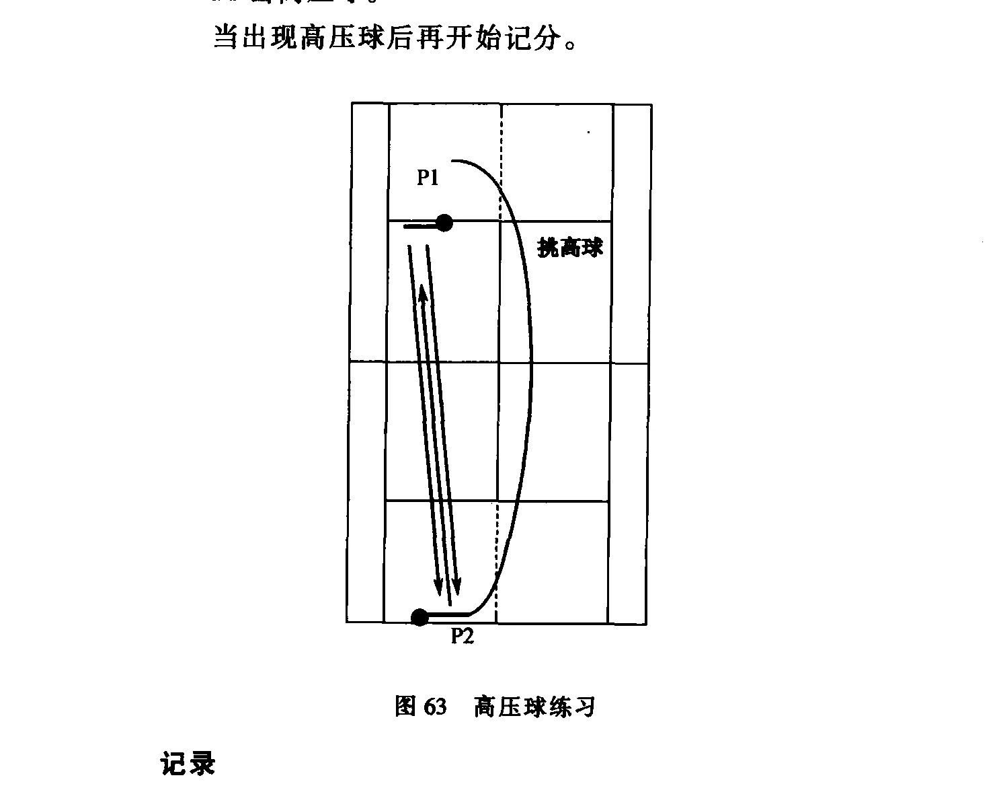

**记录**

比分。只有出现高压球时再进行计分（截击球同样可以得分）。

**要点**

- 此练习对于提高比赛中的高球扣杀能力有很大帮助。

- 进攻者击打高压球后要向前封网，并在前场得分。

- 此项练习也能通过挑高球或击底线球提高对抗高压球的防守能力。防守者应学会挑高球至对方的后场，或利用上旋球穿越至对方脚下。这是一项非常有趣但很有挑战性的练习。

**变化**

1. P2 击球至P1 脚下（此练习可以很好地锻炼进攻者的反弹球）。

2. 底线者也可以上网。

### 练习34 温布尔登得分练习

**目的**

练习在底线或底线以内的位置给对手施压。

**时间**

3~4分钟。

**方法** —半块双打场地

1. 两人在底线以内击球。任何球包括送球只要落在本方发球线以内，必须随球上网。

2. P1 与P2各送两分球。

P1 直接送球至发球线内；P2 在底线以内击球给 P1；P1 在底线以内击球给P2 至此分结束。

**记录**

比分。

**要点**

- 作为草地练习，应重点强调在快速对拉中向前移动的能力。

- 强调场上的站位，利用浅球、随上球和封网占据场上优

势。

**变化**

1. 规定可否挑高球。

2. 运动员用切削或凌空球上网。

3. 运动员可以随球上网回击任何来球。

4. 网前失误算失两分。

5. 除了穿越破网球，其他球均用切削技术。

### 练习35 温布尔登线路练习

**目的**

利用线路变化提高进攻意识，并利用在底线或底线以内的位置给对手施压。

**时间**

3~4分钟。

**方法** —单打场地

1. 两名运动员采用同样的线路变化方式击球（外侧击球不变线，内侧击球变线），接球者只能站在底线上或底线内进攻。

2. 球落在发球区内时接发球者必须随球上网（不包括发球）。

3. P1 与P2各送两分球（一个在右区，一个在左区）。

P1 发第二发球；P2 在底线或底线内接发球，直至此分结束；接发球者退到底线外则失分。

**记录**

比分。

**要点**

- 接发球者要保持积极的站位并有意识地利用浅球以争取

场上的主动。

- 接发球者在击球过程中应进行“我要前移”等心理暗示。

**变化**

1. 运动员用切削球上网。

2. 接发球者可以随球上网（包括接发球上网）。

3. 发球者在底线内进行击球。

4. 可以进行90°变线。

放小球练习

### 练习36

**目的**

练习放小球，以调动对手的场上位置。

**时间**

3~4分钟。

**方法** ——半块双打场地

1. 两名运动员从底线处开始。

2. 运动员放小球后，另一名运动员可回放小球或挑高球。

3. P1 与P2各送2分球。

P1 送球给 P2；P2 击上旋球至发球线附近；P1 移动到场内并放小球；P2 待P1 放小球后（不是放小球之前）向前移动；P1 挑高球或穿越，直至此分结束。

**记录**

比分。

**要点**

- 不仅只是速度和穿透力能够为对手制造压力，通过调动

对手的场上位置，使其陷于被动，也能产生压力。

图64 放小球练习

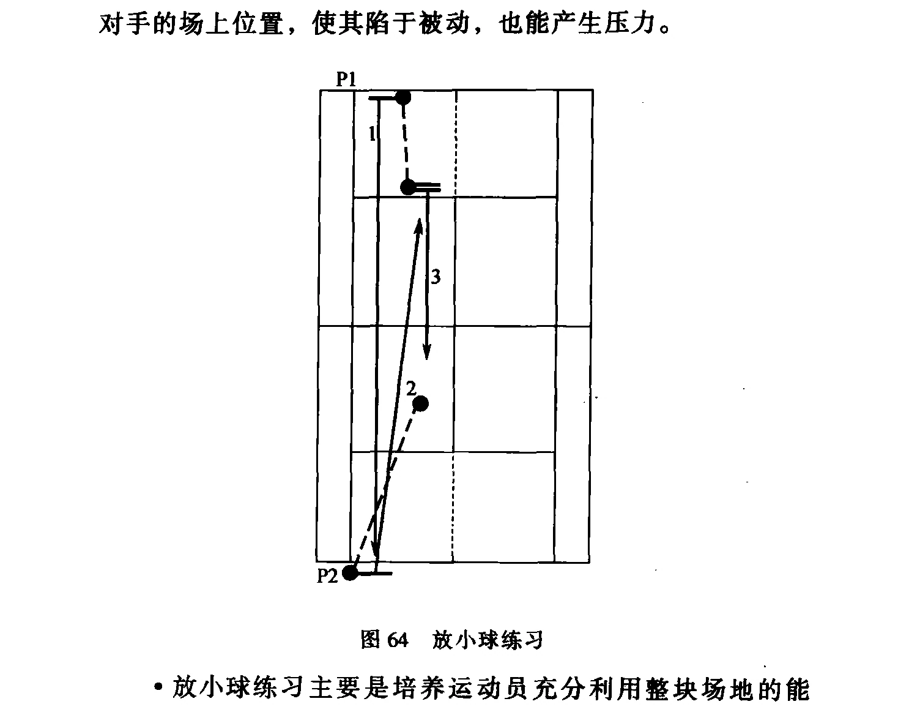

- 放小球练习主要是培养运动员充分利用整块场地的能力，使对手处于被动。

- 运动员在放小球时应保证自己站位于底线之内。

**变化**

1. 不能挑高球。

2. 练习可以是放小球与单人近网截击的结合。

### 复位还原练习

复位还原练习最好以两人对抗的形式进行。不过，3个人也可以，一人进攻施加压力，另两人进行复位还原练习。建议

教练员送球。

### 练习37

### 击内侧底线球后复位还原练习

**目的**

1. 通过击内侧底线球后复位还原化解压力。

2. 练习在后场用内侧底线击球施压。

**时间**

6分钟，每组3分钟。

**方法** ——单打场地

1. 4名队员分为两队，一队制造进攻压力，另一队进行复位还原练习，运动员轮流击打教练员送出的球。

2. 复位还原的队员从双打场地外开始移动，也可以在教练员指定的地点开始移动。要依据运动员的能力决定开始移动的位置。

3. 教练员应根据运动员是正手还是反手击球，决定从右区还是从左区送球。

注：在此例中从右区送球。教练员将球送至3/4场地处给 P1 打正手内侧球；P1底线击球变线至对手右区（P1应击出具有穿透力的底线球）；

P3跑动接 P1 的内侧球，尽量复位打斜线；直至此分结束，如果可能，运动员可以上网；P2 和P4打下一个球。

**记录**

只记进攻者得分。两轮过后，分别计算两队得分数，高分者获胜。

> 图65 击内侧底线球后复位还原练习

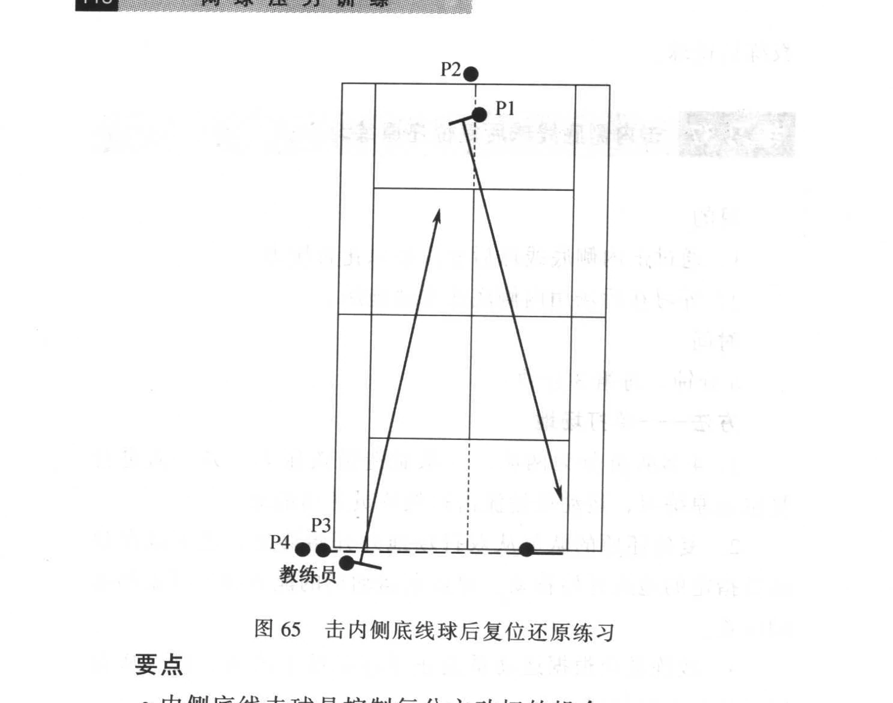

**要点**
- 内侧底线击球是控制每分主动权的机会。
- 在后场击球时的站位很重要，因此运动员应向前移动并在球的上升期击球。
- 运动员复位还原，就是要通过击斜线球重新恢复场上的主动并给进攻者增大压力。
**变化**
从左区送球至右区，用内侧底线正手回球。
### 练习 38｜内侧截击后复位还原
**目的**
通过复位练习对抗和化解对方内侧截击所制造的压力。

练习在后场击出具有压迫性的内侧截击球。
**时间**
6分钟，每组3分钟。
**方法——单打场地**
1. 分成两队，每队两名队员，一队进攻施压，另一队防守，从教练员送球开始，运动员轮流击球。
2. 复位球员从双打场地外或其他位置开始，但要依据运动员的能力决定其开始的位置。
3. 教练员送球到右区或左区，分别练习内侧反手或正手击球。
**注：此例中从右区送球。**
教练员给 P1送球使 P1 在后场击打反手截击球；P1 在后场与发球线之间击球变线至对手的左区（P1 的截击球应穿透底线）；P3回接P1 的来球，并尽量打斜线后复位还原。

直至此分结束，P2和P4 进行下一分练习。
**记录**
只记进攻者得分。两轮以后，分别计算两队的得分数，得分高者获胜。
**要点**
1. 运动员击球时角度拉得过大会导致直线高球或打得过深。从场地3/4处打内侧截击球是对付高球的高招。
2. 内侧截击球应击向对手的另一侧空当处，运动员复位还原的目的是化解攻势甚至变被动为主动。
**变化**
换区进行内侧正手截击练习。

### 练习 39｜内侧底线浅球复位还原练习
**目的**
通过复位还原，对抗和化解内侧底线浅球造成的压力。

练习中场处的内侧底线进攻性击球。
**时间**
6分钟，每组3分钟。
**方法——单打场地**
1. 分成两队各两名运动员，一队进攻施压，另一队复位还原防守，从教练员送球开始，两名运动员轮流击球。
2. 防守球员从双打场地外或其他位置开始，教练员要依据运动员的能力决定开始的位置。
3. 教练员要根据运动员是正手还是反手击球，决定从右区还是从左区送球。
**注：此例是向右区送球。**
教练员送球至中场，使P1 击内侧正手球；P1在中场处击变线球至对手的右区，并上网封网；P3跑动回球，尽量通过回斜线球或挑高球复位还原防守；P1 打完这一分；P2 和 P4接着进行下一分。
**记录**
只记进攻者得分。两轮以后分别计算两队的得分，分数高的获胜。
**要点**
- 回击中场内侧底线球的球员一般很难复位还原，因为攻方离球网较近，可以利用大角度控制对手。
- 复位的球员应该尽量回穿越斜线球，尽可能不变线，但

通常挑高球可能是最好的选择。
> 图66 内侧底线浅球复位还原练习

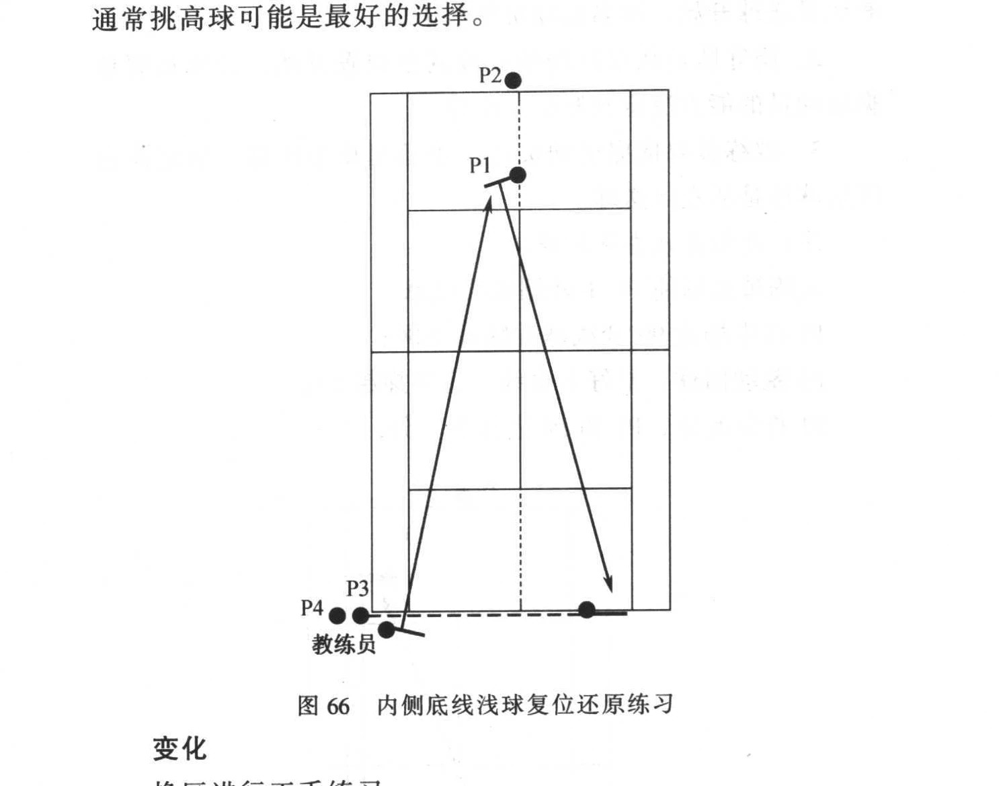

**变化**
换区进行正手练习。
### 练习 40｜外侧浅球随球上网复位还原练习
**目的**
通过复位还原，对抗或化解直线随击上网球造成的压力。

练习外侧浅球随球上网进攻。
**时间**
6分钟，每组3分钟。
**方法—单打场地**
1. 分成两队各两名运动员，一队进攻，另一队防守，从

教练员送球开始，两名运动员轮流击球。
2. 防守队员从双打场地外或其他位置开始，教练员要依据运动员的能力决定其开始的位置。
3. 教练员要依据运动员是正手还是反手击球，决定从右区送球还是从左区送球。
**注：此例是从左区送球。**
教练员送球使 P1 击外侧底线浅球。

P1 在中场击 90°变线球并随球上网；P3跑动回球，最好不变线，直线穿越P1；P1 打完此分，P2和 P4进行下一分。

P4•较练员
> 图67 外侧浅球随球上网复位还原练习

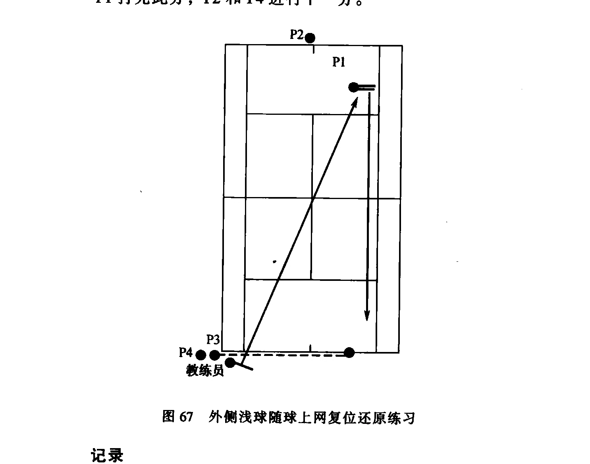

**记录**
只记进攻者得分。两轮以后分别计算两队的得分，得分高

者获胜。
**要点**
- 对大多数运动员来说，外侧底线浅球是进攻的好机会，这种随上球应保持穿透力并采用90°变线。
- 防守队员应直线穿越对手，尽可能不变线，而挑高球则是另一种选择。
**变化**
换到另一侧练习反手击球。
### 单打练习
### 练习 41｜扣失两分的网球赛
**目的**
减少下网或出边线的非受迫性失误。
**方法—单打场地**
进行一盘正常的单打比赛。
**记录**
记下比分，但下网、出边线或发球双误则记失两分。

例如，第一分P1 下网，比分为0:30，P1再在右区发球，P2 击球出底线，则比分为 15:30，P2领先。下一球P1 击球出边线，那么这一局 P2获胜。
**要点**
- 这项练习运动员开始时都不喜欢，但经过一段时间后，他们就会发现主动下网和出边线失误的情况明显减少。
- 运动员对90°变线球更加谨慎，主要原因是边线上的失误算失两分。

**变化**
1. 发球者只能有一次发球机会，而且发球失误便失两分。
2. 对于接第二发球失误的球也计失两分。
### 练习 42｜小分比赛
**目的**
练习打小分。

培养对场上各种情况的适应能力。
**方法—单打场地**
运动员抢7分或11分。
**记录**
正常记分。
**要点**
- 小分不仅能提高队员场上的速度与击球的力度，而且因为比赛接近尾声，他们也变得很兴奋。
- 几块场地同时进行，只要有一场结束，所有场地都停止，谁领先谁胜，平分加赛1分。
**变化**
1. 下网或出边线记失两分。
2. 运动员每分只能用一次发球。
3. 发球者一发时必须上网。
4. 接发球者接二发时要随球上网。
5. 每局要有3~4种组合变化。
6. 遵照变线原则进行回球（完全或部分）。
7. 一发或接二发直接得分算得两分。
8. 温布尔登抢七—运动员必须在底线内击球，当出现落在发球区内的球时要随球上网。

9. 获胜者可以有权调整下一个小分的计分规则。
### 练习 43｜抢八局比赛
**目的**
将有限的比赛时间压缩到一盘之中。
**方法—单打场地**
先胜8局者为胜，8比8时抢七。
**记分**
正常记分。
**要点**
- 将一盘比赛缩短至8局作为一场比赛。
- 这种练习适用于在时间较短的情况下进行。
**变化**
1. 下网或出边线计失两分。
2. 运动员每分只能用一次发球。
3. 发球者一发时必须随球上网。
4. 接发球者接二发时必须随球上网。
5. 要有3~4种组合变化。
6. 遵照变线原则进行回球（完全或部分）。
7. 一发或接二发直接得分算得两分。
### 练习 44｜无占先制比赛
**目的**
通过比分制造巨大压力（40:40）并压缩比赛时间。
**方法——单打场地**
1. 运动员运用无占先制进行比赛。

2. 40:40 时接发球者有权选择在哪一区接发。
**记录**
谁先赢得4分，谁就赢得一局的胜利。40:40时，接发球者选择接发球区，同样小分中6:6时也是如此。
**要点**
- 运用无占先计分制造更大的压力。
- 无占先制可用于时间有限的情况下。
**变化**
1. 下网和出边线计失两分。
2. 每分只能用一次发球。
3. 发球者一发时必须上网。
4. 接发球者接二发时必须上网。
5. 需有3~4种组合变化。
6. 遵照变线原则进行回球（完全或部分）。
7. 一发或接二发直接得分算得两分。
### 练习 45｜局点练习
**目的**
提高把握局点的能力。
**方法—单打场地**
1. 运动员打一局比赛。
2. 如果运动员没能拿下局点，其分数回到0分。
**记分**
如果运动员没能拿下局点，其分数回到0分。

例如，如果 P1 40:15领先，那么他就必须在下1分中取得这局胜利，否则分数变为0分，即比分为0:30 落后。

**要点**
- 强调一旦得到局点就要立即拿下此局。
- 此时重要的是不要懈怠和放松，一鼓作气才是最重要的。
### 练习 46｜抢4局比赛
**目的**
先赢4局即获胜利的比赛。
**方法——单打场地**
1. 进行一盘比赛。
2. 在4局中执行严谨的战术方针。
**记录**
正常记分。
**要点**
- 确保良好的开局，遵照线路变化原则，减少无谓失误（可以限制90°变线）。
- 当运动员领先时（3:1、4:0），就容易赢得这盘比赛并给对手造成压力，从而赢得下两盘比赛，这种方法使对手更容易出现失误了。
- 记住，不论运动员的水平有多高，网球是一项容易犯错的运动。

### “疯狂”练习
### 练习 47｜“疯狂”底线练习
**目的**
通过具有攻击性的无规律的送球练习，挑战运动员的底线技术、平衡能力以及脚下移动能力。
**时间**
两分钟，1分钟后轮换。
**方法——单打场地**
1. 运动员在底线回击任意落点的底线球。
2. 送球者在发球线处（“T”字型处）送球，不规律地为运动员送出正手或反手底线球。
3. 送球要具备一定的速度及难度，使运动员的技术、平衡和步伐方面得到充分的训练。
4. 1分钟后送球者与击球者调换角色。
**记录**
不记分。
**要点**
- 用随机性的送球锻炼击球者的击球能力。
- 强调在难度下保持好身体平衡，控制技术的稳定性。
**变化**
送球者通过送深、浅、左、右各种不同的球，使击球者在整场范围内击球。

“疯狂”接发球练习
### 练习 48
**目的**
锻炼运动员接各种随机的、强有力的和难度大的发球。
**时间**
1分钟右区、1分钟左区、1分钟发球、1分钟接发球共4分钟。
**方法——单打场地**
1. 球员在右区或左区接送球者的任意发球。
2. 送球者在发球线处（T型处）任意发球，击球者利用正反手接发球。
3. 发球要具备一定的速度及难度，使球员在技术和步伐移动的能力上得到充分的锻炼。
4. 接发球者与发球者每分钟互换一次角色。
5. 允许接发球者重新复位，但发球要保持较快的速率。
**记录**
不记分。
**要点**
- 发球者从发球线处利用强劲的发球，测试接发球者的控制能力及反应速度。
- 训练接发球者的移动能力。由于接发球大都是在移动中进行，因此通过击球后的回位保持身体平衡。
### 练习 49｜“疯狂”截击
**目的**
通过难度较大的任意穿越球和送球锻炼运动员的截击封网

能力。
**时间**
两分钟，1分钟后互换角色。
**方法—单打场地**
1. 运动员从T型处开始截击。
2. 送球者在底线处为截击者送任意的穿越球。
3. 送出的球要具备一定的速度及难度，使运动员在技术、平衡、步伐方面得到充分的锻炼。
4. 送球者与截击者1分钟后互换角色。
**记录**
不记分。
**要点**
- 从底线处快速送球，利用穿越球和难度较大的送球，训练截击者的移动能力。
- 截击者要注意步伐的移动，保持身体平衡并快速回位。

截击时要快速变线。
### 练习 50｜“疯狂”高压球练习
**目的**
培养高压球的能力——高与低、深与浅、右区与左区。
**时间**
两分钟，1分钟后互换角色。
**方法——单打场地**
1. 用1分钟的时间1人底线挑高球，1人网前打高压球。
2. 挑高球要尽可能地制造难度，迫使击球者在跑动中击位置过顶的来球，或在反手位击球。
3. 无论难度多大，运动员都要打高压球。

**记录**
不记分。
**要点**
- 送球者在底线送出一定速度的过顶球，以给击球者制造困难。
- 不管难度多大都要打高压球。
- 这是一个很好的练习，可增强运动员打高压球的能力。
### 练习 51｜“疯狂”高压球和截击球
**目的**
提高击随机过顶球后再打任意截击球的能力。
**时间**
两分钟，1分钟后互换角色。
**方法—单打场地**
1. 一名运动员底线送球，另一名网前击高压球并结合截击。
2. 挑高球时尽可能地增加难度，迫使击球者在跑动中击球。高压送至反手位。
3. 击一个高压球后接着再击一个截击球。
**记录**
不记分。
**要点**
- 大难度高压球与截击球相结合，强调击球后的回位与保持身体平衡。
- 正确的脚下移动十分重要，在此练习中必须强调。
- 要求在高速率下进行。
**变化**
运动员完成两个30 秒，中间休息15秒。
