双打训练作为网球重要的组成部分常常被青少年运动员所忽略，这很令人失望。因为在现代网球强调力量与压力的今天，双打练习对单打有很大的帮助。例如，双打中发球上网及封网得分等技术都对单打有很大帮助。从我的运动队中看到，单、双打之间的相互促进作用并不是巧合。总之，坚持进行双打训练是非常有益的，它能提高球员快速回合中的击球能力，运动员也发现其中充满了挑战和乐趣。

双打训练包括三个战术阶段：
- 发球与接发球阶段；
- 建立优势阶段；
- 施压阶段。

发球与接发球阶段是打好双打的秘诀——良好的发球和接发球。双打中，发球和接发球这两项技术的重要性是不言而喻的。在双打中，第一发球很重要，因为它为此分奠定了基础，高成功率的一发会让接球者处于防守态势，使本方获得网前的主动地位。双打一发与单打一发不同的是，需要更多旋转而不是速度。在发球后，强烈的旋转会令发球者有充分的时间上网进行封网。发球的落点也十分重要，因为发球者要随时考虑如何让自己的同伴抢网。

接发球的任务就是将球接过去，让这分进行下去。理想的接发球通常是将球回到发球者的脚下，这种球也有利于接发球者的同伴抢网截击得分。

另一个重要方面是建立优势阶段。双打是在斜线上进行这个阶段的。很显然此阶段不是两人同时在底线上进行，不管是单打还是双打，这样的练习不仅仅是在斜线打一两个来回就结束的。

利用一发使自己控制网前，利用拦网和高压球形成对对手的巨大压力。施加压力阶段的训练者要注重的就是截击，即封网和高压球。

双打练习要有3~4名运动员在场上。下面将就1对1、2对1和2对2这几种练习的好处进行阐述。
- 1对1：众所周知，双打的重点就是一发、接发球和一拦，这三拍球通常只有两名运动员进行—发球者和接发球者。根据经验，最明智的练习方法就是将双打当做场上只有两个人，并加以反复练习。注意力的集中也很重要。这种练习也可以给底线球员练习多拍破网的机会，底线者不要击球落网—尽量使网前者多截击几拍。
- 2对1:2对1是实施两人战术组合的最佳方法，特别体现在与之配合实施战术时。另外，2对1练习在时间和人员上最大限度地满足了双打队员的专门需要。
- 2对2：有4个人在场上，这是进行比赛的好机会。2对2练习就是模拟真实的比赛并实施战术组合。
- 双打比赛。除了常规的双打教学或练习比赛之外，双打练习还有许多种有益又有趣的训练方法。记住，一定要明确练习的目的并使之富有成效。

### 对打中的发球与接发球练习
### 练习 52｜20个第二发中路击球（1对1）
**目的**
练习双打中的前4拍技术，即发球、接发球、一拦及接发球者的第一次回球。

练习攻击发球者的突破口——两名球员中间的区域。
**时间**
不限（大约15分钟）。
**方法—半块双打场地（对角线上进行）**
1. P1 发球上网，在右区和左区各发10个二发，P2接发球回斜线。
2. 同样，P2也发20个球，P1 接发。

P1 发第二发球并随球上网；P2 回斜线低球；P1 截击斜线并封网；P2 将球击向对手的突破口——两名球员（发球者及其

想像中的同伴）的中间区域。

接着打完这一分。
**记录**
记下发球数。例如，P1 发20个二发，中18个。标准是发20个球成功17个。
**要点**
- 接发球者的第一拍球应击向“突破口”——对方两名球员的中间。

- 接发球者应该将球击向想像中的“突破口”，即使那里没有发球者的同伴。
**变化**
发球者要指定发球落点。
> 图68 20个第二发中路击球（1对1）

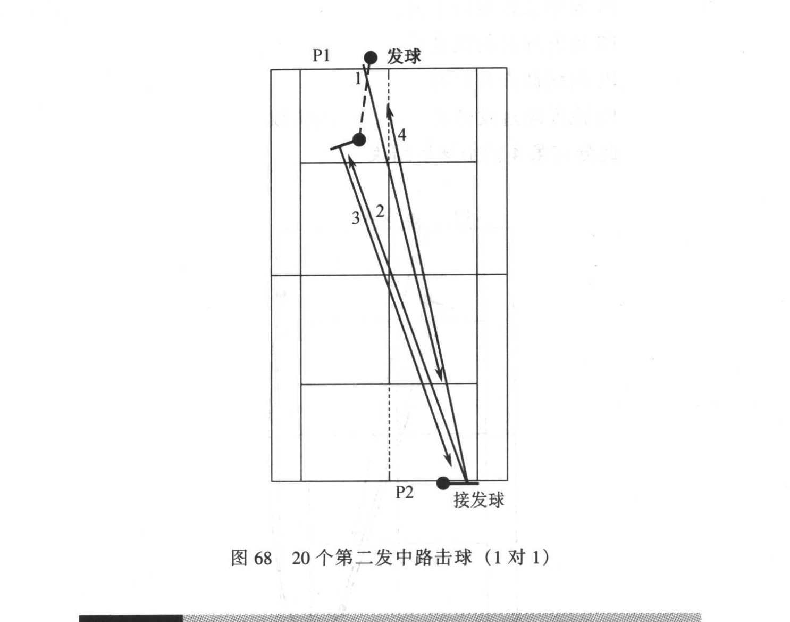

### 练习 53｜20个第二发球与挑高球
**目的**
练习双打中的前4拍技术，即发球、接发球、一拦以及接发球者的第一次回球，这里是指挑高球。
**时间**
不限（约15分钟）。

**方法——半块双打场地（对角线上进行）**
1. P1 发球上网，在右区和左区各发10个第二发球。P2接发球回斜线。
2. P2 同样发20个球，P1接发球。

P1 发第二发球后上网；P2接发球回斜线低球；P1 斜线截击并封网；P2 挑高球过发球者“同伴”的头顶。

此分在第4拍击球后结束。
> 图69 20个第二发球与挑高球

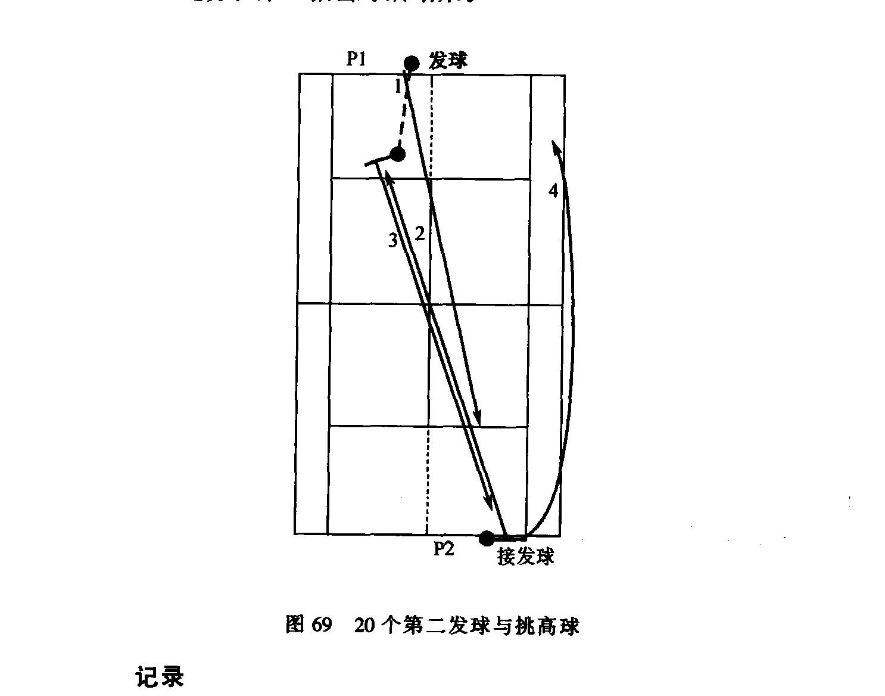

**记录**
记下发球数。例如，P1 发20 个第二发球，中18个。标准是发20个球成功17个。

**要点**
- 接发球者挑高球时，要挑过对方网前封网者的头顶—发球者“同伴”的头顶。
- 因为此练习只有两名运动员，所以应想像出一名运动员在网前，挑过其头顶。
**变化**
发球者明确发球落点。
### 练习 54｜20个第二发球与小斜线拦网
**目的**
练习双打中的前5拍技术，即发球、接发球、一拦、接发球者的第一次回球和发球方的二拦—强调大角度拦网。
**时间**
不限（约15分钟）。
**方法—半块双打场地（在对角线上进行）**
1. P1 发球，在右区和左区各发10个二发。P2接发球回斜线。
2. 同样P2也发20个球，P1 接发球。

P1 发完第二发球后上网截击；P2 接发球回斜线低平球；P1 斜线截击并封网；P2 以截击形式将球回击给 P1；P1 截击一记小角度的斜线浅球。

此分在第5拍击球后结束。
**记录**
记下发球数。例如，P1 发20个第二发球，中18个。标准是发20个球成功17个。

2&4
> 图70 20个第二发球与小斜线拦网

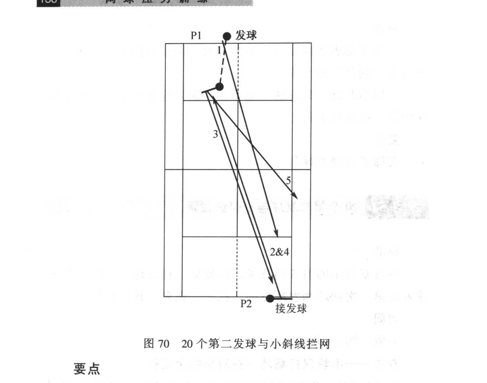

**要点**
- 发球者的第二拍截击要有角度，而且落点要浅。
- 接发球者作为合作者，要确保发球者成功地进行截击。
- 接发球者将球送至使截击者截击小斜线的位置更为理想。这是一个必须以小斜线截击对付双底线站位选手的很好的模拟练习。
**变化**
发球者明确发球落点。
### 练习 55｜接20个第二发球并随球上网
**目的**
1. 练习接第二发球后随球上网。

2. 练习对接发球者接二发时随球上网的防御能力。
**时间**
不限（约15分钟）。
**方法—半块双打场地（对角线上进行）**
1. P1 在右区和左区各发10个第二发球，P2接发球上网。
2. 同样P2 也发20个第二发球，P1 接发球上网。

P1 发第二发球并留在底线；P2 接发球回斜线并随球上网；P1 击底线落地球；P2 截击。

此分在第4拍击球后结束。
> 图71 接20个第二发球并随球上网

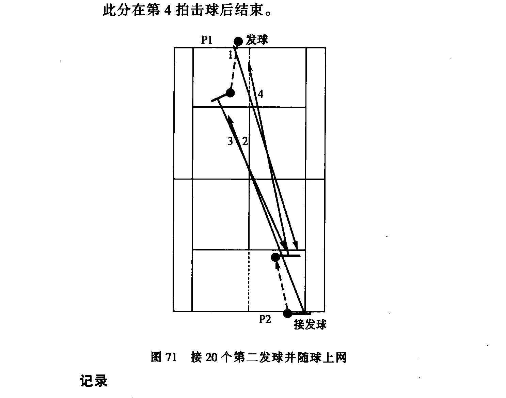

**记录**
记下发球数。例如，P1 发20个第二发球，中18个。标准

是发20个球成功17个。
**要点**
- 为了在发球区内获得有利的网前截击位置，接发球者应在接发球后随球一起向前移动。
- 为了有足够的上网时间和获得有利的站位，接发球者可以利用切削球上网。
- 发球者应确保接发球者能上网截击，理想的方法是击反弹球。
**变化**
1. 发球要明确落点。
2. 可用切削技术接发球。
### 练习 56｜双打斜线发球上网（1对1）
**目的**
提高双打中发球、接发球和一拦的技术。
**时间**
3~4分钟。
**方法——半块双打场地（对角线上进行）**
1. 每分只能用一次发球，运动员在半块双打场地上进行发球上网。
2. P1 发两分球，一分在右区，另一分在左区，P2也一样。

P1 发球上网；P2 接发球回斜线球；P1 截击斜线球直至此分结束。
**记录**
比分。

> 图72 双打斜线发球上网（1对1）

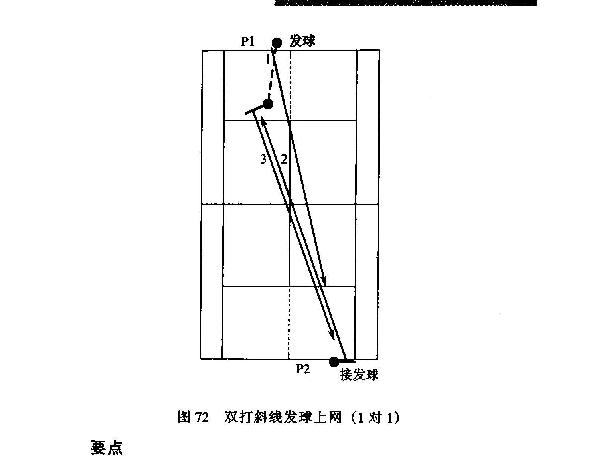

**要点**
- 这个练习强调了发球、接发球和一拦的重要性，并能很好地发现队中最优秀的双打选手。
- 因为此练习由两个人在斜线半区进行，要想得分就要通过击低平的脚下球、挑过顶高球、追身球或中路穿越球来实现。
**变化**
1. 可在双方的右区进行，也可在左区进行。
2. 有两次发球机会。
3. 网前非受迫性失误记失两分。
4. 发球、接发球或一拦失误记失两分。
5. 接发球者在接发之后必须上网。
6. 限定是否挑高球。

7. 发球者明确发球落点。
### 练习 57｜在发球者有同伴的情况下，发20个第二发球（2对1）
**目的**
提高发球者同伴的抢网能力。
**时间**
不限（约20分钟）。
**方法——双打场地**
1. P1 在右区和左区各发10个二发，P2 接发球击向中心网带方向，P3进行抢网。
2. 同样P2发20个二发球，P3接发，P1 抢网（原发球者变为抢网者，抢网者变为接发球者，接发球者变为发球者）。

P1 发第二发球；P2接发球至网带中心方向；F3 对接发球进行抢网，截击斜线。

此分在3拍后结束。
**记录**
第二发球的数目。
**要点**
- 这个练习中增加的变化就是抢网者和发球者两人在网前的移动。
- 如果发球者看到同伴处于场地同侧位置，那么他们的网前移动要配合一致。
- 抢网者应向网带中央斜线方向移动抢网。
**变化**
1. 接发球者转向内侧回球。P3要在移动之前，通过接发球者是击内侧还是外侧球来了解场上的情况。

发球者的同伴
> 图73 在发球者有同伴的情况下，发20 个第二发球（2对1）

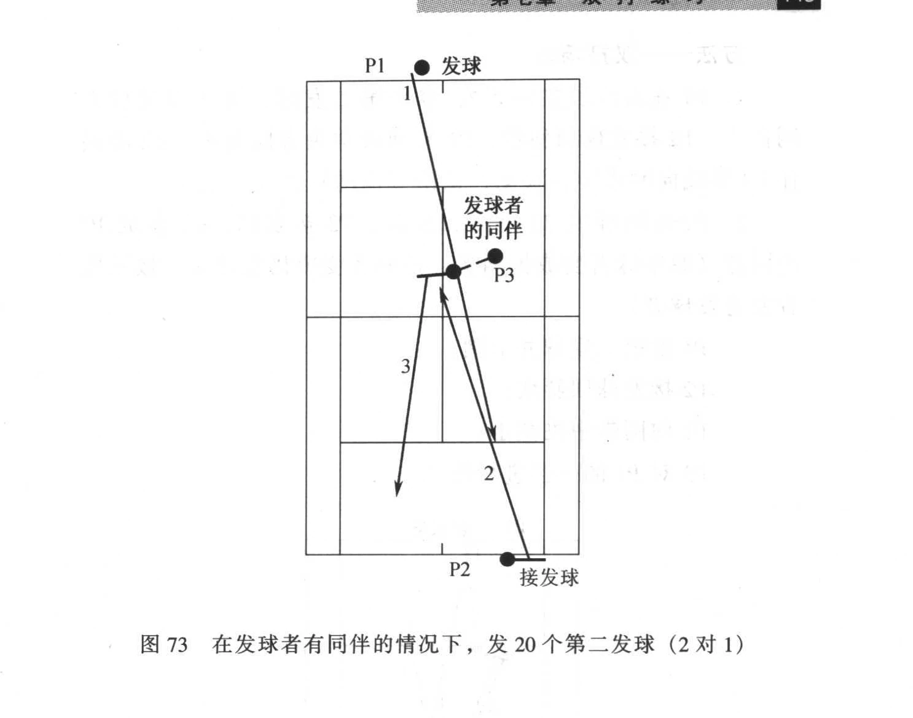

2. 发球方要在跑动中击球。
3. 发球者发球上网，接发球者可以将球回击到任何区域，发球者的同伴仍然要争取抢网。
4. 指定发球落点。
### 练习 58｜在接发球者有同伴的情况下，发20个球（2对1）
**目的**
1. 提高接发球者同伴的抢网能力。
2. 练习发球上网及接发球。
**时间**
不限（大约20分钟）。

**方法——双打场地**
1. P1 在右区和左区各发10个第二发球，每次发球后上网截击；P2 接发球回斜线；P1 向网带中央方向截击；P2的同伴 P3斜线向网带中央移动，截击（抢网）P1的一拦。
2. P2 也同样发20个第二发球，P3接发球，P1 变成 P3的同伴（原发球者变成抢网者，抢网者变成接发球者，接发球者变为发球者）。

P1 发第二发球并上网；P2 接发球回斜线；P1 向网带中央截击；F3对P1 的一拦进行抢网。

接发球者的同伴
> 图74 在接发球者有同伴的情况下，发20个球（2对1）

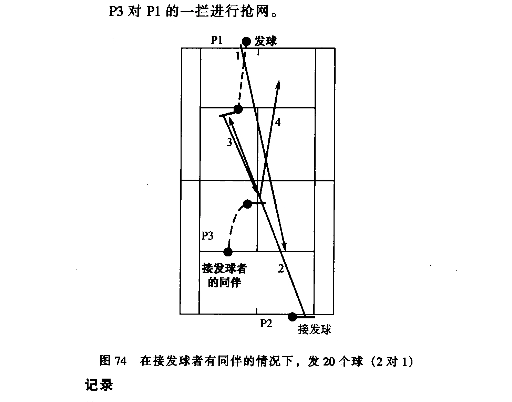

**记录**
第二发球数。

**要点**
- 在20个发球练习中加一些变化，使接发球者的同伴在接发球后，两人在移动中能够很好地配合。
- 如果同伴处于场地同侧位置，他们之间的互相协调是非常重要的。
**变化**
1. 发球者的截击要限定落点，接发球者的同伴仍要争取抢网，但必须考虑发球者一拦的质量。
2. 发球者指定发球落点。
### 练习 59｜接发球方对一名发球者（2对1）
**目的**
提高接发球方的配合技巧，着重练习网前接发球者同伴的技能。
**时间**
9分钟，每3分钟换一次角色，即发球者、接发球者和接发球者的同伴。
**方法——双打场地**
1. 发球者发第二发球后上网。
2. 此分中接发球者只能打斜线，但发球者和接发球者的同伴可以向场地各位置击球。
3. 发球者在右区和左区交替发球。

P1 发完第二发球后上网截击；P2 接发球回斜线；P3 争取抢网直至此分结束。
**记录**
发球者赢得的分数。

**要点**
- 在此练习中，接发球方应将注意力集中在相互间的协调配合上，并提高网前同伴的抢网能力。发球者强调发球后的上网。
- 发球者可以通过发内角球限制接发球者的回球角度。
- 接发球者要使发球者进行一拦。

按发球者的同伴
> 图75 接发球方对一名发球者（2对1）

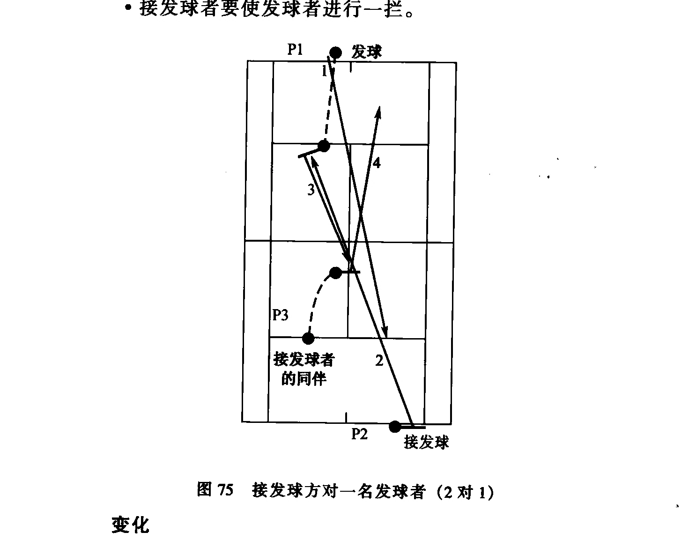

**变化**
1．练习在左右区依次进行。
2. 当出现浅球时，发球者才能从底线处向前移动。
3. 发球者可以有两次发球机会。
4. 发球者有两次发球机会，但只能用第二发球。每局只有3分钟的时间，一旦超过时间，则每球只有一次发球机会。
5. 接发球者必须随球上网。

6. 发球者指定落点。
### 练习 60｜发球方对一名接发球者（2对1）
**目的**
提高发球方的配合技巧，以及发球者同伴的网前能力。
**时间**
9分钟，每名运动员分别用3分钟做发球者、接发球者和发球者的同伴。
**方法——双打场地**
1. 发球者发完第二发球后上网截击。
2. 发球者只能打斜线而接发球者和网前者可以将球击向场地任何位置。
3．发球者在右区和左区交替进行发球。

P1 发第二发后上网截击；P2 接发球回斜线；P3 注意抢网，直至此分结束。
**记录**
只记接发球者的得分。
**要点**
- 发球方的主要任务是发球上网，其同伴做假动作抢网。
- 接发球者要使发球者能进行一拦，然后再通过挑高球或击球至发球方的中路空当为发球方创造得分机会。
**变化**
1. 在左区和右区交替进行。
2. 发球者留在底线，只有出现浅球时才可以上网。
3. 发球者有两次发球机会。
4. 发球者虽有两次发球，但只能用第二发球。每局只有

3分钟，时间用完后每分只能有一次发球机会。
5. 发球者指定发球落点。

的同伴
> 图76 发球方对一名接发球者（2对1）

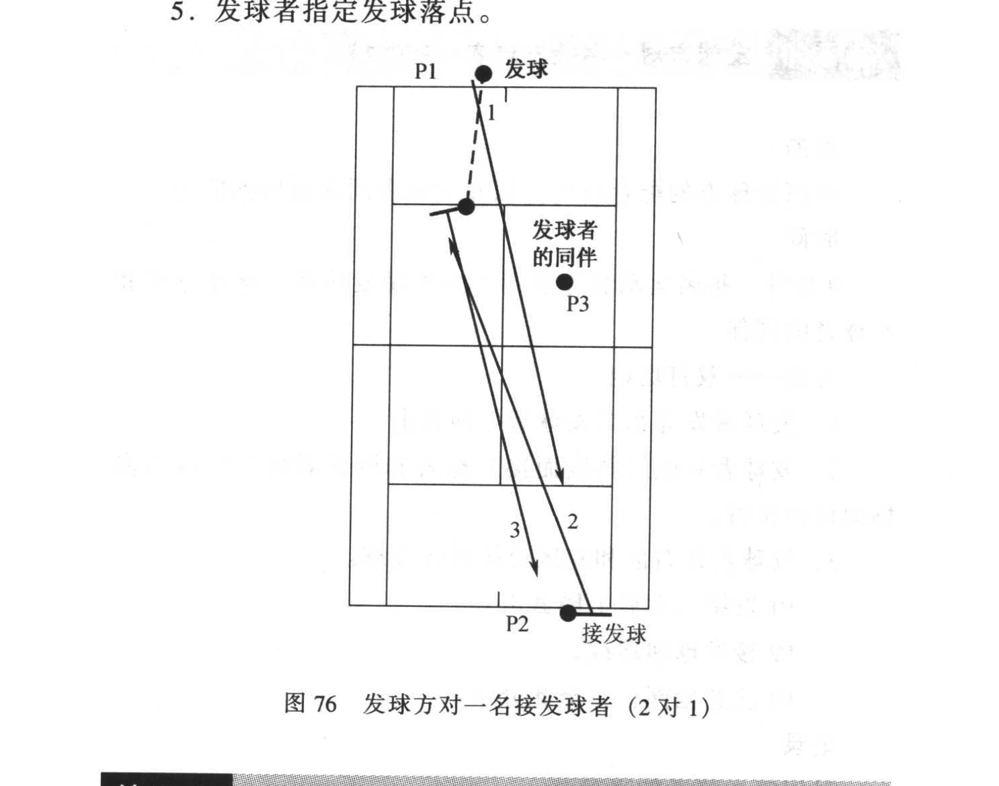

### 练习 61｜双打发球上网截击对双底线（2对2）
**目的**
提高接发球者底线回球的能力。
**时间**
8分钟，分成两个4分钟进行。
**方法——双打场地**
1. 常规的双打比赛就是发球方在网前截击，而接发球方在底线。
2. 每方发球4分钟，每名球员2分钟。

- 发球
发球者的同伴
- 
- 接发球者的同伴
> 图77 双打发球上网截击对双底线（2对2）

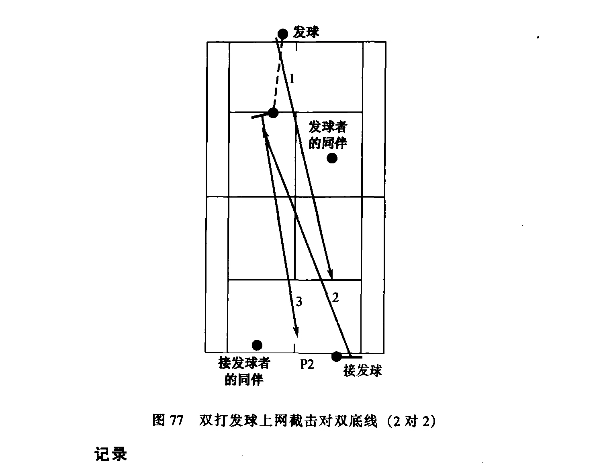

**记录**
比分。
**要点**
- 优秀双打选手必须熟悉与双底线型选手较量的打法。
- 在与双底线选手较量时，网前者会有不同步的感觉，这是因为其没有明确的攻击目标和方向。
- 发球方要耐心通过击中路球制造空当，再争取得分。
- 接发球方也要耐心通过高质量的破网球使网前者出现失误。
**变化**
1. 当回接第二发球时，可以用切削球接球，此时接发球方采用传统的一前一后站位形式。

2. 接发球方的非受迫性下网失分不能超过两分。
3. 通过送球方式进行练习。
4. 发球者指定发球落点。
### 建立优势阶段
### 练习 62｜双打中的斜线练习（1对1）
**目的**
提高在底线相持中建立优势的能力。
**时间**
3~4分钟。
**方法—半块双打场地（对角线上进行）**
1. 运动员在底线上击斜线球，并复位到指定的画线处。
2. 在右区进行正手练习，在左区进行反手练习。
3. 此练习在左右斜线上都可进行。
4. 运动员各发两分球。

P1 发球后留在后场；P2 接发球回斜线；P1 以斜线回击落地球。

此分一直在斜线上进行。
**记录**
每1分。
**要点**
- 这个练习与单打斜线练习形式相似，但要打出双打的场地范围。
- 斜线练习是使球员在双打区域内进一步加强底线技术，

> 图78 双打中的斜线练习（1对1）

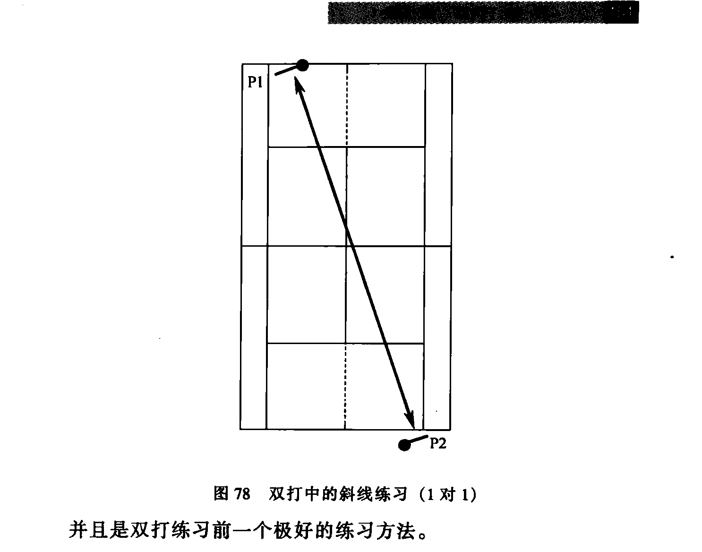

并且是双打练习前一个极好的练习方法。
- 可以将单打边线作为击球的目标。
**变化**
1. 发球上网截击、放小球、切削球和进攻性挑高球在斜线上进行。
2. 下网失误记失两分。
3．运动员有两次发球机会。
4. 对发球者限定发球落点。

### 施加压力阶段
### 练习 63｜只能落地两次的双打发球和接发球练习（1对1）
**目的**
提高发球者和接发球者的快速上网技术，以及主动进攻和上网截击的意识。
**时间**
3~4分钟。
**方法——半块双打场地（对角线上进行）**
1. 此分在斜线上进行并只有一次发球机会。
2. 发球者发球上网截击，接发球者接发球上网。
3. 每名运动员发两分球（左右区各1分）
4. 只有在发球和接发球时，球可以落地两次，其余均为凌空球。

P1 发球后上网；P2 接发球回斜线并上网；P1 截击或击反弹斜线球；P2 截击斜线。

直至此分结束，球不能落地。
**记录**
比分。发球者一拦后不能打反弹球，否则判失分。
**要点**
- 此练习能够培养运动员积极上网的意识。教练员不用再提醒运动员上网，而运动员也别无选择。
- 这是一个提高快速来回截击能力的练习。

P2 接发球
> 图79 只能落地两次的双打发球和接发球练习（1对1）

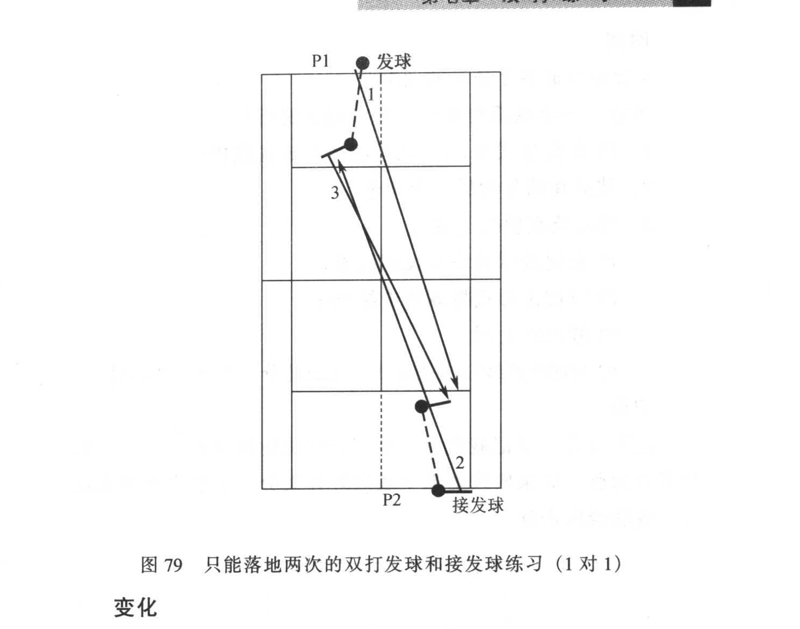

**变化**
1. 练习可以在左右区交替进行。
2. 发球者有两次发球机会。
3. 网前的非受迫性失误记失两分。
4. 发球、接发球和一拦失误记失两分。
5. 规定是否可以挑高球。
6. 对发球者指定发球落点。
### 练习 64｜双打斜线截击对底线（1对1）
**目的**
1. 练习快速截击球和底线球。
2. 练习在对付底线深球时提高手上快速调整能力。

4分钟分成各2分钟的两部分。
**方法——半块双打场地（对角线上进行）**
1. P1 在发球线处，P2 站在底线上或底线内。
2. 球员在两分钟后互换角色。
3. 练习要在斜线上进行。

P1 送斜线球并站在发球线处；F2 以截击形式将球回击给P1；P1 截击并上网；P2 只能在底线以内或底线上完成此分，不允许挑高球。
**记录**
记下每分，只记截击者分数，两球员轮换计算总得分，得分多者为胜。如果底线者退至底线外计失分，底线者必须在底线上或底线内击球。
> 图80 双打科线截击对底线（1对1）

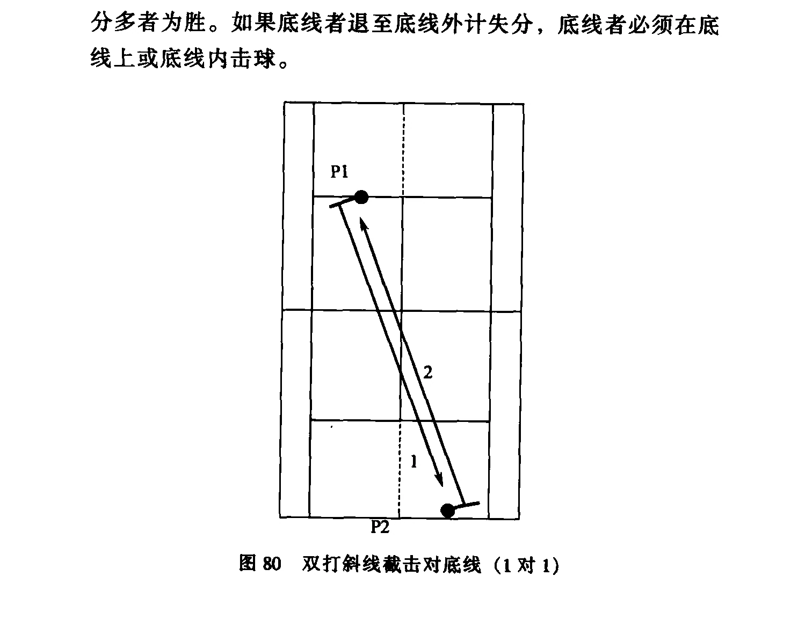

**要点**
- 这项练习与单打练习十分相似，区别是在双打场地进行。
- 运动员要保持在底线上或底线内的站位，并对底线深球进行快速回击。
- 这是一个网前快速相互对抗的练习。
**变化**
1. 非受迫性下网失误记失两分—包括截击或底线击落地球。
2. 底线者可以在网前者的两拍截击后挑高球。
3. 底线者将球击向网前者的脚下，使其只能打反弹球（练习击脚下球技术的好机会）。
### 练习 65｜双打中一人上网截击（1对1）
**目的**
1. 练习随球上网、一拦和截击高压球结束此分。
2. 练习化解对方的进攻。
**时间**
3~4分钟。
**方法—半块双打场地（对角线上进行）**
1. 双方球员都从底线开始。
2. P1 和P2各发两分球。
3. 在左右区进行都可以。

P1 送斜线球至发球线处，并留在底线；P2 随球上网回斜线给 P1；P1 以斜线回击落地球，使P2截击或打反弹球；P2 截击并打完此分。

> 图81 双打中一人上网截击（1对1）

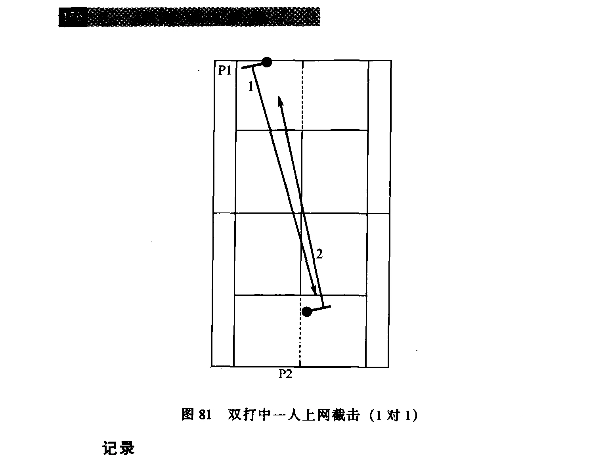

**记录**
比分。
**要点**
- 除了在双打场地范围内进行外，其余要求与在单打练习中相同。
- 浅球时运动员可练习随球上网。
- 底线者要确保截击者的一拦能够控制住球，截击者要确保一拦的深度，从而获得良好的站位使其通过截击或高压得分。
**变化**
1. 规定是否可以挑高球。
2. 底线者下网记失两分。
3. 用切削球上网。

4. 除了送球，也可以用第二发球，然后接发球者随球上网。
### 练习 66｜双打双上网截击（1对1）
**目的**
练习随球上网以及在近网时的快节奏截击。
**时间**
3~4分钟。
**方法——半块双打场地（对角线上进行）**
1. 双方球员都从底线开始。
2. P1 和P2各送两分球。
3. 在左右区进行都可以。

P1 斜线送球至发球线处然后上网；P2随击斜线短球给 P1 并上网，P2必须回短球给P1（不能穿越）；P1 截击斜线球给 P2；P2 截击，直至此分结束。
**记录**
比分。
**要点**
- 除了在双打场地范围内进行外，其余的要求同两名单打近网截击练习。
- 截击出低平球才能保证主动，一旦截出高球，就会陷人被动局面。
**变化**
1. 规定是否可以挑高球。
2. 运动员采用切削球上网。

> 图82 双打双上网截击（1对1）

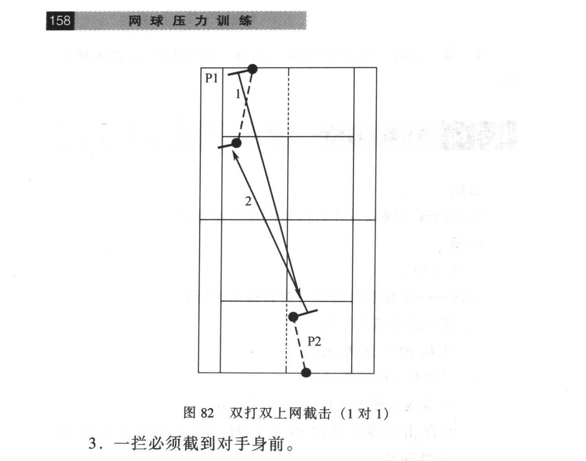

3. 一拦必须截到对手身前。
### 练习 67｜双打中的高压球练习（2对1）
**目的**
练习在面对双底线站位时，击出较深的、中路的或大角度的高压球。
**时间**
3×3分钟。
**方法——双打场地**
1. 开始时 P1 在发球线处，P2、P3在底线处。

P1 从“T”字处送球给P2或P3；P2或P3 将球截击给 P1；

P1上网截击；P2或P3挑高球；P1 高压球；P2或P3挑高球或击落地球直至此分结束。

P2 和P3必须将落地球击向 P1，可用挑高球的形式将球挑向对方场地的任何位置。
2. 一旦高压球被击中，此分结束（P2和P3此后不必挑高球）。如果第一拍高压球失误或挑出的高球无法击打，就以上述顺序重新开始，直到击打过顶球成功此分才开始有效。
3. 按顺时针轮换，每人都有机会在右区和左区防守。
> 图83 双打中的高压球练习（2对1）

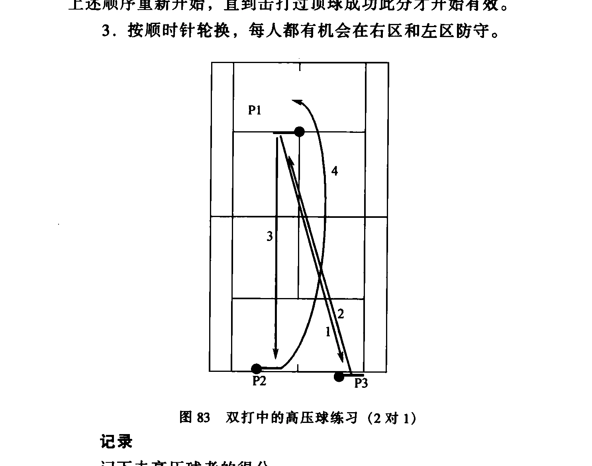

**记录**
记下击高压球者的得分。
**要点**
- 击高压球者练习如何对抗双底线选手的方法。

- 战术上，击高压球者在将球压至边线之前应先将球击向中路，尤其是在底线者挑深球时。
- 靠近网前更容易击出大角度的高压球。
**变化**
P1 截击后，P2 和 P3必须挑高球。
### 练习 68｜双打中给接发球方施加压力（2对2）
**目的**
培养在接第二发球时力争占据网前有利位置，以及在第二发时防守接发球方随球上网的能力。
**时间**
5分钟。
**方法——双打场地**
1. 运动员从一般的双打站位开始，每分只有一次发球机会。
2. 发球者可以发球上网也可以留在底线。
3. P1 和P3各发4分球，随后P2 和P4 也各发4分球。

P1 发一个第二发球；P3 接发球回斜线并随球上网；P1 截击或击落地球直至此分结束。
**记录**
比分。
**要点**
- 主要练习接发球者通过接第二发球后上网给对方施加压力。
- 比较理想的是回低平球至发球上网截击者的脚下。同时，此练习的重点是接发球者，应根据接发球者的不同情况满

> 图84 双打中给接发球方施加压力（2对2）

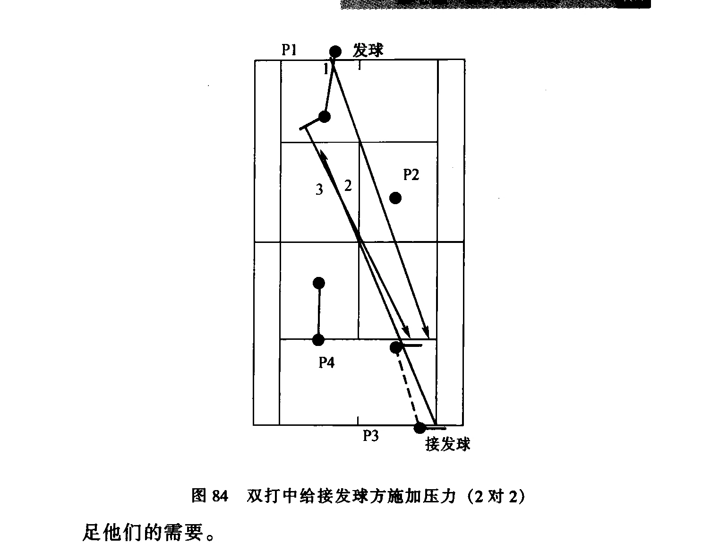

足他们的需要。
- 接发球者可以利用切削球接发，使自己有足够的时间在网前占据有利位置。
**变化**
1. 发球者要留在后场。
2. 接发球者的同伴争取抢网。
3. 抢网得分记两分——发球方或接发球方都可以抢网。
4. 接发球者可以切削或挑高球至发球者同伴的后场并前移上网。
5. 对发球者指定发球落点。

### 练习 69｜双打中接发球者同伴进行抢网（2对2）
**目的**
培养在接第二发球时接发球者同伴的抢网，以及防守接发球者同伴的抢网能力。
**时间**
5分钟。
**方法——双打场地**
1. 运动员从传统的站位开始，发球者有一次发球机会。
2. 发球者可以发球上网截击也可以在后场。
3. P1 和P3各发4分球，随后P2和P4 也各发4分球。

P1 发球上网截击；P3 接发球回斜线；P1 斜线截击或击落地球；P4抢网，直至此分结束。
**要点**
- 抢网后球拍几乎能触到球网，接发者的同伴通过接第二发球的机会向网带中央方向移动进行抢网。
- 对方发球上网就要回低平球给发球者，如果对方在后场，就要尽量将球打深。接发球者的目的就是为同伴创造抢网机会。
- 接发球者的同伴再次向网带中央方向移动至足够近的距离（几乎用球拍触到球网）。
**变化**
1. 发球者站在后场。
2. 接发球后上网。
3. 抢网得分记两分。

P3“接发球
> 图85 双打中接发球者同伴进行抢网（2对2）

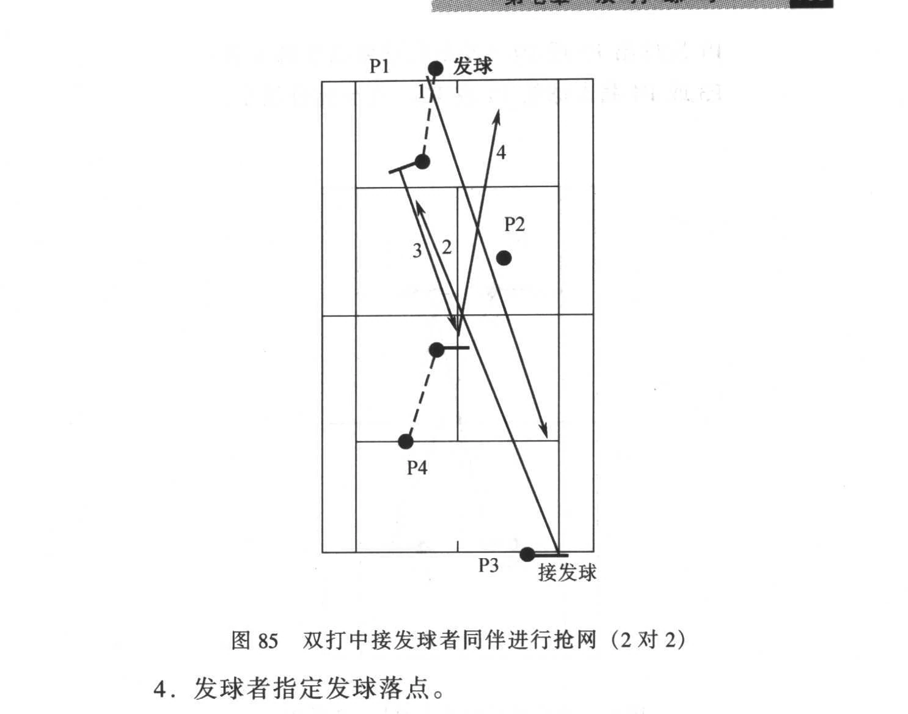

4. 发球者指定发球落点。
### 练习 70｜双打中的快节奏对拦（2对2）
**目的**
提高快节奏对拦及两人默契配合的能力。
**时间**
3~5分钟。
**方法—双打场地**
1. 4名队员都在发球线处开始。
2. 每名队员拿2~3个球，发球顺序是P1、P3、P2 和 P4，反复轮换，直到时间用完。
3. 每分队员都在发球线处回球。

P1 发球给P3或P4（发出的球要高于膝关节）；P3或P4截击球给P1 或 P2，直至此分结束。
> 图86 双打中的快节奏对拦（2对2）

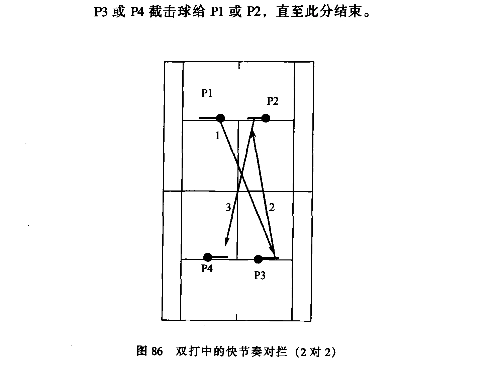

**记录**
比分。
**要点**
- 双方从发球线处开始，强调两人击球时的封网移动配合能力，争取主动并作出简短快速的截击动作。
- 两人之间也可以用2.5米长的医用橡皮管系在一起，提高相互间的配合能力。
**变化**
1. 由教练员发球。
2. 规定是否可以挑高球。

### 练习 71｜双打中一人近网截击（2对2）
**目的**
1. 练习一前一后站位对双网前站位。
2. 练习对抗一前一后站位的选手并得分。
**时间**
5分钟。
**方法—双打场地**
1. 运动员从传统的双打站位开始。
2. P1 在底线右区送两分球，然后P2 在底线左区送两分球，P3和 P4 同样也送两分球。

P1 送球至发球线并呆在底线；P3上网回击斜线球给 P1；P1 击落地球给P3，让 P3截击或击反弹球直至此分结束。
**记录**
比分。
**要点**
- 这个练习模拟了双打比赛中一方两人网前站位和另一方一前一后站位的对抗模式。
- 网前者要保持击球的攻击性，至少要在第二拍截击后创造出最后得分的机会。
- 底线运动员应注意将球回至网前者之间，或者击出低平的斜线球使对方截出高球，为本方网前者创造抢网截击的机会。
- 从战术上讲，网前运动员作出第一拍截击后，再使用挑高球则很有效。

- 
> 图87 双打中一人近网截击（2对2）

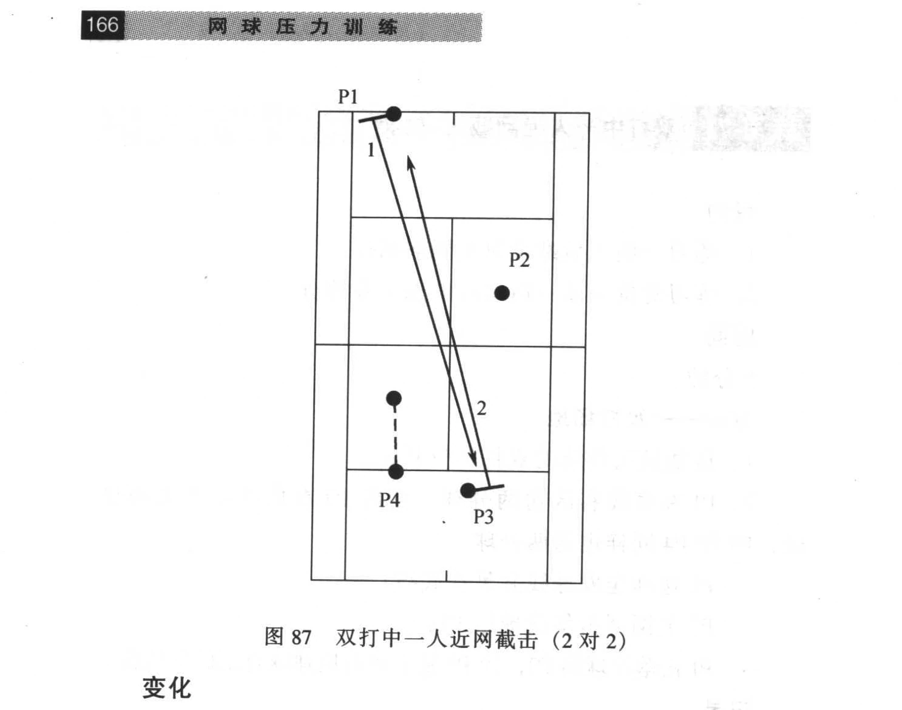

**变化**
1. 规定是否可以挑高球。
2. 底线球下网记失两分。
3. 采用切削球随球上网。
### 练习 72｜双打中一方近网截击（2对2）
**目的**
培养双人上网并对抗双底线运动员的得分能力。
**时间**
5分钟。
**方法—双打场地**
1. 双方运动员开始时都站在底线。

2. 斜线送球，每方轮换送4分球—两分在右区，两分在左区。

P1 送斜线球至发球线处并留在底线；P3 击随击球至对方中路并与 P4同时上网；P1或P2 击落地球让 P3、P4 截击或击反弹球，直至此分结束。
> 图88 双打中一方近网截击（2对2）

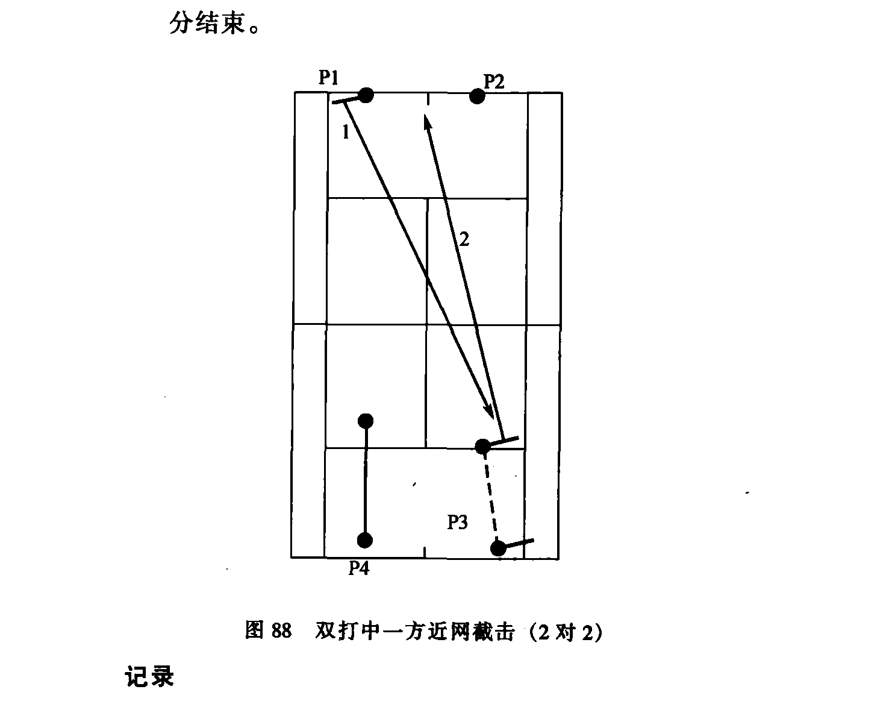

**记录**
比分。
**要点**
- 此练习与比赛中双网前对双底线的对抗模式相同。
- 网前者练习截击两底线者之间的中路球，及小斜线浅球，并保持耐心，或集中火力攻击一人，创造得分机会。
- 从战术上讲，在对方作出第一截击后，再使用挑高球来

阻止对方的进攻是很有效的。
**变化**
1. 规定是否可以挑高球。
2. 底线球下网记失两分。
3. 采用切削球随球上网。
### 练习 73｜双打中的高压球练习（2对2）
**目的**
提高双网前对双底线时的高压球得分能力。
**时间**
2×2分钟或2×3分钟。
**方法——双打场地**
1. 送球方对双底线方。
2. P1 送两分，P2再送两分，两人轮换直到时间用完为止。
3. 互换角色—双高压方变成双底线方。

P1 送斜线球至对方3/4场地处并上网；P3回斜线球给 P1；P1 向中路截击；P3或P4 挑高球（此分从现在开始）；P1 或P2击高压球，直至此分结束。
**记录**
比分。
**要点**
- 对于比较深的高球，击球者先将球击至中路，再击向边线。击球者距网越近，击球的角度就越大。
- 应对双底线时，截击小斜线非常有效。

> 图89 双打中的高压球练习（2对2）

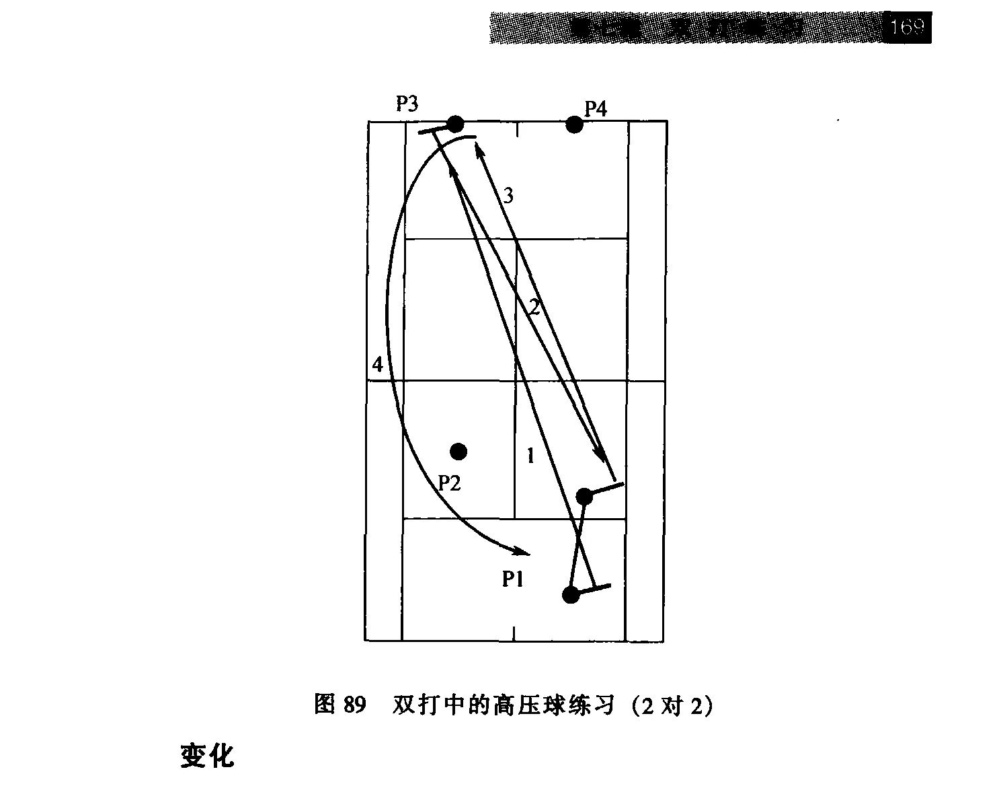

**变化**
1. 双底线运动员要在对方第一次截击后再挑高球。
2. 双底线运动员可以让网前者截击一两个球后再挑高球。
3. 击出高压球后才开始计分。
### 双打比赛
以下的双打比赛练习，包括整盘和抢七的形式进行比赛，每种练习都有很多不同的变化，教练员要针对运动员的个人特点进行专门练习。例如，一组运动员每分都要发球上网截击，而另一组每分只有一次发球机会。

### 练习 74
### 双打1对1的形式
**目的**
提高发球上网截击、接发球以及一拦的技术。
**方法——半块双打场地（对角线进行）**
1. 两名运动员以双打形式击斜线球，并想像场地中路也有一条边线。
2. 运用常规计分方法记分。
**要点**
- 此练习是评估双打队员能力水平的好办法。
- 主要练习发球上网、接发球和一拦。
**变化**
1. 采用常规或无占先计分制。
2. 下网记失两分。
3. 运动员每分只有一次发球机会。
4. 运动员每局只有两次二发的机会。
5. 接发球者接完发球后，必须向前移动。
6. 运动员必须发球上网截击。
7. 两次触地（球只能触地两次—发球方和接发球方各一次）。
8. 对发球者限定发球落点。
9. 除了采用盘的形式还可以抢七的形式进行。
### 练习 75｜双打两次触地练习（2对2）
**目的**
培养发球和接发球者积极上网给对手施压的意识。

**方法—双打场地**
1. 打一盘双打比赛。
2. 球只能落地两次——发球和接发球方各一次。
3. 其他情况球落地都算失分。
**要点**
- 这是克菜格•泰力发明的练习，目的是迫使双打运动员的打法具有侵略性和攻击性。
- 运动员应该尽可能地将球击向对手的脚下。
**变化**
1. 采用常规或无占先计分方法。
2. 运动员在每分中只有一次发球机会。
3. 运动员在每个发球局中只有两次发二发的机会。
4. 发球者指定发球落点。
6. 不能挑高球。
### 练习 76｜双打比赛（2对2）
**目的**
在实战的情况下，练习双打比赛。
**方法——双打场地**
采用常规或先胜8局者赢得一盘比赛的计分方法。
**记录**
常规方法计分。
**要点**
运动员对场上的各种变化要集中注意力并努力发挥自身的长处，改进不足之处。
**变化**
1. 接发球方采用双底线站位。

2. 在对方二发时，接发球者的同伴要力争抢网。
3. 接发球者必须接完发球后随球上网。
4. 接发球一方要向前移动（兼有变化2和3）。
5. 采用常规或无占先的计分方法。
6. 非受迫性下网失误记失两分。
7. 运动员在每分中只有一次发球机会。
8. 每个发球局中只有两次第二发球的机会。
9. 运动员必须发球上网截击。
10. 两次落地（球只能落地两次—发球与接发球方各一次）。
11. 发球者指定发球落点。
### 练习 77｜双打抢七（2对2）
**目的**
练习双打抢七。

按规定条件练习双打并注意不同的战术。
**方法——双打场地**
1. 两对运动员进行双打比赛。
2. 一块场地结束后，其他场地不管比分多少也停止比赛。
**要点**
- 抢七既有趣又刺激，4名队员必须时刻集中注意力，因为比赛很快会结束。
- 对于如何处理场上各种不同的形势，抢七练习是一种很好的方法。
**变化**
1. 接发球方双底线站位。
2. 接发球者的同伴在对方二发时要力争抢网。

3. 接发球者必须在接完球后向前移动。
4. 接发球方要向前移动（兼有变化2和3）。
5. 非受迫性下网失误记失两分。
6. 运动员每分中只能发一种发球。
7. 运动员在每个发球局中只有两次二发的机会。
8. 必须发球上网。
9. 两次触球（球只能落地两次——-发球与接发球方各一次）。
10. 对发球者限定发球落点。
11. 获胜者有权选择下一个抢七的要求。
