进行适当的热身是十分必要的，它是为激烈的比赛或训练做好身体和心理准备的一种方式。热身练习还可以用来传播和巩固技战术意识，为即将进行的练习做好准备。压力训练的组织性和纪律性很强，运动员必须通过热身为下面的练习做好准备。例如，练习双打前，就要通过截击、底线对截击、内角发球和斜线接发球等练习进行热身。从这个例子可以看出，压力训练之前的热身练习，可以提高网球的战术意识。

重要的是：
- 在热身之前通过慢跑和伸展性练习，使机体得到充分的准备。
- 热身练习是一种协作而不是竞争，没人渴望在热身中争取胜利。
- 在练习发球时，运动员总要先发几个球做热身。

下面的热身练习可以在每天的练习中进行。
### A 5分钟热身
在正式的比赛中，运动员通常只有5分钟的练习时间，而5分钟的时间足够用于一般的热身。运动员一般都喜欢这5分钟的热身，因为他们可以自由选择热身的内容。
**变化**
热身量多5~10分钟。休息2~3天后这种热身非常必要。

### B 上旋球热身练习
上旋球热身是控制过网高度的一种很好的练习方法，一般由两名运动员在以下位置进行外侧斜线击上旋球：
1. 发球线处；
2. 场地3/4处；
3. 底线处。

运动员向目标击球的练习
> 图90 上旋球热身练习

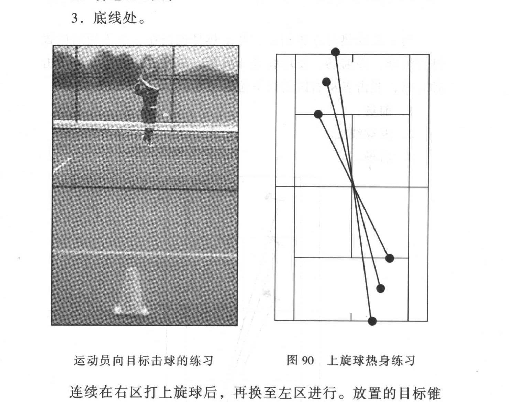

连续在右区打上旋球后，再换至左区进行。放置的目标锥形物是运动员集中击球时的目标落点。

每次连续对攻至少1分钟。例如，运动员在发球线处对攻1分钟，然后再在后场处对攻1分钟。所有的击球都要采取外侧击上旋球的技术。

**变化**
1. 每名运动员只备一个球，如果出现下网失误要立刻跑步捡球重新开始。
2. 运动员可以在底线击球时用较多的时间，如两分钟。
**注：运动员用两分钟练习发球。**
### C 截击热身练习
与上旋球热身方法相似，截击热身也是在三个不同的位置打斜线球，即前场、发球线处及后场。陪练者站在底线与截击者对练，截击者从右区的以下位置开始击球：
1. 前场；
2. 发球线处；
3. 后场。
> 图91 截击热身练习

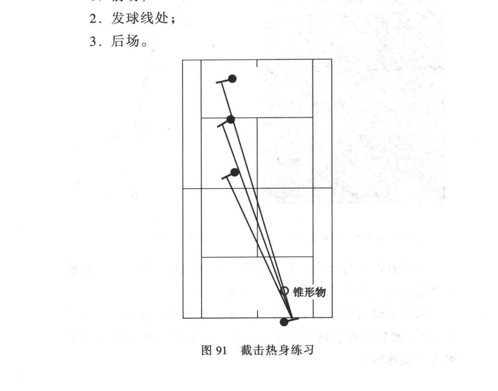

在右区连续击打后，换至左区击球，每个位置的练习至少1分钟。例如，运动员在前场击球1分钟后再到发球线处击球1分钟，再到后场处击球1分钟。

每名运动员至少要进行6分钟的截击练习，共计12分钟。

锥形物放在底线击球者的前方，即场地的后场，以帮助击球者控制落点。
**注：运动员用两分钟时间练习发球。**
### D一前一后热身练习
这种一人底线一人网前的热身练习是一种很好的双打准备活动。一人击底线球，一人截击，两人在斜线上进行外侧击球，练习需要两人的相互配合。将锥形物放在后场处以帮助截击者控制落点。截击者的每一球从发球线处开始，运动员在右区和左区至少进行各两分钟的截击练习，然后互换角色（前后）进行同样的练习。练习时间为8分钟。
**变化**
底线运动员的击球要始终保证一定速度。截击者要控制好每
> 图92 一前一后热身练习

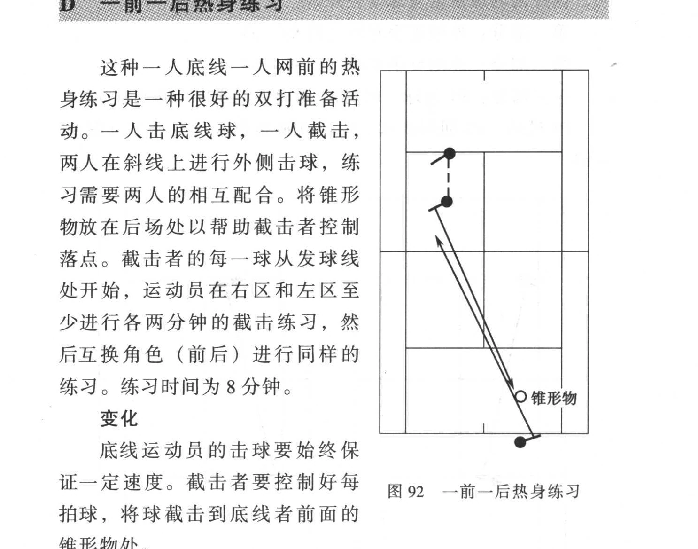

拍球，将球截击到底线者前面的锥形物处。
**注：运动员用两分钟时间练习发球。**

### E小场地线路练习
小场地是一项特别有效的热身和战术练习方法。双方运动员站在发球线处打半块双打场地，要着重强调小场地落地球和截击球的线路。在热身之前确定使用切削击球还是上旋击球。

提醒运动员脚步要不断移动。确定击球区域将很有效，因为第一次做此项练习的运动员总是将球击得太深，由于是小场地练习，因此两名球员从发球线处开始。
第一部分：外侧正手对拉（图93-a）
第二部分：外侧反手对拉（图93-b）
第三部分：P1 送球，P2 击内侧反手斜线球（图94-a）P1 送球，P2 回斜线球，球员互换角色，反复练习（图94-b）
> 图93 小场地外侧对拉

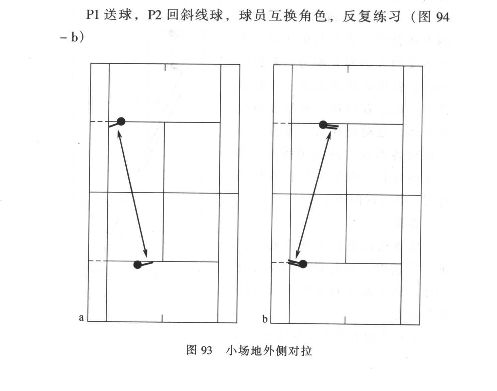

> 图94 小场地内侧对拉

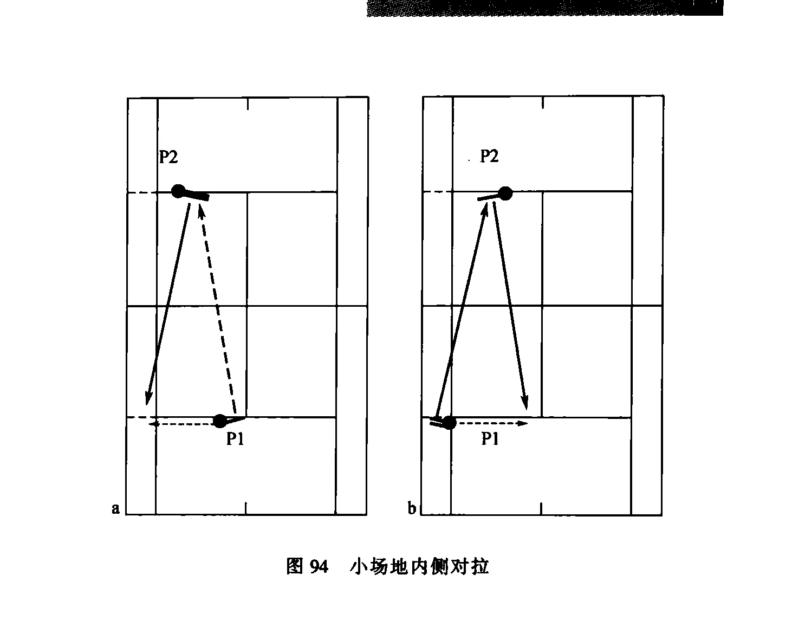

下一个练习是一人在网前，一人在发球线处。同样，每个部分要持续1分钟。
第4部分：外侧正手截击对正手底线（图95-a）。
第5部分：内侧反手截击对反手底线（图95-b）。
第6部分：P1 让P2 内侧反手截击，P2 击变线球（图96-a）。

P1 向P2 连续击内侧正手球，P2截内侧斜线球，然后运动员互换角色，反复练习（图96 b）。
**变化**
热身练习从一人网前一人发球线处开始，通过4、5、6部分的练习，着重提高截击技术和步法移动。

> 图95 小场地截击

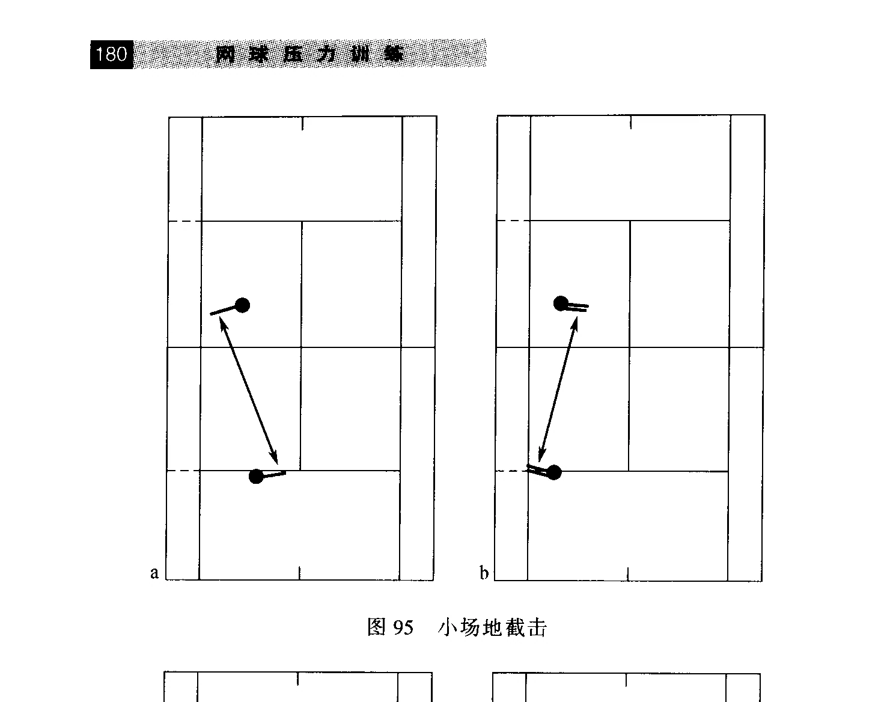

> 图96 小场地截击变线

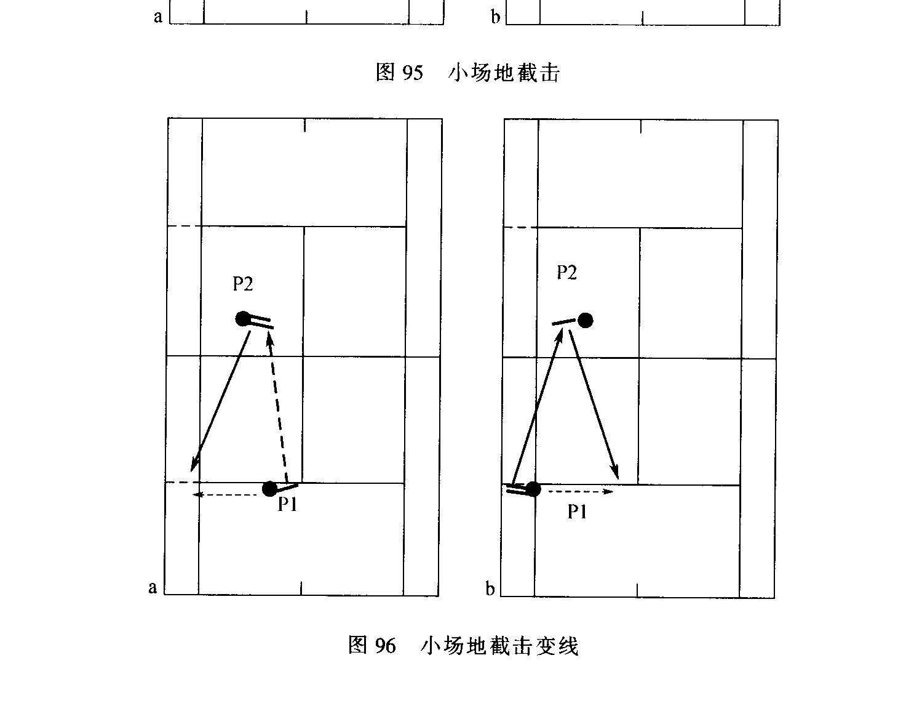

### F 平抛球练习
杰夫•穆尔练习方法。平抛球练习是理想的击球热身方式，主要练习球拍加速度和脚下移动速度，同时也可以进行战术的复习。送球者站在运动员前方1.5~3米处，使用下手将球轻抛到指定地方，运动员在每拍击球后必须回到原来的位置。教练员和运动员都可以充当送球者。如果是运动员送球，教练员则不会被限制在一块球场上，还可以同时留心多块球场。以下是几种轻抛球练习方法：
方法1：教练员手抛球送外侧正手球（图97-a）。
方法2：教练员手抛球送外侧反手球（图97-b）。
方法3：教练员手抛球送内侧反手的手抛球（图98-a）。
方法4：教练员手抛球送内侧正手的手抛球（图98-b）。
> 图97 手抛球至外侧正手和反手击球

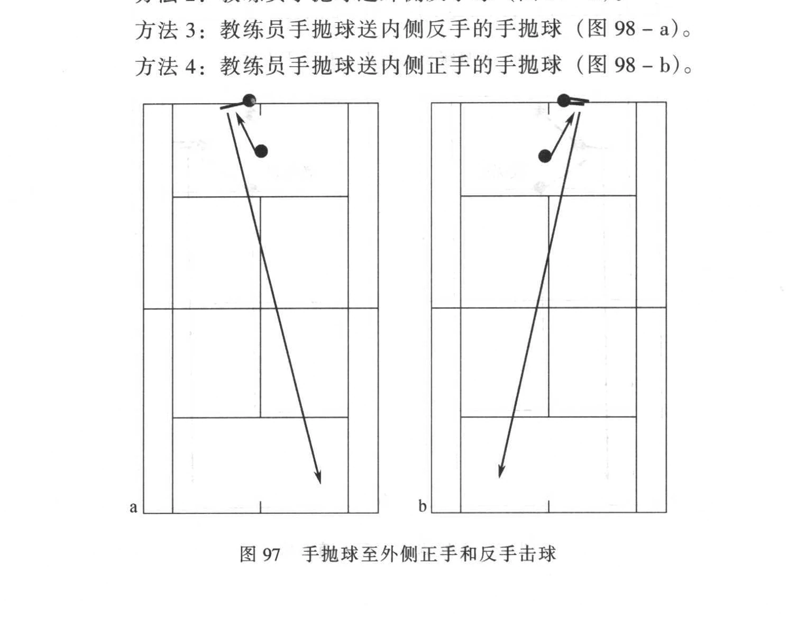

> 图98 手抛球至内侧正手和反手击球

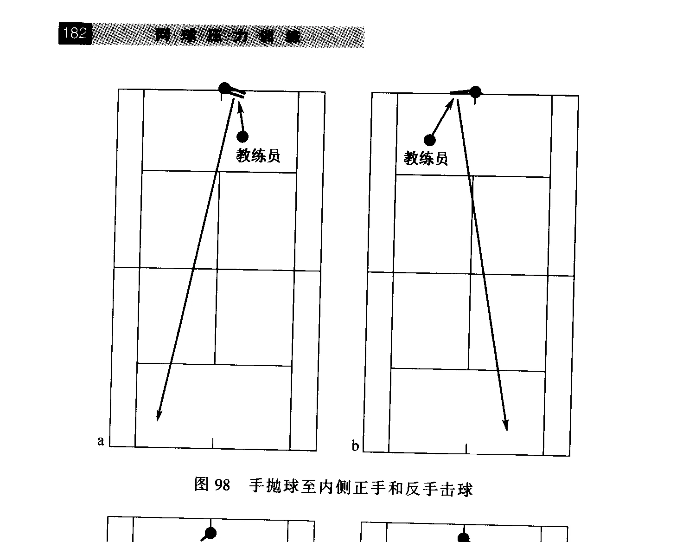

> 图99 送外侧正、反手随上球

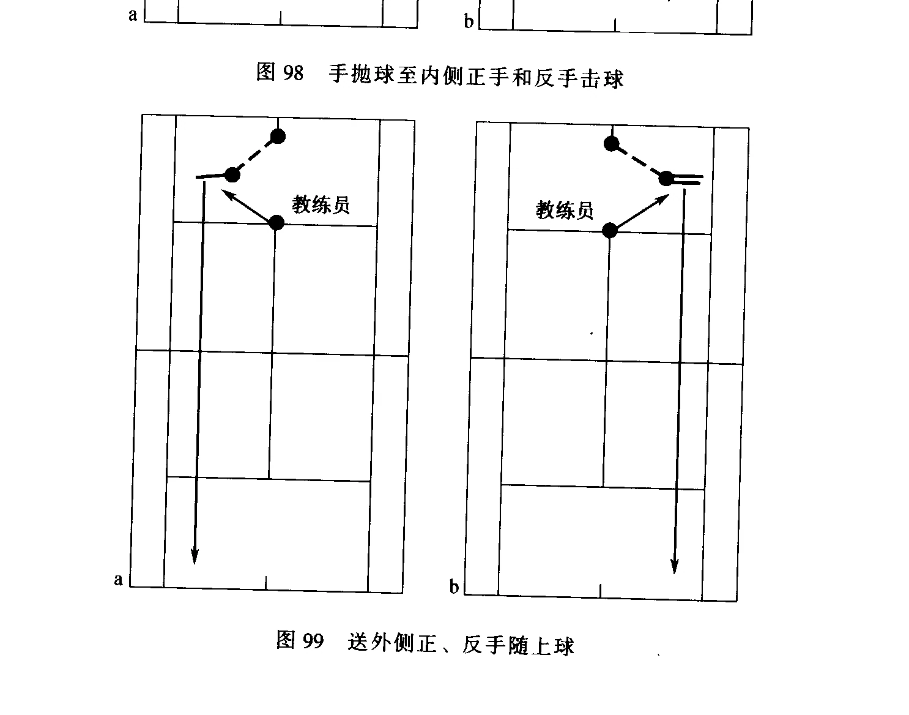

方法5：教练员送外侧正手（图99-a）和反手随上球
（图99 b）。
方法6：连续送外侧正手及外侧正手随上球（图100-a）。
方法7：连续送内侧反手及内侧反手随上球（图100-b）。
> 图100 连续送外侧正、反手球及随上球

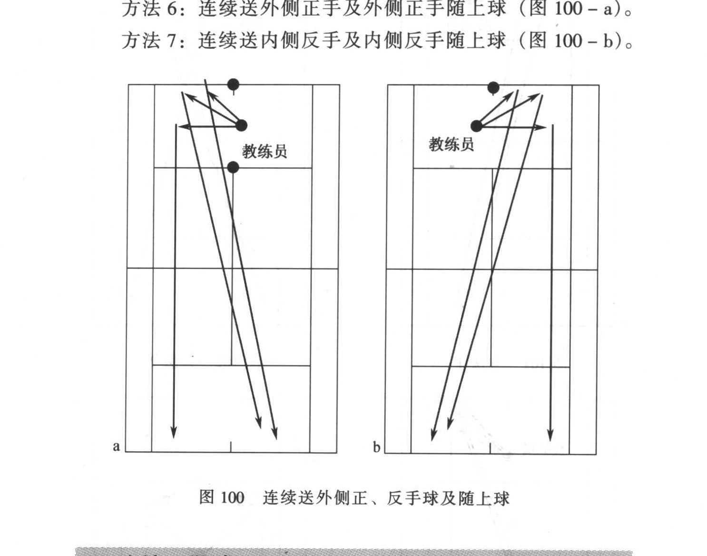

### G 连续手抛球
方法1：送两个外侧正手底线球，一个外侧正手随上球
（同样方法送至反手位，图101）。
方法2：送两个外侧反手球，一个内侧正手球（同样送至
反手位，图 102）。
方法3：送两个侧身内侧正手球，一个内侧正手90°变线
球（图 103）。
方法4：送正手截击球，回位后送反手截击球（图104）。

> 图101 方法1
> 图102 方法2

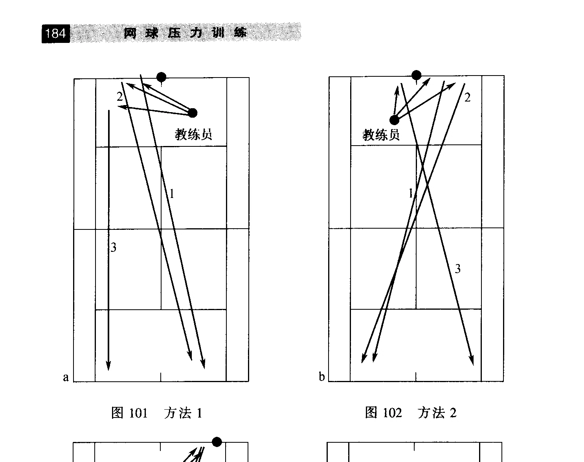

> 图103 方法3
> 图104 方法4

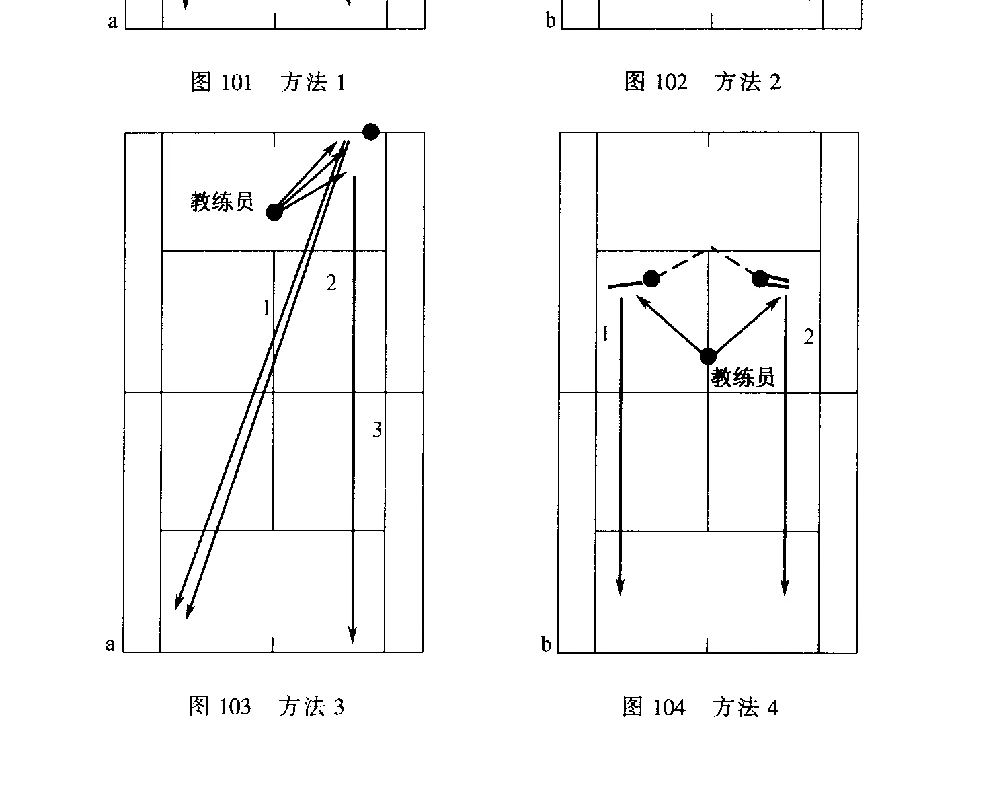

### H 双打热身练习
这是伊利诺伊大学的克雷格•泰利发明的4人双打热身练习。开始时用两个球进行斜线上的对抗。当一组斜线对拉失误后，4名运动员开始打同一个球，使之成为计分比赛。

P1 和P2同时在发球线处发斜线球；P3和 P4 打随机斜线球；P1 和P2 击落地斜线球；P3和P4截击。

此球在斜线上进行，当一组对抗结束时立刻投入到另一组的对抗中去，此时变成4人同打一球的双打比赛。

循环轮换热身持续8分钟，右区和左区的运动员在两分钟后互换位置，4分钟后互换发球队员（两分钟×2）。
**变化**
从底线的斜线对抗开始，在一组底线对拉结束后，变成4人双打比赛，此时可以进行上网。
> 图105 双打热身练习

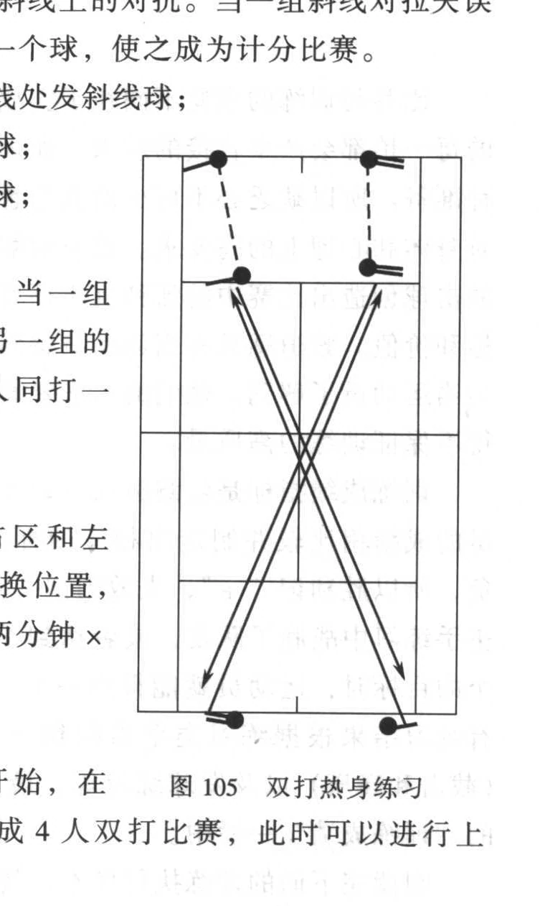
