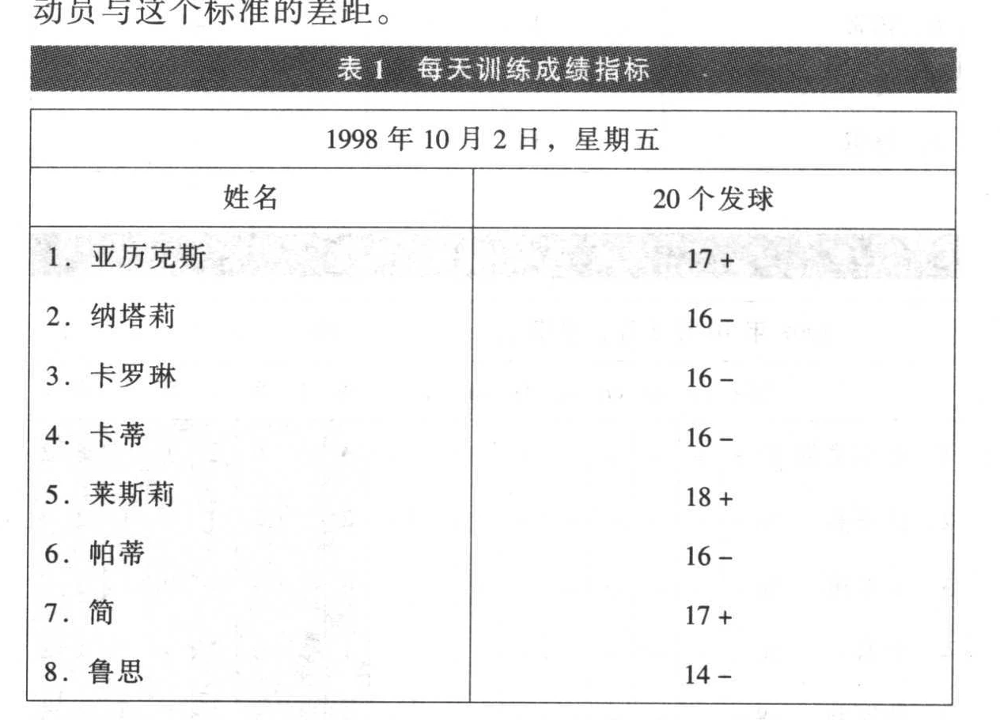
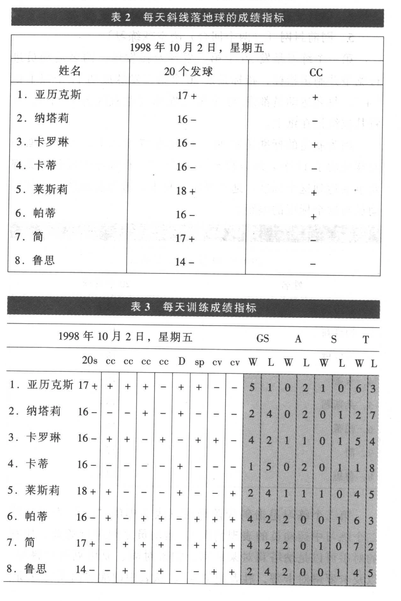
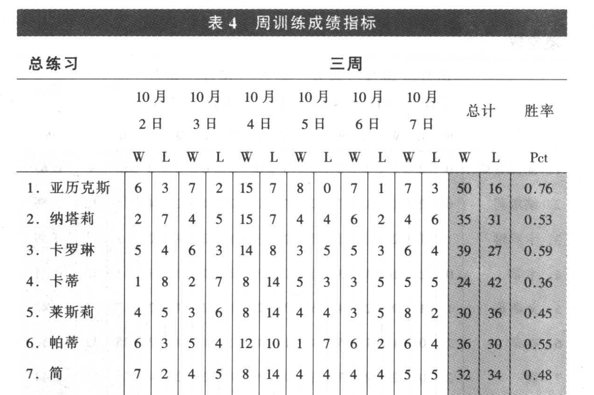
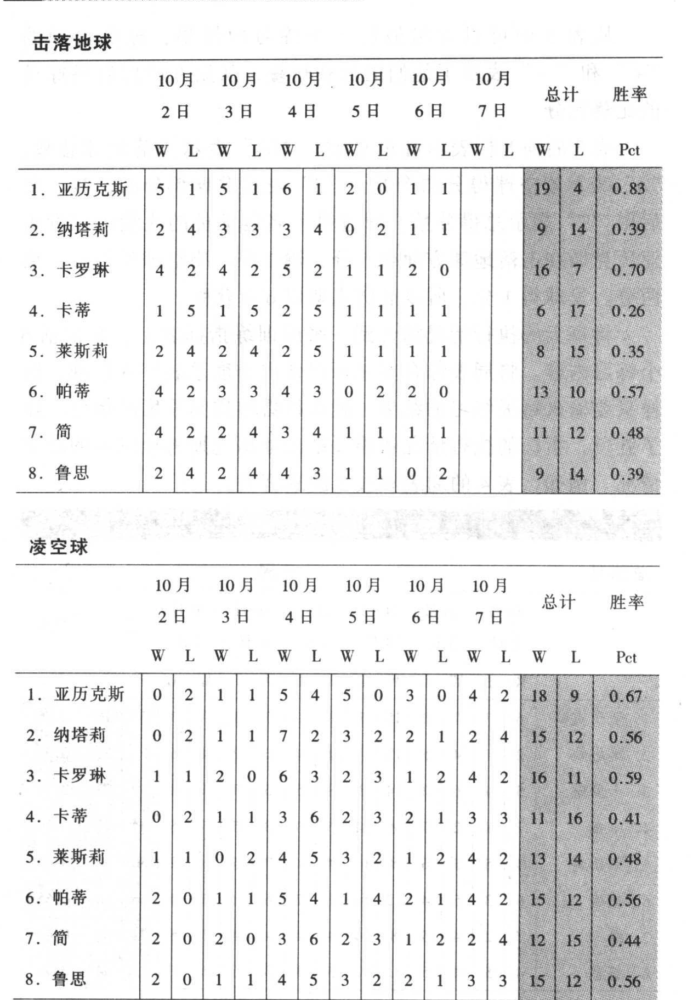
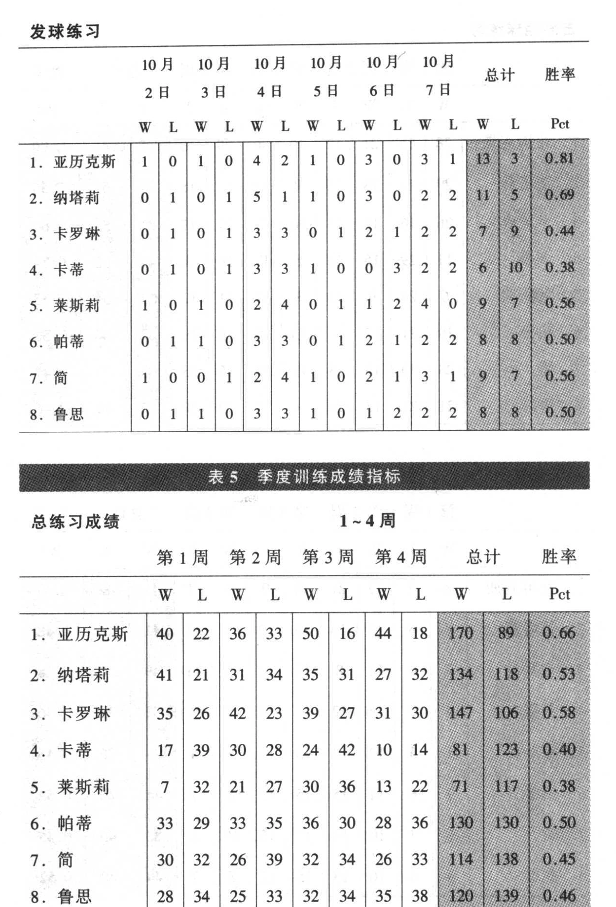
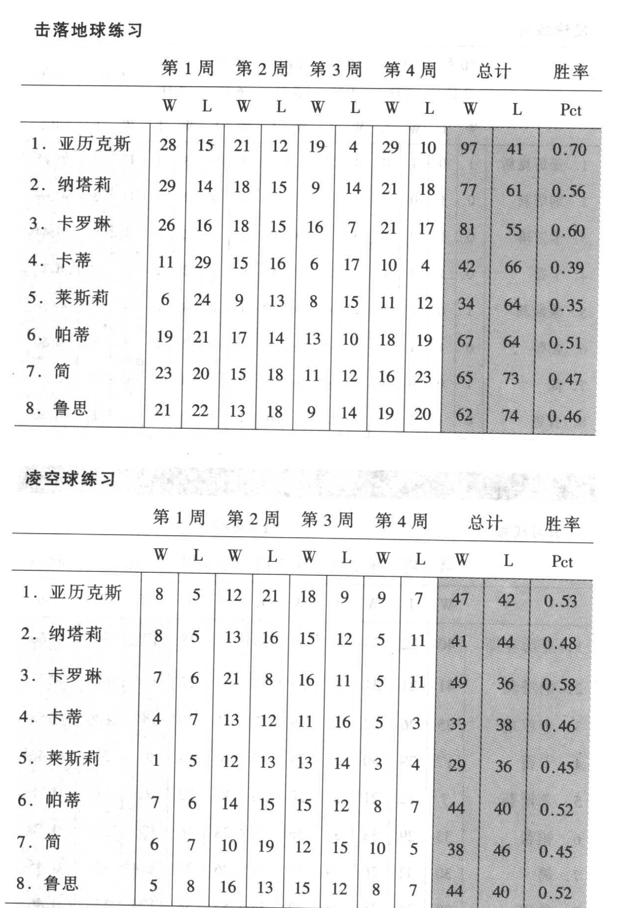
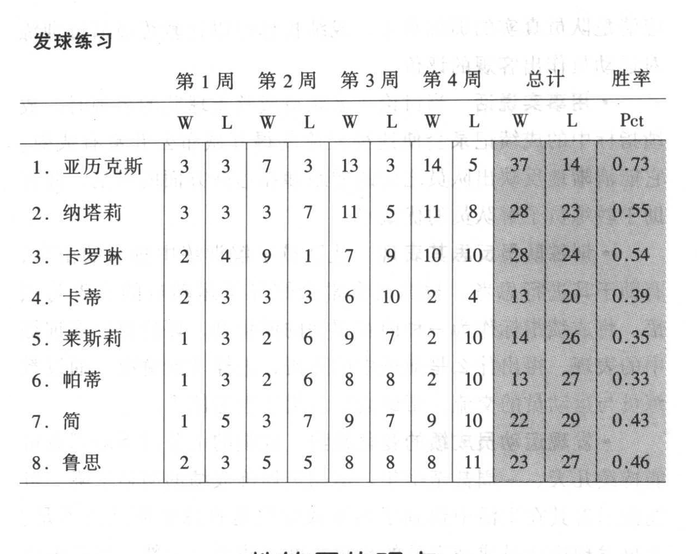

比赛与训练的主要不同在于实战中的紧迫性，因为比赛中的每一拍都会产生直接的后果，而训练则是为未来比赛做的一种准备。所以缺乏必不可少的紧迫感，就会导致在训练中放松对身体和心理上的高要求。简单的解决办法，就是通过有目的的击球创造出比赛中的那种真实环境，而每一次击球都应有目标和价值。紧迫感只有当运动员感到有责任时才会产生—因为当运动员了解到，他们的水平要通过训练水平来衡量时就不得不保证训练的高质量。

训练成绩指标是监测运动员每天训练的工具，可以将运动员的成绩相比较并制定出相应的标准。因为压力练习涉及胜负，所以胜利记“+”，失败则记“_”。例如，运动员在斜线正手练习中战胜了队友，或者达到了发20个第二发球成功19个的目标时，运动员就能得到一个“+”。将每天训练中的所有练习结果根据练习类型累积到一起—击落地球、凌空球（截击和高压）以及发球练习等，最后的结果记入运动员当日的“训练成绩”一栏中。

阅读完下面的训练执行样本，就会对“训练成绩记录”有更好的理解。

［例］ 10月2日的练习结果：
1. 20个第二发球及接发球〔（一个回合）发球练习〕。
2. 击斜线落地球【（左右区各两个回合）击落地球练习〕。

3. 变线练习〔（一个回合）击落地球练习〕。
4. 单打计分〔（一个回合）击落地球练习〕。
5. 网前封网〔（两个回合）凌空球练习〕。

第一个练习是发20个第二发球及接发球。两名运动员进行竞争并制定指标，指标是发20个第二发球成功17个以上记“+”。每名运动员都发20个第二发球（左右区各10个），并将其成绩记在纸上。

因为制定的标准是发20个球成功17个以上，亚历克斯的发球成功了17个，所以得到一个“+”。在练习中每名队员都要争取达到这个标准。通过制定的标准，教练员就能够了解运动员与这个标准的差距。

**原书成绩表（第187页）**

第二个练习是击斜线落地球（表2中的“CC” 表示在第二个练习中运动员的表现情况）。运动员之间进行竞赛。比赛的对手可以是纳塔莉对莱斯莉、帕蒂对简、亚历克斯对鲁思，以及卡罗琳对卡蒂，胜者记“+”。从表中即能看出亚历克斯、

卡罗琳、莱斯莉和帕蒂取得了斜线练习的胜利。

**原书成绩表（第188页）**

从表3中可以看出最后一个练习的结果，球员得到的“+”和“_”表示了他们的比赛输赢，从第9栏以后是球员的比赛比分。

表3后面8栏表示胜负总数，“GS” 表示击落地球总数，“A”表示凌空球得分的个数。“S”表示发球得分的个数。最后用“T”表示总得分数。通过第一名运动员的成绩可以看出亚历克斯在击落地球方面得5分，输1分。凌空球没得分，输两分。发球得1分。所以亚历克斯以6:3获胜。

将每天的执行情况综合到一张周训练指标表上，它包括6个练习内容。将周表综合起来可以作出季度总表存人电脑，这样只要输入每天练习的结果，就可以看出周与季度的情况。除了胜负，指标的执行情况还能反映出亚历克斯每项练习的胜率情况。例如，表4的周表和表5的季度表。

**原书成绩表（第189页）**

**原书成绩表（第190页）**

**原书成绩表（第191页）**

**原书成绩表（第192页）**

**原书成绩表（第193页）**

### 教练员的观点
训练成绩指标将改变教练员的执教经验，在运动员学习和适应压力训练的同时，教练员也应预测到运动员因为这种训练方式而产生抵触情绪。当运动员开始感到不适并抱怨时，教练员仍必须坚定地执行压力训练。

从教练员的观点看，“执行情况指南”是对其帮助很大的一个重要工具。
- 客观地评价运动员 作为教练员，如何准确地评估8~12名球员在训练中的表现呢？通过一两拍击球无法了解他们的真实水平。教练员在训练中也许会观察到某个运动员打得不错，但训练结束时却发现他输掉许多分，成绩指标记录的结果似乎与教练员的观察相矛盾。但训练是为了比赛，所以教练员

应清楚队员真实的训练水平。成绩指标可以让教练员通过训练对运动员作出客观的评价。
- 用事实说话 当讨论一名队员或整支球队的表现时，成绩指标中的成绩记录会使这种交流变得开诚布公并富有成效。

它能清晰地反映出队员之间的差距和在达标方面的不足，并有助于教练员了解队员的优缺点。
- 训练队员反思其表现 让队员了解训练中排名的由来，有助于其进行思考。教练员常常会惊异于运动员的自省与顿悟。将成绩指标作为一种内在驱动的催化剂，评价自己在训练中的表现，得出什么是前进中的障碍，怎样才能解决。通过教练员与运动员的交流，帮助运动员提高思考能力。
- 发现运动员成绩的变化趋势 成绩的上升或下降都有可能持续几天、一周甚至半年。运动员训练成绩的明显下降，可能预示着其在生活中遇到了难题或仅仅是打球的原动力不足。

及早发现运动员成绩下降的趋势有助于防患于未然。当然也应及时地指出队员的进步并加以表扬。
- 选定球队阵容 教练员应依据以下标准选择队员：
1. 能与对手比赛。
2. 能与队友比赛。
3. 能执行训练成绩指标。
4. 具备可塑性。

令人惊奇的是，每年的成绩指标都能够较准确地反映球员的情况。
- 激发球员 如果运动员平时胜率的浮动一般在40%~60%之间则较为理想。这说明训练富有竞争性，也预示着他的水平较高。如果运动员的胜率低于这个范围，就可以证明这名运动员的训练存在问题。如果高于60%，那么这名运动员将是一个明显强于他人的运动员，并且他需要更多的比赛机会。

鼓励全队向高水平运动员挑战，使全队水平得到较大的提高。
### 运动员的观点
训练成绩指标改变了运动员对训练的看法。一开始，运动员会对成绩指标感到非常不适应，压力训练与他们正常的训练相反，并经常让他们感到困惑。运动员一般要经历两个星期的调整，然而，一旦他们习惯了在成绩指标中记录结果，那么从运动员所表示的观点中就会体现出很多益处。
- 学会承受压力 运动员要学会承受压力，竞赛性的训练就为其提供了很好机会。例如，比分为3:3时，下一分就关系到了你是否能赢得此项练习，你应如何处理此时的压力呢？知道要记录结果，你就会对此分产生足够的重视。在练习中有一种比赛的真实感，因此在平时训练中应多进行这种决胜时刻的练习。
- 对训练成绩负责 运动员如果说出“我要对成绩指标负责”，教练员及队友就会在训练中对你有所帮助，作为优秀运动员的第一步就是能够接受自己的优缺点。
- 共同前进 记住，竞争意味着“共同前进”。尽其所能让自己与队友尽最大努力是非常重要的，在每项运动中，所有顶尖选手的成功都有益于他的对手及队友。理论上讲，你的最大努力将让队友及球队变得更好。训练不单是为自己，要使自已周围的人都能进步，当你能懂得运动员之间，以及运动员与球队的关系时你就懂得了什么是“真正的”团队。
- 了解优点和缺点 通过成绩指标了解到自己的优缺点很重要。你可能认为你的截击很好，但在成绩指标中却恰恰相反。

- 积极进取 在每天的训练中付出最大的努力，从而对你的训练情况负责。
- 学会如何比赛 因为训练是为了比赛，所以你要在训练中自始至终进行比赛。成绩指标就是你与队友之间的对比，压力训练就是训练你如何去比赛而不是如何击球。作为运动员，最大的障碍是即使你不像自己所期望的打得那么好时，也应学会如何高效地打球。强者就是能在自己不利时仍能打好比赛（这是将不适应变为适应的最佳例子。）由于压力训练如同比赛，因此你必须在你的能力范围内进行训练，简单地说，就是尽可能地将球击在场内。球员经常会因过于谨慎或过于积极而脱离自己的能力范围。过于谨慎会使对手掌握主动，而过于积极，失误就会随之增多。在过于谨慎和过于积极时，要时刻注意在自己的能力范围内击球。在能力范围之外的训练会使你的成绩指标不如人意。
- 寻求帮助 在了解自己的优缺点之后，你就要向教练员寻求帮助了。在你自己的提高过程中，扮演一个积极的角色是控制比赛非常重要的一步，此方法能使你的成绩指标得到更好的提高。
- 反思自己的训练成绩 正确看待自己的成绩对运动员来说是思考的好机会。怎样才能提高？如何处理具有压力的球？

我前进的障碍是什么？既然目标是成为一名优秀运动员，就必须将精力集中到阻碍自身发展的因素上。运动员都要对这些问题进行储备，他们的观察力往往与教练员一样具有价值。
- 胜者般地打球 获胜、失败或处于压力之下都要像胜者似地打球。运动心理学家吉米指出，在压力下，紧张与害怕是很正常的，技术也会因紧张和担心而失常。同样，胜者在出错时也要保持镇定。在你输掉一次比赛或大比分落后时，很可能会表现出生气或过激的行为。胜者在面对这种挑战时，通常是

尽力将下一分打好。你的行为要像个强者。
- 竭尽所能
控制住你所能控制的—你的努力及态度。

将心理、身体和情绪提高到最佳状态，竭尽所能，好的结果也就必然会出现。
- 控制冲动 要在网球方面取得成功就要控制住自己的冲动，抵抗住诱惑。缺乏对冲动的控制就会造成总想将球击到对手的空当，这种诱惑不是什么好兆头，甚至对职业选手也是如此。你有责任在练习中去抵抗这种诱惑并集中精力进行有效果的击球，切忌冲动。

技术的双关性

教练员经常会被问及，运动员在对赢得比赛有所担心时，该怎样用自身的技术来摆脱压力呢？作为一名大学教练员，我为运动员单独授课，此时的技术课是可以在无竞争的环境下进行，运动员可以专攻某项技术而不用担心结果。然而运动员终究要进行全队范围内的练习。如果正在尝试改变打法，那他们的成绩指标就会受到影响。

我的观点是如果在集体练习中采用新技术、新打法时，就不必强调输赢，可以不记练习的成绩，以不影响新技术的应用。通情达理和充分地交流可以让队员在压力的环境中保证技术训练富有成效，而且运动员也需要在竟争中检验新的技术及打法。如果运动员因为尝试新技术而受罚，效果将适得其反。

### 数据的记录
在训练中要花掉一点时间进行资料记录。一项练习之后，给达到标准的运动员画上“+”号，未达到的画“_”。当我第一次在肯尼亚大学运用成绩指标的时候，我记下了所有资料。在依阿华大学时，我很奢侈地雇用了一名学生来管理，他将所有的数据都存人笔记本电脑中。我和我的助手完全属于自由走动地进行观察和教学。很显然，我更喜欢在依阿华大学时的安排。其实如果你进行了很好的准备和组织，就无需花太多的精力记录数据。当然，我们更希望将节省出的那些花在组织和记录数据上的时间来有效地提高训练。

运用成绩指标评价运动员

由于成绩指标的客观性，因此它是一个指导和激励球员的很好的工具。结果是真实的，但是，为了获得最大的指导价值，教练员采用何种评价方法则很重要。在我第一年开始（1992年）采用成绩指标时就感觉到了评价方法的艰难。我拿到这些数据非常兴奋，以至于将每周和每学年的数据放在醒目的位置，看似这些数据就足够了，但运动员在看到他们的成绩时却不理解其中的意义，也发现不了自己的缺点，不知道怎样去提高，在有限的时间里我浪费了第一年，这可能就是肯尼亚学院失去 1992年全国冠军的原因吧。

据我分析，在以下条件下评价运动员可获得最大效益：
- 对球员的辅导 教练员的训练要建立在为球员服务的基

础上，教练员如何为运动员作出最好的服务，他的个人主义必须毫无异议地让位于运动员，这样你将发现球员是如何在训练中对自己的缺点进行自主评价的。
- 1对1 教练员要与球员逐一会面讨论练习情况。私人交谈可以避免混淆、尴尬以及模棱两可，可以使教练员与球员共同努力，教练员的意见可能是正确和有针对性的，然而也要听取球员的意见。由球员选择谈话的方式与地点。
- 明确问题 为什么球员的发球局打不好呢？只告诉其需要努力地练习发球是不够的，首先要鼓励运动员分析当时的情况，并与其共同研究具体原因，是技术还是战术，以及心理或其他问题。
- 问题的解决 与运动员讨论可能的解决方法，同时也包括行动的计划。例如，运动员的二发太平。因此运动员就要做一些有关二发的准备，如在练习之前考虑如何给球增加旋转。

另外，具体的方案要比泛泛而谈更有利于明确行动和取得进展。

回头看看我的教练员生活，很明显我一旦采用成绩指标，运动员就能达到最大潜能。我在肯尼亚学院5年中的后4年，我们队都是全国比赛的1号种子，并夺得了3次全国冠军。目前，我的依阿华队正在稳定提高，已达到全国的前10名。我的球队能够连续取得好成绩直接归功于运动员在训练中对他们的成绩负责。我也确信利用成绩指标的方式可以使球队达到更高的水平。
