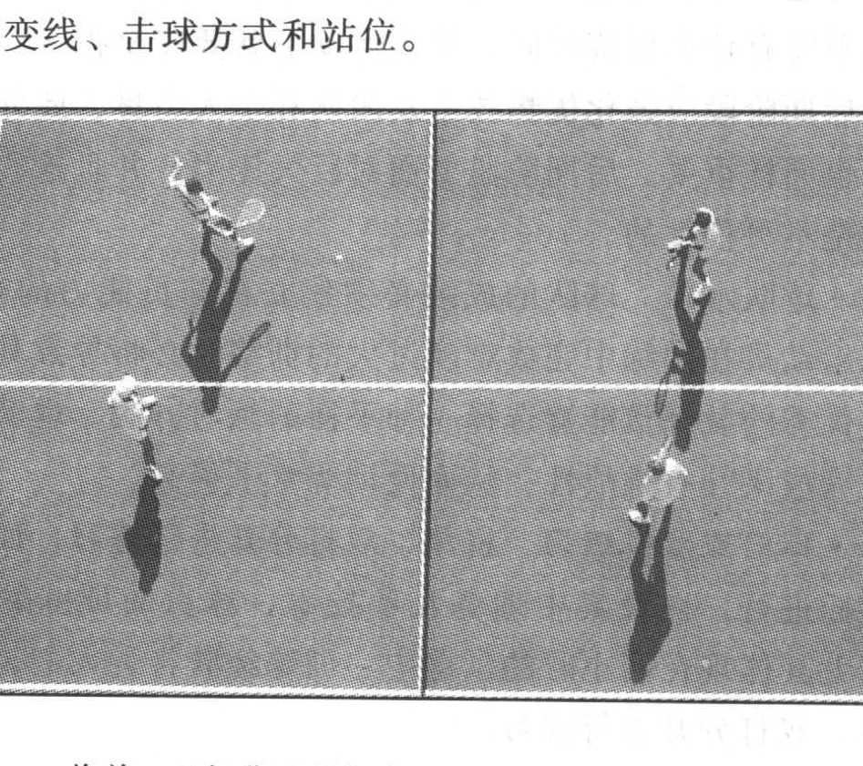
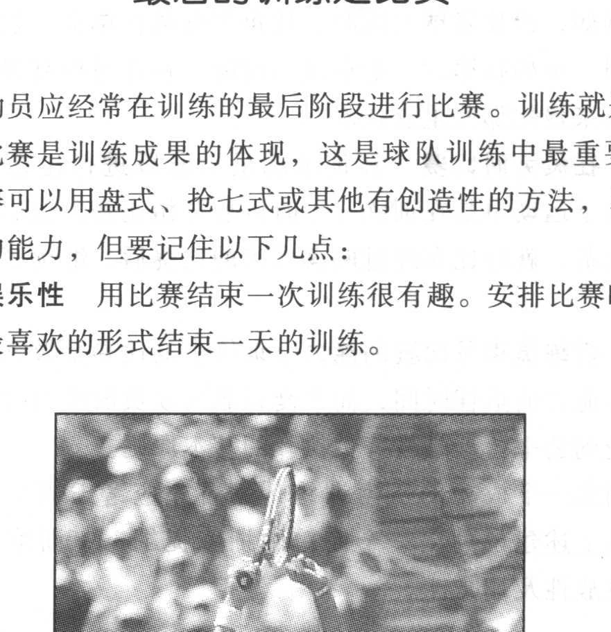

年轻时我经常通过一些粗略的训练题纲制定训练计划，并在训练中凭借自我感觉做大量改动，这样的计划缺乏结构性和集中性，也体现出了它的无纪律与无目的性。成功的压力训练要先做好大量的准备工作，按照下面的练习提纲及建议，你的训练就会富有成效，具有挑战性也很有趣。
### 训练的准备工作
在准备训练时要记住以下5项目内容：
- 周计划 作出一周中所要完成练习内容的提纲，当然，这一计划也可具有伸缩性。
- 打印、存储练习结果 将训练计划打印出来以便使用、规划和统计。训练计划应妥善保存，以便在学期结束之后进行分析。回顾训练计划可以发现球队的发展趋势以及这个赛季工作完成的概况。
- 从运动员的角度设想训练计划 在做训练计划时，应站在运动员的角度设想下一段训练该如何进行。站在运动员的角度看，有时会发现颠倒练习的次序也能达到训练效果。
- 休息 休息是科学训练的一个重要组成部分。我清楚地记得第一次教学时的过渡训练：“这么少的时间内要完成那么多的任务。”一星期中休息一天或周期性地缩短练习时间，从

而使运动员能够重新恢复精力和体力，使训练更有效率。
- 压力训练3天为一周期 由于压力训练中运动员的身心要承担负荷，如果训练只持续3天，那么运动员就能保持旺盛的体力并专注于训练。因此，3天后就应改变常规训练进行一场比赛，或缩短训练时间，以及进行针对个人需求的练习，甚至休息一天。
### 训练提纲
在设计压力训练时，主要遵循以下三个方针：
1. 每个训练方法都有一个集中的主题或构思，从开始到最后，练习的主题都要通过训练来强化，通过训练使运动员相互促进。
2. 每一训练阶段都要留出一定时间进行基础练习。
3. 每个练习最终都要为比赛服务。

要创造一个有效的训练环境，第一步就是要弄清楚这次训练所要完成的任务，记住这个就可以去组织练习，从而达到目的。一个好的训练计划要对训练过程中的每个细节进行规划—从热身到训练中的重要部分。了解这三个主要方针就可以更好地帮助你领悟如何制定训练计划的提纲。
### 重要部分
每天的训练主要强调两个主题，即帮助运动员对训练目的有一个清楚的认识，使他们了解进行特别训练的原因，以及提高训练的动机。在训练之前用5~10分钟研究训练目标及如何

完成是十分重要的。

通过强调上述内容，可以使练习循序渐进地发展。例如，如果在训练中强调拦网，可以进行以下步骤的练习。
1. 小场地截击；
2. 一人网前一人后场热身；
3. 抢网截击；
4. 一名运动员封网截击。

小场地截击和一前一后的热身截击是练习3、4的准备，抢网截击和封网截击强调通过截击而得分的练习。在这个练习中从关注步伐和拍形技术的简单截击开始，到复杂的模拟比赛截击，遵循了合理的训练流程，因为每个练习都要结合上一个练习中的要点。
### 重点要素
- 3周的循环练习 将每3周作为一个循环，在每个循环的开始安排单打和双打中的一些基础练习，重点是满足目前的技术需要。用3个月的循环练习确保队伍不断提高基本功，并在其他方面有所长进。任何球队不管取得多大进展，都不会忽视基础性训练。
- 阶段划分 网球训练包括3个阶段，即准备、竞赛和竞赛后阶段。在准备阶段重点练习基本技术。早期的训练要创造机会让球员学会如何训练和比赛，对于新人队的球员此方法特别有效。

一旦运动员的技战术基础已经成熟，就可以进人能够进一步提高水平的竞赛阶段。在这个阶段，基本技术可以通过3周循环练习得到不断的巩固。

最后是竞赛后期阶段，通过协会、州、地区及全国性的比赛检验这个阶段的准备情况。通常，在常规阶段与后期阶段之间几乎没有什么训练时间，因此运动员就要完全投入到比赛中去。后期阶段应强化优势技术及团队和个人力量，此外基础性技术也同样重要。后期阶段要面对巨大压力，并且这些压力的存在是不可代替的。
- 球队水准 球队的成绩必须建立在球员能力的基础上。

要求运动员在训练中完成难度过大的训练时必将导致其情绪沮丧。优秀的教练员能够选择-种平衡的练习方法，也就是既能保证完成又具有挑战性，从而使训练水平提高。
- 单打或双打练习 将单、双打分开进行练习，而不是互相穿插进行，以及集中训练几项技术，球员的训练效果会更好。尤其体现在两小时的训练中，训练经验告诉人们，最好是将单、双打分开进行练习。
- 以比赛作为指导原则一旦运动员投人到比赛中，那么他们的优缺点将暴露无疑，这将有利于指导教练员的下一步训练计划。在比赛中，记下需要改进的地方是以后制定训练计划的依据，因此通过比赛制定计划是最好的方法。
### 基本技术练习
为了取得更大的进步，进行基本技术的练习是非常必要的。基本技术练习包括所有网球中的常用技术。有了稳固的基础，运动员就能在比赛中占据优势地位，这也是赢得比赛的坚强后盾。

进行基本技术练习实际就是要掌握好在比赛中经常出现的技术。网球比赛中，什么技术最常用？从开始的发球与接发球

到相持几乎都在斜线上进行，因此斜线的落地球及第一回合球（发球和接发球）最为重要。另外，还有3个主要的战术要考虑，即变线、击球方式和站位。

将单、双打分开进行练习，不要互相穿插进行

在1993年全国冠军队中最好的5名运动员毕业以后，我开始明白了扎实的基本技术的价值。因此，1994年我在指导没什么网球经验的大一、大二学生时，便从比赛中的常用基本技术开始。首先我们从击落地球开始（击开放式落地球不变线和关闭式落地球变线），同时练习第二发球及接发球，而扎实的基本技术使球队在全国比赛中获得第11名。1994年我们苦练了基本技术，1995年我们以惊心动魄的两个5:4在半决赛和决赛中获胜，赢得了冠军。1995年的冠军是我们在能力和信心上的胜利。面对压力时，我们应对的办法就是我们的强项——基本技术。

一名运动员或一个球队的基本技术总是能提高的，要避免急功近利而超越基本技术的诱惑，在每次训练中都要进行基本技术的练习，扎实的基本技术是排除压力的最有效手段。

### 最后的训练是比赛
运动员应经常在训练的最后阶段进行比赛。训练就是为了比赛，比赛是训练成果的体现，这是球队训练中最重要的内容。比赛可以用盘式、抢七式或其他有创造性的方法，以考察运动员的能力，但要记住以下几点：
- 娱乐性，
用比赛结束一次训练很有趣。安排比赛时要用

运动员最喜欢的形式结束一天的训练。

使你的队员热爱网球运动

- 强化重点 应鼓励运动员将训练时重点强调的技战术内容运用到比赛中，适当运用约束和比赛规则强化重点训练内容。例如，强化发球上网时，让每名球员在单打一发时必须发球上网。正如在第六、七章提到过的，在练习中有很多创造性的方法来强化那些重点技术。
- 在疲劳时比赛 在训练的最后阶段进行比赛的主要益处，在于运动员是在训练一小时以后开始比赛。他们在身心疲惫时比赛，就好比在经过两盘艰苦的比赛后，继续第三盘的比赛。
- 教练员指导比赛的能力 训练中的比赛是教练员提高临场指导能力的最佳时间，而平衡每名运动员的练习时间，从而使其受到公平待遇是教练员执教的基本原则。

制定一个成功的压力训练计划首先应考虑周全，做好准备，按上述建议列出一个简单的训练提纲，使训练具备指导性、挑战性及趣味性。
