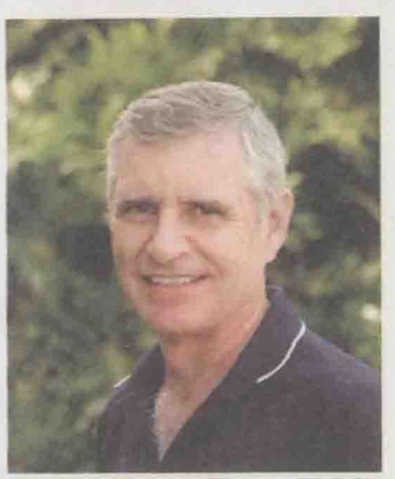
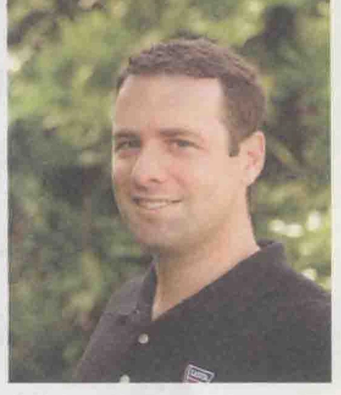

E·保罗·勒特尔（E. Paul Roetert）博士是美国健康、体育教育、休闲与舞蹈联合会（AAHPERD）的首席执行官。

在担任此职务之前，勒特尔是美国网球协会球员发展计划的常务董事，也是2002年到2009年美国青少年网球公开锦标赛的赛事总监。他还担任美国运动教育计划（ASEP）的执行董事和美国网球协会体育科学部的行政主管，在那里他指定了体育科学计划。

勒特尔在网球领域著述颇丰，包括若干图书、20余个图书章节和超过100篇文章。他是美国运动医学会成员、美国职业网球协会（USPTA）的大师级专业教练和职业网球注册机构（PTR）的荣誉专业教练。他是2002年由国际网球名人堂针对为网球运动做出卓越贡献而颁发的卓越教育奖的得主。勒特尔持有康涅狄格大学的生物力学博士学位。

马克·S. 科瓦奇（Mark S. Kovacs）博士是美国网球协会（USTA）体育科学和指导教育高级经理。他是奥本大学的全美和NCAA的双料冠军。完成专业比赛后，他攻读了研究生学位，进行针对网球运动的具体研究，获得了运动科学研究生学位和运动生理学博士学位。

马克已经在众多顶级学术期刊出版了许多具体的网球研究，并在国家与国际会议中进行了阐述。他是《网球体能训练》（Tennis Training: Enhancing On-Court Performance）一书的作者，也是《力量与训练研究杂志》（Strength and Conditioning Journal）的副主编。马克还是力量与体能训练专家，负责培训职业网球选手，其中包括参加了所有大满贯比赛的运动员。

