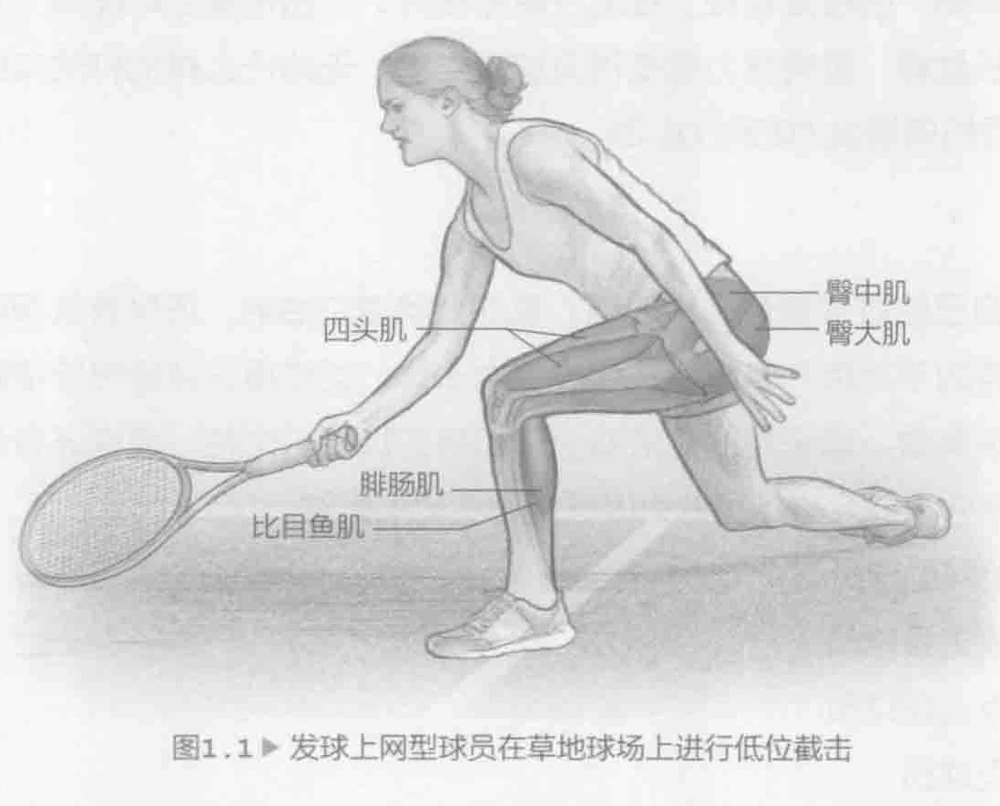
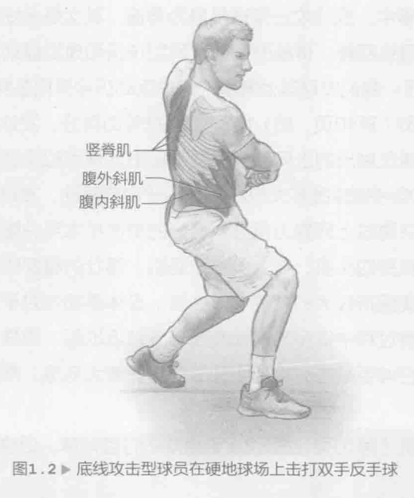
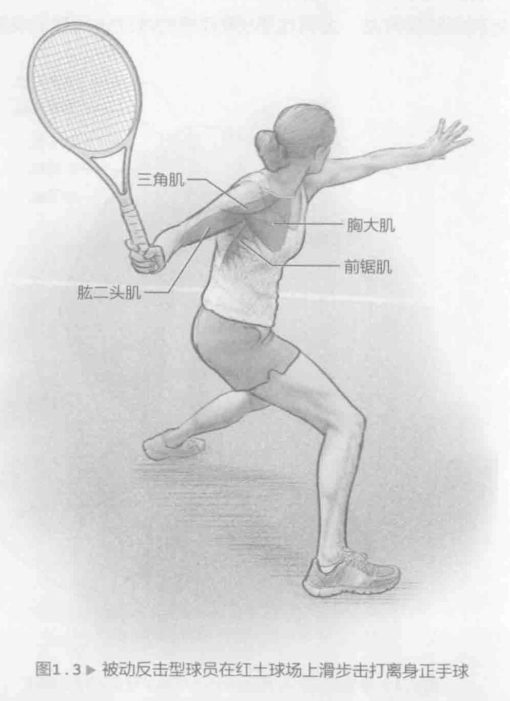
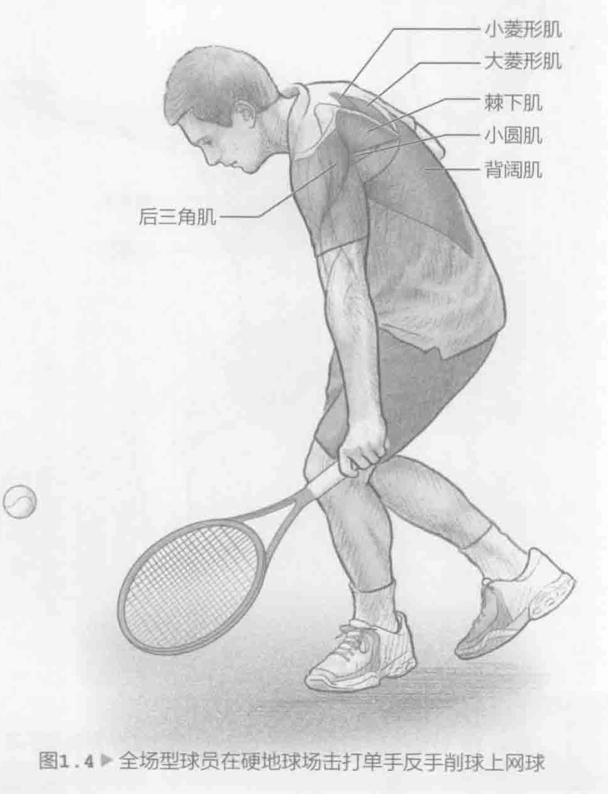

不管是哪种球场和打法，肌肉均衡对于所有球员都非常重要。但是，您的打法以及使用的球场往往会影响训练目标，并会影响训练方法的选择。例如，如果您在红土球场上进行长盘赛时，势必希望训练耐力，尤其是下半身耐力，而不是肌肉强度和爆发力，这种训练方法更适合在硬地球场上进行短盘赛。上身训练也遵循相同的原则，但程度较轻。在进行短盘赛时，仍然希望尽可能用力击球；但是，由于是长盘赛，肌肉耐力就变得更加重要了。无论什么样的打法和球场，均应对上身进行肌肉爆发力和耐力训练。

### 打法

您知道自己的打法是什么样的吗？喜欢上网凌空抽射，还是喜欢保证绝不失球，用耐力将对手拖垮？亦或是从底线大力击球，尝试得分并最终获得胜利？这三种打法都很有效。您采用的打法取决于自身的技能、个性，或许还有最常使用的球场。大部分教练会将球员分为以下四种不同的打法。

1. 发球上网型球员

2. 底线攻击型球员

3. 被动反击型球员

4. 全场型球员

在顶级职业赛事中，底线攻击型球员最为普遍，其次是全场型球员。无论是男网巡回赛还是女网巡回赛，传统的发球上网型球员和典型被动反击型球员都不再是首选打法。但是，我们发现其他赛事的网球运动员会采用各种不同的打法。

发球上网型球员（第10页，图1.1）依靠发球帮助得分。发球后，迅速上网。通常，发球上网型球员做出的上网动作比被动反击型球员和底线攻击型球员多高达20%到40%，比全场型球员多大约20%。由于向前移动，发球上网型球员往往发现自己在网边，并通过上网努力得分。良好的截击技术至关重要，需要具备出色的腿部力量，尤其是四头肌、臀大肌和腓肠肌。强壮的腿部肌肉十分关键，在低位截击时尤其需要保持较大的膝关节弯曲度。身体柔韧性对于发球上网型球员非常重要，因为比赛过程中很多时候都需要十分贴近地面。同样，腕部柔韧性也很有帮助，尤其是在伸手截击时需要将关节伸展到最大范围。需要定期训练才能获得这种柔韧性。

底线攻击型球员（第10页，图1.2）更喜欢击打落地球，但也希望通过大力攻击球向对手施加压力。这种类型的球员的目标在于减少运动，比被动反击型球员移动更少，喜欢在场内移动并尽早接球，从而缩短对手的击球间隔时间。这种打法要求肌肉强壮、耐力好，但整体爆发力才是主要因素，这将有助于底线攻击型球员得分。掌握正手大力击球或者大力双手反手击球等主要攻击手段将大有裨益。大力击球既需要力量也需要速度。训练时需要充分考虑这一点。下半身和身体中部训练与前文所述的其他风格的球员极为类似，但更重视上半身的爆发力将会很有益。胸肌和前臂肌肉对于发力十分重要，但不要忽视后臂和上背部肌肉。它们有助于保护肩关节，预防伤病。

被动反击型球员（图1.3）的目标是回击每一个球，确保对手不得不在每一波进攻期间多次击球，借此赢取每一分。这种打法依赖出色的左右运动和击球一致性。

被动反击型球员60%到80%的时间在左右移动。通常需要伸展手臂击打开放式站位的正手或反手球。因此，训练外展肌、内收肌以及全面训练计划中针对发球上网型球员计划设置的肌肉群。这包括训练柔韧度及强度。被动反击型球员必须依靠速度、敏捷度和改变方向的能力，因为她可能往往无法撇开球而获胜。这种打法在速度较慢的球场上最为有效。上下身的肌肉耐力非常关键。必须训练腹斜肌来协助所有落地球完成旋转运动，因为被动反击型球员击球次数过多，大部分时候采用开放式站位。另外，当进行防守时，被动反击型球员可能会在单腿、错位或身体失衡的情况下击出很多球。因此，必须通过进行单腿活动或在不稳定或不规则的环境下开展训练来适应这类球场情况。

全场型球员（图1.4）在击打落地球时看起来颇具攻击性，但同样喜欢通过快速上网得分。从发球、落地球到截击等各种打法都需要同样重视训练。此外，还需要花费大量时间进行攻防转换，击球训练有助于全场型球员上网。全场型球员应该定期训练上网球，比如中场正手大力击球或反手削球，然后上网得分。这些击球方式需要具备出色的移动和定位能力，通常是一个比击打常规落地球更好的姿势。上下身训练都很有益，尤其是第9章介绍的帮助进行重心转移和球场移动的训练尤为重要，比如蜘蛛式训练（第171页）和应激式起跳（第174页）。训练各个肌肉组织非常重要。主要重心应放在左右、前后和上下身平衡训练上。

### 球场

在某种程度上，球场确实对打法起到决定性作用。通常，在速度较快的草地球场上发球和截击的成功几率比在红土球场上要高。被动反击型球员在速度较慢的红土球场上的获胜几率通常要高于其他所有球场。

由于网球在草地球场和快速硬地球场上的弹起高度较低，因此球员必须能够充分地弯曲膝盖。训练应侧重练习躯体运动，保证在比赛期间达到预期的运动幅度（例如，全幅下蹲和弓步），并且可以有效恢复。在红土球场上打球的球员往往在击打离身正手球或反手球时采用滑步上球的方法。因为在红土球场上打球不仅需要前后腿有力，而且还要求腿的内外两侧肌肉强度高，因此训练外展肌和内收肌至关重要。肌肉耐力将是训练重点。研究人员对硬地球场与红土球场的球速进行了比较。网球降落到红土球场后，球速通常比同一个球降落到硬地球场要低15%。鉴于这个主要原因，红土球场比赛时间较长并且每次回击的击球数也会更多。红土球场比赛时间较长，因而相较于比赛时间较短的硬地球场会略微增加心率。因此，红土球场比赛的准备训练需要比硬地球场训练更注重有氧运动。发球比回球的体能要求更高，发球较弱的球员需要为长期作战做好准备，运用体能要求更高的打法。
