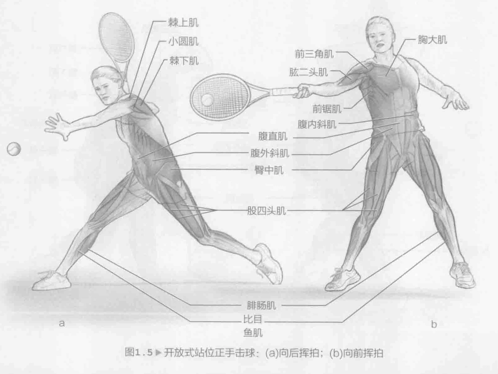
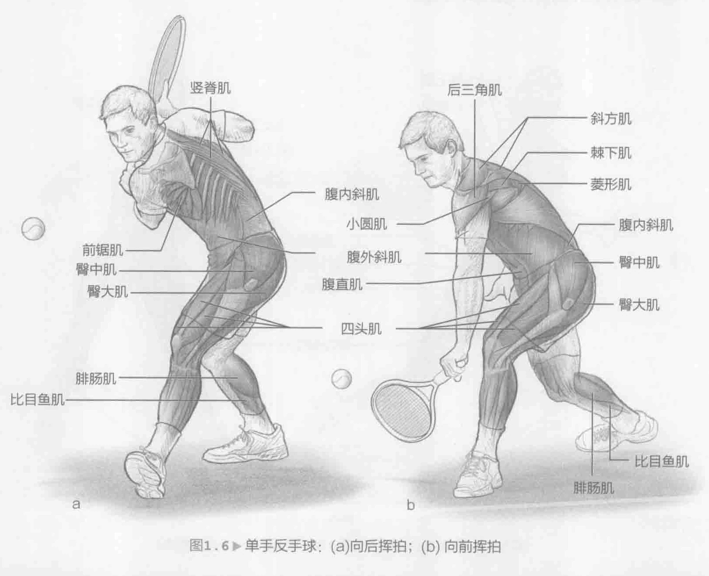
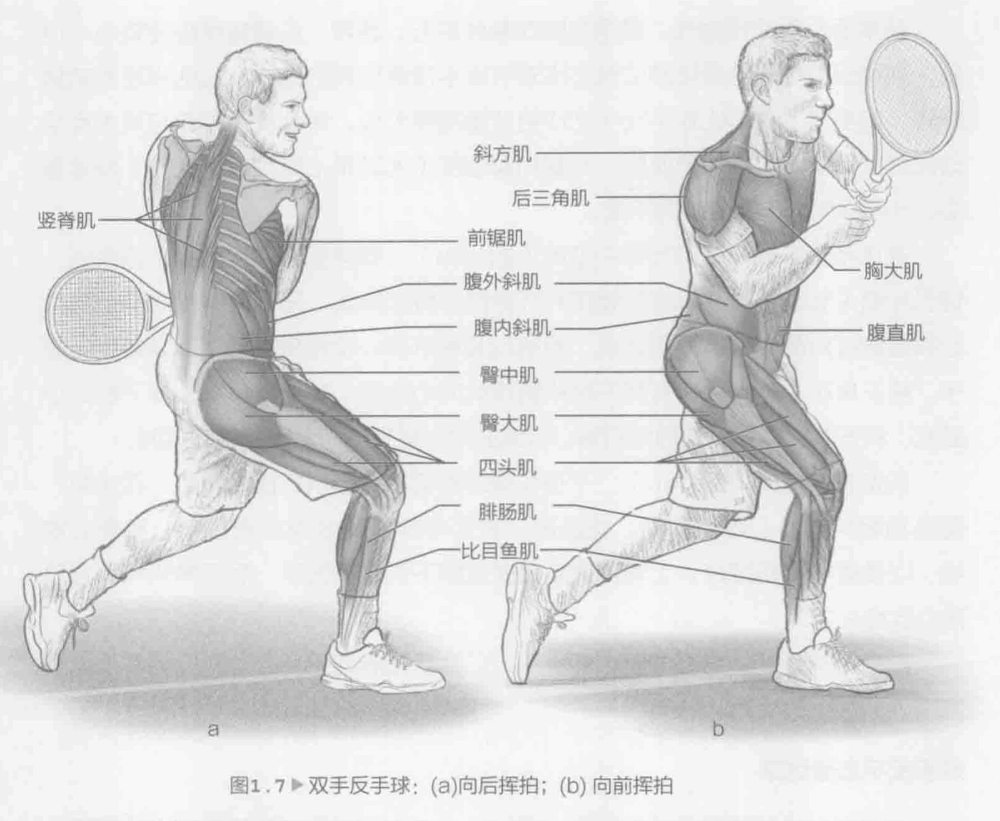

### 网球击球方法

《网球运动系统训练》主要介绍大量训练模式，从而帮助增进大家的网球技能水平。有些是多关节训练，比如弓步，弓步动作需要使用臀部、膝盖和脚踝。另外还有单关节训练，比如提踵，提踵只需使用踝关节。所有练习均有助于防止伤病及增强体能。这与找到适当的打法同等重要，因为这需要运用网球进行适应。因此，以下几章的练习将可以帮助大家提升自身的球技。

为辨别每项练习将会带来的好处，我们提供了图标用于指示特定的击球方法：落地球（正手和反手）、发球、高球、截击（正手和反手），这些击球方法均可通过有氧训练加以提升。在本部分中，我们将会对主要击球方法进行介绍，并说明动作、肌肉和肌肉收缩如何相互关联以完成强有力的击球动作。

### 正反手击落地球

在过去的30余年中，由于球拍技术发生变化，网球运动的变化最为剧烈。球拍可以使用各种材料制作并且越来越宽、越来越硬，最佳击球点范围越来越大。这对网球运动产生了巨大的影响，对落地球的影响最为重大。最佳击球点范围越来越大，对偏心击球的容忍性也越来越高，而且球拍材料可以承受更剧烈的冲力。鉴于这些变化，正手和反手挥拍也发生了变化。大幅度流畅性挥拍和沿目标方向的随球动作逐渐让位于更激烈的旋转式挥拍方法，最终可在身体的各种部位终止，具体取决于击球类型。这些挥拍模式可让球员以更加开放的站位击球，在击打正手球和双手反手球时表现尤为明显。这种变化可能会对身体中部造成巨大压力。因此，锻炼身体使其能够承受这些压力非常重要。

使用各种击球方法时，很多下身肌肉运动基本类似。伸展（拉长）和收缩（缩短）动作间的相互作用可以让身体根据每次击球的阶段存储和释放能量。此外，每次击球还需要进行转体，落地球、发球和高球的转体要求比截击高。正手、发球和高球与单手和双手反手击球有所不同，上身肌肉的刺激方式刚好相反。上背和后肩肌肉在发力阶段收缩（缩短），在随球动作时伸展（拉长）。胸肌和前肩先在拉拍时离心收缩，而后又在向前挥拍时收缩。向后挥拍遵循相反的模式。

### 正手击落地球

正手击落地球可以从开放式站位、平行式站位或闭合式站位击出。每种身体位置需要遵循不同的上下身力学模式，但这三种站位方法均综合利用线动量与角动量原理增强击球力量。线动量是质量和速度的产物，可沿垂直方向和水平方向生成。角动量是指击球的旋转分量，综合考量轴惯性矩（该轴的反力矩）和轴角速度。线动量与角动量是成功发挥正手球威力的基础。发出的线动量会影响每个身体部位发出的旋转力。

开放式站位正手击球（图1.5）可实现最大幅度的全身旋转，相较于平行式站位或闭合式站位，要求整个重心和下身发挥更大的力量和柔韧性。平行式站位和闭合式站位所需的重心旋转较小，击球点更接近球员前方且距离网更近。了解每种站位方法均取决于环境这一点至关重要。换句话说，是指您所处的球场、攻击球类型（速度和旋转）以及尝试采取的击球方法往往都会影响站位。

开放式站位正手击球是当今网球运动中最常用的正手击球形式。这种击球方法需要具备有力的臀部和上躯干旋转，从而在接地瞬间将力量从下身经由重心有效转移到球拍和球身。转体、肩部水平伸展和内旋转都是增加正手球球拍速度的主要动作模式。在球接地后，伸展力量有助于球拍减速。这一点尤其重要，因为这与预防伤病息息相关。

在正手击落地球的向后挥拍期间（图1.5a），腓肠肌、比目鱼肌、四头肌、臀肌和髋关节离心收缩，提升下肢并开始进行臀部旋转。转体阶段的收缩动作包括同侧内斜和对侧外斜，同时离心收缩会促进对侧内斜、同侧外斜、腹肌和竖脊肌。肩部和上臂旋转的截面收缩由中三角肌和后三角肌、背阔肌、棘下肌和小圆肌共同完成，而后收缩腕伸肌。肩部的离心收缩和上臂旋转的截面伸展由前三角肌、胸大肌和肩胛下肌共同完成。

向前挥拍期间（图1.5b），腓肠肌、比目鱼肌、四头肌、臀肌和髋关节进行向心和离心收缩，从而促进下半身和臀部旋转。腹斜肌、背部背伸肌和竖脊肌进行向心和离心收缩来实现躯干旋转。加速期间背阔肌、前三角肌、肩胛下肌、二头肌和胸大肌全部向心收缩，从而使球拍与球准确接触。

随球动作期间，上臂运动将通过棘下肌、小圆肌、后三角肌、菱形肌、前锯肌、斜方肌、三头肌和腕伸肌实现离心收缩。

### 单手反手击落地球

单手反手（图1.6）涉及的力综合作用方式与正手类似，但也有一些重要的不同之处。腕伸肌的力量和肌肉耐力对于成功地重复完成反手动作十分重要。研究显示，腕力矩可以快速伸展腕伸肌，这在具有网球肘（肱骨外上髁炎）历史的球员身上尤为突出。

在单手反手动作期间，惯用肩膀在身体前方。通常，击球转体程度较小；但是，需要组织不同的身体部位做出比双手反手球更协调的动作，包括肩膀和前臂旋转。单手反手动作比双手反手动作更注重前腿部位。单手反手动作与双手反手动作可以实现类似的球拍速度。力量和柔韧度（尤其是上背和后肩肌肉）非常重要。开展双侧训练实现肌肉平衡。

在单手反手动作的向后挥拍期间（图1.6a），腓肠肌、比目鱼肌、四头肌、臀肌和髋关节离心收缩以提升腿部并开始进行臀部旋转。同侧内斜和对侧外斜向心收缩通过对侧内斜、同侧外斜、腹肌和竖脊肌离心收缩来实现平衡以便旋转躯干。前三角肌、胸大肌、肩胛下肌和腕伸肌向心收缩，在后三角肌、棘下肌、小圆肌、斜方肌、菱形肌和前锯肌离心收缩的同时将肩部和上臂旋转到截面。

向前挥拍期间（图1.6b），下身和臀部旋转由腓肠肌、比目鱼肌、四头肌、臀肌和髋关节离心收缩驱动。腹斜肌、背部背伸肌和竖脊肌进行向心和离心收缩，以便躯干旋转接球。上臂加速阶段通过棘下肌、小圆肌、后三角肌和斜方肌离心收缩来完成。

随球动作期间，肩胛下肌、胸大肌、二头肌和腕伸肌离心收缩以便实现上臂减速。

### 双手反手击落地球

很多球员得益于双手反手动作（图1.7），这在早期学习阶段表现尤为明显。使用双臂增加击球力度，涉及的身体部位较少，有助于初学球员协调动作。这些优势有助于球员在好球区击球，球弹起高度较高，必须在肩部以上击球。虽然双手反手动作利用的肌肉组织与单手反手动作有很多相同之处，但双手反手动作所需的躯干旋转度要大于单手反手动作。因此，应当有效训练躯干和上腹部肌肉，尤其是腹内斜肌和腹外斜肌。这在开放式站位反手动作中尤为重要，因而在各级网球赛事中越来越流行。此外，应当训练腿部以提供稳定的支撑基础，将力量从地面适当地转移到球拍，实现长盘赛耐力。双手反手动作的一个独特之处是运用非惯用臂和手腕。必须适当训练非惯用前臂屈伸肌群、手腕和桡尺偏运动涉及的肌肉。

向后挥拍期间（图1.7a），腓肠肌、比目鱼肌、四头肌、臀肌和髋关节离心收缩以提升腿部并开始进行臀部旋转。同侧内斜和对侧外斜向心收缩由对侧内斜和同侧外斜、腹肌和竖脊肌离心收缩加以辅助。惯用侧的肩部和上臂通过前三角肌、胸大肌、肩胛下肌和腕伸肌离心收缩以及后三角肌、棘下肌、小圆肌、斜方肌、菱形肌和前锯肌向心收缩旋转到截面。在非惯用侧，通过中三角肌和后三角肌、背阔肌、棘下肌、小圆肌和腕伸肌离心收缩旋转肩部和上臂，辅以前三角肌、胸大肌和肩胛下肌离心收缩。

向前挥拍期间（图1.7b），腓肠肌、比目鱼肌、四头肌、臀肌和髋关节离心收缩提升下半身并开始进行臀部旋转。腹斜肌、背直肌群和竖脊肌进行向心和离心收缩以旋转躯干。惯用侧上臂通过棘下肌、小圆肌、后三角肌和斜方肌进行向心收缩来移动到球身。在非惯用侧，前三角肌、肩胛下肌、二头肌、前锯肌和胸大肌进行离心收缩以将手臂移动到球体。

随球动作期间，惯用臂通过肩胛下肌、胸大肌和屈腕肌离心收缩来减速。非惯用侧手臂通过棘下肌、小圆肌、后三角肌、菱形肌、前锯肌、斜方肌、三头肌和腕伸肌离心收缩来减速。
