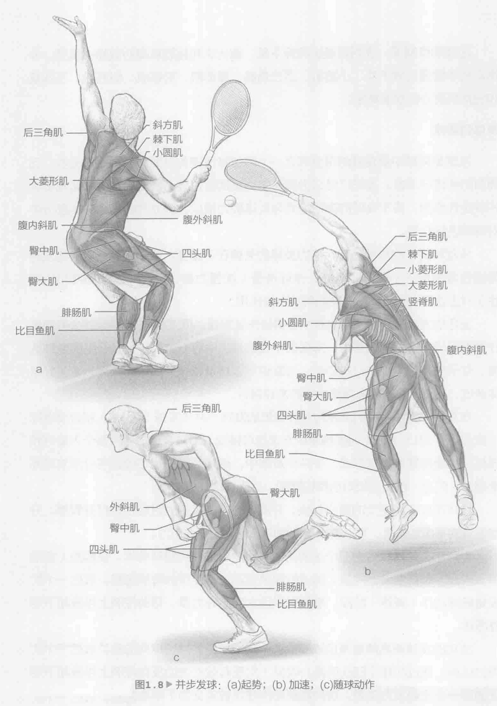
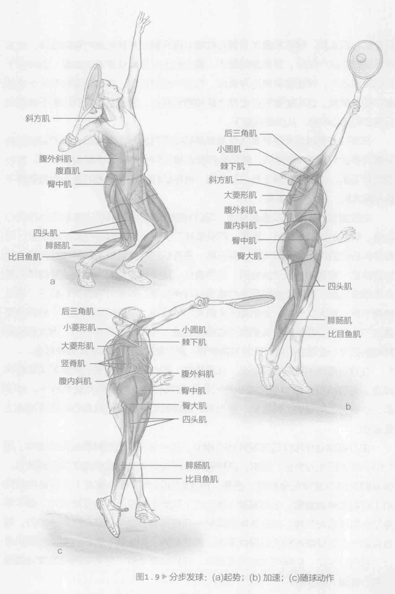
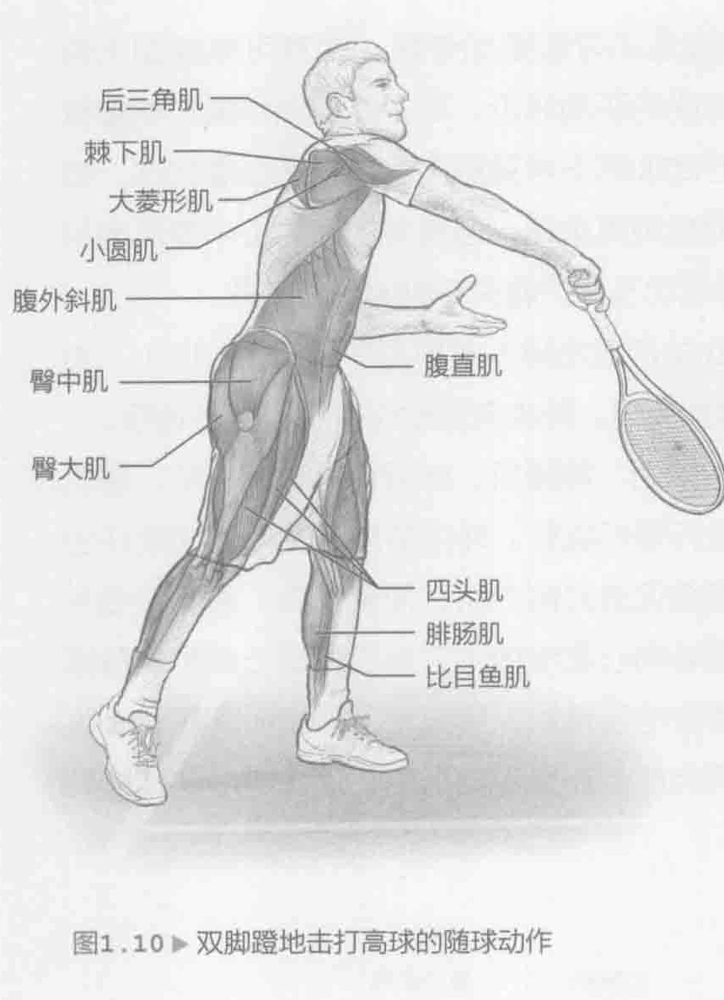
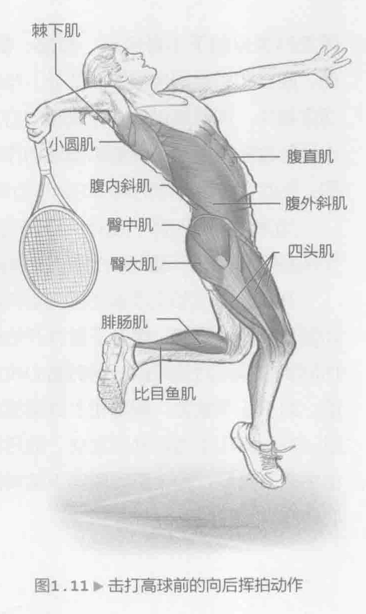

发球是网球中最重要的得分球之一。每位球员首先以发球各得一半分数，因而有时间进行准备。发球已经成为真正的比赛武器，因为它对后续得分起到很大的决定性作用。由于高球的挥拍模式与发球极为相似，因此我们也会在本部分中对高球进行介绍。

从战略战术的角度而言，成功发球的关键在于速度、旋转和落点。最佳发球需综合考虑这三个因素。当然，体能准备（加强力量、爆发力、柔韧度和协调性）对上述三个因素的质量会起到决定性作用。

出色的发球在专业网球比赛中变得越来越重要。据2009年美国网球公开赛统计数据显示，在男子比赛中，排名前十位的球员中有五位同样具备最高的发球速度。女子比赛也呈现类似的趋势。大家也可以将发球作为真正的利器，准备好身体状态，在整场比赛中发挥高水平的发球得分。

在现代比赛中，我们共发现两种类型的发球：并步发球（图1.8）和分步发球（第21页，图1.9）。无论哪种发球方法均可接受。通常，球员会根据个人喜好和风格选择使用哪种发球方式。在并步发球中，通常后脚的起始位置与分步发球完全相同。但是，在挥动和向后挥拍期间，后脚上滑靠近前脚。

这样可以实现更大的重心前移，并能够在向前挥拍时更轻松地打开臀部。分步姿势的平衡性略高，可以发出更大的向上（垂直）作用力。

发球和高球执行分为三个主要阶段：起势、加速和随球动作。在起势（或准备）阶段，您需要储备能量。加速阶段是指通过球体接触释放能量。最后一个阶段是随球动作（减速）阶段，需要提供巨大的离心力量，帮助控制上半身和下半身减速。

成功的发球或高球是来自地面的整个动力学链到冲击球体的各种力量综合作用的结果。通过屈膝（四头肌离心收缩）实现有效的地面反作用力，这是发球动作的第一个主要发力来源。这种屈膝动作往往被定义为下半身起势。腓肠肌、比目鱼肌、四头肌、臀肌和髋关节离心收缩以提升腿部并开始进行臀部旋转。在发球或高球的这一阶段，反向旋转躯干、重心和上半身以储蓄潜在能量，最终用于完成发球动作，将能量转换为冲击力。在这一起势阶段，肩部侧屈也有助于增加潜在能量储备。这些能量将在击球之前和期间释放。腹斜肌、腹肌和躯干伸肌进行向心和离心收缩，从而旋转躯干。

在发球或高球期间进行最大外肩部旋转动作的竖起手臂阶段，惯用肩膀可能会旋转多达170度。背伸肌、腹斜肌和腹肌离心向心收缩，伸展旋转躯干。向心收缩棘下肌、小圆肌、棘上肌、二头肌、前锯肌和腕伸肌，同时离心收缩肩胛下肌和胸大肌，从而移动手臂。

此位置包含一个爆发垂直分力，可以对惯用手臂和肩膀的主要肌肉执行向心收缩。前胸和肌肉（胸肌、腹肌、四头肌和二头肌）是上臂的主要加速部位，同时身体后部肌肉（肩袖肌肉群、斜方肌、菱形肌和背直肌群）是随球动作的主要加速部位。蹬腿动作通过腓肠肌、比目鱼肌、四头肌和臀肌向心收缩及腘绳肌离心收缩来完成。腹肌和腹斜肌向心收缩与背伸肌离心收缩可弯曲旋转躯干。通过肩胛下肌、胸大肌、前三角肌和三头肌向心收缩向上及向前运动前臂。肘部伸展通过三头肌向心收缩和二头肌离心收缩来完成。背阔肌、肩胛下肌、胸大肌和前臂旋前肌向心收缩会内旋肩膀并内翻前臂。通过屈腕肌向心收缩实现腕屈曲。

在球员落地的同时，腓肠肌、比目鱼肌、四头肌和臀肌离心收缩可实现躯体减速。背直肌群、腹斜肌和腹肌进行离心和向心收缩可屈伸并旋转躯干。棘下肌、小圆肌、前锯肌、斜方肌、菱形肌、腕伸肌和前臂旋后肌离心收缩可减速上臂运动。

击打高球动作和技巧与发球动作相似。这一点在球员双脚着地完成高球（图

1. 10）时表现尤为突出。通常，这种高球在回击近挑高球或球首次弹回时使用。涉及的肌肉与发球完全相同；但是，由于时间限制，挥拍模式（尤其是向后挥拍）可能会略微缩短。击打高球（图1.11）采用类似的上半身挥拍模式，但下半身动作包括抬起后腿，并在击球后用另一只腿落地。这个进球动作利于发力，并且有助于在击球期间和之后保持平衡。需要臀肌、四头肌、腓肠肌和比目鱼肌进行大幅向心运动，抬腿时尤其需要如此。在腿部落地时，这些肌肉将发挥减震器（离心收缩）的作用。

