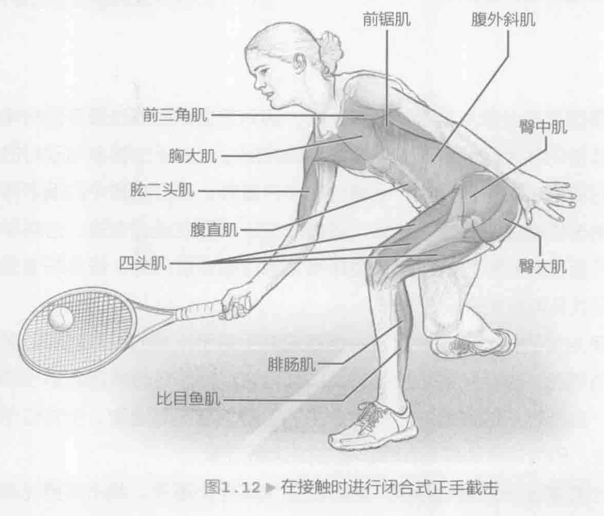
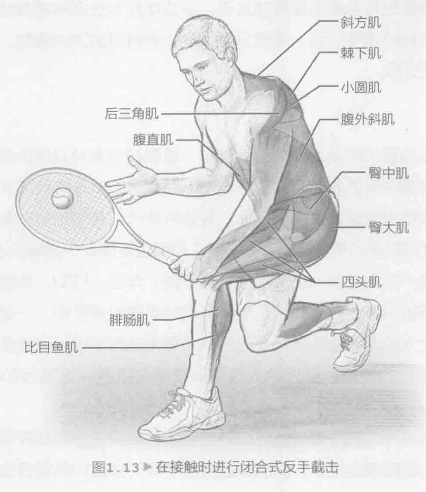

虽然精英球员不会像从前那样频繁上网，因为超身球已通过最新器材得到了大幅提升，截击仍然是网球运动的一个重要组成部分，对于主要参与双打的球员尤为重要。网前打法对于各级双打比赛仍然十分重要。双打比赛中的很多得分都通过出色的截击或高球来赢得。此外，随着球员逐渐适应强超身球，必将学到与网前球有关的新技能和新方法。全场型球员尤为注重进攻得分。很多非专业级运动员也不断寻找各种方式来设法击球。

保证具备足够的体力完成长盘赛，但逼迫对手对于比赛的输赢起着至关重要的作用。教练明白，出色的截击由手脚共同配合完成。您还必须调整适当的截击站位。因此，腿部训练或许是成为优秀截击选手最为重要的活动。全方位弓步应受到特别关注，因为这些动作是在模仿截击的球场需求。

由于截击需要出色的移动技能，因此腿部训练至关重要。截击需要完成与击落地球类似的下半身运动；但是，肌肉运动可能更加夸张。尤其可能要加大臀部、膝盖和脚踝屈伸幅度。此外，与对手的距离越近，许多此类动作模式的重复速度越快。需要通过离心方式和向心方式训练下半身肌肉。相较于击落地球，截击是包含短距离往后挥拍和随球动作的短距离击球，但两者使用的上半身肌肉相同。因此，随球动作的离心力对于立即成功及保护肩关节肌肉十分关键。

如果球员有时间，往往会以闭合式站位截击球（参见图1.12和图1.13）。由于挥拍幅度较小，因此重心转移变得更加重要。跨步向前动作有助于重心转移。

在正手截击和反手截击的向后挥拍期间，腓肠肌、比目鱼肌、四头肌、臀肌和髋关节离心收缩，提升下肢并开始进行臀部旋转。转体阶段的离心收缩动作包括同侧内斜和对侧外斜，同时离心收缩会促进对侧内斜、同侧外斜、腹肌和竖脊肌。对于正手截击，肩部和上臂截面旋转向心收缩由中三角肌和后三角肌、背阔肌、棘下肌和小圆肌共同完成，随后将收缩腕伸肌。肩部和上臂截面旋转离心收缩由前三角肌、胸大肌和肩胛下肌共同完成。在反手截击中，这些向心动作和离心动作则刚好相反。

在正手截击和反手截击的向前挥拍期间，腓肠肌、比目鱼肌、四头肌、臀肌和髋关节进行向心和离心收缩，提升下肢并开始进行臀部旋转。腹斜肌、背伸肌和竖脊肌进行向心和离心收缩以便转体。对于正手截击，背阔肌、前三角肌、肩胛下肌、二头肌和胸大肌均在加速阶段向心收缩，以便将球拍推向球体来完成击球。对于正手截击，上臂加速阶段通过棘下肌、小圆肌、后三角肌和斜方肌向心收缩共同完成。

在正手截击的随球动作阶段，上臂通过棘下肌、小圆肌、后三角肌、菱形肌、前锯肌、斜方肌、三头肌和腕伸肌离心收缩进行减速。反手截击期间，上臂通过肩胛下肌、胸大肌、前三角肌和二头肌离心收缩进行减速。
