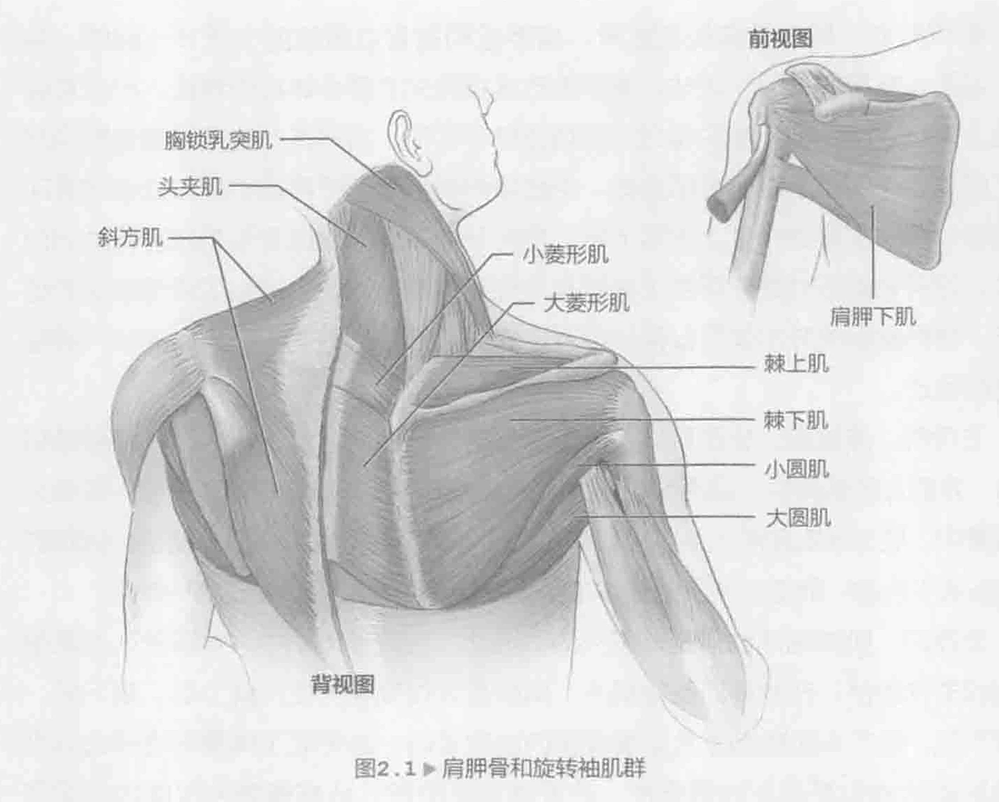
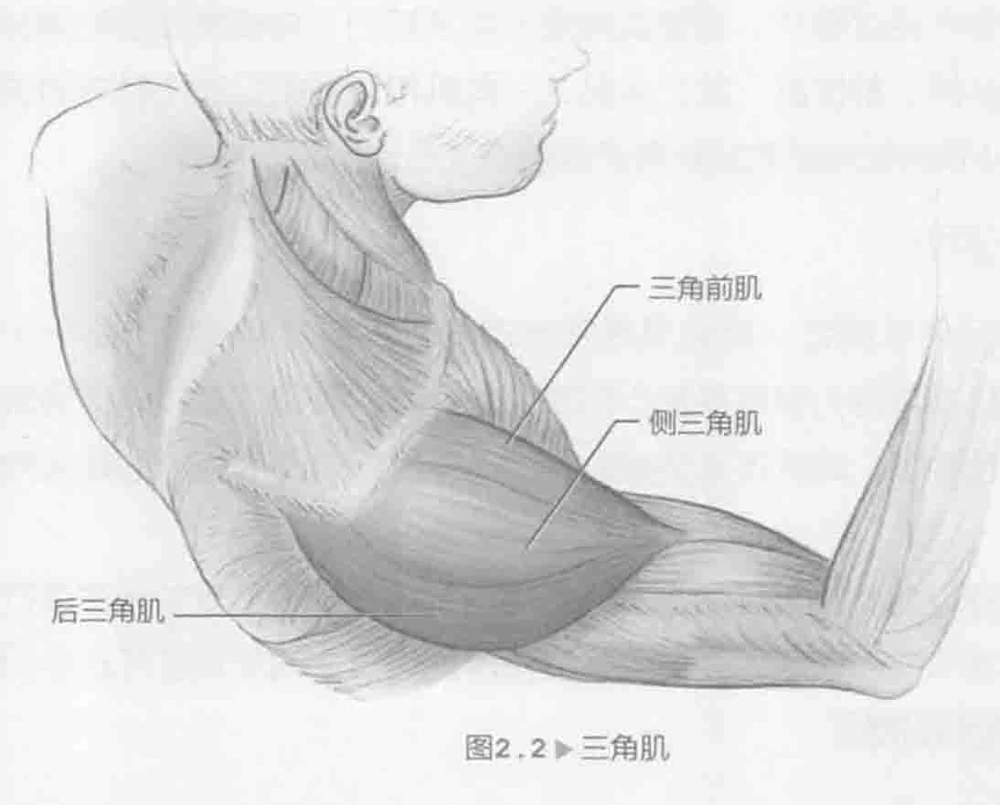
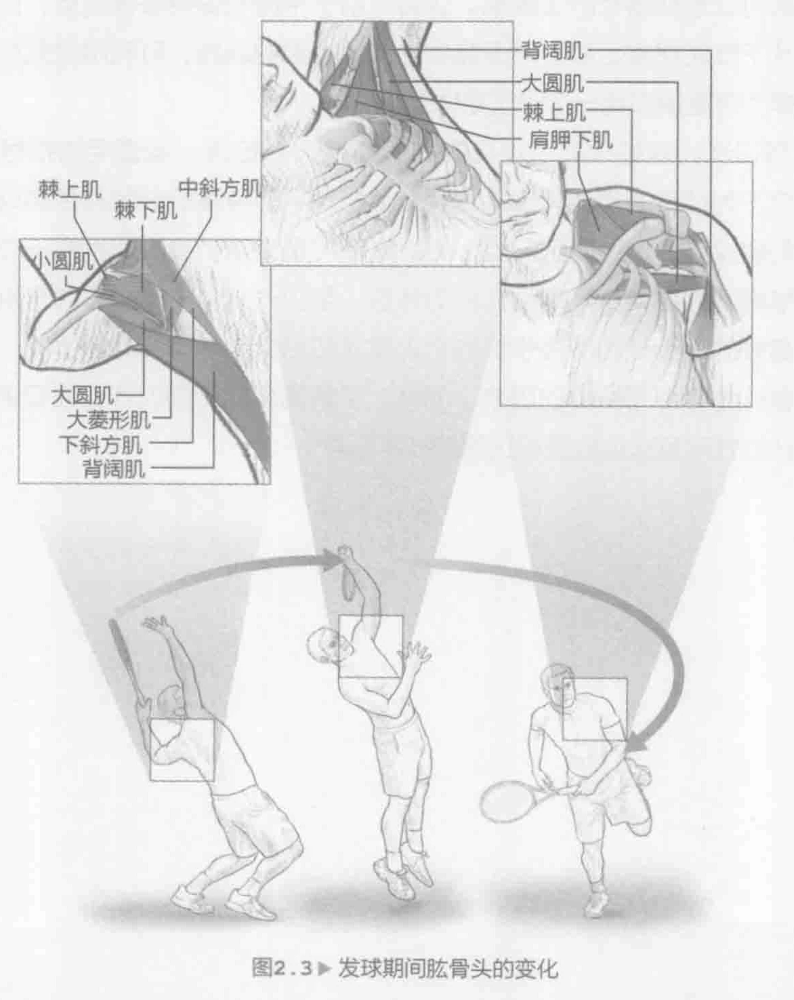

对于网球运动员而言，肩膀可能是身体最重要的一个关节。肩膀不仅是提升球技的一个主要的重点部位，还是网球运动员最常见的一个受伤部位。肩关节又称盂肱关节，是一个多轴球状关节。这使得它成为身体最重要的一个活动关节，可以完成大幅度的关节运动。对于网球运动员而言，这是一个明显的优势，因为这项体育运动需要在多个方向运动，包括伸展来击打离身落地球、使用弓步进行低位截击和跳起来以击打高球。这种多方位大范围的关节运动虽然有益，但也造成了关节相对不稳定。因此，网球运动员因过度运动而使肩关节受伤的情况很常见。本章的训练不仅可以锻炼肩部肌肉，还可以加强肩部运动以提升球技。

### 肩关节解剖

这三块骨（肱骨、肩胛骨和锁骨）是肩关节运动主要调动的骨关节。肱骨是最长的上臂骨，与肩胛骨组成肩关节，与尺骨和桡骨（前臂骨）构成肘关节。锁骨通过胸骨连接到身体核心。锁骨与肩胛骨相连，是肩胛带的一部分。当肩关节活动时，肩膀周围的肌肉会移动肩胛骨来帮助增加肩膀的运动范围。肩胛骨不动，肩关节只能屈曲或外展约120度。肩胛骨活动使肩关节在各个方向的运动增加约60度。

大量的肌肉参与肩部运动。肩胛下肌、棘上肌、棘下肌、小圆肌及其相关肌腱和韧带形成了旋转袖（图2.1，第31页），这是肩膀最容易受伤的一个部位，它与过劳性损伤有关（第10章将详细介绍肩关节损伤和其他常见的网球运动损伤，以及预防和恢复这些损伤的训练）。旋转袖是相对较小的肌肉群，其肌腱包围在肱骨周围（前方、上方和后方）。这些肌腱将肱骨头稳定于肩胛盂，对维持肩部更强大的肌肉（三角肌，图2.2，第31页）正常运动起着极其重要的作用。

确切的说，肩关节由控制肱骨、肩胛骨和锁骨位置的四个关节（胸锁、肩锁、盂肱、肩胛胸关节）组成。胸锁关节连接肩关节复合体和中轴骨，可让锁骨做出上提和下压、前引和后缩以及长轴旋转等动作。肩锁关节连接着锁骨和肩胛骨的肩峰，决定了上肢的全部运动。当肱骨伸展且肩关节弯曲和延伸以做出滑动动作时，两个主要动作是上提和下压。肩关节的关节面由肱骨头和肩胛骨的肩臼组成。这种弯曲方式既考虑到了在所有方位的大量运动，也提供了最低限度的稳定性。肩胛胸廓关节不仅可以保护伸展手臂的放松，还有助于固定肩关节，增强手臂的运动。

三角肌、喙肱肌、大圆肌以及旋转套是肩关节的内在肌，它们源于肩胛骨和锁骨，并插入在肱骨中。背阔肌和胸大肌是肩关节的外在肌，它们源于躯干并插入在肱骨中。肱二头肌和肱三头肌也都参与了肩关节运动。肱二头肌主要协助肩膀的弯曲和水平内收，而肱三头肌的长头主要协助肩膀的伸展和肩关节水平外展。

发球时，肌肉的活动量是非常大的。因此，在网球运动中，发球被认为是最剧烈的击球动作。在发球的蓄势瞬间，肩膀最大程度地外旋，棘上肌、棘下肌、肩胛下肌、肱二头肌和前锯肌呈现较高的肌肉活动，这突显了肩胛骨稳定性训练和前后旋转袖力量训练的重要性。在发球加速阶段，从肩膀最大程度地外旋开始，以接触球结束，胸大肌、肩胛下肌、背阔肌和前锯肌呈现高肌肉活动。在强有力的向心肱骨内旋过程中，这些肌肉是非常活跃的。在接触球后的随球动作阶段，后旋转袖肌群、前锯肌、肱二头肌、三角肌和背阔肌呈现出较高的活跃性，有助于促进离心肌肉收缩来放松肱骨并保护肩关节。

### 击球和肩部运动

对于网球运动员而言，肩膀是最常用的（有时会过度使用）的一个身体部位。这使得肩膀常常成为最容易受伤的部位之一，尤其是在竟技网球运动中。除了肩膀的反复性要求，网球还需要爆发性的动作模式以及高强度的最大向心和离心肌肉运动。

击打落地球以肩膀水平运动为主，使用外展和外旋相结合的方式进行正手向后挥拍和反手随球动作训练，并使用外展和内旋相结合的方式进行正手向前挥拍和反手向后挥拍的训练。

网球发球是一个比较复杂的包含水平运动和垂直运动的组合序列。在向后挥拍期间，肩关节进行水平外展和外旋；在蓄势阶段，肩胛骨收缩并下压。在准备击球阶段，肩胛骨上提、肩关节水平外展和肩关节伸直使得移动手臂向前接触球。肩关节内旋转、伸直和内收会完成随球动作。在所有的网球运动中，旋转袖肌群在稳定肩肱骨方面起着至关重要的作用，但在发球的加速和随球动作阶段中它们非常关键（图2.3）。旋转袖肌群在发球加速时加力，而在接触球后的随球动作中提供离心力来帮助放松手臂。有报告称，在爆发性的内旋发球中，肩膀的旋转速度可以达到每秒1024至2300度。接触球之后，通过旋转袖及相关肌肉组织的离心力来减速。在职业比赛中，男选手的发球时速接近每小时140英里（225公里/小时）。因此，充分训练肩部肌肉非常重要。

网球截击与击落地球或发球相比需要更少的肌肉和关节运动。对于正手截击而言，肩膀先轻微外旋和内收，然后外展，从而完成击球动作。而反手截击包含轻微的内旋和外展，然后是肩部的轻微外旋和内收。

### 肩关节训练

按照这种方法进行训练对肩关节有好处。具体地讲，会使肩关节周围的肌肉更加强健结实，这样既可以防止受伤，又可以提升球技。进行此类训练时，收缩核心肌群可以形成强壮的上腹部。这将有助于平衡和保持身体姿势，以及在击球时力量从下肢转移到上肢。对于需要手握弹力带的训练，可利用缆索拉力器或者把手握弹力带直接绑到一个固定物体上。

虽然训练计划是极其个性化的，但所有训练包含一些通用的指导原则。例如，包含下列训练的初始训练计划，应恰当地平衡身体的前侧和后侧以及左右两侧。我们建议开始训练两到三组，每组重复10至12次，直到您拥有一个坚实的基础。训练期间务必使身体得到充分的休息（至少一天），这样有助于肌肉恢复。当然，最好的训练计划取决于您的个人需求和目标。基本的健康水平、年龄、经验和比赛计划等都是重要的因素。同样，了解网球的体能训练认证专家可帮助设计训练计划并对每次训练进行正确的技术指导。
