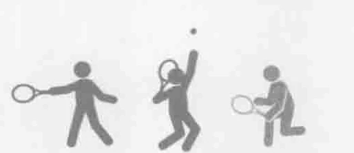
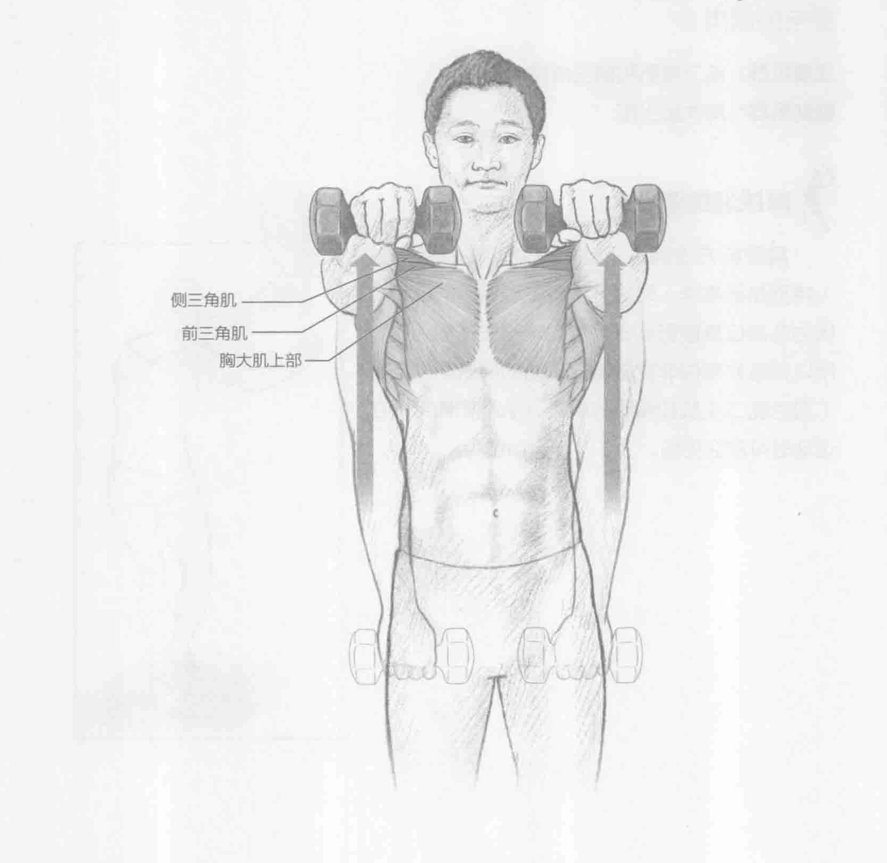
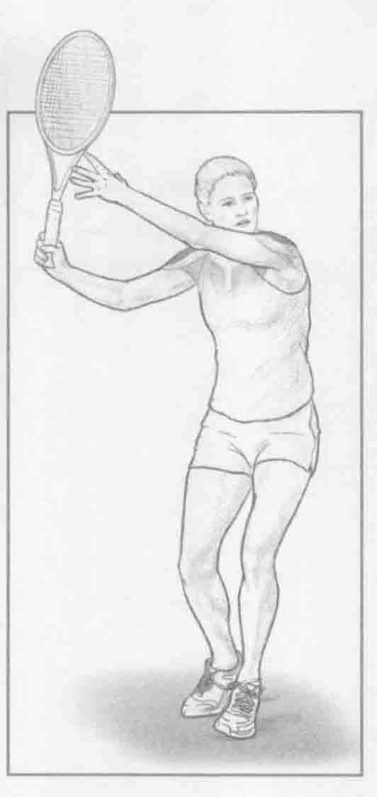

### 进行步骤

1. 挺胸站直，两侧肩胛骨。双手各握一个轻哑铃（少于10英镑，4.5千克）。双手置于大腿前，手掌在下。这是起始位置。

2. 手臂伸直，将手臂举至肩膀的高度，掌心向下。手握哑铃，保持2秒钟。

3. 慢慢放下手臂回到起始位置，重复上述动作。

### 参与的肌肉

主要肌群：前三角肌和侧三角肌

辅助肌群：胸大肌上部

### 网球训练要点

肩膀前方是网球运动员在正手击打落地球（特别是接高球）时提升手臂主要调用的部位。因为此部位直接影响击打落地球和发球的加速，所以训练此部位非常重要。乏力的肩膀前方部位（包括肱二头肌和胸肌的肌肉、肌腱和韧带）在运动时可能会受伤。

### 编者校对注

> 原书第35页：“挺胸站直，两侧肩胛骨。”。原扫描第一步确实止于“两侧肩胛骨”，缺少动作谓语；邻近的哑铃侧平举写作“两侧肩胛骨向后”。此处保留原书缺漏，不补入推测文字。

> 原书第35页：“少于10英镑，4.5千克”。原扫描确实印“英镑”，并非OCR误识；英镑是货币名称，原书重量单位用词有误。忠实版保留原文。
