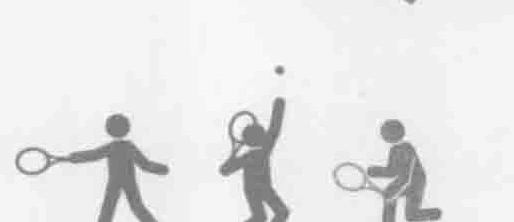
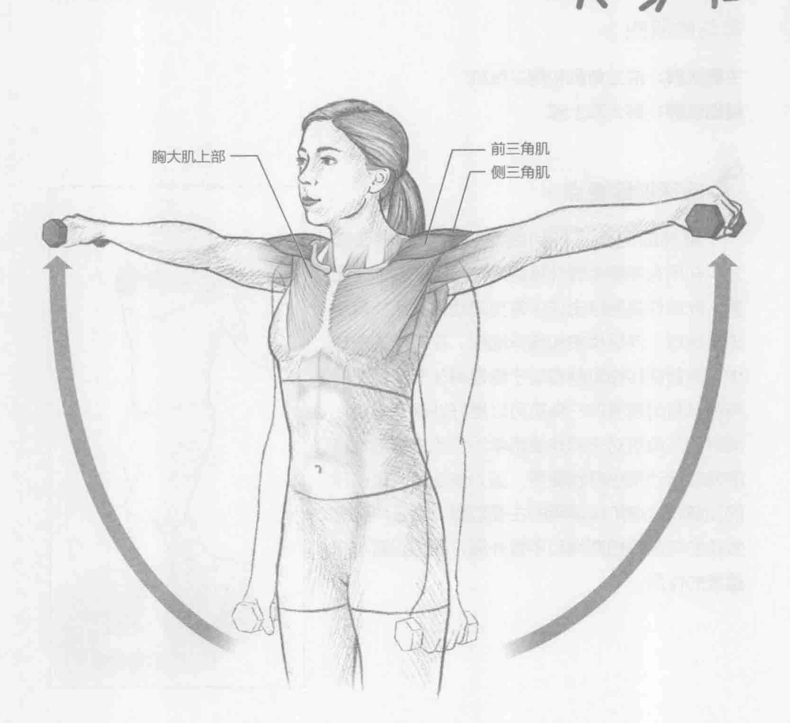
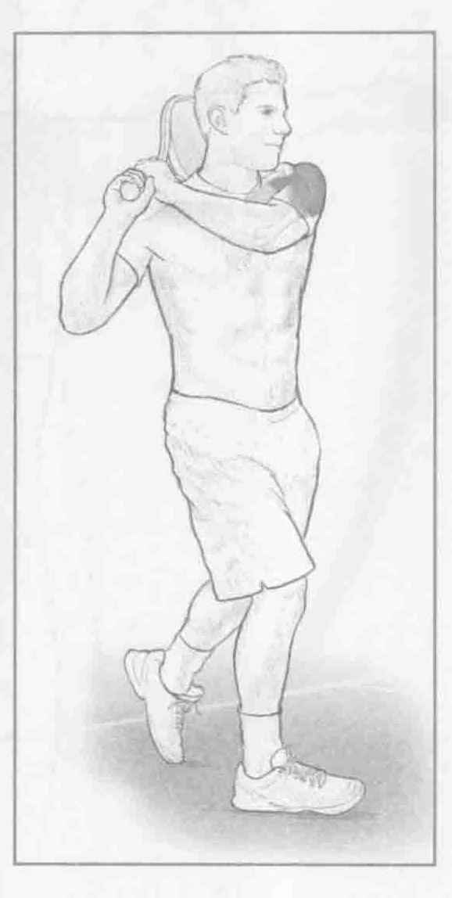

### 进行步骤

1. 挺胸站直，两侧肩胛骨向后。双手各握一个轻哑铃（少于10英镑，4.5千克）。双手放在大腿两侧，掌心朝向大腿。

2. 手臂伸直，双手侧举至肩膀的高度（外展）。手腕用力，手臂伸直，保持2秒钟。

3. 慢慢放下手臂回到起始位置，重复上述动作。

### 参与的肌肉

主要肌群：前三角肌和侧三角肌

辅助肌群：胸大肌上部

### 网球训练要点

肩部的侧面（特别是侧三角肌的侧面部分）在所有需要手臂外展的网球运动中都非常重要。此动作是网球击球中常见的动作，比如反手击落地球、向后挥拍和随球动作。在网球的击球中，尽管旋转袖肌群有助于稳定肩关节，但是拥有强壮且耐疲劳的三角肌可以更好地保护肩膀。同时侧三角肌对于那些使用单手反手击打落地球的网球运动员也特别重要，因为侧三角肌是击球的加速和减速阶段调用的主要肌群。侧三角肌在发球的向后挥拍期间和手臂外展方面也起着非常重要的作用。

### 编者校对注

> 原书第37页：“少于10英镑，4.5千克”。原扫描确实印“英镑”，并非OCR误识；原书重量单位用词有误。忠实版保留原文。
