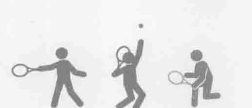
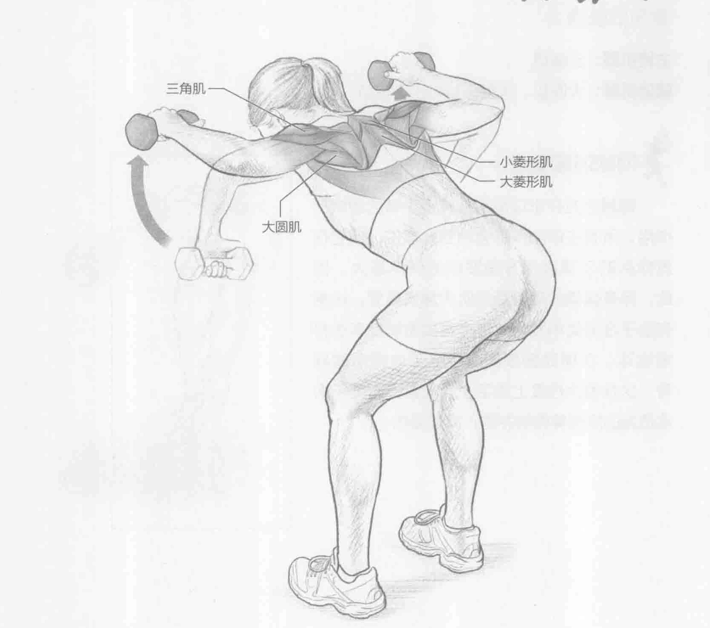
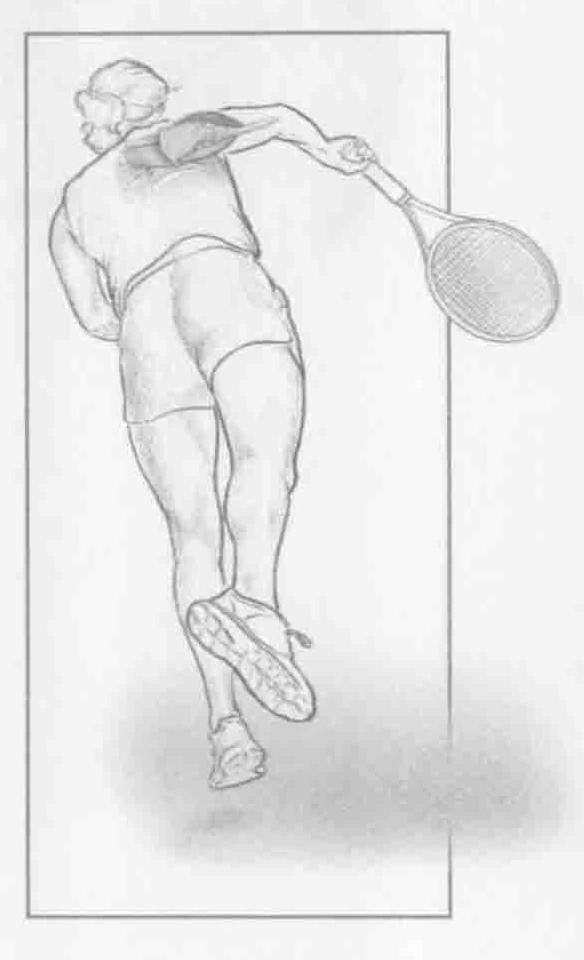

### 进行步骤

1. 站立，两脚分开与肩同宽。膝盖微微弯曲，腰部弯曲，同时保持背部挺直。双手各握一个轻哑铃（少于10英镑，4.5千克）。向下舒展手臂，双手握紧。手指关节朝向地面，手肘弯曲约90度。

2. 肘部弯曲约90度，握紧哑铃，慢慢抬起前臂至肩膀高度，保持2秒钟。

3. 慢慢放下手臂回到起始位置，重复上述动作。

### 参与的肌肉

主要肌群：三角肌

辅助肌群：大圆肌、大菱形肌和小菱形肌

### 网球训练要点

肩膀后方在击球后起着减缓手臂的速度的作用。所有击球动作都会用到此部位，但它在发球后的手臂减速方面发挥的作用最大。因此，拥有强健的肩膀后方肌肉非常重要。这将有助于在运动中发力，还会直接影响反手击打落地球。在移动到顶部时收拢（收缩）肩胛骨，这在很大程度上激活了菱形肌，有助于锻炼适当的肩胛骨控制并防止肩部受伤。

### 编者校对注

> 原书第39页：“少于10英镑，4.5千克”。原扫描确实印“英镑”，并非OCR误识；原书重量单位用词有误。忠实版保留原文。
