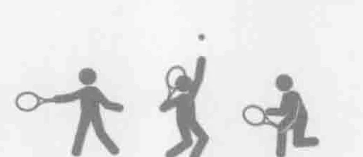
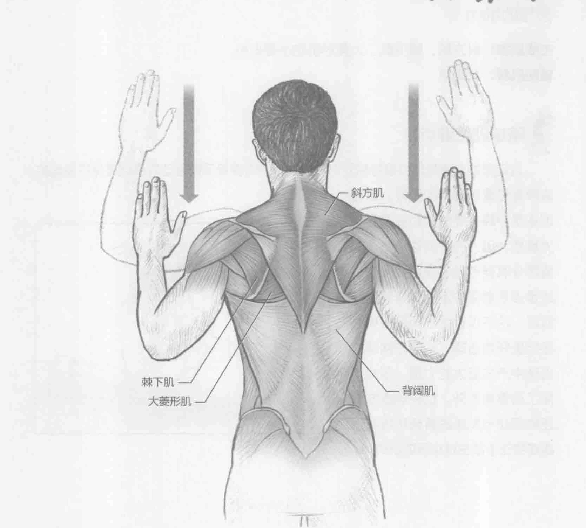
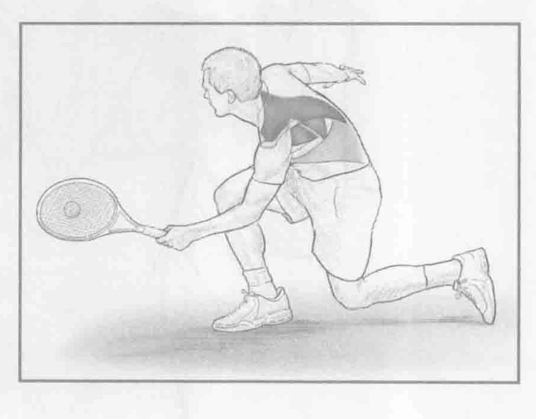

### 进行步骤

1. 站立，双脚分开与肩同宽，膝盖微微弯曲，肩膀保持90度角，肘部保持90度角。这是起始位置。

2. 向上背部收缩菱形肌，让手肘慢慢向臀部方向移动。在移动的底部保持2至4秒。

3. 慢慢放下手臂回到起始位置，重复上述动作。

### 参与的肌肉

主要肌群：斜方肌、棘下肌、大菱形肌和小菱形肌

辅助肌群：背阔肌

### 网球训练要点

运动员的肩胛骨部位很容易受伤。肘到臀的肩胛骨后缩运动的重点是保持良好的肩胛骨位置所调用的肌群。这项训练是一种主要的运动姿态且尤为重要，因为许多网球运动员的肩胛骨肌群不是很强健。此训练的重点是增强稳定肩胛骨调用的肌群，这不仅有助于预防损伤，还能更好地击球，从而在网球的击球中产生更大的力量。因此，除了改善体态外，这种训练方法还能调动与发球的蓄势阶段和近距离的正手截击球相同的肌肉。

