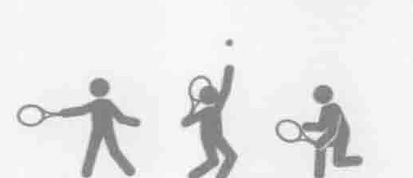
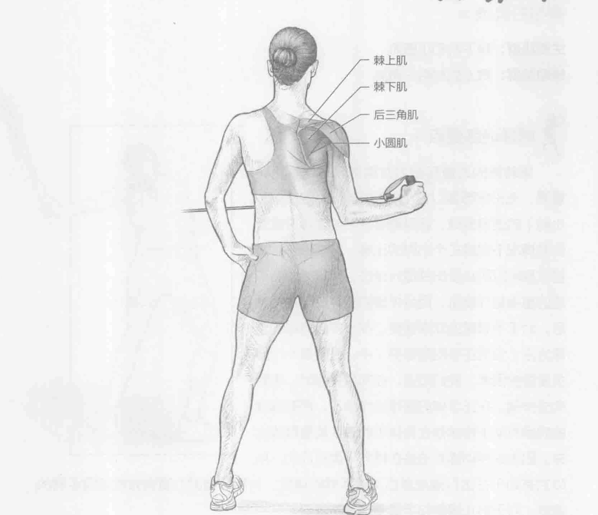
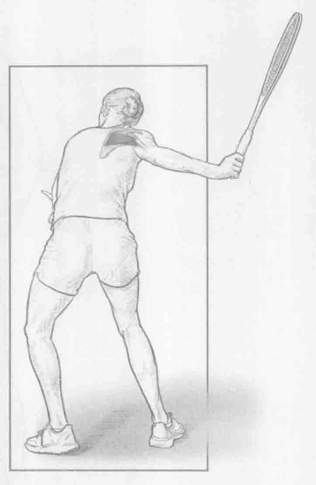
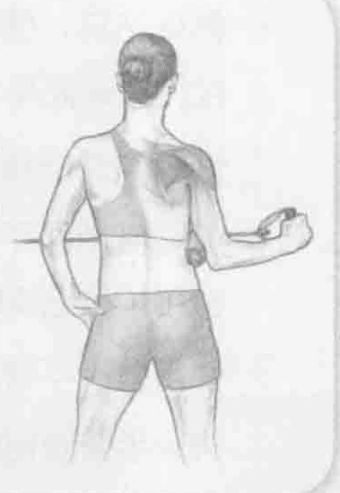

### 进行步骤

1. 侧身站立，使用外侧的手握住拉力器，靠近臀部的手肘保持90度角，前臂保持与地面平行。这是起始位置。

2. 慢慢向外旋转肩膀（远离身体的方向），克服来自拉力器的阻力，并确保前臂与地面平行。在移动期间，保持肩部不动，并且不能旋转腰部。同时在移动快结束时保持2秒钟。

3. 慢慢放下手臂回到起始位置，按以上的步骤重复做10到12次。然后，换另一只手臂做相同的动作。

### 参与的肌肉

主要肌群：棘下肌和小圆肌

辅助肌群：棘上肌和后三角肌

### 网球训练要点

旋转袖的力量和耐力对赢得网球比赛至关重要，无论您想要以每小时130英里（210公里/小时）的速度发球，还是能够在不感到疲劳或受伤的情况下完成三个小时的比赛。定期训练旋转袖肌群可以防止受伤并提升球技。手臂外旋转训练的重点是外旋肌，而且外旋肌在球拍与球接触后，对于手臂减速非常重要。在大多数网球的击球方法（包括正手向后挥拍）中，外旋是一个至关重要的因素。我们知道，在向后挥拍时，手臂向外伸展。在正手球的随球动作阶段，拥有强健的肩膀有助于将储存在身体里的潜在能量释放出来。因为这种训练方法是在横向平面完成的，所以它有助于在击打落地球后减缓手臂的速度。利用恰当的力量有效地减缓手臂的速度，对于防止肩膀和手臂受伤非常重要。

### 变化动作

#### 在外旋训练期间，在手肘和身侧之间放一条毛巾。这不仅可以

保持良好的训练动作，还能降肩膀后方的肌群（棘下肌和小圆肌）活动率增加约20%。
