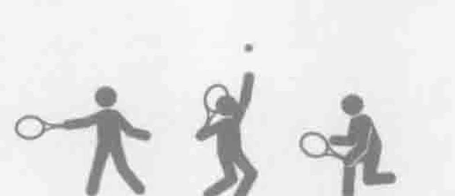
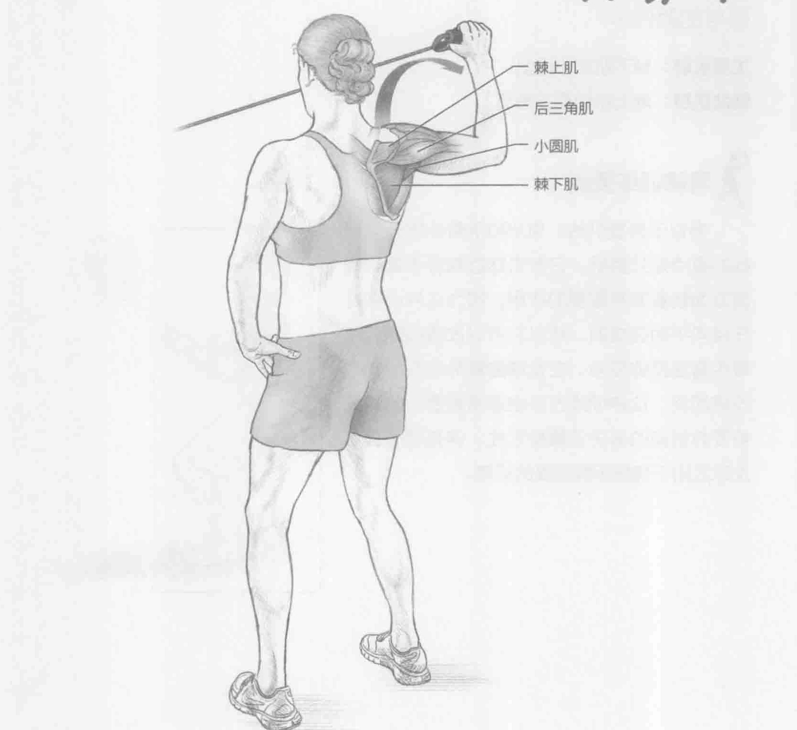
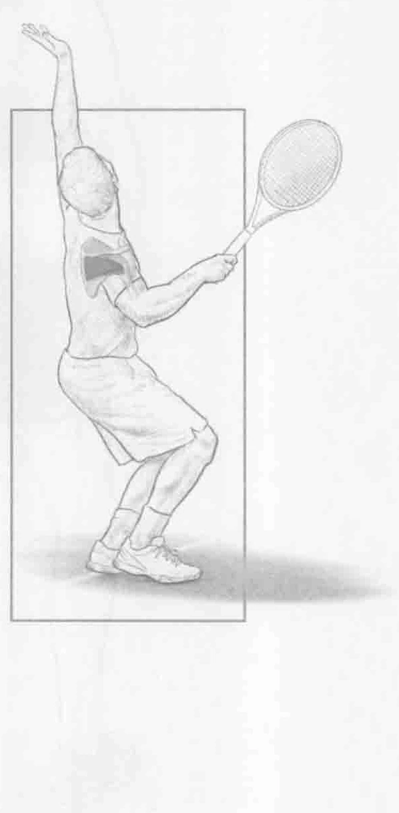

### 进行步骤

1. 身体站直，双脚分开与肩同宽，面对拉力器。将拉力器拉至与肩膀同高，并将肩膀和肘部保持为90度角。这是起始位置。

2. 以与手握弹力带相反的方向外旋肩膀。开始时，前臂与地面平行，在移动到顶部时与地面垂直（肩部外旋）。同时在移动快结束时保持2秒钟。

3. 慢慢放下手臂回到起始位置，按以上的步骤重复做10到12次。然后，换另一只手臂做相同的动作。

### 参与的肌肉

主要肌群：棘下肌和小圆肌

辅助肌群：棘上肌和后三角肌

### 网球训练要点

类似于外旋训练，90/90手臂外展外旋训练的重点是外旋肌，它在击球后减缓手臂的速度方面起着非常重要的作用。因为这种训练是在径向平面完成的，所以它可以改善击球后减缓手臂速度的能力。在发球的蓄势阶段的向心收缩期间，这种训练方法也非常重要。此训练需要有很高的肩关节囊稳定性，这有助于强化发球后用于减缓手臂速度的肌肉。

